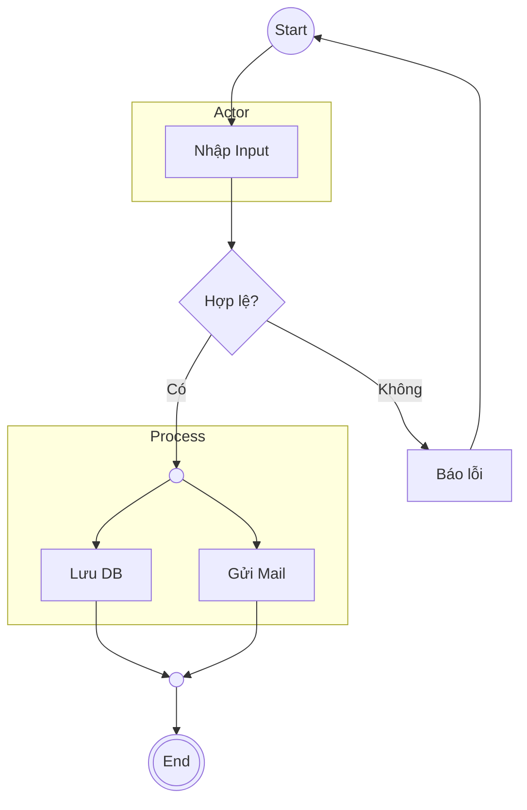

# Activity Diagram Rules & Standards (High-Fidelity v2.0)

> **Usage Reference**: Tài liệu này đóng vai trò là "Sách hướng dẫn chuẩn" cho việc thiết kế sơ đồ hoạt động. Cần đối chiếu khi bắt đầu vẽ (Mode A) hoặc khi cần phân tích lỗi (Mode B).
> **Source**: Chuyển hóa 100% từ `resources/activity-diagram-research.md`.

---

## 1. Bản chất & Mục đích

### 1.1 Khái niệm
Activity Diagram (AD) là một loại biểu đồ hành vi trong UML mô tả dòng chảy của các hoạt động hoặc quy trình trong hệ thống.
- **Bản chất**: Mô tả trình tự các bước thực hiện một công việc từ khởi điểm đến kết thúc.
- **Khác biệt với Flowchart**: AD hỗ trợ xử lý song song (Fork/Join), có Swimlanes để phân trách nhiệm và thuộc chuẩn UML hướng đối tượng.

### 1.2 Mục đích
- Chi tiết hóa thuật toán và quy trình nghiệp vụ cấp Use Case.
- Làm rõ tương tác giữa Actor và Hệ thống.
- Hình dung các luồng sự kiện (Happy path & Exception).
- Mô tả kịch bản phức tạp sau giai đoạn xác định Use Case.

---

## 2. Thư viện Ký hiệu & Semantics (Exhaustive)

| Thành phần | Ký hiệu (UML) | Ký hiệu (Mermaid) | Vai trò & Semantics |
| :--- | :--- | :--- | :--- |
| **Initial Node** | ● | `((Start))` | Điểm bắt đầu duy nhất. |
| **Action Node** | ▢ (bo góc) | `[Action]` | Một bước thực hiện (Động từ + Danh từ). |
| **Control Flow** | → | `-->` | Trình tự thực hiện giữa các hoạt động. |
| **Object Flow** | ⇢ | `-.->` | Luồng dữ liệu/đối tượng giữa các hoạt động. |
| **Decision Node** | ◇ | `{Question?}` | Rẽ nhánh điều kiện (1 vào, N ra). Cần có Guard conditions `[ ]`. |
| **Merge Node** | ◇ | `(( ))` | Gộp các nhánh rẽ (N vào, 1 ra). Tránh tạo ra "Implicit AND". |
| **Fork Node** | ┃━━━┃ | `(( ))` | Bắt đầu xử lý song song (1 vào, N ra). Mọi nhánh đều chạy. |
| **Join Node** | ┃━━━┃ | `(( ))` | Đồng bộ hóa (N vào, 1 ra). Chờ TẤT CẢ các nhánh hoàn thành. |
| **Activity Final** | (●) | `(((End)))` | Kết thúc TOÀN BỘ quy trình. |
| **Flow Final** | ⊗ | `X (( ))` | Kết thúc một nhánh đơn lẻ, các nhánh khác vẫn tiếp tục chạy. |
| **Swimlanes** | Partitions | `subgraph` | Phân chia trách nhiệm (Ai thực hiện?). |
| **Object Node** | ⎕ | `[/Data/]` | Trạng thái của dữ liệu tại một thời điểm (VD: Hóa đơn [Chưa thanh toán]). |

### Phân biệt semantics quan trọng:
- **Decision vs Fork**: Decision chọn 1 hướng (OR), Fork chạy tất cả các hướng (AND).
- **Merge vs Join**: Merge cho phép đi tiếp khi 1 luồng đến, Join bắt buộc chờ tất cả các luồng đến.
- **Activity Final vs Flow Final**: Activity Final dừng cả hệ thống, Flow Final chỉ dừng nhánh hiện tại.

---

## 3. Quy trình Thiết kế chuẩn (5 Bước)

1. **Xác định phạm vi từ Use Case**: Chọn 1 UC cụ thể, đọc kỹ đặc tả (Main flow & Exceptions).
2. **Xác định Swimlanes**: Phân chia các đối tượng tham gia (Làn bơi). Thường dùng: User/Admin và System. (Theo Clean Architecture: Actor, Application, Domain, Infrastructure).
3. **Xác định hoạt động & luồng chính**: Chuyển Basic Flow thành Action Nodes nối theo thời gian.
4. **Xác định điểm quyết định & rẽ nhánh**: Tìm từ khóa "Nếu", "Kiểm tra", "Xác thực". Ghi rõ Guard Condition trong ngoặc vuông `[...]`.
5. **Kết thúc quy trình**: Đánh dấu Final Node. Đảm bảo mọi nhánh lỗi đều có điểm kết hoặc quay lại luồng hợp lệ.

---

## 4. Business Best Practices & Checklist

- **Naming**: Bắt buộc **Động từ + Danh từ** (VD: "Kiểm tra thẻ" thay vì "Thẻ").
- **Exhaustive Logic**: Phải vẽ cả luồng ngoại lệ (Error path), không chỉ Happy Path.
- **Swimlanes**: Phân chia trách nhiệm rõ ràng, không để các hoạt động lẫn lộn.
- **Traceability**: Sơ đồ phải khớp 1:1 với tài liệu đặc tả (Use Case Specification).
- **Guard Conditions**: Luôn bao phủ hết các trường hợp (nên có nhánh `[Else]`).

---

## 5. Mermaid Syntax Reference

**Ký hiệu Mermaid chuẩn:**
- `((Start))`: Tròn đơn (Initial).
- `[Action]`: Chữ nhật (Action).
- `{Choice?}`: Hình thoi (Decision).
- `(((End)))`: Tròn đôi (Final).
- `subgraph`: Phân làn trách nhiệm.
