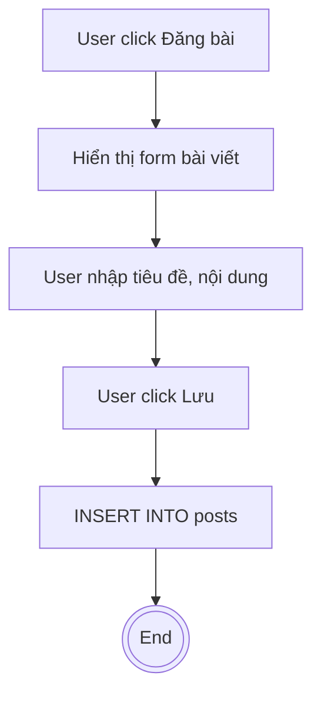
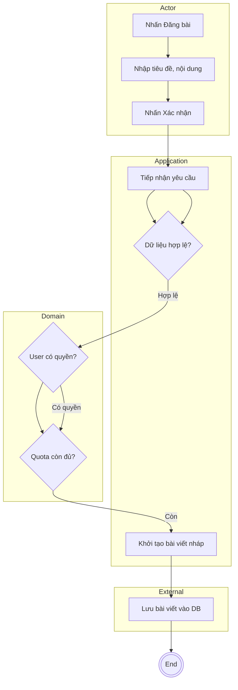

# Clean Architecture Lens for Activity Diagram
> **Usage Reference**: Tài liệu này là khung tham chiếu (Lens) để thiết kế hoặc audit sơ đồ theo tư duy **Boundary – Use Case – Entity**. Giúp tránh sa đà vào chi tiết giao diện (UI) hoặc hạ tầng (Infrastructure).

---

## 1. Mục tiêu & Nguyên tắc cốt lõi
- **Mục tiêu**: Tách biệt rõ ràng trách nhiệm giữa người dùng, logic điều phối và quy tắc nghiệp vụ bất biến.
- **Hạn chế**:
  - Không để luồng bị **UI-driven** (chỉ xoay quanh màn hình/nút bấm).
  - Không để luồng bị **DB-driven** (chỉ xoay quanh các câu lệnh CRUD dữ liệu).
- **Nguyên tắc phụ thuộc (Dependency Rule)**: Các vòng tròn bên trong (Domain/Use Case) không được phụ thuộc vòng ngoài (UI/Infra).

---

## 2. Phân lớp Action (Checklist B-U-E)
Khi xem xét một hành động (Action Node), hãy đối chiếu với checklist sau:
1. **Actor Layer (Boundary)**: Hành động của người dùng hoặc hệ thống ngoài (VD: "Nhập thông tin", "Nhấn xác nhận").
2. **Application Layer (Use Case)**: Điều phối luồng nghiệp vụ, nhận input, gọi Entity (VD: "Tiếp nhận yêu cầu", "Validate input").
3. **Domain Layer (Entity)**: Business rules cốt lõi, bất biến, không phụ thuộc framework (VD: "Kiểm tra quyền", "Tính toán quota").
4. **Infrastructure Layer (External)**: Tương tác DB, API ngoài, Mail (VD: "Lưu vào DB", "Gửi thông báo Email").

---

## 3. Mapping Swimlane theo Layer
Bắt buộc phân chia các làn bơi (Swimlanes) để làm rõ trách nhiệm:

| Swimlane | Layer | Loại hành động tiêu biểu |
| :--- | :--- | :--- |
| **Actor** | Boundary | Nhập dữ liệu, Lựa chọn, Kích hoạt (Trigger). |
| **Application** | Use Case | Điều phối (Orchestration), Validate tính hợp lệ của luồng. |
| **Domain** | Entity | Thực thi Business Rules, đưa ra các Decision nghiệp vụ quan trọng. |
| **External** | Infrastructure | Đọc/Ghi dữ liệu (DB), Giao tiếp hệ thống ngoài (Mail, Payment). |

> **Quy tắc**: Tuyệt đối không sử dụng các lane tên "UI", "Controller" hay "Database". Hãy dùng tên layer hoặc tên chủ thể.

---

## 4. Anti-patterns & Nhận diện Risk
- **UI-driven**: Action có tên giao diện ("Mở Modal", "Hiển thị màn hình"). Hệ quả: Logic nghiệp vụ bị mờ nhạt.
- **Persistence-first**: Action tập trung vào database ("Insert table posts", "Update column"). Hệ quả: Domain logic bị chôn vùi.
- **Thiếu Domain Rule Gate**: Requirement có Business Rule nhưng sơ đồ thiếu Decision Node tương ứng ở lane Domain.
- **Swimlane lẫn lộn**: Lane User chứa action hệ thống (VD: "Lưu DB"), lane Infra chứa action nghiệp vụ (VD: "Kiểm tra quyền").

---

## 5. Ví dụ Đối chiếu (Clean Architecture Improvement)

### ❌ TRƯỚC (UI & DB Driven)

### ✅ SAU (Clean Architecture Lens)

---

## 6. Traceability Rule
- **Basic Flow Step** → Ít nhất 1 Action Node trong lane phù hợp.
- **Alternative/Exception Flow** → Branch từ một Decision Node (Rule Gate).
- **Business Rule** → Bắt buộc thể hiện bằng một Decision Node hoặc Action trong lane **Domain**.
