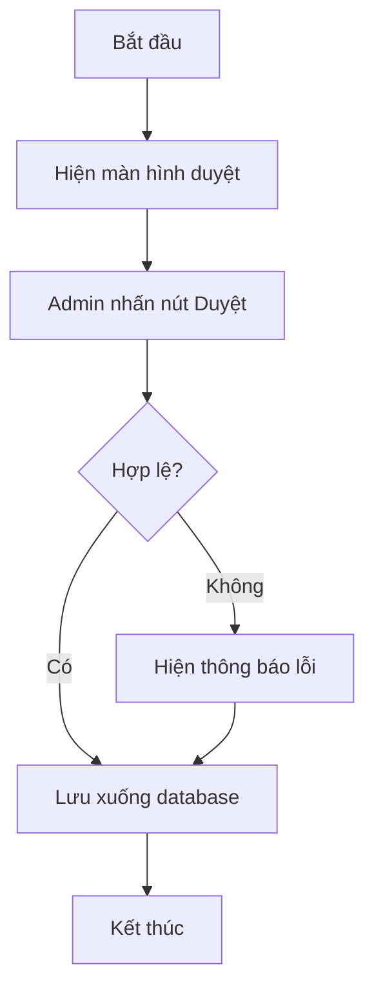
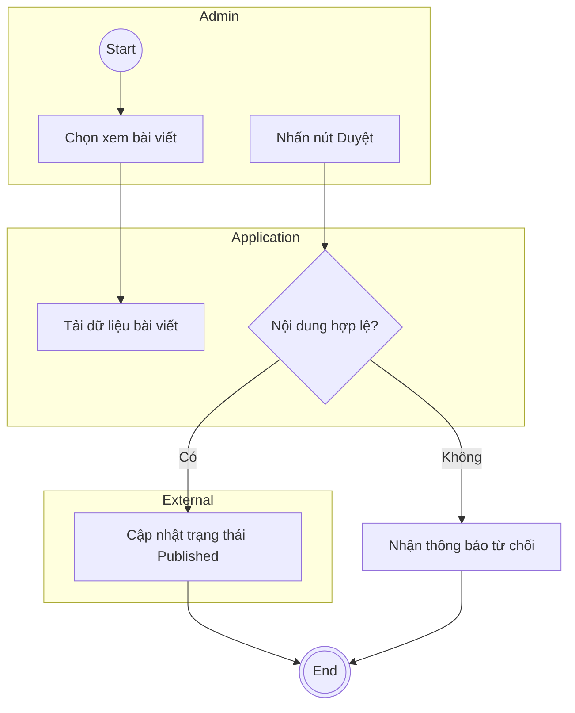

# Test Case: Mode B - Audit & Refactor
> **Scenario**: Kiểm tra và tối ưu hóa sơ đồ "Duyệt nội dung bài viết" đã có sẵn.

---

## 1. Input Diagram (Low Quality)

---

## 2. Issues to Detect (Expectation)
Skill phải nhận diện được các lỗi sau dựa trên `rules.yaml` và `knowledge/`:
1. **CF-01 (Implicit AND)**: Nút `F` chờ cả `D -- Có` và `E` (Nhánh không hợp lệ vẫn đi vào Lưu DB) -> Gây Deadlock hoặc sai logic.
2. **RS-03 (UI-Driven)**: Tên action "Hiện màn hình duyệt", "Hiện thông báo lỗi" quá phụ thuộc UI.
3. **RS-02 (Missing Swimlanes)**: Toàn bộ action nằm chung 1 luồng, không rõ trách nhiệm giữa Admin và Hệ thống.
4. **RN-01/RN-02**: Sử dụng ký hiệu `[ ]` cho Start/End thay vì `(( ))` và `((( )))`.

---

## 3. Mock Mermaid Refactor Output

---

## 4. Evaluation Criteria
1. **Severity Matrix**: Lỗi CF-01 phải được đánh giá là **🔴 Critical**.
2. **Rational**: Giải thích rõ tại sao chuyển từ "Hiện màn hình" sang "Chọn xem bài viết".
3. **Clean Architecture**: Phải phân tách đúng lane Actor và Application/External.
