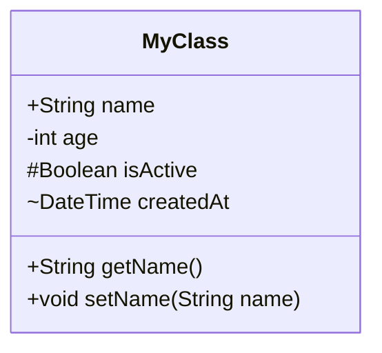
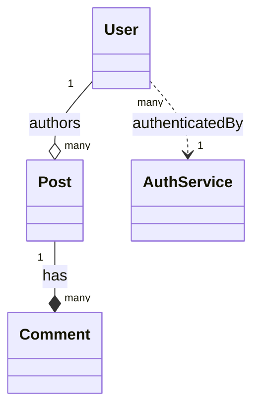
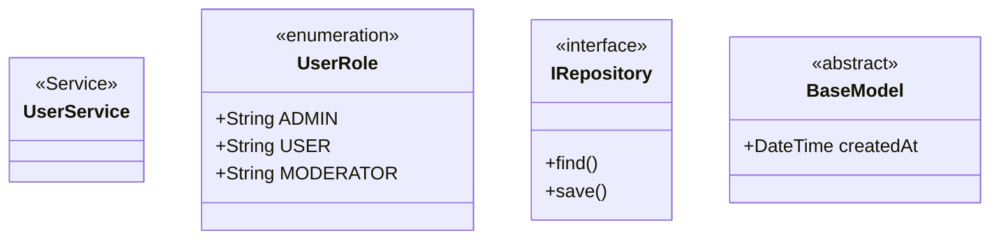
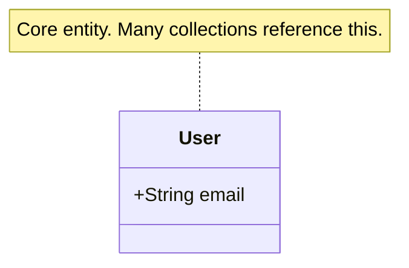
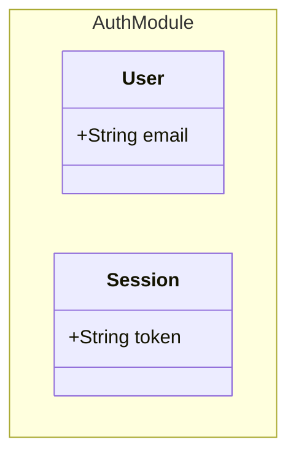
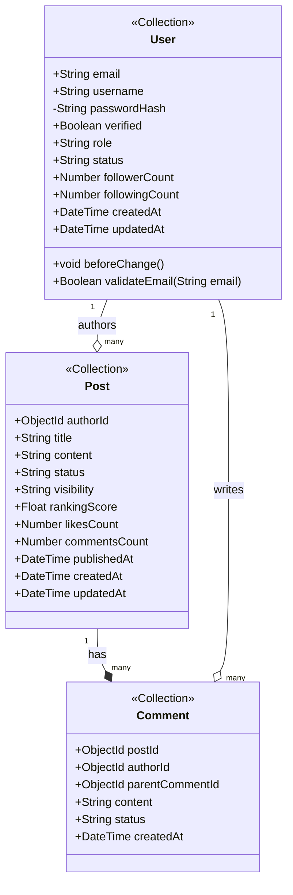

# Mermaid classDiagram — Syntax Rules & Anti-patterns

> **Usage**: Đọc ở Tầng 2 (Conditional) khi Phase D bắt đầu hoặc cần verify syntax.
> **Source**: `resources/mermaid-rules.md` (transform 100% — không tóm tắt)
> **Target Mermaid Version**: v10+ (2024-2026)
> **Parity**: 11 sections trong resource → 11 sections tương ứng trong file này

---

## 1. classDiagram Declaration



**Cú pháp mở đầu bắt buộc**: `classDiagram` (không có dấu câu sau)

---

## 2. Visibility Modifiers (Access Modifiers)

| Ký hiệu | Nghĩa | Khi nào dùng |
|--------|-------|-------------|
| `+` | Public | Fields accessible từ bên ngoài |
| `-` | Private | Fields internal, không expose |
| `#` | Protected | Fields chỉ cho subclass |
| `~` | Package/Default | Internal package access |

**Best practice cho class-diagram-analyst**:
- Tất cả public fields của entity: dùng `+`
- Private password hash: dùng `-`
- Timestamps (createdAt, updatedAt): dùng `+`

---

## 3. Field Declaration Syntax

```
+TypeName fieldName
```

**Ví dụ hợp lệ**:
```
+String email
+Number likeCount
+Boolean verified
+DateTime createdAt
+ObjectId authorId
+String[] tags
+Object metadata
```

**Ví dụ KHÔNG hợp lệ** (sẽ lỗi render):
```
+email: String         ← sai thứ tự, KHÔNG dùng colon
+String status = "active"  ← KHÔNG hỗ trợ default value trong field declaration
String email           ← thiếu visibility prefix
```

---

## 4. Method Declaration Syntax

```
+ReturnType methodName(ParamType paramName)
+void methodName()
+String methodName(String arg1, int arg2)
```

**Ví dụ**:
```
+String getDisplayName()
+void beforeChange(Object data)
+Boolean validate(String email)
```

---

## 5. Relationship Arrows

| Arrow | Syntax | Nghĩa | Ví dụ |
|-------|--------|-------|-------|
| Inheritance | `--|>` | Kế thừa (is-a) | Class con `--|>` Class cha |
| Composition | `--*` | Composition (owns-a, lifecycle linked) | Post `--*` Comment |
| Aggregation | `--o` | Aggregation (has-a, independent lifecycle) | User `--o` Post |
| Association | `-->` | Association (uses-a) | Service `-->` Repository |
| Dependency | `..>` | Dependency (depends-on) | Controller `..>` Service |
| Realization | `..|>` | Implements interface | ConcreteClass `..|>` Interface |
| Link (plain) | `--` | Undirected association | Bidirectional |

### Cú pháp đầy đủ với label và cardinality



**Cardinality values**: `1`, `0..1`, `0..*`, `1..*`, `many`, `n`, `1..n`

---

## 6. Stereotype Labels (Annotations)

Dùng để phân loại entity:



| Stereotype | Dùng khi |
|-----------|---------|
| `<<Service>>` | Service classes |
| `<<Repository>>` | Data access layer |
| `<<interface>>` | Interface definitions |
| `<<abstract>>` | Abstract base classes |
| `<<enumeration>>` | Enum types |
| `<<Collection>>` | PayloadCMS collection (custom — dùng trong project này) |
| `<<EmbeddedDoc>>` | Embedded document (custom — dùng trong project này) |
| `<<ValueObject>>` | Value object không có MongoDB collection — dùng cho M3 FeedQuery |

---

## 7. Note / Annotation



---

## 8. Namespace (Grouping)



---

## 9. Full Example — PayloadCMS Entity



---

## 10. Anti-patterns — PHẢI TRÁNH

| Anti-pattern | Ví dụ lỗi | Thay thế |
|-------------|----------|---------:|
| Dùng colon trong field | `+email: String` | `+String email` |
| Dùng `=` cho default value | `+String status = "active"` | Chỉ khai báo type và name |
| Thiếu visibility prefix | `String email` | `+String email` |
| Relationship arrow sai chiều | `Post --|> User` (sai ngữ nghĩa) | `Post --> User : authoredBy` |
| Cardinality đặt sai vị trí | `User --o Post "1" : writes` | `User "1" --o "many" Post : writes` |
| Dùng HTML entity trong label | `User → Post` | Không dùng special chars trong label |
| Class name có space | `class My Class` | `class MyClass` |
| Relationship label có special chars | `: has/owns` | `: hasMany` (chỉ alphanumeric + space) |
| Nested classDiagram | Không support | Tách thành nhiều diagram riêng |

---

## 11. Mermaid Version Compatibility (v10+)

**Features CÓ trong v10+** (sử dụng được):
- `namespace` grouping
- `note for ClassName`
- Full cardinality syntax: `"1"`, `"many"`, `"0..*"`

**Features KHÔNG CÓ hoặc unstable** (PHẢI TRÁNH):
- Generic types `List<String>` — dùng `String[]` thay thế
- Comment `%%` trong class body — dùng `note for` thay
- Multi-line method trong class body — tóm tắt thành 1 dòng
