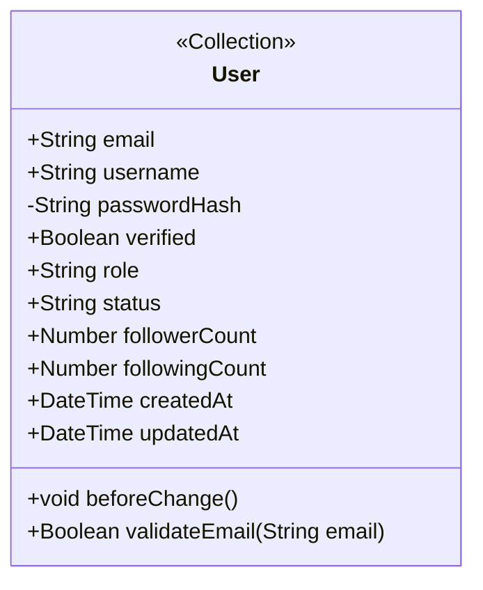

# Test Case: M1 Auth & Profile — class-diagram-analyst

> **Purpose**: Kiểm tra skill hoạt động đúng với Module M1
> **Source**: design.md §3 loop/test-cases/, Appendix A, Appendix B

---

## Input

```
User: "Vẽ class diagram M1"
```

---

## Expected Phase Execution

### Phase 0 — Input Resolution (skip IP0)
- Input type: "Module rõ ràng (M1)"
- Action: Chạy thẳng Phase A
- Module: **M1 — Auth & Profile**

### Phase A — Extract Entities
**Expected entity list từ module-map.yaml**:
- `users` — aggregate_root: true

**Expected fields từ er-diagram.md** (tối thiểu):
```
users:
  - email (email type, required, unique)
  - username (text type, required, unique)
  - password_hash (text type, required, private visibility)
  - role (select type: user/admin/moderator)
  - status (select type: active/inactive/banned)
  - follower_count (number, computed)
  - following_count (number, computed)
  - created_at (date type)
  - updated_at (date type)
```

### Phase B — Cross-Reference
**Expected behaviors**:
- `beforeChange`: sanitize_input (từ activity-diagrams/m1-a1-registration.md)
- `afterChange`: update follower_count (từ connections logic)

**Expected access_control**:
- create: ["anyone"] (USC01 — đăng ký)
- read: ["owner", "admin"]
- update: ["owner", "admin"]
- delete: ["admin"]
- source: UseCase/use-case-m1-auth-profile.md#UC01

### Phase C — Classify
- `users`: **AGGREGATE ROOT** (✅ Q1: posts, comments, likes trỏ vào + Q2: timestamps)

### IP1 — Expected presentation

```
📋 Module M1 — Auth & Profile
Entity List đề xuất:

| Entity | Stereotype | Fields (preview) | Behaviors | Access (summary) |
|--------|-----------|-----------------|-----------|-----------------|
| users  | <<Collection>> | email, username, role, status, followerCount... | beforeChange: sanitize | create: anyone, read: owner/admin |

⚠️ Không có Assumptions đặc biệt cho M1.

❓ Xác nhận danh sách trên để tạo class-m1-auth-profile.md?
```

---

## Expected Mermaid Output (class-m1-auth-profile.md)



---

## Expected Traceability Table

| Entity | Field | Source | Assumption? |
|--------|-------|--------|------------|
| `users` | `email` | `er-diagram.md#USERS.email` | ❌ |
| `users` | `username` | `er-diagram.md#USERS.username` | ❌ |
| `users` | `passwordHash` | `er-diagram.md#USERS.password_hash` | ❌ |
| `users` | `role` | `er-diagram.md#USERS.role` | ❌ |
| `users` | `status` | `er-diagram.md#USERS.status` | ❌ |
| `users` | `followerCount` | `er-diagram.md#USERS.follower_count` | ❌ |
| `users` | `followingCount` | `er-diagram.md#USERS.following_count` | ❌ |
| `users` | `createdAt` | `er-diagram.md#USERS.created_at` | ❌ |
| `users` | `updatedAt` | `er-diagram.md#USERS.updated_at` | ❌ |

---

## Expected YAML Contract Snippet (class-m1-auth-profile.yaml)

```yaml
# ⚠️ LOCKED CONTRACT — DO NOT EDIT MANUALLY.
# Generated by Skill 2.5 (class-diagram-analyst).

meta:
  module: "M1"
  module_name: "Auth & Profile"
  skill_version: "2.5"
  sources_consumed:
    - "Docs/life-2/diagrams/er-diagram.md"
    - "Docs/life-2/diagrams/UseCase/use-case-m1-auth-profile.md"
    - "Docs/life-2/diagrams/activity-diagrams/m1-a1-registration.md"

entities:
  - slug: "users"
    display_name: "User"
    payload_collection: "users"
    aggregate_root: true
    fields:
      - name: "email"
        type: "email"
        required: true
        unique: true
        indexed: true
        source: "er-diagram.md#USERS.email"

      - name: "username"
        type: "text"
        required: true
        unique: true
        indexed: true
        constraints:
          minLength: 3
          maxLength: 50
        source: "er-diagram.md#USERS.username"

      - name: "passwordHash"
        type: "text"
        required: true
        source: "er-diagram.md#USERS.password_hash"

      - name: "role"
        type: "select"
        required: true
        options: ["user", "admin", "moderator"]
        defaultValue: "user"
        source: "er-diagram.md#USERS.role"

      - name: "followerCount"
        type: "number"
        required: false
        defaultValue: 0
        admin:
          readOnly: true
        source: "er-diagram.md#USERS.follower_count"
        pattern: "Computed Pattern"

    behaviors:
      - lifecycle: "beforeChange"
        trigger: "sanitize_input"
        source: "activity-diagrams/m1-a1-registration.md"

    access_control:
      create: ["anyone"]
      read: ["owner", "admin"]
      update: ["owner", "admin"]
      delete: ["admin"]
      source: "UseCase/use-case-m1-auth-profile.md#UC01"

    assumptions: []

validation_report:
  total_fields: 9
  fields_with_source: 9
  fields_as_assumption: 0
  unresolved: []
```

---

## Expected Validation Result

```
✅ PASS — Contract hợp lệ
   Total entities: 1
   Total fields: 9
   With source: 9
   Assumptions: 0
```

---

## Pass Criteria

- [ ] Skill nhận "Vẽ class diagram M1" → chạy Phase A ngay (không hỏi thêm)
- [ ] Entity `users` được extract với đủ fields từ ER
- [ ] `passwordHash` có visibility `-` (private) trong Mermaid
- [ ] `followerCount` có `pattern: "Computed Pattern"` trong YAML
- [ ] Mọi fields có source citation format `er-diagram.md#ENTITY.field`
- [ ] validate_contract.py → PASS
- [ ] IP1, IP2, IP3 được kích hoạt đúng thứ tự
