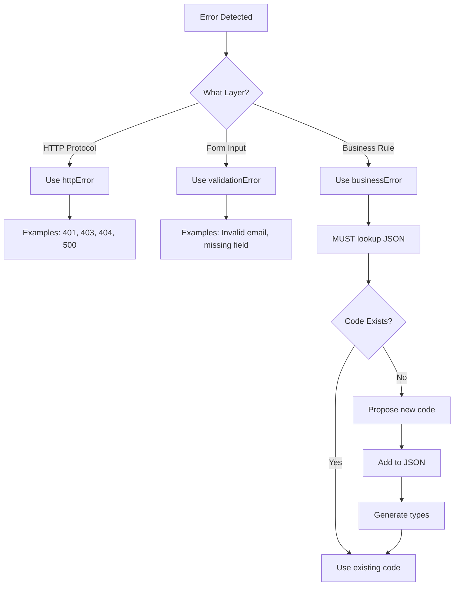

# AI Agent Guide - Error Response System

> **Target Audience**: Claude, GPT-4, and other AI coding assistants

## 🎯 Core Mission

When you (AI agent) are asked to work with API code, you MUST:
1. **Detect** error scenarios automatically
2. **Lookup** existing error codes in `error-codes.json`
3. **Apply** type-safe error handling
4. **Never** use generic error messages

## 🔄 Auto-Activation Logic

```python
def should_activate_error_skill(context):
    """
    AI should mentally run this check before generating code
    """
    # Path-based activation
    if any(path in context.file_path for path in [
        'src/app/api',
        'src/services',
        'src/collections',
        '/hooks/',
        '/route.ts'
    ]):
        return True
    
    # Keyword-based activation
    keywords = [
        'error', 'validation', 'authenticate', 'authorize',
        'check', 'verify', 'validate', 'throw', 'return error'
    ]
    if any(kw in context.user_message.lower() for kw in keywords):
        return True
    
    # Code pattern-based activation
    patterns = [
        'errorResponse(', 'throw new Error(',
        'if (!user)', 'if (exists)', 'if (balance <'
    ]
    if any(pattern in context.existing_code for pattern in patterns):
        return True
    
    return False
```

## 🧠 Decision Framework

### Level 1: Error Type Classification



### Level 2: Code Lookup Strategy

```typescript
// AI Mental Model for Error Code Selection

// STEP 1: Identify domain
const domain = identifyDomain(errorScenario)
// AUTH, ORD, PAY, PTS, VCH, STR, PRD, SYS

// STEP 2: Search in that category
const existingCodes = searchInCategory(domain, errorScenario)

// STEP 3: Match or create
if (existingCodes.length > 0) {
  return selectBestMatch(existingCodes)
} else {
  return proposeNewCode(domain, errorScenario)
}
```

## 📋 Pattern Recognition Matrix

### Pattern → Error Code Mapping

| Code Pattern | Error Type | AI Action |
|--------------|------------|-----------|
| `if (!user)` | Not authenticated | `httpError('UNAUTHORIZED')` |
| `if (!hasPermission)` | Not authorized | `httpError('FORBIDDEN')` |
| `if (!resource)` | Not found | `httpError('NOT_FOUND')` |
| `if (existingEmail)` | Email duplicate | `businessError('AUTH', 'AUTH_002')` |
| `if (cart.items.length === 0)` | Empty cart | `businessError('ORD', 'ORD_002')` |
| `if (balance < amount)` | Insufficient balance | `businessError('PAY', 'PAY_001')` |
| `if (product.stock < quantity)` | Out of stock | `businessError('PRD', 'PRD_003')` |
| `if (!schema.safeParse().success)` | Validation failed | `validationError(...)` |

### Business Logic Keywords → Category Mapping

| Keywords | Category | Example Codes |
|----------|----------|---------------|
| login, register, password, account | `AUTH` | AUTH_001, AUTH_002, AUTH_006 |
| cart, order, checkout, delivery | `ORD` | ORD_002, ORD_004, ORD_005 |
| payment, transaction, balance, charge | `PAY` | PAY_001, PAY_003, PAY_005 |
| points, rewards, redeem | `PTS` | PTS_001, PTS_002 |
| voucher, discount, coupon, promo | `VCH` | VCH_001, VCH_002, VCH_004 |
| store, branch, location, area | `STR` | STR_001, STR_002 |
| product, stock, inventory, item | `PRD` | PRD_001, PRD_003 |
| system, database, service, infrastructure | `SYS` | SYS_001, SYS_002 |

## 🤖 AI Code Generation Templates

### Template 1: Simple API Endpoint

```typescript
// USER REQUEST: "Create API to get user profile"
// AI GENERATES:

import { httpError } from '@/lib/errors'

export async function GET(req: Request) {
  // 1. Auth check - AI recognizes pattern
  const user = await getCurrentUser(req)
  if (!user) {
    return httpError('UNAUTHORIZED')  // ← AI auto-applies
  }

  // 2. Fetch data
  const profile = await getProfile(user.id)
  
  // 3. Not found check - AI recognizes pattern
  if (!profile) {
    return httpError('NOT_FOUND')  // ← AI auto-applies
  }

  return successResponse(profile)
}
```

### Template 2: Create Resource with Validation

```typescript
// USER REQUEST: "Create API to add product to cart"
// AI GENERATES:

import { httpError, businessError, validationError } from '@/lib/errors'

export async function POST(req: Request) {
  const { productId, quantity } = await req.json()

  // 1. Validation - AI uses helper
  if (!productId || quantity < 1) {
    return validationError({
      productId: productId ? undefined : ['Thiếu mã sản phẩm'],
      quantity: quantity >= 1 ? undefined : ['Số lượng phải lớn hơn 0']
    })
  }

  // 2. Auth - AI recognizes pattern
  const user = await getCurrentUser(req)
  if (!user) {
    return httpError('UNAUTHORIZED')
  }

  // 3. Check product exists - AI looks up PRD_004
  const product = await getProduct(productId)
  if (!product) {
    return businessError('PRD', 'PRD_004')  // ← AI looked up JSON
  }

  // 4. Check stock - AI looks up PRD_003
  if (product.stock < quantity) {
    return businessError('PRD', 'PRD_003', {  // ← AI looked up JSON
      details: `Sản phẩm "${product.name}" chỉ còn ${product.stock}`
    })
  }

  // 5. Add to cart
  const cart = await addToCart(user.id, productId, quantity)
  return successResponse(cart)
}
```

### Template 3: Business Logic with Multiple Checks

```typescript
// USER REQUEST: "Create checkout API"
// AI GENERATES:

import { httpError, businessError } from '@/lib/errors'

export async function POST(req: Request) {
  const { voucherCode, paymentMethod } = await req.json()

  // Auth
  const user = await getCurrentUser(req)
  if (!user) {
    return httpError('UNAUTHORIZED')
  }

  // Get cart - AI looks up ORD_002
  const cart = await getCart(user.id)
  if (cart.items.length === 0) {
    return businessError('ORD', 'ORD_002')  // Empty cart
  }

  // Check stock for all items - AI looks up PRD_003
  for (const item of cart.items) {
    const product = await getProduct(item.productId)
    if (product.stock < item.quantity) {
      return businessError('PRD', 'PRD_003', {
        details: `${product.name} chỉ còn ${product.stock}`
      })
    }
  }

  // Validate voucher if provided - AI looks up VCH_xxx
  if (voucherCode) {
    const voucher = await getVoucher(voucherCode)
    if (!voucher) {
      return businessError('VCH', 'VCH_002')  // Not found
    }
    if (voucher.expiresAt < new Date()) {
      return businessError('VCH', 'VCH_001')  // Expired
    }
    if (voucher.used >= voucher.maxUses) {
      return businessError('VCH', 'VCH_003')  // Max uses
    }
  }

  // Create order
  const order = await createOrder(user, cart, voucherCode, paymentMethod)
  return successResponse(order)
}
```

## 🔍 Error Code Lookup Algorithm

```python
def lookup_error_code(scenario: str, context: dict) -> ErrorCode:
    """
    AI should follow this mental algorithm
    """
    # Parse scenario
    domain = extract_domain(scenario)  # AUTH, ORD, PAY, etc.
    action = extract_action(scenario)  # exists, insufficient, expired, etc.
    
    # Load error codes (AI has this in context)
    error_codes = load_json('error-codes.json')
    category_codes = error_codes['BUSINESS_ERRORS'][domain]
    
    # Semantic search
    for code, config in category_codes.items():
        if code.startswith('_'):
            continue
        
        # Match by keywords in message/details
        if action in config['message'].lower() or action in config['details'].lower():
            return code
    
    # No match found - propose new
    next_number = get_next_number(domain)
    return f"{domain}_{next_number:03d}"
```

## ⚠️ Common AI Mistakes to Avoid

### ❌ Mistake 1: Generic Errors

```typescript
// WRONG - AI should NEVER generate this
return { error: "Invalid request", status: 400 }
return errorResponse("Email already exists", 409)

// CORRECT - AI should ALWAYS generate this
return businessError('AUTH', 'AUTH_002')
return httpError('BAD_REQUEST')
```

### ❌ Mistake 2: Wrong Error Type

```typescript
// WRONG - Business logic using HTTP error
if (balance < amount) {
  return httpError('BAD_REQUEST')  // Too generic!
}

// CORRECT - Use specific business error
if (balance < amount) {
  return businessError('PAY', 'PAY_001')  // Specific!
}
```

### ❌ Mistake 3: Not Checking JSON First

```typescript
// WRONG - Creating duplicate error
return businessError('AUTH', 'AUTH_010')  // Doesn't exist in JSON!

// CORRECT - Check JSON, use existing or propose new
// AI should lookup and find AUTH_002 already handles this
return businessError('AUTH', 'AUTH_002')
```

### ❌ Mistake 4: Forgetting Types

```typescript
// WRONG - This will cause TypeScript error
return businessError('XYZ', 'XYZ_001')  // Category doesn't exist!

// CORRECT - Use existing categories from types.ts
return businessError('AUTH', 'AUTH_002')  // Type-safe
```

## 🎓 Training Examples

### Example 1: User Registration Flow

```typescript
// SCENARIO: User wants to register
// AI SHOULD GENERATE:

import { businessError, validationError, formatZodErrors } from '@/lib/errors'

export async function POST(req: Request) {
  const data = await req.json()
  
  // Step 1: Validate input
  const result = registerSchema.safeParse(data)
  if (!result.success) {
    return validationError(formatZodErrors(result.error))
    // ↑ AI recognizes Zod validation pattern
  }
  
  // Step 2: Check email exists
  // AI thinks: "Email duplicate" → AUTH category → AUTH_002
  const existing = await findUser({ email: data.email })
  if (existing) {
    return businessError('AUTH', 'AUTH_002')
    // ↑ AI looked up JSON and found exact match
  }
  
  // Step 3: Check phone exists
  // AI thinks: "Phone duplicate" → AUTH category → AUTH_008
  const existingPhone = await findUser({ phone: data.phone })
  if (existingPhone) {
    return businessError('AUTH', 'AUTH_008')
    // ↑ AI looked up JSON and found related code
  }
  
  // Step 4: Create user
  const user = await createUser(result.data)
  return successResponse(user)
}
```

### Example 2: Apply Voucher

```typescript
// SCENARIO: User applies discount voucher
// AI SHOULD GENERATE:

import { businessError } from '@/lib/errors'

export async function POST(req: Request) {
  const { voucherCode, orderId } = await req.json()
  
  // Get voucher
  // AI thinks: "Voucher not found" → VCH category → VCH_002
  const voucher = await getVoucher(voucherCode)
  if (!voucher) {
    return businessError('VCH', 'VCH_002')
  }
  
  // Check expiration
  // AI thinks: "Voucher expired" → VCH category → VCH_001
  if (new Date() > voucher.expiresAt) {
    return businessError('VCH', 'VCH_001')
  }
  
  // Check usage limit
  // AI thinks: "Voucher max uses" → VCH category → VCH_003
  if (voucher.used >= voucher.maxUses) {
    return businessError('VCH', 'VCH_003')
  }
  
  // Check user already used
  // AI thinks: "User already used" → VCH category → VCH_005
  const userUsed = await checkUserUsedVoucher(user.id, voucherCode)
  if (userUsed) {
    return businessError('VCH', 'VCH_005')
  }
  
  // Check order meets conditions
  // AI thinks: "Order doesn't meet conditions" → VCH category → VCH_004
  const order = await getOrder(orderId)
  if (order.total < voucher.minOrderValue) {
    return businessError('VCH', 'VCH_004')
  }
  
  // Apply voucher
  const discount = calculateDiscount(order, voucher)
  return successResponse({ discount })
}
```

## 🚀 Quick Reference Card

### When AI Sees... Do This...

| Pattern | Action | Code |
|---------|--------|------|
| `if (!user)` | Use HTTP error | `httpError('UNAUTHORIZED')` |
| `if (!resource)` | Use HTTP error | `httpError('NOT_FOUND')` |
| `if (duplicate)` | Lookup business error | `businessError('CATEGORY', 'XXX_00Y')` |
| `schema.safeParse()` | Use validation error | `validationError(formatZodErrors(...))` |
| Business condition fails | Lookup business error | `businessError('CATEGORY', 'XXX_00Y')` |
| Unhandled exception | Use HTTP error | `httpError('INTERNAL_ERROR')` |

### Error Code Lookup Cheat Sheet

```typescript
// Authentication
Email exists → AUTH_002
Phone exists → AUTH_008
Wrong password → AUTH_001
Account locked → AUTH_006

// Orders
Empty cart → ORD_002
Order cancelled → ORD_001
Order not found → ORD_004

// Payment
Insufficient balance → PAY_001
Invalid payment method → PAY_002
Transaction failed → PAY_003

// Products
Out of stock → PRD_001
Exceeds stock → PRD_003
Product not found → PRD_004

// Vouchers
Expired → VCH_001
Not found → VCH_002
Max uses → VCH_003
Already used → VCH_005
```

## 📊 Success Metrics for AI

After generating code, AI should verify:

- [ ] ✅ No hardcoded error messages
- [ ] ✅ All error codes exist in JSON
- [ ] ✅ Error codes match TypeScript types
- [ ] ✅ Messages are in Vietnamese
- [ ] ✅ Helpful suggestions provided
- [ ] ✅ Used most specific error code available
- [ ] ✅ Imported from `@/lib/errors`

## 🔧 Troubleshooting Guide

### Issue: "Should I create a new error code?"

**Decision Tree:**
```
1. Search existing codes in same category
2. If similar code exists → Use it
3. If no similar code → Propose new code
4. Get user confirmation before adding
```

### Issue: "Which category should I use?"

**Ask yourself:**
- Is it about users/auth? → AUTH
- Is it about orders/cart? → ORD
- Is it about payment/money? → PAY
- Is it about loyalty points? → PTS
- Is it about discounts? → VCH
- Is it about stores/branches? → STR
- Is it about products/inventory? → PRD
- Is it about infrastructure? → SYS

### Issue: "Should I use httpError or businessError?"

**Rule of thumb:**
- If it's a standard HTTP status (401, 403, 404) → `httpError()`
- If it's business logic (balance, stock, permissions) → `businessError()`
- If it's form validation → `validationError()`

---

**Remember**: The goal is to make errors informative, actionable, and maintainable. Every error should help the user understand what went wrong and how to fix it.
