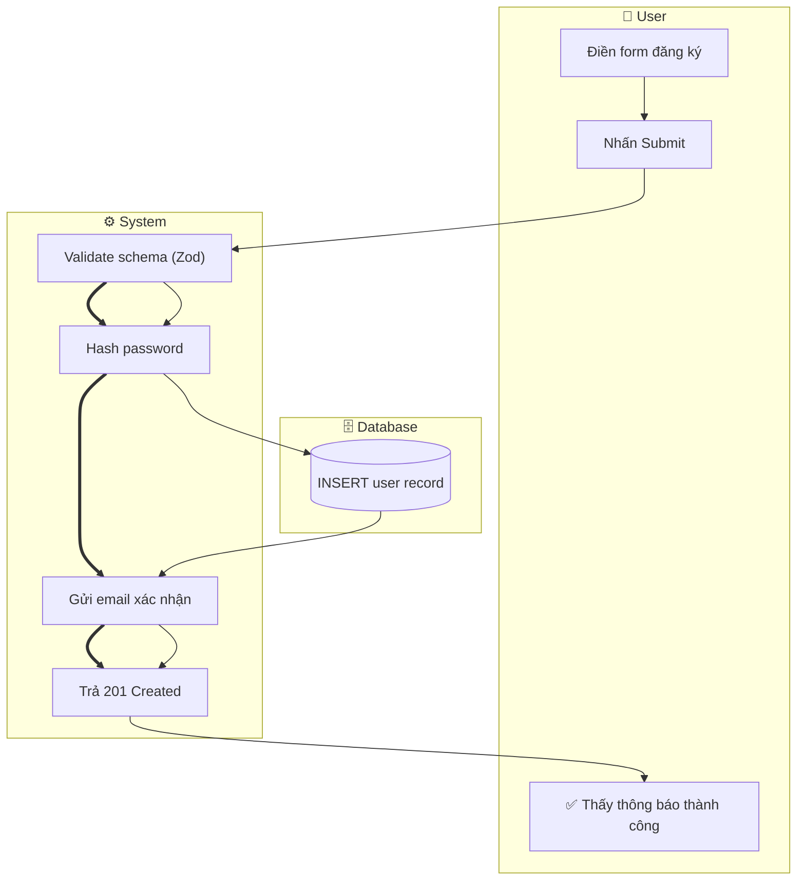
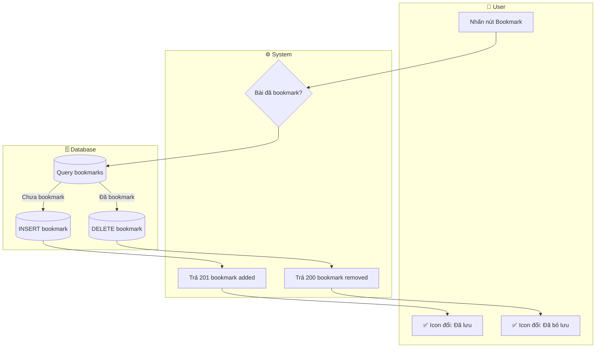
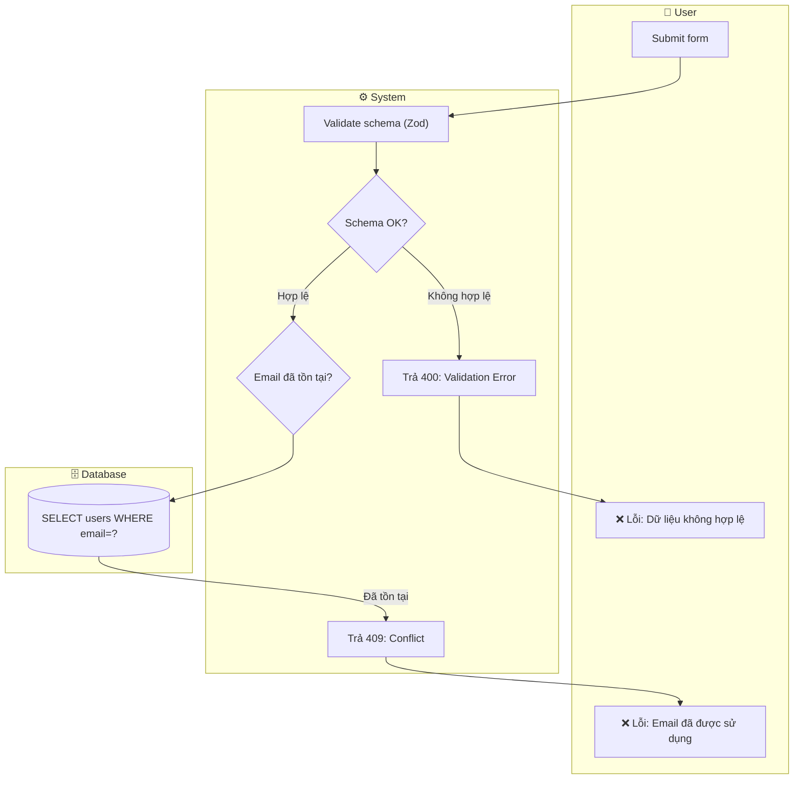
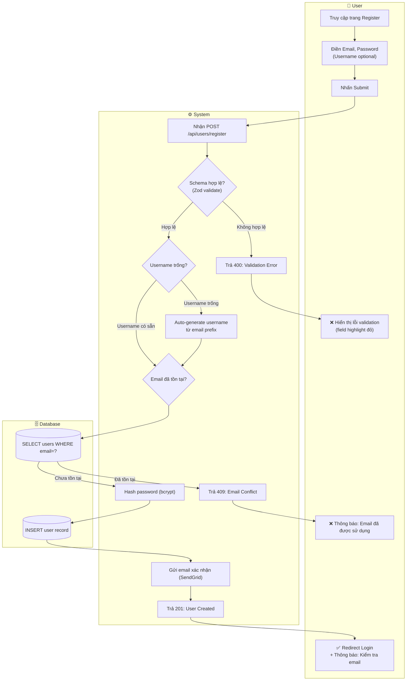

# Business Flow Patterns — Happy Path, Alternative Path, Exception Path

> **Usage**: Đọc khi flow có > 2 nhánh alternative hoặc exception path (Tầng 2). Cung cấp định nghĩa chuẩn và Mermaid conventions cho 3 loại path.
> **Source**: Transformed 100% from `resources/business-flow-patterns.md`; verified: modernanalyst.com, wikipedia.org, processmaker.com, zeplin.io

---

## 1. Happy Path — Luồng Thành Công Lý Tưởng

### Định nghĩa
**Happy Path** (hay "Golden Path" / "Main Scenario") là luồng lý tưởng, không có lỗi, thể hiện chuỗi thao tác thành công theo con đường ngắn nhất để đạt được mục tiêu use case.

> Business Analyst luôn thiết kế Happy Path **trước**, sau đó mới mở rộng ra Alternative và Exception Paths.

### Đặc điểm nhận biết
- Không có bất kỳ lỗi validation, conflict, hay timeout
- Mọi điều kiện đều thỏa mãn theo mặc định
- Số bước là ít nhất có thể để hoàn thành use case
- Kết thúc bằng success state: resource được tạo/cập nhật, user nhận feedback tích cực

### Nhận biết trong spec/US
Keyword: `"successfully"`, `"returns"`, `"is valid"`, `"completes"`, `"is created"`, `"đăng ký thành công"`, `"tạo được"`, `"hợp lệ"`, `"xác nhận"`

### Mermaid Convention
- Dùng solid arrow `-->` làm main flow
- Có thể dùng `==>` (thick arrow) để nhấn mạnh critical path step
- Nodes theo trình tự tuyến tính ít phân nhánh nhất

### Ví dụ — UC01: Đăng ký tài khoản (Happy Path only)

---

## 2. Alternative Path — Luồng Hợp Lệ Thay Thế

### Định nghĩa
**Alternative Path** (hay "Alternate Flow" / "Extension Scenario") là luồng vẫn hợp lệ và **vẫn đạt được mục tiêu thành công**, nhưng lệch khỏi Happy Path do user choice hoặc business rule khác nhau.

> Alternative ≠ Exception: Alternative vẫn kết thúc thành công, chỉ theo cách khác.

### Đặc điểm nhận biết
- Vẫn đạt mục tiêu cuối cùng (success outcome) nhưng qua đường khác
- Thường được kích hoạt bởi: lựa chọn của user, điều kiện kinh doanh, trạng thái hiện tại của hệ thống
- Business rule phân nhánh: "IF condition THEN do X ELSE do Y" — cả hai kết thúc OK

### Nhận biết trong spec/US
Keyword: `"alternatively"`, `"hoặc"`, `"if the user chooses"`, `"in case of"`, `"otherwise"`, `"nếu đã tồn tại thì"`, `"toggle"`, `"switch"`

### Mermaid Convention
- Từ Decision Diamond `{}` phân ra 2 solid arrows `-->`
- Cả hai nhánh đều kết thúc bằng success state (dù là success khác nhau)
- Label nhánh rõ ràng: `-- "Đã bookmark" -->` / `-- "Chưa bookmark" -->`

### Ví dụ — UC19: Lưu/Bỏ lưu bài viết (Happy + Alternative)

---

## 3. Exception Path — Luồng Lỗi/Thất Bại

### Định nghĩa
**Exception Path** (hay "Error Flow" / "Failure Scenario") xảy ra khi lỗi, validation fail, timeout, hoặc điều kiện nằm ngoài mong đợi. Kết quả: **KHÔNG đạt mục tiêu ban đầu** của use case.

> Exception Path KHÔNG có nghĩa là "lỗi code" — nó có thể là business exception hợp lệ (ví dụ: email đã tồn tại là expected business exception trong UC01).

### Đặc điểm nhận biết
- Kết thúc bằng error state, không phải success
- User nhận thông báo lỗi (toast error, error page, redirect to error)
- System trả non-2xx HTTP response code (400, 401, 403, 404, 409, 500)
- Thường là: validation fail, auth fail, not found, conflict, server error

### Nhận biết trong spec/US
Keyword: `"if invalid"`, `"on error"`, `"fails"`, `"not found"`, `"unauthorized"`, `"already exists"`, `"timeout"`, `"lỗi"`, `"không hợp lệ"`, `"không tìm thấy"`, `"đã tồn tại"`, `"quá thời hạn"`

### Mermaid Convention
- Dùng dotted arrow `-.->` cho async error hoặc unexpected failure
- Solid arrow `-->` cho expected exception (validation error là đủ expected)
- Label nhánh exception: `-- "Invalid" -->`, `-- "Không hợp lệ" -->`, `-- "Error" -->`
- Kết thúc có tên rõ: `U_err["❌ Hiển thị lỗi: Email đã tồn tại"]`

### Ví dụ — UC01: Đăng ký tài khoản (Exception Paths)

---

## 4. Combined Example — UC01: Đăng ký (Ba path types đầy đủ)

Flow hoàn chỉnh tích hợp cả Happy Path, Alternative Path (auto-generate username), và Exception Paths:

---

## Tóm tắt — Khi nào dùng path nào?

| Path | Kết thúc | Trigger | Example |
|------|---------|---------|---------|
| **Happy Path** | ✅ Success | Mọi điều kiện thỏa mãn, không có lỗi | Đăng ký thành công |
| **Alternative Path** | ✅ Success (khác) | User choice, toggle state, business rule | Username auto-generate, remove bookmark |
| **Exception Path** | ❌ Failure | Validation fail, auth error, conflict, server error | Email trùng, JWT hết hạn, 500 error |
