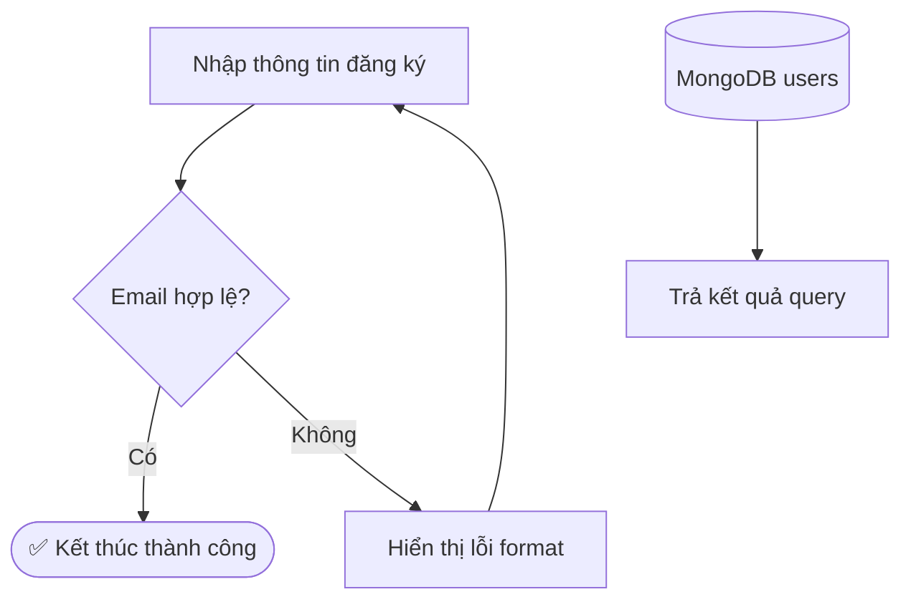
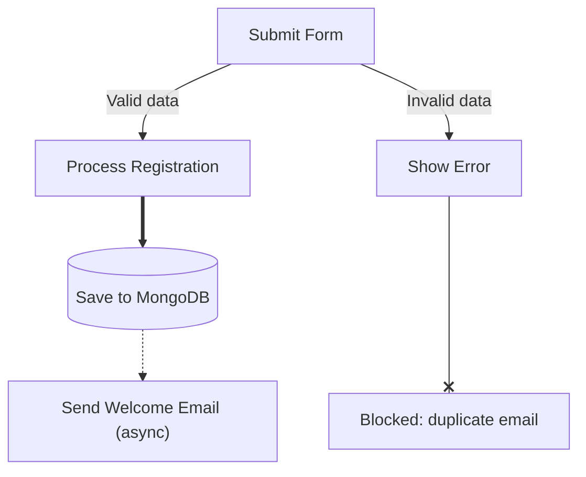
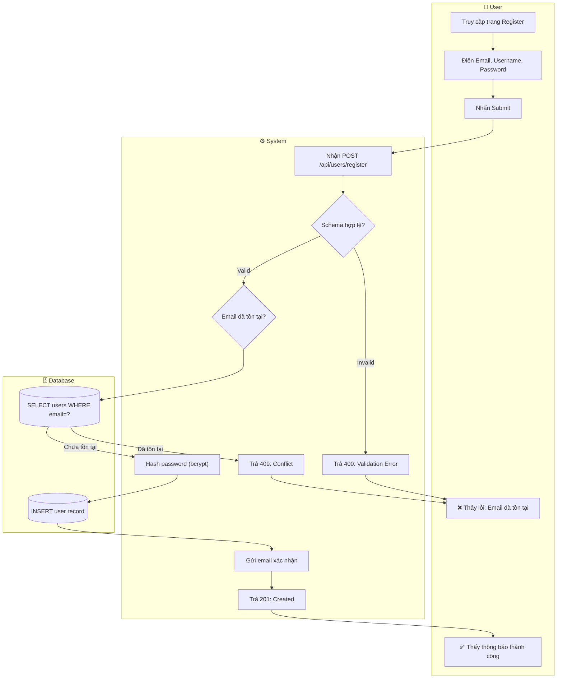
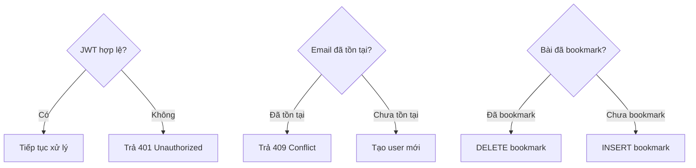
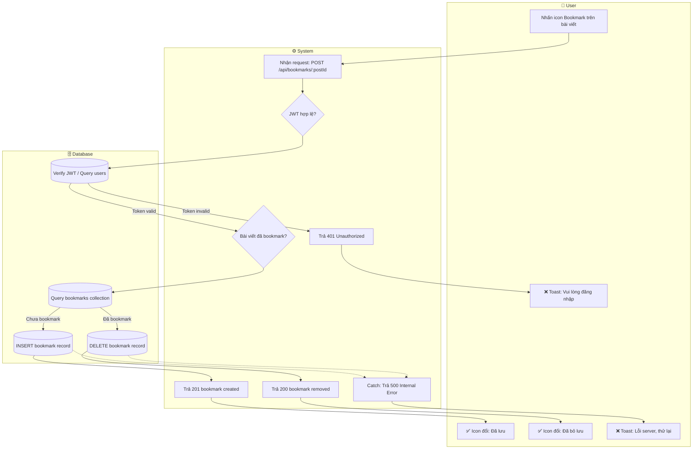

# Mermaid Flowchart Guide — Complete Syntax Reference

> **Usage**: Đọc bắt buộc (Tầng 1) mỗi khi skill kích hoạt. Cung cấp cú pháp Mermaid đầy đủ để sinh swimlane flow diagram chuẩn xác.
> **Source**: Transformed 100% from `resources/mermaid-flowchart-reference.md` + `activity-uml-rules.md §6`

---

## 1. Node Shape Reference

Bảng đầy đủ tất cả node shapes trong Mermaid flowchart:

| Shape | Syntax | Dùng cho | Ghi chú |
|-------|--------|----------|---------|
| Rectangle (default) | `id["Text"]` | Action / Process step | Shape phổ biến nhất |
| Rounded edges | `id("Text")` | Trigger / Start event | Cũng dùng cho sub-process nhỏ |
| Stadium | `id(["Text"])` | Terminal: Start hoặc End | Ưu tiên dùng cho endpoint |
| Subroutine | `id[["Text"]]` | Sub-process / Call activity | Hiếm dùng |
| Cylinder (Database) | `id[("Text")]` | Database node trong DB Lane | Chuẩn cho DB operations |
| Circle | `id(("Text"))` | Connector / Junction node | Nối qua trang |
| Rhombus (Decision) | `id{"Text"}` | Decision gate | Bắt buộc ≥ 2 nhánh có label |
| Hexagon | `id{{"Text"}}` | Preparation step | Ít dùng |
| Parallelogram | `id[/"Text"/]` | Input / Output action | Nhấn mạnh I/O |
| Trapezoid | `id[/"Text"\]` | Manual operation | Dùng cho bước thủ công |

**Ví dụ tổng hợp:**



---

## 2. Edge Types

Tất cả kiểu mũi tên và connector trong Mermaid:

| Syntax | Tên | Dùng cho |
|--------|-----|----------|
| `A --> B` | Arrow đơn | Luồng thông thường (phổ biến nhất) |
| `A --- B` | Open link | Không có chiều, liên kết đơn giản |
| `A -- "Text" --> B` | Arrow có label | Nhánh có điều kiện ("Yes", "No", "Success") |
| `A -. "Text" .-> B` | Dotted + label | Luồng conditional, async, optional |
| `A -.-> B` | Dotted không label | Dependency ngầm, trigger gián tiếp |
| `A ==> B` | Thick arrow | Nhấn mạnh Happy Path chính |
| `A === "Text" ==> B` | Thick + label | Thick arrow có nhãn |
| `A ---o B` | Circle ending | Optional dependency |
| `A ---x B` | Cross ending | Blocked / Forbidden path |

**Ví dụ phân biệt edge types:**



---

## 3. Swimlane (Subgraph) Syntax — 3-Lane Standard

**Cú pháp chuẩn cho 3-lane swimlane (User / System / DB):**

```
flowchart TD
  subgraph User ["👤 User"]
    direction TB
    ...user action nodes...
  end

  subgraph System ["⚙️ System"]
    direction TB
    ...system logic nodes...
  end

  subgraph DB ["🗄️ Database"]
    direction TB
    ...database operation nodes...
  end

  %% Cross-lane connections defined AFTER all subgraphs
  UserNode --> SystemNode
  SystemNode --> DBNode
```

**Quy tắc bắt buộc cho subgraph:**

1. **Label có space → BẮT BUỘC `""`**:
   - ✅ `subgraph User ["👤 User"]`
   - ❌ `subgraph User [👤 User]` → render lỗi

2. **`direction TB` bên trong mỗi subgraph** để control hướng riêng từng lane.

3. **Keyword `end`** là reserved word:
   - ✅ `id["end of process"]` (wrap trong `""`)
   - ❌ `id[end]` → parse error

4. **Cross-lane arrows** phải khai báo SAU khi đóng tất cả `end` của subgraph.

5. Lồng subgraph trong subgraph → hạn chế, khó control style.

**Ví dụ hoàn chỉnh — UC01: Đăng ký tài khoản:**



---

## 4. Safe Label Rules — Quy tắc bắt buộc

> **Nguồn**: Đồng nhất với `activity-diagram-design-analyst/knowledge/activity-uml-rules.md §6`

### 4.1 Label Quoting (Bọc nhãn)

**BẮT BUỘC dùng `""` khi label chứa bất kỳ ký tự nào sau:**

| Ký tự nguy hiểm | Ví dụ | Cách viết đúng |
|-----------------|-------|----------------|
| `( )` ngoặc tròn | `Check (Status)?` | `"Check (Status)?"` |
| `{ }` ngoặc nhọn | `{Validation}` | `"{Validation}"` |
| `[ ]` ngoặc vuông | `[Array]` | `"[Array]"` |
| `:` dấu hai chấm | `Error: 404` | `"Error: 404"` |
| `/` gạch chéo | `Read/Write` | `"Read/Write"` |
| `?` dấu hỏi | `Valid?` | `"Valid?"` |
| `&` dấu và | `A & B` | `"A & B"` |
| whitespace | `My Action` | `"My Action"` |

**Quy tắc vàng**: Dùng `""` cho MỌI label dài hơn 1 từ — không có ngoại lệ.

```
✅ ĐÚNG: S1{"Email đã tồn tại?"}
✅ ĐÚNG: U2["Điền Email, Username, Password"]
❌ SAI:  S1{Email đã tồn tại?}   → Parse error
❌ SAI:  U2[Điền Email, Username, Password]  → Parse error
```

### 4.2 Line Breaks (Xuống dòng)

```
✅ ĐÚNG: id["Dòng 1<br/>Dòng 2"]
❌ SAI:  id["Dòng 1\nDòng 2"]   → \n không render trong Mermaid
```

### 4.3 Node ID Constraints

- **Chỉ dùng**: chữ (`a-z`, `A-Z`), số (`0-9`), dấu gạch dưới (`_`)
- **Không dùng**: `()`, `{}`, `[]`, `-`, spaces, ký tự đặc biệt
- **Convention KLTN**: Prefix theo lane: `U1, U2, U3` (User), `S1, S2` (System), `D1, D2` (DB)

```
✅ ĐÚNG: U1, S_validate, D_save, user_action_1
❌ SAI:  user-action, node(1), check&save
```

### 4.4 Cảnh báo đặc biệt

- Chữ `o` hoặc `x` đầu node trong edge → Mermaid parse nhầm thành `--o`/`--x` arrow ending. Workaround: thêm space hoặc wrap ID.
- Từ `end` là reserved keyword → bắt buộc wrap: `id["end of flow"]`.
- `subgraph` title có space → bắt buộc `""`; nếu không → `subgraph` sẽ không nhận diện được title.

---

## 5. Decision Node Rules — Quy tắc Diamond

**Mọi `{}` Decision Diamond PHẢI tuân thủ:**

1. Tối thiểu **2 nhánh output** (không để dangling — 1 mũi tên ra)
2. Mỗi nhánh có **label rõ ràng** (`-- "Yes" -->`, `-- "Không hợp lệ" -->`)
3. Mọi nhánh có **điểm kết thúc** (không để path lơ lửng)



**Các pattern Decision Node phổ biến trong KLTN:**

| Situation | Nhánh 1 | Nhánh 2 |
|-----------|---------|---------|
| Validation | `"Hợp lệ"` | `"Không hợp lệ"` |
| Auth check | `"Đã đăng nhập"` | `"Chưa đăng nhập"` |
| DB existence | `"Tìm thấy"` | `"Không tìm thấy"` |
| API response | `"200 OK"` | `"4xx/5xx Error"` |
| Toggle state | `"Đã [action]"` | `"Chưa [action]"` |

---

## 6. Complete 3-Lane Example — UC19 Bookmark (Verified)

Flow hoàn chỉnh với đủ: 3 lanes, decision nodes, happy path, alternative path, exception path.


