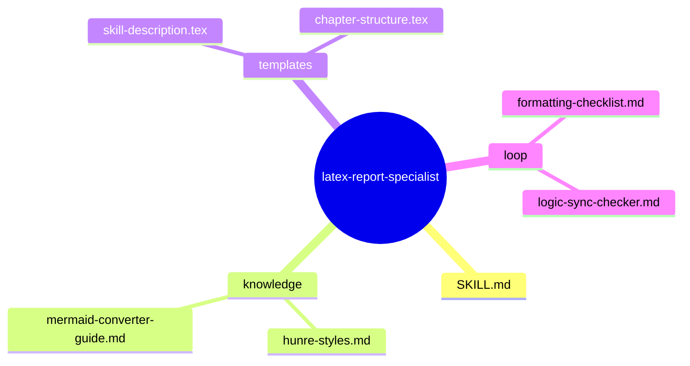

# latex-report-specialist — Architecture Design

> Generated by Antigravity (Tít dễ thương) | Date: 2026-02-22
> Status: 🟡 IN-PROGRESS (Design Phase)

---

## 1. Problem Statement

**Vấn đề**: Việc viết báo cáo khóa luận bằng LaTeX thường mất nhiều thời gian cho việc căn chỉnh format, chèn ảnh, và đồng bộ hóa nội dung từ các bản thiết kế (Mermaid diagrams, YAML schemas) sang mã LaTeX. Đặc biệt, người dùng cần đảm bảo báo cáo bám sát thực tế các bộ Agent Skill đã xây dựng mà không gây ra sai lệch thông tin.

**Người dùng**: Steve (Sinh viên thực hiện khóa luận), AI Agent (Tít dễ thương) cần một quy trình chuẩn để tự động hóa việc "hóa thân" các thiết kế trong `.skill-context` thành nội dung các chương trong báo cáo.

**Lý do cần skill**: Để tối ưu hóa quy trình viết báo cáo, đảm bảo tính nhất quán giữa "sản phẩm" (Agent Skills) và "tài liệu minh chứng" (LaTeX Report), đồng thời tuân thủ 100% quy chuẩn của nhà trường (HUNRE).

---

## 2. Capability Map

### 2.1 Tri thức (Knowledge — Pillar 1)

| Tri thức | File | Ghi chú |
| :--- | :--- | :--- |
| HUNRE Writing Standards | `.agent/rules/06-report-writing-standards.md` | Quy chuẩn lề, font, spacing, heading |
| LaTeX Thesis Templates | `bao-cao/KLTN-template.tex` | Cấu trúc file mẫu hiện tại |
| Skill Context Analysis | `.skill-context/` | Cách đọc và trích xuất thông tin từ `design.md` các skill |
| Mermaid to LaTeX/Image | `knowledge/latex-mermaid-integration.md` | Cách xử lý diagram trong báo cáo |

### 2.2 Quy trình (Process — Pillar 2)

**Workflow "Hóa thân thiết kế"**:

1. **ANALYZE**: Đọc yêu cầu chương/phần cần viết + Đọc `.skill-context` liên quan.
2. **EXTRACT**: Trích xuất các thành phần cốt lõi (Problem Statement, Capability Map, Workflow, Guardrails).
3. **TRANSFORM**: Chuyển đổi Markdown/Mermaid sang LaTeX (sử dụng các môi trường `listings`, `figure`, `table`).
4. **INTEGRATE**: Chèn nội dung vào đúng vị trí trong `KLTN-template.tex`.
5. **VERIFY**: Kiểm tra lề, font và tính logic của nội dung so với mẫu PDF.

### 2.3 Kiểm soát (Guardrails — Pillar 3)

- **G1: No Content Invention**: Tuyệt đối không tự bịa thêm tính năng cho skill nếu không có trong `design.md` tại `.skill-context`.
- **G2: Standard Compliance**: Luôn kiểm tra lại format lề và font sau mỗi lần update block nội dung lớn.
- **G3: Reference Integrity**: Các hình vẽ và bảng biểu phải có đầy đủ label và caption để dẫn chiếu trong văn bản.

---

## 3. Zone Mapping

| Zone | Files cần tạo | Nội dung | Bắt buộc? |
| :--- | :--- | :--- | :--- |
| Core | `SKILL.md` | Persona: LaTeX Report Expert, Hướng dẫn viết chapter từ skill design | ✅ |
| Knowledge | `knowledge/hunre-styles.md` | Chi tiết các lệnh LaTeX tùy chỉnh cho HUNRE | ✅ |
| Templates | `templates/chapter-logic.tex` | Mẫu cấu trúc một chương về Agent Skill | ✅ |
| Loop | `loop/report-checklist.md` | Checklist kiểm tra tính đồng bộ và định dạng | ✅ |

---

## 4. Folder Structure (D1)

---

## 10. Metadata

- **Skill Name**: latex-report-specialist
- **Version**: 1.0
- **Primary Goal**: Automate LaTeX report generation from Agent Skill contexts.
- **Status**: 🟢 DESIGNED
