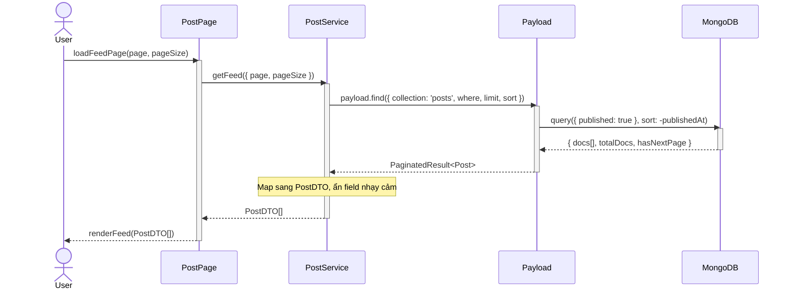
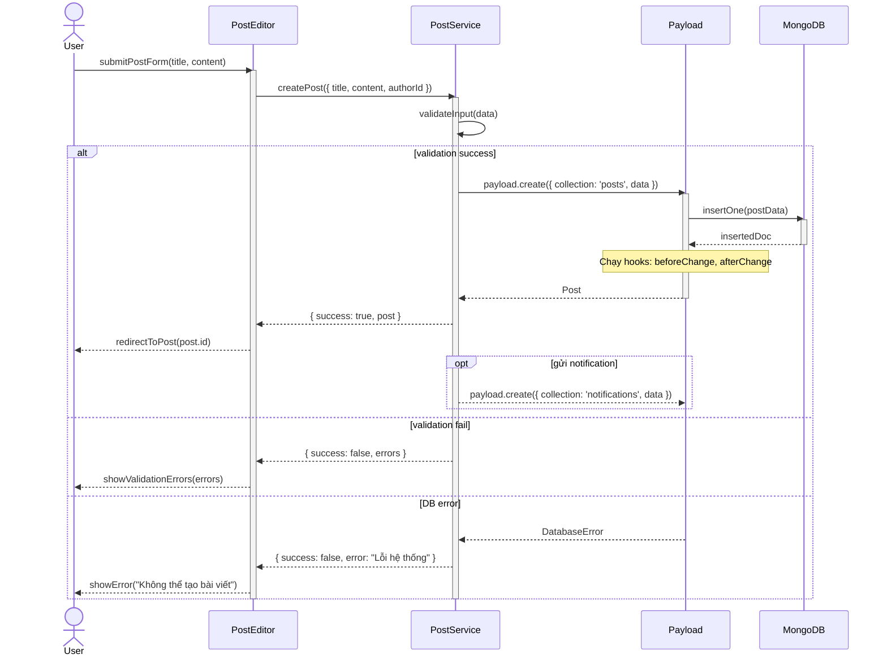

# Project Architecture & Patterns

> **Usage**: Giúp AI hiểu “bản đồ” kiến trúc và luồng logic của dự án Next.js + PayloadCMS để vẽ Sequence Diagram đúng lớp, đúng hướng call.

---

## 1. Core Architecture

### 1.1 Tech Stack & Runtime

- **Frontend / SSR**: Next.js 15 (App Router) chạy trên Node runtime.  
  - Sử dụng Server Components, Route Handlers và/hoặc Server Actions cho các luồng cần truy cập Payload Local API.
- **Backend / CMS**: PayloadCMS 3.0 chạy cùng process với Next.js như một monolith.  
- **Database**: MongoDB (theo quyết định kiến trúc chung của dự án).

### 1.2 API Style – Local API First

- **Local API** (Primary):  
  - Sử dụng helper `getPayload` để lấy instance Payload trong môi trường Node.
  - Chỉ được sử dụng **trên server** (Route Handler, Server Component, Server Action), không dùng trực tiếp trên client component.
  - Các phương thức chính:
    - `payload.find({ collection, where, limit, sort })`
    - `payload.findByID({ collection, id })`
    - `payload.create({ collection, data })`
    - `payload.update({ collection, id, data })`

- **REST API** (Fallback / Integration):  
  - Khi cần gọi từ client-side hoặc từ hệ thống bên ngoài, sử dụng REST endpoints chuẩn của Payload thay vì Local API.

**Guardrail cho Sequence**: Khi vẽ sơ đồ, luôn thể hiện luồng Data Access đi qua **Payload Local API hoặc REST API**, không bao giờ cho UI/Service nói chuyện trực tiếp với Database.

---

## 2. Sequence Layers (Thứ tự tham gia của các lớp)

### 2.1 Chuỗi lớp chuẩn

Thứ tự tham gia chuẩn trong các Sequence Diagram của dự án:

1. **Actor (User / External System)**  
   - Người dùng web, mobile, hoặc hệ thống tích hợp (Payment Gateway, OAuth Provider).

2. **UI Component / Screen (Next.js App Router)**  
   - Page / Layout / Client Component chịu trách nhiệm: Nhận input từ user; Gửi request tới Route Handler / Server Action / Service.

3. **Service Layer (Domain / Application Services)**  
   - Viết bằng TypeScript, nằm trong thư mục kiểu `src/services/` hoặc `src/features/**/services`.  
   - Đảm nhiệm: Ánh xạ input từ UI thành lệnh domain; Gọi Payload Local API thông qua các hàm helper.

4. **Payload Local API (Data Access via getPayload)**  
   - Hàm helper kiểu `getPayloadClient`.
   - Service layer gọi `payload.find`, `payload.findByID`, `payload.create`, v.v. tại đây.

5. **Database / External Systems**  
   - MongoDB đứng phía sau Payload.
   - Các hệ thống khác (Redis, 3rd-party API) luôn được wrap bởi một service/adapter.

### 2.2 Quy tắc khi vẽ Sequence

- Không vẽ Actor / UI gọi Database trực tiếp; luôn chèn Service layer và Payload Local API.
- Tên lifeline nên phản ánh đúng layer: `actor User`, `participant PostPage`, `participant PostService`, `participant Payload`, `participant MongoDB`.

---

## 3. Common Logic Flows

### 3.1 Auth Flow (Login / Token / Session)

**Luồng tổng quát:**
1. `User` nhập credential trên UI (Login Page).
2. `LoginPage` gửi request tới `AuthRoute` hoặc `AuthService`.
3. `AuthService` sử dụng `payload.login`.
4. Payload xác thực, trả về user + token.
5. `AuthService`: Ghi session (cookie); Trả kết quả về cho UI.

**Ví dụ Mermaid – Auth Flow:**
```mermaid
sequenceDiagram
  actor User
  participant LoginPage
  participant AuthService
  participant Payload
  participant MongoDB

  User ->> LoginPage: submitLoginForm(email, password)
  activate LoginPage
  LoginPage ->> AuthService: login(email, password)
  activate AuthService
  AuthService ->> Payload: payload.login({ collection: 'users', data })
  activate Payload
  Payload ->> MongoDB: findOne({ email })
  activate MongoDB
  MongoDB -->> Payload: UserRecord | null
  deactivate MongoDB

  alt login success
      Payload -->> AuthService: { user, token }
      deactivate Payload
      AuthService ->> AuthService: setSessionCookie(token)
      AuthService -->> LoginPage: { success: true, user }
      LoginPage -->> User: redirectToDashboard()
      opt ghi audit log
          AuthService -->> Payload: payload.create({ collection: 'auditLogs', data })
      end
  else invalid credentials
      Payload -->> AuthService: AuthError("Invalid credentials")
      deactivate Payload
      AuthService -->> LoginPage: { success: false, error }
      LoginPage -->> User: showError("Sai email hoặc mật khẩu")
  else user locked
      Payload -->> AuthService: AuthError("Account locked")
      deactivate Payload
      AuthService -->> LoginPage: { success: false, error }
      LoginPage -->> User: showError("Tài khoản bị khóa")
  end

  deactivate AuthService
  deactivate LoginPage
```

---

### 3.2 Data Query Flow (Payload find / findByID)

**Ví dụ Mermaid – Data Query Flow:**


---

### 3.3 Write / Update Flow (Create / Update via Payload)

**Ví dụ Mermaid – Write / Update Flow:**


---

## 4. Guardrails for Sequence in This Project

- **Không vẽ trực tiếp vào Database**: Mọi thao tác qua Payload Local API.
- **Tôn trọng Layer Order**: Actor → UI → Service Layer → Payload Local API → Database.
- **Tên Service khớp file `.service.ts`**.
- **Auth luôn qua Auth Service / Auth Collection**.
- **Sequence Diagram bám sát use case thật**.

---

## 5. Naming Conventions Tham Khảo Nhanh

| Layer              | Lifeline Mermaid           | Ví dụ file thực tế               |
|--------------------|----------------------------|----------------------------------|
| Actor              | `actor User`               | —                                |
| UI / Page          | `participant PostPage`     | `app/(frontend)/posts/page.tsx`  |
| Route Handler      | `participant PostRoute`    | `app/api/posts/route.ts`         |
| Service            | `participant PostService`  | `src/services/post.service.ts`   |
| Payload Local API  | `participant Payload`      | `src/lib/payload.ts`             |
| Database           | `participant MongoDB`      | MongoDB Atlas / local instance   |
| External System    | `participant PaymentGW`    | Stripe, VNPay, v.v.              |

---
*Fidelity Source: resources/project-patterns.md (Transformed 100%)*
