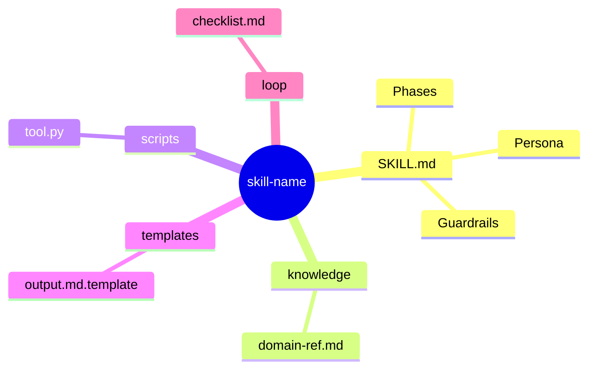
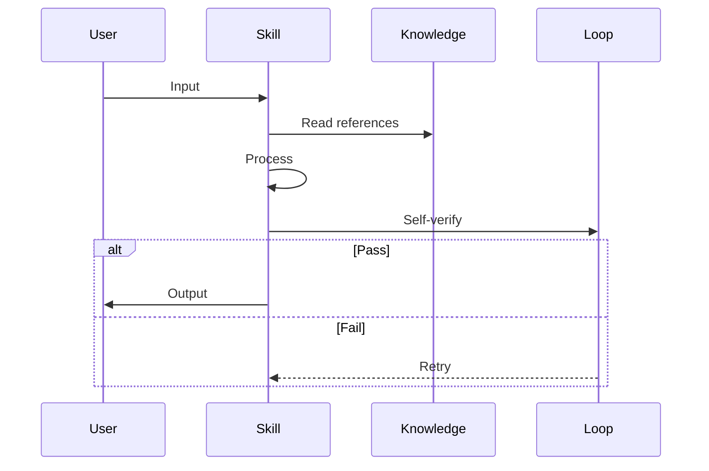
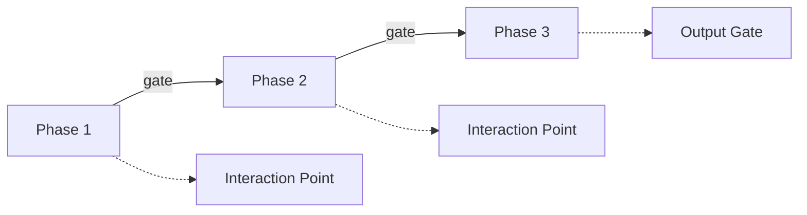
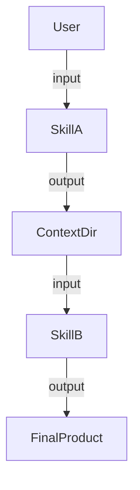

# Visualization & Diagram Guidelines

This guide defines how to create effective, concrete, and unambiguous architecture diagrams for Agent Skills. Use these when designing a new skill to ensure clarity for both humans and AI.

## Principle: "Show, then explain"

For each major concept, FIRST draw a diagram, THEN add a table or text that explains details the diagram cannot convey. Never replace a diagram with a table.

## Diagram Types & When to Use

| #  | Diagram Type       | Mermaid Syntax  | Use When                                          |
| -- | ------------------ | --------------- | ------------------------------------------------- |
| D1 | **Folder Structure** | `mindmap`     | ALWAYS — show the skill's directory tree           |
| D2 | **Execution Flow**   | `sequenceDiagram` | ALWAYS — show runtime interaction between participants |
| D3 | **Workflow Phases**  | `flowchart LR` | Skill has multi-phase workflow with clear stages   |
| D4 | **Relationship**     | `flowchart TD` | Skill connects to external systems or other skills |
| D5 | **Data Flow**        | `flowchart LR` | Skill transforms data through multiple stages      |

## Mermaid Skeletons

Use these as starting points. Adapt them to the specific skill being designed.

### D1 — Folder Structure (Mindmap)

### D2 — Execution Flow (Sequence)

### D3 — Workflow Phases (Flowchart)

### D4 — Relationship (Flowchart)

## Quality Checklist for Diagrams

- [ ] Each diagram has a clear title or is placed under a descriptive heading.
- [ ] Participants/nodes use short, readable labels.
- [ ] Decision points (alt/else, diamond nodes) are visible where logic branches.
- [ ] Interaction points with user are explicitly marked.
- [ ] Diagram renders correctly in standard Mermaid (no unsupported syntax).
