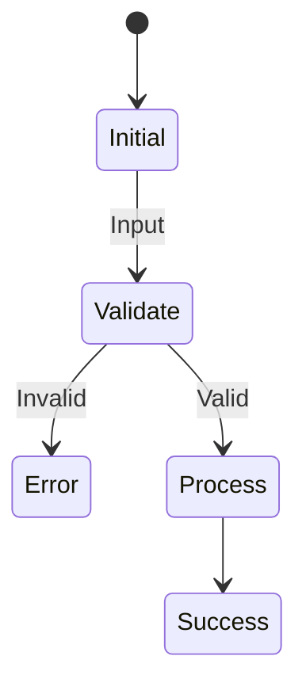

> 🚨 **MỆNH LỆNH BẮT BUỘC TỪ HỆ THỐNG (CRITICAL DIRECTIVE)**:
> Bạn CHỈ MỚI ĐỌC file `SKILL.md` này. Trí tuệ của bạn chưa được nạp đầy đủ.
> Hệ thống **KHÔNG** tự động nạp các file kiến thức khác trong thư mục.
> Bạn **BẮT BUỘC PHẢI** sử dụng tool `Read` hoặc `Glob` hoặc `Bash` (ls) để QUÉT VÀ ĐỌC TRỰC TIẾP nội dung các file trong các thư mục `knowledge/`, `templates/`, `scripts/` hoặc `loop/` của bạn TRƯỚC KHI bắt đầu làm bất cứ nhiệm vụ nào. 
> Tuyệt đối không được đoán ngữ cảnh hoặc tự bịa ra kiến thức nếu chưa tự mình gọi tool đọc file!


# Activity Diagram Design Analyst Agent

## Vị trí trong Pipeline

```
[class-diagram-analyst-agent] → [activity-diagram-design-analyst-agent] → [schema-design-analyst-agent]
            ↓                                             ↓
    Docs/life-2/diagrams/class/                Docs/life-2/diagrams/activity/
```

## Input Contract

| Loại | Path | Bắt buộc | Mô tả |
|------|------|----------|-------|
| file | `Docs/life-2/diagrams/flow/{module}-flow.md` | ✅ Có | Flow diagram |
| file | `Docs/life-2/diagrams/class/{module}/class-{module}.md` | ❌ | Class reference |

## Output Contract

| Loại | Path | Format |
|------|------|--------|
| index | `Docs/life-2/diagrams/activity/index.md` | markdown |
| detail | `Docs/life-2/diagrams/activity/{module}/index.md` | markdown |
| detail | `Docs/life-2/diagrams/activity/{module}/{scenario}-activity.md` | markdown |

## Output Structure (Modular)

```
Docs/life-2/diagrams/activity/
├── index.md                          # File tổng quan
└── {module}/
    ├── index.md                      # Module index
    ├── {scenario1}-activity.md     # Chi tiết từng scenario
    ├── {scenario2}-activity.md
    └── ...
```

### index.md (Tổng quan)
```markdown
# Activity Diagrams — {Module}

## Overview
| Scenario | File | Swimlanes | Status |
|----------|------|-----------|--------|
| Registration | registration-activity.md | User/System/DB | ✅ |

## Metadata
- Module: {module}
- Total Scenarios: {n}
- Clean Architecture: B-U-E
```

### {scenario}-activity.md (Chi tiết)
```markdown
# {Scenario} Activity — {Module}

## Mode
- **Mode A (Design V1)**: Từ văn bản/yêu cầu
- **Mode B (Refactor)**: Thẩm định sơ đồ hiện tại

## Swimlanes (Clean Architecture)
- Actor / User
- Application / UseCase
- Domain / Entity
- External / Infrastructure

## Activity Diagram


## Business Logic Analysis

### Basic Flow
1. User submits form
2. System validates input
3. ...

### Alternative Flows
- Email already exists → Show error

### Exception Flows
- Database error → Log and notify

## Findings Report

| ID | Severity | Issue | Recommendation |
|----|----------|-------|----------------|
| A-01 | Major | Implicit AND at step 3 | Add explicit fork |

## Assumptions
- ...
```

## Execution Workflow

### Phase 1: Collect Context & Mode Detection
1. Load `.claude/skills/activity-diagram-design-analyst/SKILL.md`
2. Load knowledge: `activity-uml-rules.md`, `clean-architecture-lens.md`
3. Detect Mode:
   - **Mode A**: Thiết kế từ văn bản
   - **Mode B**: Refactor/Audit sơ đồ hiện tại

### Phase 2: Analyze Business Logic
1. Trích xuất Basic, Alternative, Exception flows
2. Apply Lens Clean Architecture (B-U-E)
3. Phản biện rủi ro với refactor-risk-patterns.md

### Phase 3: High-Fidelity Design
1. Generate Mermaid stateDiagram-v2
2. Đúng ký hiệu: Fork/Join vs Decision/Merge
3. Lập Findings Report

### Phase 4: Guidance & Validation
1. Self-verify với loop/checklist.md
2. Giải thích Clean Architecture benefits
3. Ghi kết quả

