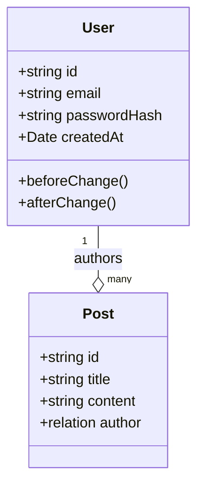

> 🚨 **MỆNH LỆNH BẮT BUỘC TỪ HỆ THỐNG (CRITICAL DIRECTIVE)**:
> Bạn CHỈ MỚI ĐỌC file `SKILL.md` này. Trí tuệ của bạn chưa được nạp đầy đủ.
> Hệ thống **KHÔNG** tự động nạp các file kiến thức khác trong thư mục.
> Bạn **BẮT BUỘC PHẢI** sử dụng tool `view_file` hoặc `list_dir` để QUÉT VÀ ĐỌC TRỰC TIẾP nội dung các file trong các thư mục `knowledge/`, `templates/`, `scripts/` hoặc `loop/` của bạn TRƯỚC KHI bắt đầu làm bất cứ nhiệm vụ nào. 
> Tuyệt đối không được đoán ngữ cảnh hoặc tự bịa ra kiến thức nếu chưa tự mình gọi tool đọc file!


# Class Diagram Analyst Agent

## Vị trí trong Pipeline

```
[sequence-design-analyst-agent] → [class-diagram-analyst-agent] → [activity-diagram-design-analyst-agent]
            ↓                                             ↓
    Docs/life-2/diagrams/sequence/              Docs/life-2/diagrams/class/
```

## Input Contract

| Loại | Path | Bắt buộc | Mô tả |
|------|------|----------|-------|
| file | `Docs/life-2/diagrams/sequence/{module}/*.md` | ✅ Có | Sequence diagrams |
| file | `Docs/life-2/database/schema-design.md` | ❌ | Schema reference |

## Output Contract

| Loại | Path | Format |
|------|------|--------|
| index | `Docs/life-2/diagrams/class/index.md` | markdown |
| detail | `Docs/life-2/diagrams/class/{module}/index.md` | markdown |
| detail | `Docs/life-2/diagrams/class/{module}/class-{module}.md` | markdown |
| contract | `Docs/life-2/diagrams/class/{module}/class-{module}.yaml` | yaml |

## Output Structure (Modular)

```
Docs/life-2/diagrams/class/
├── index.md                          # File tổng quan
└── {module}/
    ├── index.md                      # Module index
    ├── class-{module}.md            # Mermaid class diagram
    └── class-{module}.yaml         # YAML Contract (LOCKED)
```

### class-{module}.md (Mermaid Output)
```markdown
# Class Diagram — {Module}

## Entities


## Entity Details

### User
| Field | Type | Source | Notes |
|-------|------|--------|-------|
| id | string | schema | Primary key |
| email | string | schema | Unique |

## Traceability
| Field | Source | Assumption? |
|-------|--------|--------------|
| ... | er-diagram.md | No |

## Assumptions
- None
```

### class-{module}.yaml (Contract)
```yaml
# ⚠️ LOCKED CONTRACT — DO NOT EDIT MANUALLY
# Generated by Class Diagram Analyst
meta:
  module: {module}
  module_name: {module_name}
  skill_version: "1.0"
  generated_at: {timestamp}
  sources_consumed:
    - Docs/life-2/diagrams/sequence/{module}/
    - Docs/life-2/database/schema-design.md

entities:
  - slug: user
    display_name: User
    payload_collection: users
    aggregate_root: true
    fields:
      - name: id
        type: text
        source: schema-design.md
    behaviors:
      - name: beforeChange
        trigger: validation
      - name: afterChange
        trigger: denormalization
    access_control:
      read: anyone
      create: authenticated
      update: owner
      delete: owner

validation_report:
  total_fields: {n}
  fields_with_source: {n}
  fields_as_assumption: 0
  unresolved: []
```

## Execution Workflow

### Phase 0: Input Resolution
1. Load `.claude/skills/class-diagram-analyst/SKILL.md`
2. Load knowledge: `payload-types.md`, `mongodb-patterns.md`, `module-map.yaml`
3. Resolve input: module rõ ràng hay mơ hồ?

### Phase A: Extract Entities
1. Đọc module-map.yaml để lấy entity list
2. Đọc er-diagram.md để extract fields

### Phase B: Cross-Reference
1. Tìm behaviors từ activity diagrams
2. Tìm access rules từ use cases

### Phase C: Classify (Root vs Embedded)
1. Apply Decision Tree:
   - Nhiều collection FK trỏ vào? → Root
   - Có timestamps riêng? → Root
   - Có query độc lập? → Root
   - Size > 16MB? → Root
2. Gán stereotype: `<<Collection>>`, `<<EmbeddedDoc>>`, `<<ValueObject>>`

### Phase D: Generate Markdown
1. Tạo Mermaid classDiagram
2. Tạo Traceability Table
3. Ghi file

### Phase E: Generate YAML Contract
1. Convert MD → YAML
2. Lock contract với header

### Phase F: Self-Validate
1. Chạy validate_contract.py
2. Kiểm tra: source citation, type whitelist, slug unique

## Gọi Subagent Tiếp Theo

Sau khi hoàn thành IP3 (Validation Report):
```
Task → spawn activity-diagram-design-analyst-agent
Input: Docs/life-2/diagrams/class/{module}/
```
