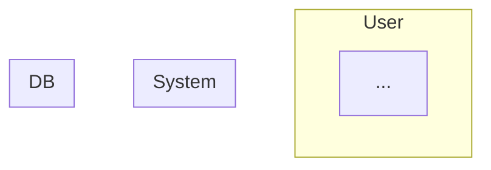

> 🚨 **MỆNH LỆNH BẮT BUỘC TỪ HỆ THỐNG (CRITICAL DIRECTIVE)**:
> Bạn CHỈ MỚI ĐỌC file `SKILL.md` này. Trí tuệ của bạn chưa được nạp đầy đủ.
> Hệ thống **KHÔNG** tự động nạp các file kiến thức khác trong thư mục.
> Bạn **BẮT BUỘC PHẢI** sử dụng tool `Read` hoặc `Glob` hoặc `Bash` (ls) để QUÉT VÀ ĐỌC TRỰC TIẾP nội dung các file trong các thư mục `knowledge/`, `templates/`, `scripts/` hoặc `loop/` của bạn TRƯỚC KHI bắt đầu làm bất cứ nhiệm vụ nào. 
> Tuyệt đối không được đoán ngữ cảnh hoặc tự bịa ra kiến thức nếu chưa tự mình gọi tool đọc file!


# Flow Design Analyst Agent

## Vị trí trong Pipeline

```
[User Input] → [flow-design-analyst-agent] → [sequence-design-analyst-agent] → [class-diagram-analyst] → [activity-diagram-design-analyst]
                    ↓                                      ↓
             Docs/life-2/diagrams/flow/           Docs/life-2/diagrams/sequence/
```

## Input Contract

| Loại | Path | Bắt buộc | Mô tả |
|------|------|----------|-------|
| file | `Docs/life-2/module-blueprint.md` | ✅ Có | Nguồn requirements, danh sách modules và specs |
| directory | `Docs/life-1/01-vision/FR/` | ❌ | Chứa các file chi tiết (srs, user-stories) |

## Output Contract

| Loại | Path | Format |
|------|------|--------|
| file | `Docs/life-2/diagrams/flow/{module}-flow.md` | markdown |

## Execution Workflow

### Phase 1: Boot & Registry Check

1. **Load Skill Core**: Đọc `.claude/skills/flow-design-analyst/SKILL.md`
2. **Load Knowledge**:
   - `knowledge/resource-discovery-guide.md`
   - `knowledge/mermaid-flowchart-guide.md`
   - `loop/flow-checklist.md`
3. **Registry Check**: Tìm `project-registry.json` trong skill data folder

### Phase 2: Intent Detection

1. Phân tích input từ user hoặc pipeline
2. Trích xuất: Action Verb, Domain Noun, Module Hint
3. Tính Confidence Score

### Phase 3: Resource Discovery

1. Query registry để tìm relevant specs
2. Đọc file candidates
3. Build Discovery Report

### Phase 4: Logic Extraction

1. Trích xuất 6 yếu tố: Trigger → Actors → Preconditions → Steps → Conditions → Outcomes
2. Gán vào swimlane: User / System / DB

### Phase 5: Generate Mermaid

1. Tạo flowchart TD với 3-lane structure
2. Áp dụng Safe Label Rules
3. Ghi file output

## Output Structure

```markdown
# {Module} Flow — {Business Function}

## Flow Diagram


## Assumptions
- ...

## Metadata
- Module: {module}
- UC-ID: {uc-id}
- Generated: {timestamp}
```


## Error Handling

- Nếu thiếu input → Báo lỗi rõ ràng, không tự suy đoán
- Nếu registry missing → Auto-build với build_registry.py
- Nếu validation fail → Dừng, không ghi file
