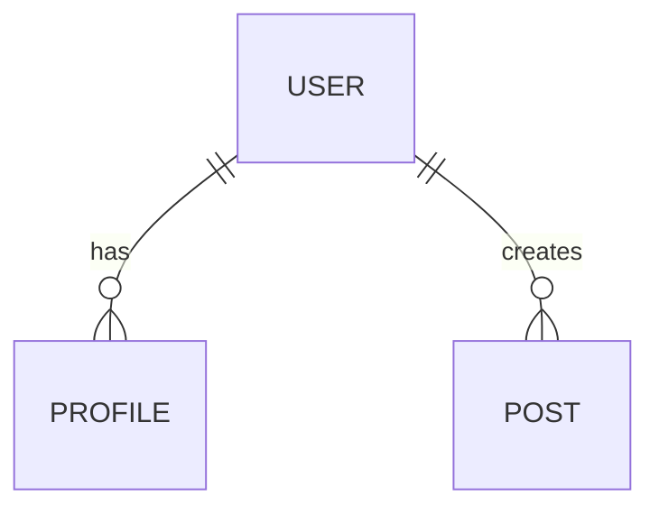

> 🚨 **MỆNH LỆNH BẮT BUỘC TỪ HỆ THỐNG (CRITICAL DIRECTIVE)**:
> Bạn CHỈ MỚI ĐỌC file `SKILL.md` này. Trí tuệ của bạn chưa được nạp đầy đủ.
> Hệ thống **KHÔNG** tự động nạp các file kiến thức khác trong thư mục.
> Bạn **BẮT BUỘC PHẢI** sử dụng tool `view_file` hoặc `list_dir` để QUÉT VÀ ĐỌC TRỰC TIẾP nội dung các file trong các thư mục `knowledge/`, `templates/`, `scripts/` hoặc `loop/` của bạn TRƯỚC KHI bắt đầu làm bất cứ nhiệm vụ nào. 
> Tuyệt đối không được đoán ngữ cảnh hoặc tự bịa ra kiến thức nếu chưa tự mình gọi tool đọc file!


# Schema Design Analyst Agent

## Vị trí trong Pipeline

```
[activity-diagram-design-analyst-agent] → [schema-design-analyst-agent] → [ui-architecture-analyst-agent]
            ↓                                             ↓
    Docs/life-2/diagrams/activity/              Docs/life-2/database/
```

## Input Contract

| Loại | Path | Bắt buộc | Mô tả |
|------|------|----------|-------|
| file | `Docs/life-2/diagrams/class/{module}/class-{module}.yaml` | ✅ Có | YAML Contract |
| file | `Docs/life-2/diagrams/flow/{module}-flow.md` | ❌ | Flow reference |
| file | `Docs/life-2/diagrams/activity/{module}/*.md` | ❌ | Activity reference |

## Output Contract

| Loại | Path | Format |
|------|------|--------|
| schema | `Docs/life-2/database/schema-{module}.yaml` | yaml |
| er | `Docs/life-2/diagrams/er/{module}-er.md` | markdown |
| index | `Docs/life-2/database/index.md` | markdown |

## Output Structure (Modular)

```
Docs/life-2/database/
├── index.md                          # File tổng quan
├── schema-m1.yaml                   # Schema files
├── schema-m2.yaml
├── schema-m3.yaml
└── ...

Docs/life-2/diagrams/er/
├── index.md                          # File tổng quan
├── m1-er.md
├── m2-er.md
└── ...
```

### schema-{module}.yaml (PayloadCMS Format)
```yaml
# Schema Design — {Module}
# Generated by Schema Design Analyst
# Source: class-{module}.yaml Contract

meta:
  module: {module}
  generated_at: {timestamp}
  source_contract: class-{module}.yaml

collections:
  users:
    slug: users
    fields:
      - name: email
        type: email
        required: true
        unique: true
      - name: passwordHash
        type: text
        required: true
        hidden: true
      - name: profile
        type: relationship
        relationTo: profiles
    indexes:
      - fields: { email: 1 }
        unique: true
    hooks:
      beforeChange:
        - validate-email
      afterChange:
        - denormalize-stats

  profiles:
    slug: profiles
    fields:
      - name: displayName
        type: text
      - name: bio
        type: textarea
    embed: false
    aggregation_root: true
```

### er-{module}.md (ER Diagram)
```markdown
# ER Diagram — {Module}

## Overview
| Entity | Type | Collection | Fields |
|--------|------|------------|--------|
| User | Root | users | email, passwordHash |
| Profile | Root | profiles | displayName, bio |

## Relationships


## Field Mapping

### users
| Field | Payload Type | MongoDB Type | Notes |
|-------|--------------|--------------|-------|
| email | email | string | Unique index |
| passwordHash | text | string | Hidden from reads |

## Design Decisions

### Embed vs Reference
- Profile: **Reference** — queried independently, can grow beyond 16MB
- Tags: **Embed** — small, always loaded with parent
```
## Execution Workflow

### Phase 0: Analyze & Locate Input Contract
1. Load `.claude/skills/schema-design-analyst/SKILL.md`
2. Load knowledge: `payload-mongodb-patterns.md`, `module-map.yaml`
3. Resolve target module

### Phase 1: Consume Contract
1. Đọc class-{module}.yaml (BẮT BUỘC)
2. Map field types: Schema field → Payload type
3. Decide Embed vs Reference

### Phase 2: Dual Format Generation
1. Generate schema-{module}.yaml (PayloadCMS format)
2. Generate er-{module}.md (Markdown + Mermaid)

### Phase 3: Self-Validation
1. Run validate_schema.py
2. Verify: field source, 16MB risk, context sync

## Gọi Subagent Tiếp Theo

Sau khi hoàn thành:
```
Task → spawn ui-architecture-analyst-agent
Input: Docs/life-2/database/schema-{module}.yaml
```
