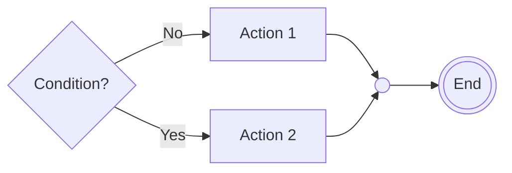
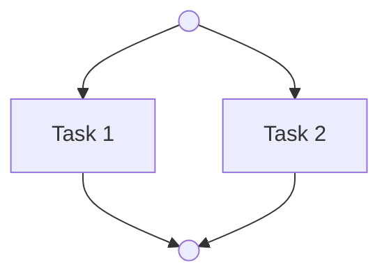

# Activity Diagram Symbols - Mermaid Cheat Sheet
> **Usage**: Tra cứu nhanh cách biểu diễn các ký hiệu UML sang cú pháp Mermaid.

---

| Ký hiệu UML | Ý nghĩa | Cú pháp Mermaid | Hình ảnh minh họa |
| :--- | :--- | :--- | :--- |
| **Initial Node** | Điểm bắt đầu | `Name((Start))` | `(( ))` (Tròn đơn) |
| **Action Node** | Hành động cụ thể | `Name[Lấy dữ liệu]` | `[ ]` (Chữ nhật) |
| **Decision Node** | Chốt điều kiện | `Question{Hợp lệ?}` | `{ }` (Hình thoi) |
| **Merge Node** | Điểm gộp (OR) | `Merge(( ))` | `(( ))` (Thanh bar hoặc Tròn) |
| **Fork Node** | Chia luồng (AND) | `Fork(( ))` | `(( ))` (Thanh bar hoặc Tròn) |
| **Join Node** | Gộp luồng (AND) | `Join(( ))` | `(( ))` (Thanh bar hoặc Tròn) |
| **Final Node** | Điểm kết thúc | `End(((End)))` | `((( )))` (Tròn đôi) |
| **Swimlanes** | Phân chia trách nhiệm | `subgraph Name ... end` | Khung bao quanh |

---

## Mẹo sử dụng (Tips)

### 1. Decision & Merge (Semantic OR)
Sử dụng hình thoi `{ }` cho Decision và một điểm gộp (Merge) để tránh lỗi deadlock.

### 2. Fork & Join (Semantic AND)
Sử dụng Fork khi các hành động bên dưới cần chạy đồng thời và Join khi cần đợi tất cả hoàn thành.

### 3. Naming Convention
- **Action**: `[Verb + Object]` (Vd: `[Gửi Email]`)
- **Decision**: `{Question?}` (Vd: `{Đủ số dư?}`)
- **Guard**: `-- Condition -->` (Vd: `-- [Hợp lệ] -->`)
