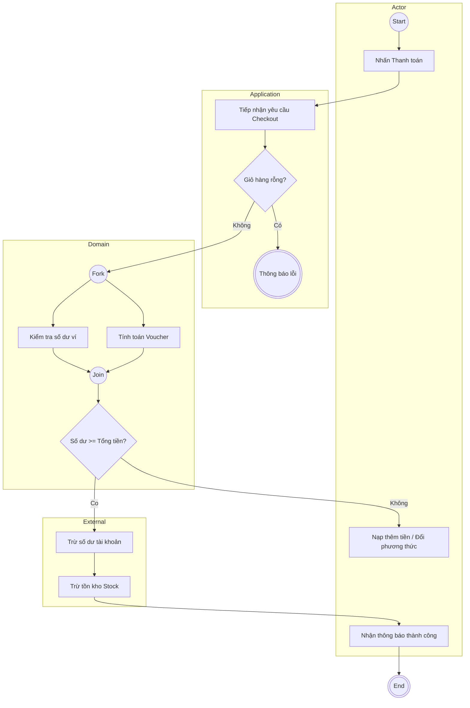

# Test Case: Mode A - Design V1 (Complex)
> **Scenario**: Thiết kế Activity Diagram cho Use Case "Thanh toán đơn hàng (Checkout)" trong hệ thống E-commerce.

---

## 1. Input Context (User Requirements)
- **Actor**: Khách hàng (Customer).
- **Trình tự**:
  1. Khách hàng nhấn nút "Thanh toán".
  2. Hệ thống kiểm tra giỏ hàng. Nếu giỏ hàng trống, hiển thị thông báo lỗi và kết thúc.
  3. Hệ thống kiểm tra số dư ví (Wallet balance).
  4. Hệ thống áp dụng mã giảm giá (Voucher) - Lưu ý: bước này chạy song song với việc kiểm tra ví.
  5. Nếu tổng tiền sau giảm giá > số dư ví, yêu cầu người dùng nạp thêm tiền hoặc chọn phương thức khác.
  6. Nếu số dư đủ, thực hiện trừ tiền và trừ kho (Stock).
  7. Gửi thông báo thành công cho người dùng.

---

## 2. Expectation (Successful Output Strategy)
Một kết quả đạt chuẩn của Skill phải thể hiện được:

### A. Phân lớp Swimlanes (Clean Architecture)
- **Actor**: Khách hàng (Nhấn nút, nhận thông báo).
- **Application**: Điều phố quy trình (Check giỏ hàng, Orchestrate Wallet/Voucher check).
- **Domain**: Business Rules (Tính toán giá sau voucher, Quyết định trừ tiền/kho).
- **External**: Database (Stock), Wallet Service (External API).

### B. UML Semantics
- **Initial/Final Node** đầy đủ.
- **Fork/Join** cho bước (4) xử lý song song Voucher và Wallet.
- **Decision Node** với Guard conditions rõ ràng: `[Giỏ hàng trống]`, `[Đủ số dư]`, `[Thanh toán thành công]`.

### C. Traceability Tags
- Gắn tag `[TỪ USER]` vào các Action như "Kiểm tra ví", "Áp dụng voucher".
- Gắn tag `[TỪ THIẾT KẾ]` hoặc `[RS-01]` vào việc phân bổ action vào các Lane.

---

## 3. Mock Mermaid Output (Reference)

