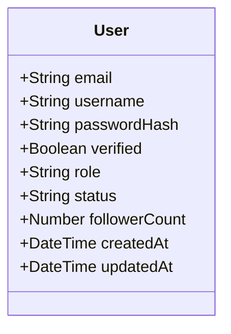

# PayloadCMS v3 — Field Types Knowledge

> **Usage**: Đọc khi khởi động (Tầng 1 Mandatory). Biết field type whitelist TRƯỚC KHI gán type cho bất kỳ field nào.
> **Source**: `resources/payload-types.md` (transform 100% — không tóm tắt)
> **Parity**: 6 sections trong resource → 6 sections tương ứng trong file này

---

## 1. Bảng Field Types Hợp lệ (Whitelist đầy đủ)

| Field Type | Mermaid Ký hiệu | Mô tả | Constraints phổ biến |
|-----------|----------------|-------|----------------------|
| `text` | `String` | Chuỗi văn bản | `required`, `unique`, `minLength`, `maxLength`, `hasMany` |
| `email` | `String` | Email — tự validate format | `required`, `unique` |
| `number` | `Number` | Số nguyên hoặc thập phân | `required`, `min`, `max`, `hasMany` |
| `boolean` | `Boolean` | True / False | `required`, `defaultValue` |
| `date` | `DateTime` | Timestamp (ISO 8601) | `required`, `defaultValue` |
| `select` | `String` | Enum với danh sách options cố định | `required`, `hasMany`, `options[]` |
| `text` (as `json`) | `JSON` | Raw JSON object | `required` |
| `json` | `JSON` | Raw JSON — dùng khi cần lưu structure tùy ý | `required` |
| `richText` | `String` | Rich text / HTML content (Lexical editor) | `required` |
| `relationship` | `ObjectId` (ref) | Tham chiếu sang collection khác | `relationTo`, `hasMany`, `required` |
| `upload` | `ObjectId` (ref) | File upload — tham chiếu sang Media collection | `relationTo: 'media'`, `required` |
| `array` | `Array` | Danh sách các sub-documents cùng loại | `fields[]`, `minRows`, `maxRows` |
| `group` | `Object` | Gom nhóm các field con vào object | `fields[]` |
| `point` | `[Number, Number]` | GeoJSON point (longitude, latitude) | `required` |
| `blocks` | `Array<Block>` | Polymorphic block content | `blocks[]` |
| `tabs` | (layout) | Tab layout — **KHÔNG phải data field** | N/A |
| `row` | (layout) | Row layout — **KHÔNG phải data field** | N/A |
| `collapsible` | (layout) | Collapsible group — **KHÔNG phải data field** | N/A |

---

## 2. Allowed Types cho YAML Contract

Danh sách hợp lệ để gán vào `type:` field của YAML Contract:

```
text, email, number, boolean, date, select, json, richText,
relationship, upload, array, group, point, blocks
```

**KHÔNG được dùng**: `tabs`, `row`, `collapsible` — đây là layout fields, không lưu data.

---

## 3. Constraint Rules

### 3.1 Universal Constraints (áp dụng cho hầu hết types)

| Constraint | Type | Mô tả |
|-----------|------|-------|
| `required: true` | boolean | Field bắt buộc điền |
| `unique: true` | boolean | Giá trị unique trong collection |
| `index: true` | boolean | Tạo MongoDB index |
| `defaultValue` | any | Giá trị mặc định |
| `admin.readOnly` | boolean | Không thể edit qua Admin UI |

### 3.2 Type-Specific Constraints

**text / email**:
```yaml
minLength: 3
maxLength: 255
```

**number**:
```yaml
min: 0
max: 9999
```

**select**:
```yaml
options:
  - label: "Active"
    value: "active"
  - label: "Inactive"
    value: "inactive"
hasMany: false  # true = multi-select
```

**relationship**:
```yaml
relationTo: 'users'     # single collection
hasMany: false          # true = array of refs
# hoặc polymorphic:
relationTo: ['posts', 'comments']  # nhiều collection
```

**array**:
```yaml
minRows: 1
maxRows: 10
fields:
  - name: item
    type: text
```

---

## 4. Ký hiệu Mermaid cho từng type

Khi viết `classDiagram`, dùng ký hiệu:

| PayloadCMS Type | Mermaid representation |
|----------------|----------------------|
| `text` | `String` |
| `email` | `String` |
| `number` | `Number` |
| `boolean` | `Boolean` |
| `date` | `DateTime` |
| `select` | `String` (kèm `<<enum>>` hoặc comment options) |
| `json` | `JSON` |
| `richText` | `String` |
| `relationship` (single) | `ObjectId` hoặc tên Entity tham chiếu |
| `relationship` (hasMany) | `ObjectId[]` hoặc `Entity[]` |
| `upload` | `ObjectId` |
| `array` | `EntityName[]` hoặc `Object[]` |
| `group` | Dùng nested class hoặc annotation |
| `point` | `Float[]` |

**Ví dụ hợp lệ**:


---

## 5. Ví dụ YAML Contract snippet từng type

```yaml
entities:
  - slug: "users"
    display_name: "User"
    payload_collection: "users"
    aggregate_root: true
    fields:
      - name: "email"
        type: "email"
        required: true
        unique: true
        indexed: true
        source: "er-diagram.md#USERS.email"

      - name: "username"
        type: "text"
        required: true
        unique: true
        indexed: true
        constraints:
          minLength: 3
          maxLength: 50
        source: "er-diagram.md#USERS.username"

      - name: "role"
        type: "select"
        required: true
        options: ["user", "admin", "moderator"]
        defaultValue: "user"
        source: "er-diagram.md#USERS.role"

      - name: "status"
        type: "select"
        required: true
        options: ["active", "inactive", "banned"]
        defaultValue: "active"
        source: "er-diagram.md#USERS.status"

      - name: "followerCount"
        type: "number"
        required: false
        defaultValue: 0
        admin:
          readOnly: true
        source: "er-diagram.md#USERS.follower_count"
        pattern: "Computed Pattern (denormalized)"
```

---

## 6. Anti-patterns — KHÔNG làm

| Anti-pattern | Lý do | Thay bằng |
|-------------|-------|-----------|
| Dùng `string` thay `text` | Không phải Payload type | `text` |
| Dùng `int` hay `float` | Không phải Payload type | `number` |
| Dùng `object` thay `group` | Không có trong Payload schema | `group` |
| Dùng `timestamp` thay `date` | Không phải Payload type | `date` |
| Không khai báo `relationTo` cho `relationship` | Lỗi runtime | Luôn khai báo `relationTo` |
| Đặt `index: true` cho tất cả fields | Tốn bộ nhớ MongoDB | Index có chọn lọc: FK, unique, query-frequent fields |
