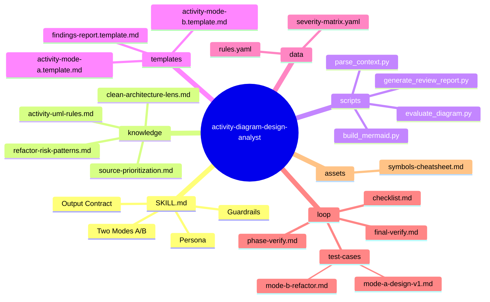
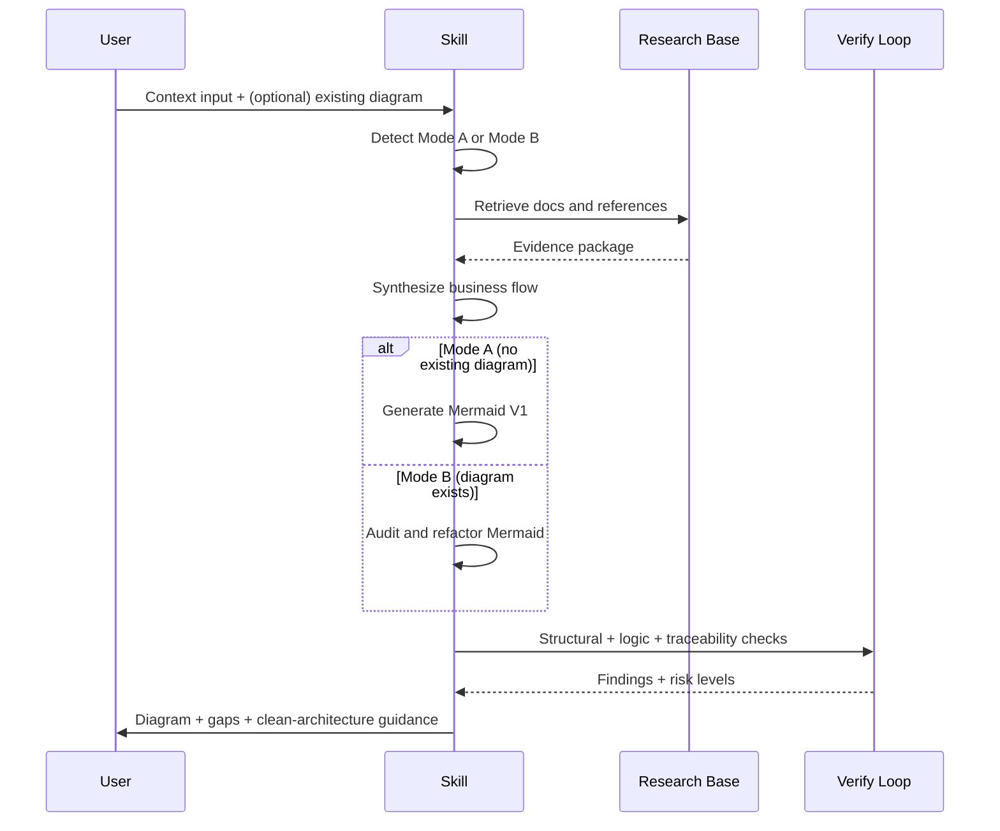
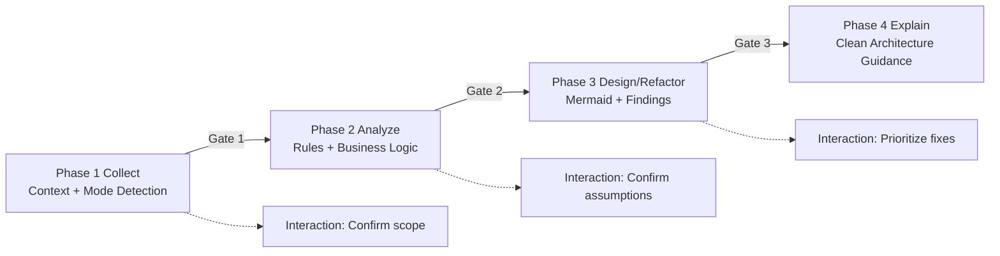

# activity-diagram-design-analyst — Architecture Design

> Generated by Skill Architect | Date: 2026-02-15
> Status: 🔵 IN PROGRESS

---

## 1. Problem Statement

Skill nay giai quyet bai toan phan tich va thiet ke so do Activity Diagram theo context nguoi dung cung cap, thay vi ve theo cam tinh hoac chi "happy path".

Nhom nguoi dung chinh:
- Analyst/BA can chuyen hoa use case thanh luong hoat dong ro rang.
- Engineer can review logic nghiep vu truoc khi implement.
- Team lead can kiem soat chat luong mo hinh hoa va giam risk sai luong.

Hai tinh huong dau vao:
1. Mode A (Design V1): nguoi dung chua co so do, skill phai phan tich context va tao ban Mermaid V1.
2. Mode B (Refactor/Audit): nguoi dung da co so do, skill phai chi ra rui ro logic, diem mo ho, va de xuat cai tien.

Gia tri cot loi:
- Tao Activity Diagram co cau truc chuan UML.
- Doi chieu voi tai lieu context/research de phat hien thieu sot.
- Giai thich nhu ky su thiet ke theo tu duy clean architecture: ro boundary, ro trach nhiem, ro luong chinh-va-ngoai-le.

## 2. Capability Map

### 2.1 Tri thuc (Knowledge)
- UML Activity Diagram fundamentals:
  - Initial/Final node, Action/Activity, Control Flow, Decision/Merge, Fork/Join, Swimlanes.
  - Guard conditions va cach dat nhanh theo dieu kien.
- Best practices:
  - One use case -> one diagram.
  - Luon co happy path + alternative/error path.
  - Ten action dang dong tu, ngan gon, nhat quan.
- Tai lieu nen:
  - `Docs/diagram/activity-diagram-research.md` (nguon nghien cuu nen).
  - Context user cung cap (use case, policy, constraint, actor).
- Clean architecture lens:
  - Phan bien use-case logic theo boundary, entity, interaction.
  - Tach quyet dinh nghiep vu khoi chi tiet UI/ha tang.

### 2.2 Quy trinh (Process)
Workflow tong quat:
1. Nhap context va xac dinh mode A/B.
2. Trich xuat actor, trigger, business rules, exception points.
3. Research tai lieu nen de lap "logical baseline".
4. Tong hop va tao Mermaid (V1 moi hoac V2 refactor).
5. Kiem dinh:
   - structural check (ky hieu + luong),
   - semantic check (logic nghiep vu),
   - traceability check (context -> diagram).
6. Tra output gom diagram, findings, recommendations, assumptions.

Nhanh xu ly theo mode:
- Mode A:
  - Build V1 tu context.
  - Danh dau cac gia dinh va cau hoi con thieu.
- Mode B:
  - Audit diagram hien tai.
  - Xac dinh diem rui ro tiem an, diem can lam ro, de xuat refactor logic nghiep vu.

### 2.3 Kiem soat (Guardrails)
- Khong doan nghiep vu neu context thieu: phai no assumptions ro rang.
- Tach ro "syntax issue" va "business logic issue".
- Khong bo qua luong loi/ngoai le.
- Moi ket luan review phai co can cu tu context hoac research base.
- Neu do tin cay < 70% (thieu du lieu), bat buoc hoi lai user.
- Khong implement code ung dung; chi phan tich, thiet ke, va de xuat.

## 3. Zone Mapping

| Zone | Noi dung | Bat buoc? |
|------|----------|----------|
| Core (SKILL.md) | Persona "Activity Diagram Design Engineer", 2 modes A/B, phase gates, output contract | ✅ |
| Knowledge | UML activity rules, anti-patterns, clean-architecture review lens, source mapping guide | ✅ |
| Scripts | Context parser, mermaid builder helper, rule checker, risk classifier | Optional (recommended) |
| Templates | Mermaid activity template (A/B), findings report template, recommendation template | ✅ |
| Data | Rule config (required nodes, severity), glossary actor/action/condition | Optional |
| Loop | phase-verify, final-verify, test-cases theo use case | ✅ |
| Assets | Symbol cheat sheet, visual example snippets | Optional |

## 4. Folder Structure

Mermaid mindmap de xac dinh bo khung skill.

## 5. Execution Flow

Sequence flow de mo ta luong runtime theo 2 mode.

## 6. Interaction Points

| # | Thoi diem | Ly do |
|---|-----------|-------|
| 1 | Sau khi doc input ban dau | Xac nhan mode A/B va pham vi use case |
| 2 | Sau khi trich xuat actor + business rules | Xac nhan khong bo sot nghiep vu quan trong |
| 3 | Truoc khi chot diagram | Trinh bay assumptions va diem mo ho can user quyet dinh |
| 4 | Sau khi gap analysis | Xac nhan muc uu tien cho cac de xuat refactor |

## 7. Progressive Disclosure Plan

### Tang 1: Bat buoc doc (Mandatory)
- SKILL.md
- knowledge/activity-uml-rules.md
- knowledge/clean-architecture-lens.md
- loop/checklist.md
- Docs/diagram/activity-diagram-research.md (neu ton tai trong repo)

### Tang 2: Tu quyet dinh (Conditional)
- knowledge/refactor-risk-patterns.md (chi dung cho Mode B)
- templates/activity-mode-a.template.md (khi tao moi V1)
- templates/activity-mode-b.template.md (khi refactor)
- data/rules.yaml, data/severity-matrix.yaml (khi can danh gia dinh luong)
- Tai lieu user chi dinh them (spec/usecase/domain docs)

## 8. Risks & Blind Spots

| # | Risk | Mitigation |
|---|------|------------|
| 1 | Diagram dung ky hieu nhung sai logic nghiep vu | Bat buoc trace moi nhanh voi rule/context goc |
| 2 | Thieu luong ngoai le do context mo ta "happy path" | Checklist bat buoc co alternate/error path |
| 3 | Nham Swimlane (sai chu the thuc hien) | Mapping actor-action truoc khi ve diagram |
| 4 | Lam dung tu cua hinh thuc, thieu tinh clean architecture | Danh gia theo boundary/use-case separation checklist |
| 5 | Over-assumption khi context thieu | Bat buoc output section "Assumptions + Questions" |
| 6 | Refactor qua tay lam phuc tap hoa flow | Uu tien don gian, giam so node, giu traceability |

## 9. Open Questions

| # | Cau hoi | Trang thai |
|---|---------|-----------|
| 1 | Co can ho tro input anh/screenshot diagram hay chi markdown mermaid? | ❓ |
| 2 | Co can chuan hoa output song ngu (VI/EN) ngay tu V1? | ❓ |
| 3 | Muc do tu dong sua diagram den dau thi can dung va hoi user? | ❓ |
| 4 | Co can scoring dinh luong (0-100) cho quality diagram? | ❓ |

## 9.1 Workflow Phases (Gate-based)

## 10. Metadata

- **Skill Name**: activity-diagram-design-analyst
- **Created**: 2026-02-15
- **Author**: Skill Architect
- **Framework**: architect.md v2.0
- **Primary Use**: Analyze and design/refactor Activity Diagram from user context
- **Modes**: A (Design V1), B (Refactor/Audit)
- **Status**: 🟢 DRAFT READY FOR REVIEW
