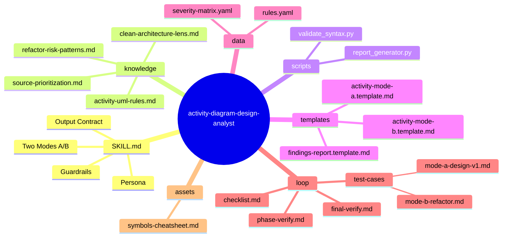
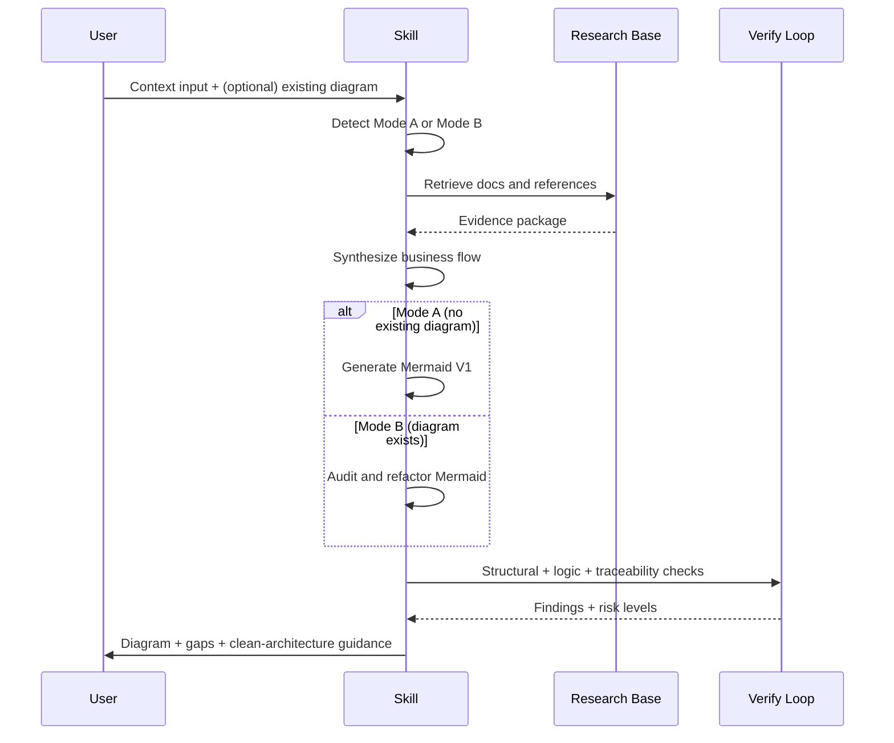
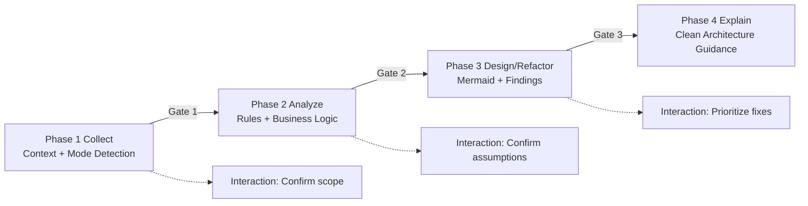

# activity-diagram-design-analyst — Architecture Design

> Generated by Skill Architect | Date: 2026-02-15
> Status: 🔵 IN PROGRESS

---

## 1. Problem Statement

Skill này giải quyết bài toán phân tích và thiết kế sơ đồ Activity Diagram theo dữ liệu nghiệp vụ thực tế, thay vì vẽ sơ đồ "happy path" đơn giản.

**Vấn đề cần giải quyết (Refactor v2.0):**
- **Sự mất mát tri thức (Knowledge Loss)**: Các phiên bản trước thường tóm tắt (summarize) tài liệu gốc, dẫn đến việc AI bỏ sót các tiểu tiết kỹ thuật quan trọng (Fork/Join, Object Flow, Flow Final).
- **Thiếu tính phản biện**: AI dễ dàng chấp nhận logic của người dùng mà không kiểm tra các rủi ro kinh điển như Deadlock khi dùng Fork/Join sai cách.
- **Tính đóng gói**: Cần chuẩn hóa lại bộ tri thức Clean Architecture B-U-E để áp dụng vào modeling nghiệp vụ một cách nhất quán.

**Nhóm người dùng chính:**
- Analyst/BA cần chuyển hóa use case thành luồng hoạt động rạng ngời tri thức.
- Senior Engineer cần một công cụ review logic có khả năng phát hiện lỗi Semantic.
- Team Lead cần audit thiết kế theo tiêu chuẩn Clean Architecture.

**Hai tình huống đầu vào (Modes):**
1. **Mode A (Design V1)**: Người dùng chưa có sơ đồ, skill phải phân tích Context và tạo bản Mermaid V1 với độ chi tiết cao.
2. **Mode B (Refactor/Audit)**: Người dùng đã có sơ đồ, skill phải đóng vai trò "Kỹ sư Audit" để chỉ ra rủi ro logic (CF-0x, DL-0x...) và đề xuất cải tiến.

**Giá trị cốt lõi:**
- **High-Fidelity**: Chuyển hóa 100% tri thức từ tài liệu nghiên cứu, không tóm tắt.
- **Traceability**: Mọi thành phần sơ đồ đều phải truy vết được nguồn từ Context.
- **Clean Architecture Lens**: Áp dụng triệt để phân lớp Boundary-UseCase-Entity vào Swimlane.

## 2. Capability Map

### 2.1 Tri thức (Knowledge) - Tầm nhìn High-Fidelity
- **UML Activity Diagram Specialization**:
  - Không chỉ các node cơ bản, mà phải nắm vững: Object Node, Pin, Expansion Region (nếu cần), các cơ chế Token flow.
  - Phân biệt rạch ròi giữa Fork/Join (Concurrency) và Decision/Merge (Choice).
- **Comprehensive Research (100% Transform)**:
  - Tài nguyên gốc: `resources/activity-diagram-research.md`.
  - Nhiệm vụ: Chuyển hóa toàn bộ quy tắc, ký hiệu, và cạm bẫy logic vào skill. Tuyệt đối không viết kiểu "tóm tắt".
- **Clean Architecture B-U-E Lens**:
  - Tư duy phân lớp: Boundary (Giao diện/Tương tác), Use Case (Logic phối hợp), Entity (Luật nghiệp vụ cốt lõi).
  - Khả năng ánh xạ (Mapping) từ Use Case steps sang Swimlane tương ứng.

### 2.2 Quy trình (Process) - Expert Persona
Workflow 4-Phase (Gate-based):
1. **Phase 1: Collect**: Nhận dạng Mode A/B và thẩm định Context.
2. **Phase 2: Analyze**: Trích xuất Logical Baseline. Đào sâu các "Edge cases" và "Exception flows".
3. **Phase 3: Design/Refactor**: Tạo Mermaid với độ thẩm mỹ cao và báo cáo Findings chuyên sâu.
4. **Phase 4: Explain**: Giải thích lý do thiết kế dựa trên Clean Architecture.

### 2.3 Kiểm soát (Guardrails) - Thắt chặt kỷ luật
- **G1: High-Fidelity**: Không summarize tri thức kỹ thuật. Nếu tài nguyên nói có 10 loại lỗi, skill phải biết 10 loại lỗi.
- **G2: Anti-Hallucination**: Không tự bịa nghiệp vụ. Dùng `[MISSING_DOMAIN_DATA]` khi thiếu context.
- **G3: Risk Focus**: Phải phát hiện ít nhất một rủi ro tiềm ẩn (ví dụ: thiếu luồng lỗi) nếu nghiệp vụ phức tạp.
- **G4: Interaction Gate**: Không tự ý hoàn thiện nếu độ tin cậy < 70%.
- **G5: Language Accuracy**: Sử dụng Tiếng Việt chuyên nghiệp, thuật ngữ Tiếng Anh giữ nguyên (Swimlane, Fork, Join).

## 3. Zone Mapping

| Zone | Nội dung | Bắt buộc? |
|------|----------|----------|
| Core (`SKILL.md`) | Persona "Senior Activity Design Engineer", Quy trình 4-Phase, High-Fidelity Guards | ✅ |
| Knowledge | **100% Transform** từ `activity-diagram-research.md`, `refactor-risk-patterns.md`, `clean-architecture-lens.md` | ✅ |
| Scripts | `scripts/validate_syntax.py`, `scripts/report_generator.py` (Hỗ trợ AI kiểm tra syntax và tạo báo cáo) | Optional |
| Templates | `templates/activity-mode-a.template.md`, `templates/activity-mode-b.template.md`, `templates/findings-report.template.md` | ✅ |
| Data | `data/rules.yaml`, `data/severity-matrix.yaml` (Dữ liệu cứng về tiêu chuẩn) | ✅ |
| Loop | `loop/checklist.md`, `loop/phase-verify.md`, `loop/final-verify.md` | ✅ |
| Assets | `assets/symbols-cheatsheet.md` | Optional |

## 4. Folder Structure

Mermaid mindmap de xac dinh bo khung skill.

## 5. Execution Flow

Sequence flow de mo ta luong runtime theo 2 mode.

## 6. Interaction Points

| # | Thoi diem | Ly do |
|---|-----------|-------|
| 1 | Sau khi doc input ban dau | Xac nhan mode A/B va pham vi use case |
| 2 | Sau khi trich xuat actor + business rules | Xac nhan khong bo sot nghiep vu quan trong |
| 3 | Truoc khi chot diagram | Trinh bay assumptions va diem mo ho can user quyet dinh |
| 4 | Sau khi gap analysis | Xac nhan muc uu tien cho cac de xuat refactor |

## 7. Progressive Disclosure Plan

### Tang 1: Bat buoc doc (Mandatory)
- SKILL.md
- knowledge/activity-uml-rules.md
- knowledge/clean-architecture-lens.md
- loop/checklist.md
- Docs/diagram/activity-diagram-research.md (neu ton tai trong repo)

### Tang 2: Tu quyet dinh (Conditional)
- knowledge/refactor-risk-patterns.md (chi dung cho Mode B)
- templates/activity-mode-a.template.md (khi tao moi V1)
- templates/activity-mode-b.template.md (khi refactor)
- data/rules.yaml, data/severity-matrix.yaml (khi can danh gia dinh luong)
- Tai lieu user chi dinh them (spec/usecase/domain docs)

## 8. Risks & Blind Spots

| # | Risk | Mitigation |
|---|------|------------|
| 1 | Diagram dung ky hieu nhung sai logic nghiep vu | Bat buoc trace moi nhanh voi rule/context goc |
| 2 | Thieu luong ngoai le do context mo ta "happy path" | Checklist bat buoc co alternate/error path |
| 3 | Nham Swimlane (sai chu the thuc hien) | Mapping actor-action truoc khi ve diagram |
| 4 | Lam dung tu cua hinh thuc, thieu tinh clean architecture | Danh gia theo boundary/use-case separation checklist |
| 5 | Over-assumption khi context thieu | Bat buoc output section "Assumptions + Questions" |
| 6 | Refactor qua tay lam phuc tap hoa flow | Uu tien don gian, giam so node, giu traceability |

## 9. Open Questions

| # | Cau hoi | Trang thai |
|---|---------|-----------|
| 1 | Co can ho tro input anh/screenshot diagram hay chi markdown mermaid? | ❓ |
| 2 | Co can chuan hoa output song ngu (VI/EN) ngay tu V1? | ❓ |
| 3 | Muc do tu dong sua diagram den dau thi can dung va hoi user? | ❓ |
| 4 | Co can scoring dinh luong (0-100) cho quality diagram? | ❓ |

## 9.1 Workflow Phases (Gate-based)

## 10. Metadata

- **Skill Name**: activity-diagram-design-analyst
- **Created**: 2026-02-15
- **Refactored**: 2026-02-16 (v2.0 - High-Fidelity Upgrade)
- **Author**: Anti-gravity (using Master Skill Suite)
- **Framework**: architect.md v2.0
- **Primary Use**: Phân tích, thiết kế và Audit Activity Diagram chuyên sâu.
- **Status**: � DESIGN REFACTORED - READY FOR PLANNING
