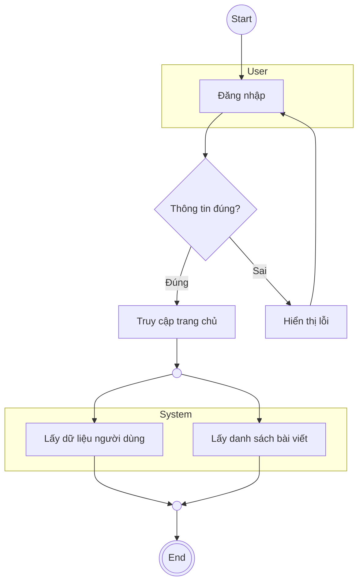

# Activity Diagram - Tài nguyên nghiên cứu

> **Nguồn**: NotebookLM - https://notebooklm.google.com/notebook/46ddeb54-c391-43df-95f2-53c820428ada
> **Ngày tạo**: 2026-02-02

---

## 1. Lý thuyết

### 1.1 Khái niệm
**Activity Diagram (Biểu đồ hoạt động/hành động)** là một loại biểu đồ thuộc nhóm Mô hình hóa hành vi (Behavioral Modeling) trong UML.

- **Định nghĩa**: Biểu đồ chỉ ra dòng chảy của các hoạt động (flow of activities) hoặc quy trình trong hệ thống.
- **Bản chất**: Mô tả trình tự các bước thực hiện một công việc từ điểm bắt đầu đến điểm kết thúc.

### 1.2 Mục đích sử dụng
- **Mô tả thuật toán và quy trình nghiệp vụ**: Chi tiết hóa các bước xử lý bên trong một chức năng cụ thể
- **Thể hiện sự tương tác**: Làm rõ sự tương tác giữa người dùng (Admin/User) và Hệ thống qua từng bước
- **Làm rõ các luồng sự kiện**: Hình dung các luồng đi của dữ liệu và điều khiển, bao gồm cả nhánh rẽ

### 1.3 Khi nào dùng?
- Trong giai đoạn Phân tích và Thiết kế hệ thống
- Sau khi đã xác định danh sách Use Case
- Khi cần mô tả chi tiết kịch bản (Scenario) của một Use Case phức tạp
- Khi cần mô tả quy trình nghiệp vụ (Business Process) của khách hàng

**Ví dụ**: Sau khi xác định Use Case "Quản lý bài viết", vẽ Activity Diagram cho: "Thêm bài viết", "Sửa bài viết", "Xóa bài viết"

### 1.4 So sánh Activity Diagram vs Flowchart

| Đặc điểm | Flowchart | Activity Diagram |
|----------|-----------|------------------|
| **Phạm vi** | Lập trình cấu trúc, thuật toán tuần tự | UML (Hướng đối tượng), hành vi hệ thống |
| **Khả năng xử lý** | Chủ yếu tuần tự | Hỗ trợ xử lý song song (Fork/Join) |
| **Thành phần** | Khối hình học đơn giản | Có Swimlanes, Fork/Join |
| **Chuẩn hóa** | Không chuẩn hóa thống nhất | Thuộc chuẩn UML |

**Kết luận**: Activity Diagram là phiên bản "nâng cấp" và chuẩn hóa của Flowchart.

---

## 2. Cấu trúc

### 2.1 Các thành phần cơ bản

```
    ●                          ← Initial Node (điểm bắt đầu)
    │
    ▼
┌─────────────────┐
│  Hoạt động 1    │            ← Activity Node (hình chữ nhật bo góc)
└────────┬────────┘
         │                      ← Control Flow (mũi tên)
         ▼
    ◇─────────◇                 ← Decision Node (hình thoi)
   /           \
  / [Đúng]      \ [Sai]
 ▼               ▼
┌────┐         ┌────┐
│ A  │         │ B  │
└──┬─┘         └──┬─┘
   │              │
   └──────┬───────┘
          ▼
    ◇─────────◇                 ← Merge Node (hình thoi)
          │
          ▼
    ┃━━━━━━━━━┃                 ← Fork Node (thanh đậm)
   /           \
  ▼             ▼
┌────┐       ┌────┐
│ C  │       │ D  │             ← Xử lý song song
└──┬─┘       └──┬─┘
   │             │
   └──────┬──────┘
          ▼
    ┃━━━━━━━━━┃                 ← Join Node (thanh đậm)
          │
          ▼
        (●)                     ← Final Node (hình mắt bò)
```

### 2.2 Ký hiệu các thành phần

| Thành phần | Ký hiệu | Mô tả |
|------------|---------|-------|
| **Initial Node** | ● (tròn đặc đen) | Điểm bắt đầu quy trình |
| **Activity Node** | ▢ (chữ nhật bo góc) | Một bước thực hiện, hành động cụ thể |
| **Control Flow** | → (mũi tên) | Trình tự thực hiện |
| **Decision Node** | ◇ (hình thoi, 1 vào nhiều ra) | Rẽ nhánh theo điều kiện |
| **Merge Node** | ◇ (hình thoi, nhiều vào 1 ra) | Gộp các nhánh lại |
| **Fork Node** | ┃━━━┃ (thanh đậm, 1 vào nhiều ra) | Bắt đầu xử lý song song |
| **Join Node** | ┃━━━┃ (thanh đậm, nhiều vào 1 ra) | Kết thúc xử lý song song (đồng bộ) |
| **Final Node** | (●) (tròn đặc trong tròn rỗng) | Kết thúc quy trình |
| **Swimlanes** | Cột dọc/hàng ngang | Phân chia trách nhiệm |

### 2.3 Guard Conditions (Điều kiện bảo vệ)

Trên các luồng đi ra từ Decision Node, ghi điều kiện trong ngoặc vuông:
- `[Đúng]` / `[Sai]`
- `[Hợp lệ]` / `[Không hợp lệ]`
- `[OK]` / `[Cancel]`

### 2.4 Cú pháp Mermaid



**Ký hiệu Mermaid:**
- `(( ))`: Hình tròn (Start/Fork/Join)
- `[ ]`: Hình chữ nhật (Action)
- `{ }`: Hình thoi (Decision)
- `((( )))`: Hình tròn đôi (Final Node)
- `subgraph`: Tạo Swimlanes

---

## 3. Cách thức xây dựng

### 3.1 Quy trình 5 bước

```
┌─────────────────────────────────────────────────────────────────┐
│  BƯỚC 1: Xác định phạm vi từ Use Case                          │
│  ↓                                                              │
│  BƯỚC 2: Xác định các làn bơi (Swimlanes)                      │
│  ↓                                                              │
│  BƯỚC 3: Xác định các hoạt động và luồng đi chính              │
│  ↓                                                              │
│  BƯỚC 4: Xác định điểm quyết định và rẽ nhánh                  │
│  ↓                                                              │
│  BƯỚC 5: Kết thúc quy trình (Final Node)                       │
└─────────────────────────────────────────────────────────────────┘
```

### 3.2 Chi tiết từng bước

**Bước 1: Xác định phạm vi từ Use Case**
- Chọn một Use Case cụ thể (VD: "Thêm chuyên mục", "Đăng nhập")
- Đọc kỹ đặc tả Use Case (kịch bản chính và ngoại lệ)

**Bước 2: Xác định Swimlanes**
- Xác định các đối tượng tham gia
- Thường có 2 làn chính:
  - **Người dùng (User/Admin)**: Nhập liệu, bấm nút
  - **Hệ thống (System)**: Kiểm tra, xử lý, lưu CSDL, hiển thị thông báo

**Bước 3: Xác định hoạt động và luồng chính**
- Chuyển đổi các bước trong Basic Flow thành Activity Node
- Dùng mũi tên nối theo trình tự thời gian

**Bước 4: Xác định điểm quyết định**
- Tìm từ khóa: "Nếu... thì...", "Kiểm tra", "Xác thực"
- Vẽ Decision Node và các nhánh rẽ
- Ghi Guard Conditions trên mỗi nhánh

**Bước 5: Kết thúc quy trình**
- Đánh dấu Final Node
- Đảm bảo mọi luồng (kể cả lỗi) đều dẫn đến kết thúc hoặc quay lại hoạt động hợp lệ

### 3.3 Best Practices

| Nên làm | Không nên làm |
|---------|---------------|
| Một Use Case - Một Activity Diagram | Nhồi nhét toàn bộ hệ thống vào 1 biểu đồ |
| Luôn có Initial Node và Final Node | Bỏ qua điểm bắt đầu/kết thúc |
| Đặt tên động từ (VD: "Kiểm tra đăng nhập") | Đặt tên danh từ (VD: "Việc kiểm tra") |
| Vẽ cả luồng ngoại lệ (lỗi) | Chỉ vẽ Happy Path |
| Sử dụng Swimlanes phân chia trách nhiệm | Để các hoạt động lẫn lộn không rõ ai làm |
| Khớp với Use Case Specification | Không đồng bộ với tài liệu đặc tả |

---

## 4. Hoạt động

### 4.1 Cách đọc từng thành phần

| Nhìn thấy | Đọc là |
|-----------|--------|
| ● (tròn đặc đen) | "Quy trình bắt đầu tại đây" |
| ▢ (chữ nhật bo góc) | "Hệ thống/Người dùng đang làm [động từ]" |
| ◇ (hình thoi, 1 vào nhiều ra) | "Câu hỏi/điều kiện kiểm tra" |
| ┃━━━┃ (thanh đậm, 1 vào nhiều ra) | "Bắt đầu làm đồng thời các việc sau" |
| ┃━━━┃ (thanh đậm, nhiều vào 1 ra) | "Chờ tất cả xong mới đi tiếp" |
| (●) (hình mắt bò) | "Quy trình hoàn tất" |

### 4.2 Cách theo dõi luồng

**Luồng điều khiển (Control Flow)**:
- Đường liền nét có mũi tên
- Đọc: "Làm xong việc A thì chuyển sang việc B"
- Gặp Decision: Chọn một hướng theo điều kiện
- Gặp Fork: Theo dõi tất cả hướng cùng lúc

**Luồng dữ liệu (Data Flow)**:
- Object Node: Hình chữ nhật góc vuông (VD: `Hóa đơn [Chưa thanh toán]`)
- Object Flow: Mũi tên nối Activity ↔ Object
- Đọc: "Hoạt động A tạo ra dữ liệu X, Hoạt động B dùng dữ liệu X"

**Theo dõi trách nhiệm (Swimlanes)**:
- Xem Activity Node nằm trong cột/hàng nào
- Đọc: "Nút 'Duyệt bài' trong làn 'Admin' → Admin thực hiện"

### 4.3 Tóm tắt cách đọc

> "Bắt đầu từ chấm đen → đi theo mũi tên → để ý làn bơi để biết ai làm → dừng lại suy nghĩ ở hình thoi → chạy song song ở thanh đậm → dừng lại ở hình mắt bò"

---

## 5. Thành phần cấu thành

### 5.1 Danh sách đầy đủ

| Thành phần | Tên tiếng Anh | Vai trò |
|------------|---------------|---------|
| **Nút khởi đầu** | Initial Node | Điểm bắt đầu quy trình |
| **Nút hành động** | Action/Activity Node | Các bước thực hiện công việc |
| **Luồng điều khiển** | Control Flow | Đường nối chỉ định trình tự |
| **Luồng đối tượng** | Object Flow | Đường nối chỉ định dòng chảy dữ liệu |
| **Nút quyết định** | Decision Node | Rẽ nhánh theo điều kiện (If/Else) |
| **Nút gộp** | Merge Node | Nơi các luồng rẽ nhánh gặp nhau |
| **Nút chia song song** | Fork Node | Bắt đầu xử lý đa luồng |
| **Nút gộp song song** | Join Node | Kết thúc xử lý đa luồng (đồng bộ) |
| **Làn bơi** | Swimlanes (Partitions) | Phân chia trách nhiệm |
| **Nút kết thúc** | Activity Final Node | Kết thúc toàn bộ quy trình |
| **Nút kết thúc luồng** | Flow Final Node | Chỉ kết thúc một nhánh (ký hiệu: ⊗) |
| **Ghi chú** | Note/Comment | Giải thích thêm |

### 5.2 Chi tiết các nút đặc biệt

**Decision Node vs Merge Node**:
```
Decision:  1 vào → nhiều ra (có điều kiện)
Merge:     nhiều vào → 1 ra (không có điều kiện)
```

**Fork Node vs Join Node**:
```
Fork:      1 vào → nhiều ra (song song)
Join:      nhiều vào → 1 ra (đồng bộ - chờ tất cả)
```

**Activity Final vs Flow Final**:
```
Activity Final (●):  Kết thúc TOÀN BỘ quy trình
Flow Final (⊗):      Chỉ kết thúc MỘT nhánh, nhánh khác vẫn chạy
```

---

## Checklist

- [x] **Lý thuyết**: có khái niệm, mục đích, so sánh với Flowchart
- [x] **Cấu trúc**: có cú pháp/ký hiệu, các thành phần, Mermaid
- [x] **Cách xây dựng**: có quy trình 5 bước và best practices
- [x] **Hoạt động**: có cách đọc từng thành phần, theo dõi luồng
- [x] **Thành phần**: có danh sách đầy đủ các thành phần

---

*Tài liệu được tổng hợp từ NotebookLM với nguồn "Mô hình hóa hành vi" và "Đồ án tốt nghiệp xây dựng website"*
