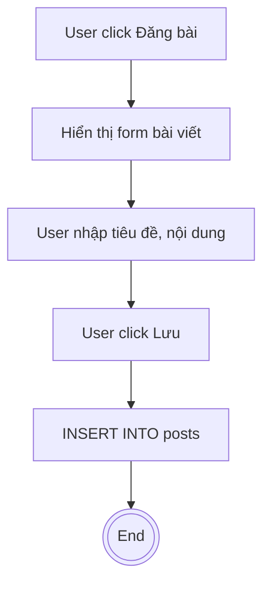
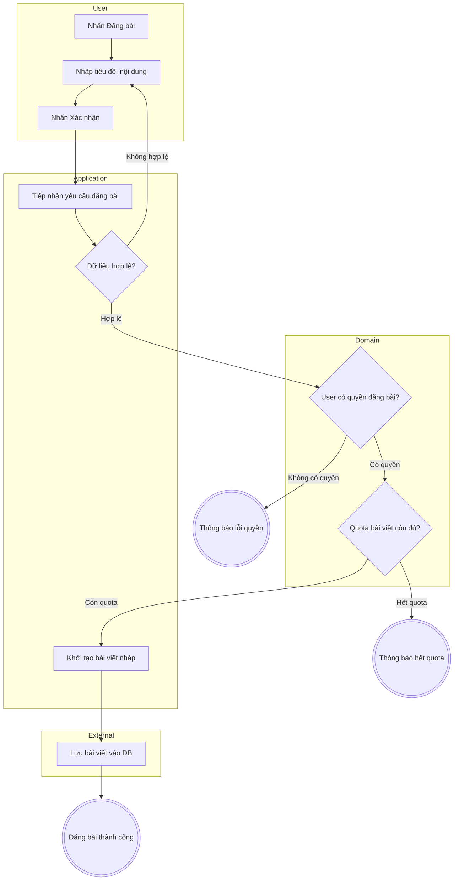

Vai trò: Làm “lens” để review / thiết kế Activity Diagram theo tư duy **Boundary – Use Case – Entity**, tránh lẫn UI/Infra vào business flow, đảm bảo luồng thể hiện đúng **Use Case + Business Rules** chứ không phải chi tiết framework.

---

## 1. Mục tiêu & phạm vi áp dụng

### 1.1 Mục tiêu

- Định nghĩa một **cách nhìn chuẩn Clean Architecture** khi đọc/vẽ Activity Diagram:
- Tách rõ:
  - **Actor (User / External System)**
  - **Use Case (Application Service / Orchestrator)**
  - **Domain (Entity / Domain Service / Domain Rules)**
  - **External Systems (DB, Message Queue, Payment, Email, Search, …)**
- Hạn chế:
  - Không để luồng bị **UI-driven** (chỉ xoay quanh màn hình/nút).
  - Không để luồng bị **DB-driven** (chỉ xoay quanh insert/update/delete).
- Hỗ trợ:
  - **Mode A (Design V1)**: giúp thiết kế Activity Diagram từ yêu cầu.
  - **Mode B (Refactor/Audit)**: làm khung review, phát hiện chỗ sai layer hoặc thiếu domain rule.

### 1.2 Phạm vi

- Áp dụng cho **luồng nghiệp vụ cấp Use Case**:
  - Ví dụ: “Đăng nhập”, “Đăng bài viết”, “Duyệt bài viết”, “Báo cáo vi phạm”.
  - Có thể áp dụng cho: Use case người dùng (User/Admin) và Use case hệ thống nội bộ (cron job, batch xử lý).
- Không tập trung:
  - Các luồng thuần hạ tầng (backup DB, rotate log).
  - Các flow siêu low-level (ví dụ thuật toán trong 1 function đơn lẻ).

### 1.3 Khi nào dùng trong Mode A/B

- **Mode A – Design V1**:
  - Sau khi: Đọc xong requirement + use case, nắm được thuật ngữ domain cơ bản.
  - Trước khi: Vẽ Activity Diagram V1.
  - Cách dùng: Dùng checklist để chọn **swimlane** đúng, quyết định action nào thuộc Use Case/Domain/External, và xác định chỗ cần decision node cho domain rule.
- **Mode B – Refactor/Audit**:
  - Khi đã có Activity Diagram hiện tại cần kiểm tra lỗi phân tầng hoặc thiếu domain rule.
  - Cách dùng: So sánh từng node với lens Clean Architecture (Node này đúng lane chưa? Có rule domain nào bị thiếu?).

---

## 2. Tóm tắt Clean Architecture cho modeling luồng nghiệp vụ

### 2.1 Các vòng tròn Clean Architecture (tóm tắt)

Theo Clean Architecture của Uncle Bob, hệ thống được chia thành các vòng tròn đồng tâm:

- **Entities (Domain Layer)**:
  - Chứa business rules quan trọng, **bất biến** theo thời gian.
  - Không phụ thuộc UI, DB, framework.
- **Use Cases (Application Layer)**:
  - Điều phối luồng nghiệp vụ (workflow): Nhận input từ Actor, gọi Entities để thực hiện rule, gọi gateway để đọc/ghi dữ liệu.
- **Interface Adapters**:
  - Chuyển đổi dữ liệu giữa core và external (Controllers, Presenters, View Models).
- **Frameworks & Drivers (Infrastructure)**:
  - Web framework, DB, file system, external API.

**Nguyên tắc phụ thuộc (Dependency Rule):** Các vòng tròn bên trong **không được** phụ thuộc vòng ngoài.

### 2.2 Checklist phân lớp cho Activity Diagram

Khi nhìn vào **một action**, nên trả lời:

1. **Đây là hành động của Actor?** (VD: "Nhập thông tin", "Nhấn Đăng bài")
2. **Đây là bước điều phối Use Case (Application)?** (VD: "Tiếp nhận yêu cầu", "Validate input")
3. **Đây là domain rule / xử lý nghiệp vụ cốt lõi?** (VD: "Kiểm tra quyền", "Tính điểm uy tín")
4. **Đây là tương tác với hệ thống ngoài (External/Infra)?** (VD: "Lưu bài viết vào DB", "Gửi email")

Nếu **không phân loại được**, có thể flow đang mô tả UI layout hoặc chi tiết kỹ thuật không cần thiết.

---

## 3. Mapping Clean Architecture ↔ Activity Diagram

### 3.1 Thiết kế swimlane theo layer

- **Lane 1 – Actor(s)**: User, Admin, External Service. Action dạng: “Nhập...”, “Chọn...”, “Nhấn...”.
- **Lane 2 – Application / Use Case**: Application Service. Action dạng: “Tiếp nhận yêu cầu”, “Orchestrate flow”.
- **Lane 3 – Domain (Entity / Domain Service)**: Business logic thuần. Action dạng: “Kiểm tra quota”, “Tính điểm thưởng”.
- **Lane 4 – External Systems / Infrastructure**: DB, Payment, Email. Action dạng: “Lưu DB”, “Gửi email”.

> **Quy tắc:** Không dùng lane “UI” hay “Controller”. Domain rule phải nằm ở lane Domain hoặc Application.

### 3.2 Quy tắc đặt action & decision

**Action naming:**
- Ưu tiên **động từ + bổ ngữ nghiệp vụ** (VD: "Kiểm tra thông tin đăng nhập").
- Tránh tên thuần kỹ thuật (VD: "Insert DB posts").

**Decision placement:**
- Decision về **domain rule**: Đặt trong lane **Domain**.
- Decision về **orchestration/policy**: Đặt trong lane **Application**.
- Decision về **lựa chọn UI**: Đặt trong lane **Actor**.

**Guard condition:**
- Luôn ghi điều kiện trên cạnh ra: `[Hợp lệ]`, `[Không hợp lệ]`, `[Có quyền]`.

### 3.3 Mapping từ Use Case → Activity Diagram

- **Basic flow step** → Action node trong lane Application/Domain/Actor.
- **Alternative flow** → Branch từ 1 decision node.
- **Exception flow** → Branch lỗi (dẫn tới Final hoặc quay về bước an toàn).

---

## 4. Anti‑pattern thường gặp (theo lens Clean Architecture)

### 4.1 UI‑driven flow
- Dấu hiệu: Action tên rất UI (“Mở form”, “Hiển thị màn hình”).
- Hệ quả: Logic nghiệp vụ bị mờ nhạt, khó test domain độc lập.

### 4.2 Persistence‑first flow (DB‑driven)
- Dấu hiệu: Action tập trung vào lệnh DB (“Insert table”, “Update column”).
- Hệ quả: Domain logic bị chôn trong repository/ORM.

### 4.3 Thiếu domain rule gate
- Dấu hiệu: Requirement có rule nhưng diagram không có decision node tương ứng.
- Hệ quả: Rule dễ bị quên khi implement.

### 4.4 Swimlane lẫn lộn trách nhiệm
- Dấu hiệu: Lane User chứa action “Lưu DB”, lane External chứa action “Kiểm tra quyền”.
- Hệ quả: Hiểu sai trách nhiệm hệ thống.

### 4.5 Dùng Fork để thể hiện lựa chọn thay vì song song
- Dấu hiệu: Dùng fork node chia thành các path lựa chọn (chọn 1 trong 3).
- Hệ quả: Sai semantics UML (fork = song song), gây hiểu nhầm logic.

---

## 5. Heuristics review nhanh (Checklist Yes/No)

1. Mỗi action thuộc rõ 1 trong 4 nhóm (Actor/Use Case/Domain/External)?
2. Action DB/Framework không nằm trong lane Domain/Actor?
3. Action domain không nằm trong lane External/Infra?
4. Rule quan trọng đều có decision node tương ứng?
5. Guard rõ ràng, cover đủ case (có `else`)?
6. Lane Domain tránh từ vựng UI?
7. Lane Actor không chứa action hệ thống (Lưu DB, Gửi mail)?
8. Fork node thể hiện đúng song song (không dùng cho lựa chọn)?
9. Mọi fork cần đồng bộ đều có join đúng chỗ?
10. Mọi luồng đều kết thúc tại Final hoặc trạng thái xác định?
11. Mỗi node đều trace được về Use Case step hoặc Business Rule?

---

## 6. Ví dụ before/after (Mermaid)

### 6.1 Before – UI‑driven, DB‑driven

### 6.2 After – Áp dụng Clean Architecture Lens

--------------------------------------------------------------------------------
## 7. Traceability rule (context → node)
- Nguồn trace: Use Case Specification (Precondition, Basic/Alt/Exception flows), Business Rules.
- Nguyên tắc:
    + Mỗi step basic flow → ít nhất 1 action node.
    + Mỗi alternative/exception → 1 branch.
    + Mỗi business rule → 1 decision node hoặc action domain.

- Gắn trace: Note cạnh node (VD: “Trace: UC01.S3, RULE-R1”).

