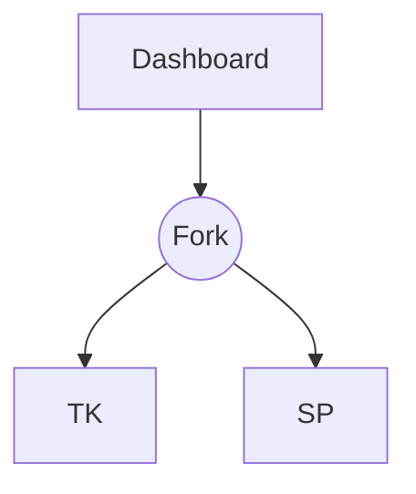
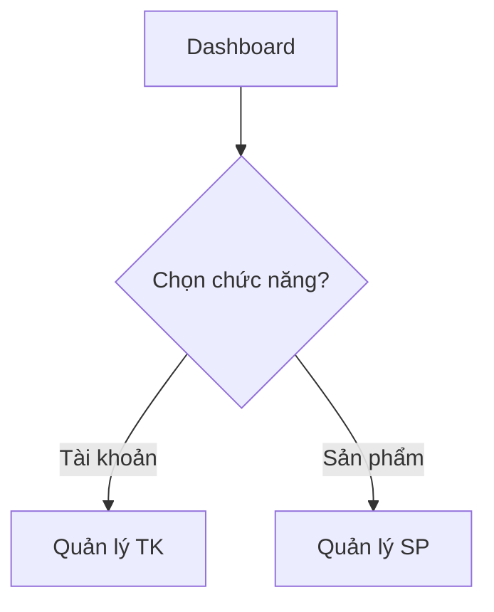
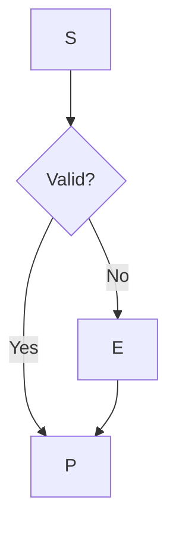
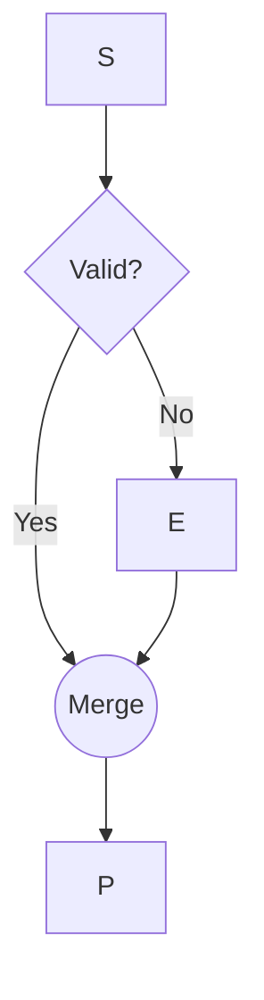
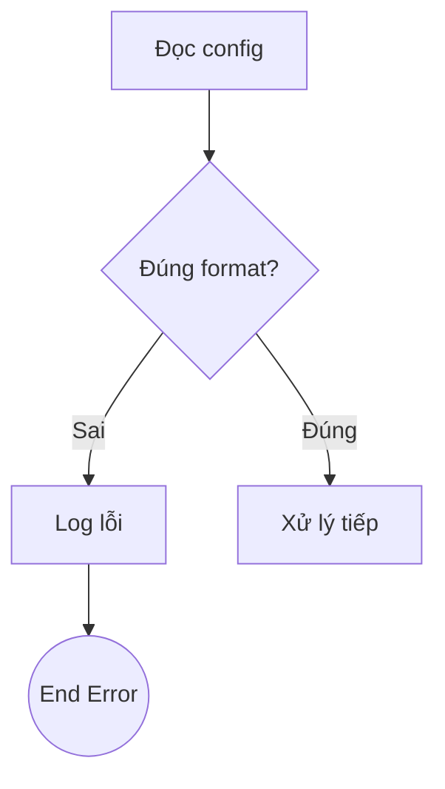
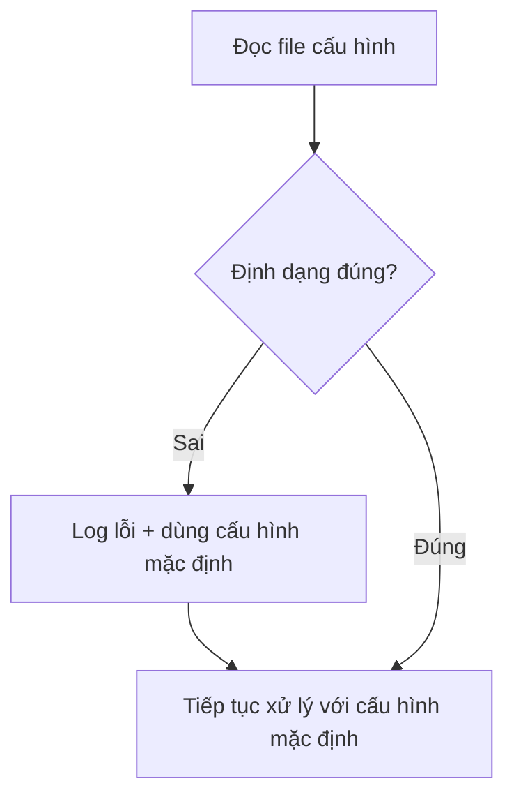
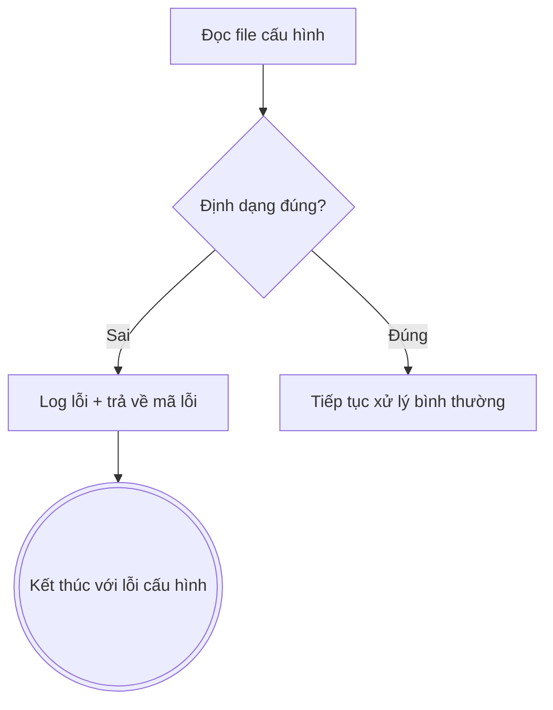

Vai trò: Thư viện “mẫu rủi ro” (risk patterns) để audit/refactor Activity Diagram trong Mode B, giúp phân loại **Critical / Major / Minor** nhất quán.

---

## 1. Mục tiêu & phạm vi rủi ro

### 1.1 Mục tiêu
- Xây dựng **bộ từ điển risk** cho Activity Diagram (Control-flow, Decision-logic, Parallelism, Responsibility, Exception).
- Mô tả: **Dấu hiệu → Hệ quả → Cách phát hiện → Cách refactor**.
- Làm cơ sở cho Mode B (Refactor/Audit) để phát hiện lỗi logic và đánh severity.

### 1.2 Định nghĩa “risk”
- **Risk** = bất kỳ mẫu nào khiến luồng không chạy đúng semantics UML (deadlock, implicit AND sai), dẫn đến hiểu sai nghiệp vụ hoặc implement sai rule.

---

## 2. Taxonomy rủi ro

1. **Control‑flow Risks**: Thiếu Initial/Final, dùng Decision/Merge sai semantics, thiếu Merge gây "join ngầm".
2. **Decision‑logic Risks**: Guard thiếu `else`, logic quá phức tạp, guard mơ hồ (`[OK]`).
3. **Parallelism Risks**: Dùng **fork** cho lựa chọn (thay vì decision), Join deadlock (chờ token không bao giờ tới).
4. **Responsibility / Swimlane Risks**: Logic domain nằm sai lane (External/User), không dùng swimlane.
5. **Exception & Alternate Flow Risks**: Chỉ vẽ happy path, exception không kết thúc rõ ràng.

---

## 3. Pattern Catalog (Mỗi pattern: dấu hiệu → hệ quả → phát hiện → refactor)

### 3.1 Control‑flow Patterns

#### Pattern CF‑01 – Thiếu Merge sau Decision (Implicit AND)
- **Dấu hiệu**: 2+ nhánh từ decision cùng đi vào 1 action mà không qua merge node.
- **Hệ quả**: Action đợi token từ tất cả các nhánh (Implicit AND) → Deadlock nếu logic là OR.
- **Refactor**: Thêm **merge node** gom các nhánh trước khi vào action.

#### Pattern CF‑02 – Thiếu Final Node / Flow Final
- **Dấu hiệu**: Path treo lơ lửng, không dẫn tới Final hoặc quay lại step rõ ràng.
- **Hệ quả**: Không rõ trạng thái kết thúc.
- **Refactor**: Thêm Activity Final / Flow Final node.

### 3.2 Decision‑logic Patterns

#### Pattern DL‑01 – Guard không đầy đủ (Missing Else)
- **Dấu hiệu**: Thiếu case `else` hoặc các case không cover hết logic.
- **Hệ quả**: Case thiếu bị bỏ qua khi code.
- **Refactor**: Bổ sung guard còn thiếu hoặc guard `[else]`.

#### Pattern DL‑02 – Guard mơ hồ, không domain‑driven
- **Dấu hiệu**: Guard `[OK]`, `[Success]` thay vì `[Quota < N]`.
- **Hệ quả**: Khó test, không rõ rule.
- **Refactor**: Đổi tên guard theo ngôn ngữ domain.

### 3.3 Parallelism Patterns

#### Pattern PL‑01 – Dùng Fork cho “chọn 1 trong N” (Choice vs Parallel)
- **Dấu hiệu**: Dùng fork chia 3 nhánh cho việc "chọn chức năng".
- **Hệ quả**: Semantics là chạy đồng thời 3 chức năng → Sai nghiệp vụ.
- **Refactor**: Thay Fork bằng **Decision node**.

#### Pattern PL‑02 – Join chờ token không bao giờ tới (Deadlock)
- **Dấu hiệu**: Join node chờ N incoming, nhưng logic rẽ nhánh khiến token không bao giờ đến đủ.
- **Hệ quả**: Join đứng vĩnh viễn (Deadlock).
- **Refactor**: Dùng Merge nếu là OR, hoặc sửa logic flow.

### 3.4 Responsibility / Swimlane Patterns

#### Pattern RS‑01 – Domain logic nằm trong lane External / User
- **Dấu hiệu**: Lane DB chứa action "Kiểm tra quyền".
- **Hệ quả**: Dev code rule sai tầng (đẩy vào infra).
- **Refactor**: Chuyển action sang lane Application/Domain.

#### Pattern RS‑02 – Không có swimlane
- **Dấu hiệu**: Mọi action nằm cùng 1 cột.
- **Refactor**: Thêm swimlane (Actor, Use Case, Domain, External) và phân loại lại.

### 3.5 Exception & Alternate Flow Patterns

#### Pattern EX‑01 – Happy Path only
- **Dấu hiệu**: Chỉ vẽ luồng thành công, bỏ qua lỗi đã define trong use case.
- **Refactor**: Thêm decision node và nhánh lỗi.

#### Pattern EX‑02 – Exception flow không kết thúc rõ ràng
- **Dấu hiệu**: Nhánh lỗi quay lại luồng chính mà không rõ trạng thái (rollback hay chưa).
- **Refactor**: Dùng Activity Final riêng hoặc decision retry rõ ràng.

---

## 4. Severity Rubric (Critical / Major / Minor)

- **Critical**: Gây deadlock/sai semantics UML nghiêm trọng, hoặc bỏ qua business rule cốt lõi (bỏ check quyền, thanh toán).
  - VD: CF-01, PL-02, EX-01 (quan trọng).
- **Major**: Gây hiểu nhầm domain, dev dễ implement sai, sai swimlane.
  - VD: PL-01, RS-01, DL-01.
- **Minor**: Ảnh hưởng readability, naming, layout.
  - VD: DL-02, thiếu flow final (nhưng logic vẫn hiểu được).

---

## 5. Clarification Triggers (Khi nào cần hỏi lại user?)

1. **Guard mơ hồ**: `[OK]` nghĩa là gì? (Quyền hay Quota?).
2. **Không rõ Parallel vs Choice**: Dùng fork nhưng mô tả là "hoặc".
3. **Exception thiếu mô tả**: Có path lỗi nhưng không biết hệ thống cần làm gì (Retry/Rollback?).
4. **Domain rule trong comment**: Có comment rule nhưng không có node thực thi.
5. **Trùng lặp lane**: Không rõ Actor hay System thực hiện.

-> Hành động: Đánh dấu **[CẦN LÀM RÕ]** và đặt câu hỏi.

---

## 6. Refactor Playbook (6 bước)

1. **Detect**: Quét node, gán label pattern (CF-01, PL-01...).
2. **Assign Severity**: Đánh giá Critical/Major/Minor.
3. **Isolate**: Khoanh vùng subgraph bị lỗi.
4. **Redesign**: Vẽ lại dựa trên Use Case spec và semantics đúng.
5. **Validate**: Soát lại với requirement và UML semantics.
6. **Explain**: Ghi lại Before/After và lý do sửa để user hiểu.

---

## 7. Ví dụ thực chiến Mermaid (Before/After)

### 7.1 Pattern PL‑01 – Fork dùng cho lựa chọn
**Before (Sai - Fork):**

**After (Đúng - Decision):**

### 7.2 Pattern CF‑01 – Thiếu Merge sau Decision
**Before (Sai - Implicit AND):** Action P chờ cả E và D (deadlock).

**After (Đúng - Merge):** Action P chạy khi 1 trong 2 đến.

**After (Đúng - Merge):**

### 7.3 Pattern EX‑02 – Exception flow rõ ràng

**Before (Mơ hồ sau lỗi):**

**Vấn đề:** Không rõ sau lỗi thì hệ thống xử lý tiếp như thế nào.
- Có dùng cấu hình mặc định không?
- Có dừng flow (fail fast) không?

**After A (Tiếp tục với cấu hình mặc định):**

**After B (Fail fast khi cấu hình lỗi):**

**Rule chọn hướng xử lý:**
- Chọn **After A** nếu hệ thống cho phép degraded mode và default config an toàn.
- Chọn **After B** nếu cấu hình là điều kiện tiên quyết để đảm bảo tính đúng/safe của nghiệp vụ.
