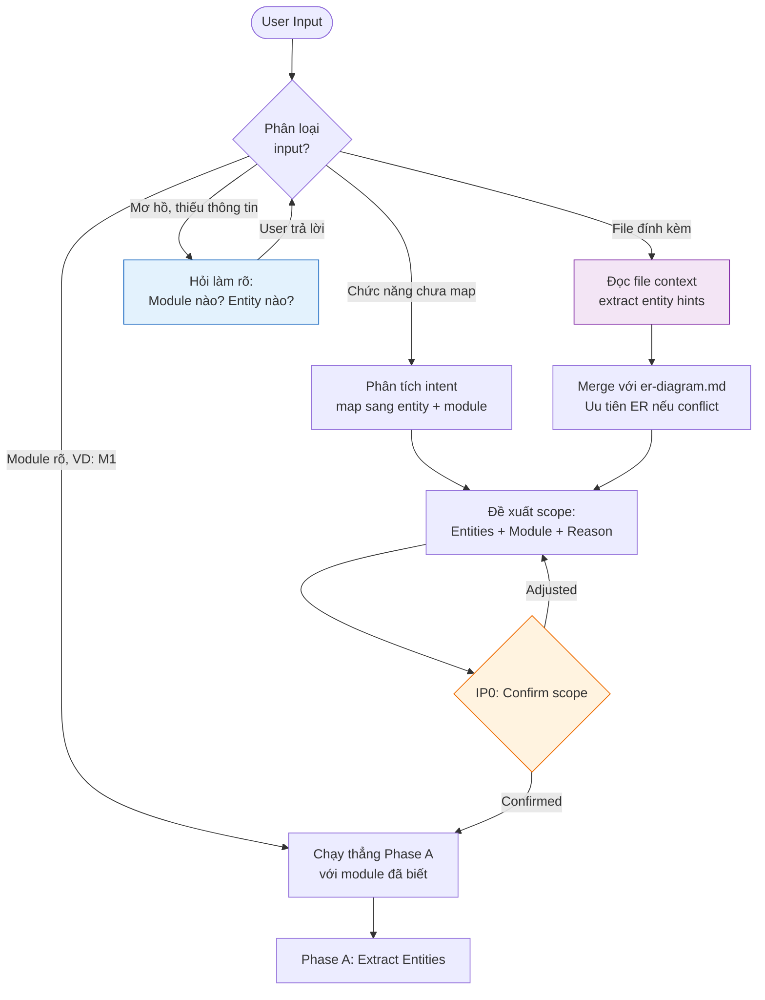
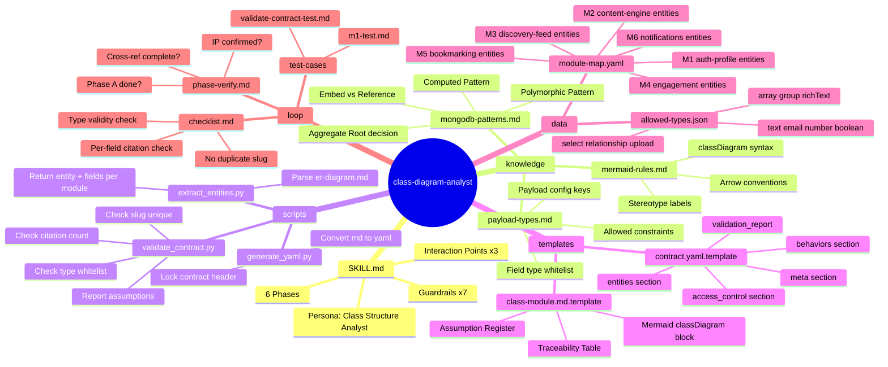
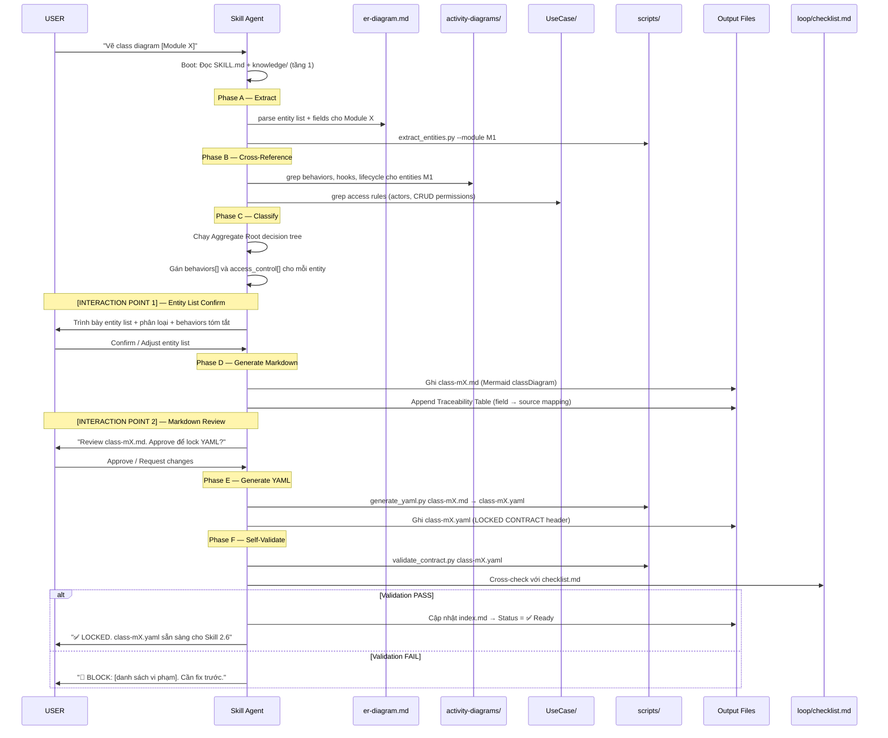
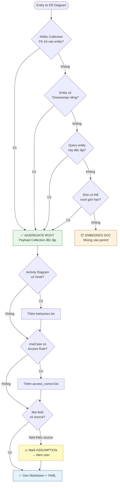

# class-diagram-analyst — Architecture Design

> Generated by Skill Architect | Date: 2026-02-20
> Status: 🟡 PHASE 1-2 CONFIRMED — Phase 3 Ready to Build

---

## 0. Input Mechanism

> **Thay đổi cơ chế so với thiết kế ban đầu**: Skill không chỉ chạy theo module cố định.
> Skill nhận **yêu cầu mơ hồ hoặc chưa đủ rõ ràng từ người dùng + file context đính kèm**,
> sau đó tự phân tích để xác định scope trước khi bắt đầu.

### 0.1 Input Types được chấp nhận

| Loại Input | Ví dụ | Skill xử lý thế nào |
|-----------|-------|--------------------|
| **Yêu cầu module rõ ràng** | "Vẽ class diagram M1" | Chạy thẳng Phase A với module đã biết |
| **Yêu cầu theo chức năng** | "Vẽ class cho chức năng đăng ký" | Phân tích → map sang entity/module → hỏi confirm |
| **Yêu cầu mơ hồ** | "Cần thiết kế schema cho notifications" | Phân tích intent → propose scope → CHỜ confirm trước khi làm |
| **Yêu cầu + file đính kèm** | "Dựa vào file này, vẽ class diagram" + attach file | Đọc file context → extract entity hints → merge với ER Diagram |
| **Yêu cầu partial update** | "Thêm field avatar vào User class" | Identify affected entity → update class-mX.md + re-lock YAML |

### 0.2 Input Resolution Flow



### 0.3 File Context Rules

Khi user đính kèm file context (specification, note, previous diagram):

1. **Đọc file context TRƯỚC** — extract tất cả entity/field/behavior hints
2. **Cross-reference với `er-diagram.md`** — ER là nguồn chân lý, file context là bổ sung
3. **Conflict resolution**: Nếu file context mô tả field không có trong ER → Mark `[FROM_CONTEXT]`, không phải `[ASSUMPTION]`
4. **Traceability**: Source citation ghi rõ `"context-file.md#section"` thay vì ER
5. **Báo cáo delta**: Sau khi đọc file context, báo cáo cho user: "Tìm thấy X entities, Y fields mới không có trong ER"

### 0.4 Interaction Point 0 (IP0) — Input Clarification Gate

> Đây là **gate mới** được thêm vào khi input chưa đủ rõ ràng.
> IP0 chỉ kích hoạt khi input type là **mơ hồ** hoặc **chức năng chưa map**.

```
IP0 Output — Skill phải trình bày:
  ✅ Tôi hiểu yêu cầu của yêu thương là: [paraphrase lại]
  ✅ Scope tôi đề xuất: [Module X → Entities: A, B, C]
  ✅ Nguồn tôi sẽ dùng: [er-diagram.md + activity-diagrams/mX + UseCase/mX]
  ❓ Xác nhận để tiếp tục?
```

---

## 1. Problem Statement

### Bối cảnh

Dự án KLTN đang ở **Life-2 (Thiết kế)** trong chuỗi sản xuất tri thức:

```
Life-1 (Requirements) → Life-2 (Design) → Life-3 (Code)
```

File `Docs/life-2/diagrams/class-diagrams/class-diagram.md` hiện chỉ là
**placeholder với 2 class (User + Post)** — không đủ để phục vụ AI Code Agent
ở Life-3.

### Pain Point

| Vấn đề | Hệ quả |
|--------|--------|
| ER Diagram có ~12 entities nhưng chưa có OOP view | AI Code Agent không biết field nào có Method, Hook, Validate rule |
| Không có Access Control trên Class level | AI sinh code thiếu RBAC, bỏ qua phân quyền |
| Không có nguồn trích dẫn (citation) cho mỗi field | AI dễ hallucinate thêm field không tồn tại trong spec |
| Toàn dự án 1 file class duy nhất | Context quá lớn → AI bị mất context khi xử lý cuối file |
| Không có machine-readable contract | Skill 2.6 (Schema Design) không có ground truth để đọc |

### Mục tiêu Skill

`class-diagram-analyst` là **Skill 2.5** — sinh tài liệu Class Diagram theo chuẩn
dual-format (Mermaid + YAML Contract), **per-module**, đủ chi tiết để:

1. **Human Review**: Analyst review bằng file `.md` (Mermaid classDiagram)
2. **AI Machine Input**: Skill 2.6 đọc file `.yaml` (YAML Contract — LOCKED)
3. **Chống hallucination**: Mọi field đều phải có source citation từ tài liệu gốc

### Pipeline Position

```
ER Diagram + UseCase + Activity + Sequence
         ↓
   [SKILL 2.5 — class-diagram-analyst]  ← Skill này
         ↓
   class-mX.md (human)  +  class-mX.yaml (AI contract)
         ↓
   [SKILL 2.6 — schema-design-analyst]  → schema-design/*.md
         ↓
   AI Code Agent (Life-3) đọc schema specs
```

---

## 2. Capability Map

### 2.1 Tri thức (Knowledge)

| Tri thức | Nguồn | Quan trọng |
|----------|-------|------------|
| MongoDB Modeling Patterns | `knowledge/mongodb-patterns.md` | ⭐⭐⭐ |
| PayloadCMS Field Types & API | `knowledge/payload-types.md` | ⭐⭐⭐ |
| Mermaid classDiagram Syntax | `knowledge/mermaid-rules.md` | ⭐⭐⭐ |
| Aggregate Root Strategy | Embedded trong mongodb-patterns | ⭐⭐⭐ |
| Entity Dictionary (12 entities) | `er-diagram.md` | ⭐⭐⭐ |
| Behaviors per Entity | `activity-diagrams/m*-a*.md` | ⭐⭐⭐ |
| Access Rules per Actor | `UseCase/use-case-m*.md` | ⭐⭐⭐ |
| Method signatures | `sequence-diagrams/detailed-m*.md` | ⭐⭐ |

### 2.2 Quy trình (Process)

Skill thực thi theo **6 phases, 3 interaction points**, mỗi module độc lập:

```
Phase A  →  Phase B  →  Phase C  →  [IP1]  →  Phase D  →  [IP2]  →  Phase E  →  Phase F  →  [IP3]
Extract     CrossRef     Classify   Confirm    Gen .md    Review     Gen .yaml   Validate    Done
```

**Chi tiết:**

- **Phase A — Extract Entities**: Đọc `er-diagram.md`, lấy entity list + full field dict cho module hiện tại
- **Phase B — Cross-Reference**: Grep `activity-diagrams/` tìm Hook/Behavior; grep `UseCase/` tìm Access Rule
- **Phase C — Classify**: Quyết định mỗi entity là `Aggregate Root` hay `Embedded Doc` theo decision tree
- **[IP1] Confirm Entity List**: Trình bày danh sách entities + phân loại → CHỜ user xác nhận
- **Phase D — Generate Markdown**: Sinh `class-mX.md` với Mermaid classDiagram + Traceability Table
- **[IP2] Review Markdown**: Trình bày file.md → CHỜ user review và approve
- **Phase E — Generate YAML**: Chuyển đổi .md thành YAML Contract (locked format)
- **Phase F — Self-Validate**: Chạy validate logic (citation check, type check, slug unique)
- **[IP3] Report Result**: Báo cáo kết quả validation → DONE nếu pass, BLOCK nếu fail

### 2.3 Kiểm soát (Guardrails)

| Rule | Hành động vi phạm |
|------|------------------|
| Mọi field PHẢI có `source:` citation | BLOCK — không ghi file |
| Field type phải nằm trong `allowed-types.json` | BLOCK — throw error |
| Không được duplicate entity slug | BLOCK — throw error |
| Field không có nguồn trong ER/Activity/UseCase | Mark `[ASSUMPTION]`, alert user |
| YAML Contract không được edit thủ công | Comment rõ trong file header |
| Phải CHỜ user confirm sau mỗi Interaction Point | Không bỏ qua bước nào |
| Module đang làm phải `✅ Ready` trong index.md | Chỉ lock khi user approve |

---

## 3. Zone Mapping

| Zone | Nội dung | Bắt buộc? |
|------|----------|-----------|
| **Core (SKILL.md)** | Persona: Class Structure Analyst; 6-phase workflow; 3 interaction points; guardrails | ✅ |
| **knowledge/** | `payload-types.md`, `mermaid-rules.md`, `mongodb-patterns.md` | ✅ Tầng 1 |
| **scripts/** | `extract_entities.py`, `validate_contract.py`, `generate_yaml.py` | ✅ |
| **templates/** | `class-module.md.template`, `contract.yaml.template` | ✅ |
| **data/** | `allowed-types.json`, `module-map.yaml` | ✅ |
| **loop/** | `checklist.md`, `phase-verify.md`, `test-cases/` | ✅ Mỗi phase |
| **assets/** | Không cần | ❌ |

---

## 4. Folder Structure



---

## 5. Execution Flow

### 5.1 Luồng thực thi tổng quát



### 5.2 Workflow theo Phase — Gating rõ ràng

```mermaid
flowchart LR
    A[Phase A\nExtract Entities] -->|entities + fields| B
    B[Phase B\nCross-Reference\nBehavior + Access] -->|enriched entities| C
    C[Phase C\nClassify\nRoot vs Embed] -->|classified list| IP1

    IP1{🛑 IP1\nConfirm\nEntity List} -->|User approved| D
    IP1 -->|Adjustments| C

    D[Phase D\nGen class-mX.md\nMermaid + Table] -->|md file| IP2

    IP2{🛑 IP2\nReview .md\nApprove?} -->|Approved| E
    IP2 -->|Changes needed| D

    E[Phase E\nGen class-mX.yaml\nContract] -->|yaml file| F

    F[Phase F\nSelf-Validate\nvalidate_contract.py] -->|check result| IP3

    IP3{🛑 IP3\nValidation\nPassed?} -->|PASS| Done
    IP3 -->|FAIL → list violations| Fix

    Fix[Fix violations\nresource citation\ntype errors] --> E
    Done([✅ LOCKED & READY\nUpdate index.md])

    style IP1 fill:#fff3e0,stroke:#ef6c00
    style IP2 fill:#fff3e0,stroke:#ef6c00
    style IP3 fill:#fff3e0,stroke:#ef6c00
    style Done fill:#e8f5e9,stroke:#2e7d32
    style Fix fill:#ffcdd2,stroke:#c62828
```



### 5.3 Decision Tree — Aggregate Root vs Embedded



---

## 6. Interaction Points

| # | Thời điểm | Nội dung tương tác | Lý do |
|---|-----------|-------------------|-------|
| **IP1** | Sau Phase C (Classify) | Trình bày danh sách entities, Root/Embed phân loại, behaviors tóm tắt | Phải xác nhận scope trước khi gen file — sai ở đây sẽ sai toàn bộ |
| **IP2** | Sau Phase D (Gen .md) | Hiển thị `class-mX.md` đầy đủ — CHỜ approve | Người dùng cần review Mermaid diagram + Traceability Table trước khi khóa YAML |
| **IP3** | Sau Phase F (Validate) | Báo cáo kết quả validation: pass/fail + danh sách vi phạm | Không được auto-lock YAML khi có violation — phải user aware |

> ⚠️ **Quy tắc bất biến**: Không bước qua Interaction Point mà không nhận phản hồi từ người dùng.

---

## 7. Progressive Disclosure Plan

### Tầng 1: Bắt buộc đọc khi skill khởi động (Mandatory)

```
- SKILL.md                         ← Luôn đầu tiên
- knowledge/payload-types.md       ← Biết field type nào hợp lệ trước khi làm gì
- knowledge/mongodb-patterns.md    ← Nguyên tắc Aggregate Root / Embedded
- data/module-map.yaml             ← Biết module nào có entity nào
- loop/checklist.md                ← Biết validation rule trước khi bắt đầu
```

### Tầng 2: Tự quyết định theo context (Conditional)

```
Khi xử lý Module X:
  - er-diagram.md                  ← Đọc 1 lần để extract entities
  - activity-diagrams/mX-a*.md    ← Chỉ đọc file của module đang làm
  - UseCase/use-case-mX-*.md      ← Chỉ đọc use case của module đang làm
  - sequence-diagrams/detailed-mX.md  ← Chỉ khi cần method signature

Khi gen output:
  - templates/class-module.md.template   ← Đọc khi Phase D bắt đầu
  - templates/contract.yaml.template     ← Đọc khi Phase E bắt đầu

Khi validate:
  - data/allowed-types.json              ← Đọc trong Phase F
  - knowledge/mermaid-rules.md           ← Đọc nếu cần verify Mermaid syntax
```

---

## 8. Risks & Blind Spots

| # | Risk | Mức độ | Mitigation |
|---|------|--------|------------|
| R1 | **AI hallucinate field** không có trong ER | 🔴 Cao | Guardrail: Mọi field phải có `source:` — không có nguồn → BLOCK |
| R2 | **Entity `shares`** tồn tại trong ERD tổng quan nhưng **không có Entity Dictionary** | 🟠 Trung | Mark `[ASSUMPTION]` + thiết kế provisional fields cơ bản → Alert user ngay IP1 |
| R3 | **Confusion Embed vs Root** với `tags`, `post_media` (join tables) | 🟠 Trung | Decision Tree rõ ràng (§5.3) + Module-map.yaml pre-classify |
| R4 | **Mermaid classDiagram syntax lỗi** (unsupported operators) | 🟡 Thấp | `mermaid-rules.md` whitelist syntax + template cứng |
| R5 | **Context loss khi file .md lớn** | 🟡 Thấp | Per-module chunking — max ~1 entity dict/file; index.md routing |
| R6 | **YAML Contract bị edit thủ công** sau khi lock | 🟡 Thấp | Header comment rõ `⚠️ DO NOT EDIT MANUALLY. Generated by Skill 2.5.` |
| R7 | **Access Control không đầy đủ** nếu bỏ qua UseCase | 🟠 Trung | Cross-reference UseCase là mandatory step trong Phase B |
| R8 | **M3 Discovery** không có entity riêng — AI có thể bỏ qua module | 🟡 Thấp | Module-map.yaml note rõ: M3 = cross-module, document pattern thay vì collection |

---

### Cập nhật 2.2 — Input Resolution Phase (bổ sung vào Process)

Phase ban đầu là 6-phase. Sau khi cập nhật Input Mechanism, thêm **Phase 0 — Input Resolution**:

```
Phase 0  →  Phase A  →  Phase B  →  Phase C  →  [IP1]  →  Phase D  →  [IP2]  →  Phase E  →  Phase F  →  [IP3+]
Resolve     Extract     CrossRef     Classify   Confirm    Gen .md    Review     Gen .yaml   Validate    Done
Input
(IP0 nếu
cần)
```

---

## 9. Open Questions

| # | Câu hỏi | Trạng thái | Quyết định |
|---|---------|-----------|------------|
| Q1 | Entity `shares` thiếu Entity Dictionary — dùng provisional fields nào? | ✅ Chốt | Mark `[ASSUMPTION]`, thiết kế: `id, post_id, user_id, created_at` tương tự `likes` |
| Q2 | Skill build đầy đủ hay chỉ design.md trước? | ✅ Chốt | Design trước — implementation sau |
| Q3 | Thứ tự module? | ✅ Chốt | Phase-based: M1 → M2 → M3 → M4 → M5 → M6, từng module độc lập |
| Q4 | M3 Discovery Feed không có entity riêng — xử lý thế nào? | ❓ Open | Option A: Bỏ qua, document cross-module pattern. Option B: Tạo `FeedQuery` value object |
| Q5 | `post_media` và `post_tags` là join tables — Root hay Embedded? | ❓ Open | Cần quyết định khi làm M2 — provisional: Embedded trong Post |
| Q6 | Skill 2.5 và Skill 2.6 có share cùng `knowledge/` không? | ❓ Open | Kiến trúc hiện tại: separate skills, separate knowledge — DRY qua `data/shared-types.json` |

---

## 10. Metadata

- **Skill Name**: `class-diagram-analyst`
- **Alias**: Skill 2.5 trong Task Pipeline
- **Created**: 2026-02-20
- **Author**: Skill Architect (Vũ Thương Hải)
- **Framework**: architect.md v2.0
- **Status**: 🟡 DESIGN COMPLETE — Ready for skill-planner → skill-builder
- **Target Output Dir**: `Docs/life-2/diagrams/class-diagrams/`
- **YAML Contract Dir**: `Docs/life-2/diagrams/class-diagrams/mX-*/`
- **Next Skill**: `schema-design-analyst` (Skill 2.6) — đọc YAML Contract từ skill này
- **Related Files**:
  - `Docs/life-2/diagrams/architect.databasse.md` — Nguồn gốc spec này
  - `Docs/life-2/diagrams/er-diagram.md` — Primary input source
  - `.skill-context/class-diagram-analyst/todo.md` — Implementation plan (chờ skill-planner)

---

## Appendix A — Entity Inventory (Pre-classified)

Dựa trên ER Diagram — inventory đầy đủ cho skill-planner và skill-builder:

| Entity | Module | Aggregate Root? | Source | Special Notes |
|--------|--------|----------------|--------|---------------|
| `users` | M1 | ✅ Root | er-diagram.md | Core entity — nhiều FK trỏ vào |
| `posts` | M2 | ✅ Root | er-diagram.md | Có ranking_score, denormalized counters |
| `media` | M2 | ✅ Root | er-diagram.md | PayloadCMS Upload collection riêng |
| `tags` | M2 | ✅ Root (nhỏ, ref) | er-diagram.md | Nhiều post → nhiều tag (N:N) |
| `post_tags` | M2 | 📦 Embedded | er-diagram.md | Join table → nhúng vào relationship |
| `post_media` | M2 | 📦 Embedded | er-diagram.md | Join table → nhúng vào Post.media[] |
| _(feed logic)_ | M3 | ❌ No entity | er-diagram.md | Cross-module pattern — document strategy |
| `comments` | M4 | ✅ Root | er-diagram.md | Có parent_comment_id (threaded) |
| `likes` | M4 | ✅ Root | er-diagram.md | Unique (post_id, user_id) |
| `connections` | M4 | ✅ Root | er-diagram.md | Unique (follower_id, following_id) |
| `shares` | M4 | ✅ Root (provisional) | er-diagram.md tổng quan | ⚠️ [ASSUMPTION] thiếu Entity Dict |
| `bookmark_collections` | M5 | ✅ Root | er-diagram.md | has_default flag |
| `bookmarks` | M5 | ✅ Root | er-diagram.md | Unique (user_id, post_id) |
| `notifications` | M6 | ✅ Root | er-diagram.md | Polymorphic (entity_type + entity_id) |
| `reports` | M6 | ✅ Root | er-diagram.md | Polymorphic (target_type + target_id) |
| `audit_logs` | M6 | ✅ Root | er-diagram.md | Append-only pattern |

**Tổng**: 15 entities thực, 1 provisional (`shares`), 1 cross-module pattern (M3 feed)

---

## Appendix B — File Output Spec

### Cấu trúc thư mục output

```
Docs/life-2/diagrams/class-diagrams/
├── index.md                              ← Routing + Status table
├── m1-auth-profile/
│   ├── class-m1-auth-profile.md          ← Human review (Mermaid)
│   └── class-m1-auth-profile.yaml       ← AI Contract (LOCKED)
├── m2-content-engine/
│   ├── class-m2-content-engine.md
│   └── class-m2-content-engine.yaml
├── m3-discovery-feed/
│   ├── class-m3-discovery-feed.md        ← Cross-module pattern doc
│   └── class-m3-discovery-feed.yaml
├── m4-engagement/
│   ├── class-m4-engagement.md
│   └── class-m4-engagement.yaml
├── m5-bookmarking/
│   ├── class-m5-bookmarking.md
│   └── class-m5-bookmarking.yaml
└── m6-notifications-moderation/
    ├── class-m6-notifications.md
    └── class-m6-notifications.yaml
```

### index.md Routing Table Format

```markdown
| Module | Markdown (Human) | YAML (AI Contract) | Status |
|--------|------------------|---------------------|--------|
| M1 Auth & Profile | m1-auth-profile/class-m1-auth-profile.md | m1-auth-profile/class-m1-auth-profile.yaml | ⏳ Pending |
| M2 Content Engine | m2-content-engine/class-m2-content-engine.md | m2-content-engine/class-m2-content-engine.yaml | ⏳ Pending |
| M3 Discovery Feed | m3-discovery-feed/class-m3-discovery-feed.md | m3-discovery-feed/class-m3-discovery-feed.yaml | ⏳ Pending |
| M4 Engagement     | m4-engagement/class-m4-engagement.md | m4-engagement/class-m4-engagement.yaml | ⏳ Pending |
| M5 Bookmarking    | m5-bookmarking/class-m5-bookmarking.md | m5-bookmarking/class-m5-bookmarking.yaml | ⏳ Pending |
| M6 Notifications  | m6-notifications-moderation/class-m6-notifications.md | m6-notifications-moderation/class-m6-notifications.yaml | ⏳ Pending |
```

### YAML Contract Format (Chuẩn bắt buộc)

```yaml
# ⚠️ LOCKED CONTRACT — DO NOT EDIT MANUALLY.
# Generated by Skill 2.5 (class-diagram-analyst). Last updated: {date}

meta:
  module: "M1"
  module_name: "Auth & Profile"
  skill_version: "2.5"
  generated_at: "{date}"
  sources_consumed:
    - "Docs/life-2/diagrams/er-diagram.md"
    - "Docs/life-2/diagrams/UseCase/use-case-m1-auth-profile.md"
    - "Docs/life-2/diagrams/activity-diagrams/m1-a1-registration.md"

entities:
  - slug: "users"
    display_name: "User"
    payload_collection: "users"
    aggregate_root: true
    fields:
      - name: "email"
        type: "email"
        required: true
        unique: true
        indexed: true
        source: "er-diagram.md#L169"
    behaviors:
      - lifecycle: "beforeChange"
        trigger: "sanitize_input"
        source: "activity-diagrams/m1-a1-registration.md"
    access_control:
      create: ["anyone"]
      read: ["owner", "admin"]
      update: ["owner", "admin"]
      delete: ["admin"]
      source: "UseCase/use-case-m1-auth-profile.md#UC01"
    assumptions: []

validation_report:
  total_fields: 0
  fields_with_source: 0
  fields_as_assumption: 0
  unresolved: []
```
