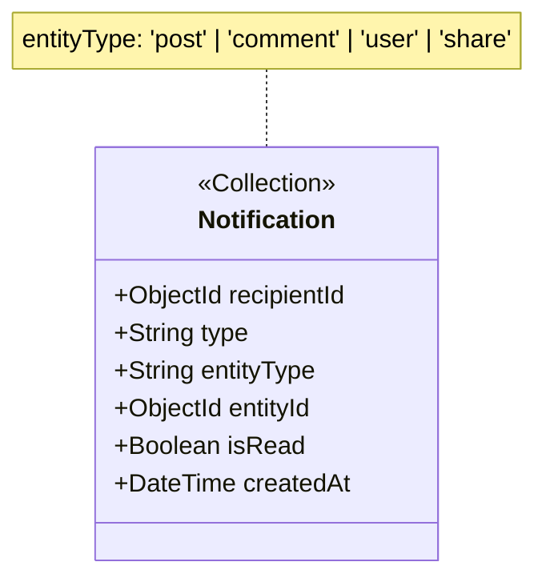

# MongoDB Design Patterns — Cho class-diagram-analyst

> Nguồn: MongoDB Design Patterns + PayloadCMS Architecture
> Mục đích: Nguyên tắc Aggregate Root / Embedded cho class-diagram-analyst
> Builder đọc file này để tạo `knowledge/mongodb-patterns.md`

---

## 1. Aggregate Root vs Embedded Document — Decision Tree

Khi gặp một entity từ ER Diagram, chạy decision tree này:

```
Entity từ ER Diagram
       │
       ▼
Q1: Nhiều Collection FK trỏ vào entity này không?
   │  (VD: nhiều bảng khác có field author_id, user_id trỏ về entity)
   ├─ CÓ  ──► [AGGREGATE ROOT]
   └─ KHÔNG
         │
         ▼
   Q2: Entity có Timestamps riêng (created_at, updated_at)?
       │
       ├─ CÓ  ──► [AGGREGATE ROOT]
       └─ KHÔNG
               │
               ▼
         Q3: Có query entity này độc lập (không qua parent)?
             │  (VD: "Lấy tất cả comments của user X" — độc lập với post)
             │
             ├─ CÓ  ──► [AGGREGATE ROOT]
             └─ KHÔNG
                     │
                     ▼
               Q4: Size có thể vượt 16MB giới hạn BSON khi nhúng?
                   │  (VD: array of comments trong Post — unbounded growth)
                   │
                   ├─ CÓ  ──► [AGGREGATE ROOT]
                   └─ KHÔNG ──► [EMBEDDED DOCUMENT]
```

### Áp dụng cho dự án KLTN

| Entity | Q1 | Q2 | Q3 | Q4 | Kết luận |
|--------|----|----|----|----|---------|
| `users` | ✅ (posts, comments, likes trỏ vào) | ✅ | ✅ | N/A | **Root** |
| `posts` | ✅ (comments, likes trỏ vào) | ✅ | ✅ | N/A | **Root** |
| `media` | ✅ (post_media, posts trỏ vào) | ✅ | ✅ | N/A | **Root** |
| `tags` | ✅ (post_tags trỏ vào) | ❌ | ✅ (query tags phổ biến) | N/A | **Root** |
| `post_tags` | ❌ | ❌ | ❌ (chỉ query qua post) | ❌ (bounded) | **Embedded** |
| `post_media` | ❌ | ❌ | ❌ (chỉ query qua post) | ❌ (bounded) | **Embedded** |
| `comments` | ✅ (user_id trỏ vào) | ✅ | ✅ | N/A | **Root** |
| `likes` | ❌ | ✅ | ✅ (query likes của user) | N/A | **Root** |
| `connections` | ❌ | ✅ | ✅ (query followers) | N/A | **Root** |
| `shares` | ❌ | ✅ | ✅ (query shares của user) | N/A | **Root** (provisional) |
| `bookmark_collections` | ❌ | ✅ | ✅ | N/A | **Root** |
| `bookmarks` | ❌ | ✅ | ✅ (query bookmarks của user) | N/A | **Root** |
| `notifications` | ❌ | ✅ | ✅ | N/A | **Root** |
| `reports` | ❌ | ✅ | ✅ | N/A | **Root** |
| `audit_logs` | ❌ | ✅ | ✅ | N/A | **Root** |

---

## 2. Pattern: Computed Pattern (Denormalized Counters)

### Vấn đề

Mỗi lần cần hiển thị "Post có 1,234 likes", nếu COUNT từ `likes` collection → query chậm. Với 100k posts, không thể COUNT real-time.

### Giải pháp: Denormalized Counter

Lưu counter ngay trong parent document, cập nhật khi có thay đổi.

```
Post {
  likesCount: 1234,      ← denormalized từ likes collection
  commentsCount: 567,    ← denormalized từ comments collection
  sharesCount: 89        ← denormalized từ shares collection
}
```

### Khi nào dùng

| Điều kiện | Dùng Computed Pattern |
|-----------|----------------------|
| Read nhiều hơn Write 10:1 | ✅ |
| Counter không cần exact real-time | ✅ |
| Counter thay đổi thường xuyên (likes) | ✅ |
| Cần hiển thị ngay không qua JOIN | ✅ |

### Entities trong KLTN dùng pattern này

| Entity | Counter Fields | Update trigger |
|--------|---------------|----------------|
| `posts` | `likesCount`, `commentsCount`, `sharesCount` | AfterChange hook trong likes/comments/shares |
| `users` | `followerCount`, `followingCount` | AfterChange hook trong connections |

### PayloadCMS implementation note

```typescript
// afterChange hook trong Likes collection
async function updatePostLikeCount(args) {
  const { doc, operation, req } = args;
  if (operation === 'create' || operation === 'delete') {
    await req.payload.update({
      collection: 'posts',
      id: doc.postId,
      data: {
        likesCount: await req.payload.count({
          collection: 'likes',
          where: { postId: { equals: doc.postId } }
        })
      }
    });
  }
}
```

### Trong YAML Contract

```yaml
- name: "likesCount"
  type: "number"
  required: false
  defaultValue: 0
  admin:
    readOnly: true
  pattern: "Computed Pattern — updated by Likes afterChange hook"
  source: "activity-diagrams/m4-a2-engagement-logic.md"
```

---

## 3. Pattern: Polymorphic Pattern

### Vấn đề

`notifications` cần tham chiếu đến nhiều loại entity khác nhau: post, comment, user (follow notification). `reports` cần target post, comment, user.

### Giải pháp: type + id fields

```
Notification {
  entityType: "post" | "comment" | "user" | "share",
  entityId: ObjectId,  // trỏ đến bảng tương ứng với entityType
  ...
}

Report {
  targetType: "post" | "comment" | "user",
  targetId: ObjectId,
  ...
}
```

### Khi nào dùng

| Điều kiện | Dùng Polymorphic Pattern |
|-----------|--------------------------|
| Cần tham chiếu đến nhiều collection khác nhau | ✅ |
| Runtime type resolution (biết type khi đọc) | ✅ |
| Không muốn tạo nhiều bảng junction | ✅ |

### Entities trong KLTN dùng pattern này

| Entity | Fields | Values |
|--------|--------|--------|
| `notifications` | `entity_type` + `entity_id` | `"post"`, `"comment"`, `"user"`, `"share"` |
| `reports` | `target_type` + `target_id` | `"post"`, `"comment"`, `"user"` |

### Trong class diagram



### Trong YAML Contract

```yaml
- name: "entityType"
  type: "select"
  required: true
  options: ["post", "comment", "user", "share"]
  source: "er-diagram.md#NOTIFICATIONS.entity_type"
  pattern: "Polymorphic Pattern"

- name: "entityId"
  type: "text"
  required: true
  source: "er-diagram.md#NOTIFICATIONS.entity_id"
  note: "ObjectId as text — polymorphic ref, no FK constraint"
```

---

## 4. Pattern: Unique Constraint Pattern

### Vấn đề

`likes` chỉ được tồn tại 1 like per (user, post). `connections` chỉ 1 connection per (follower, following).

### Giải pháp: Compound Unique Index

MongoDB compound index đảm bảo tổ hợp (fieldA, fieldB) là unique.

### Entities trong KLTN

| Entity | Unique Combination | Notes |
|--------|-------------------|-------|
| `likes` | `(post_id, user_id)` | Một user chỉ like 1 lần per post |
| `connections` | `(follower_id, following_id)` | Không follow 2 lần |
| `bookmarks` | `(user_id, post_id)` | Không bookmark 2 lần |

### Trong YAML Contract

```yaml
- name: "postId"
  type: "relationship"
  relationTo: "posts"
  required: true
  source: "er-diagram.md#LIKES.post_id"
  
compound_indexes:
  - fields: ["postId", "userId"]
    unique: true
    note: "Unique constraint — một user chỉ like 1 lần per post"
```

---

## 5. Pattern: Append-Only (Audit Log)

### Vấn đề

`audit_logs` chỉ INSERT, không bao giờ UPDATE hay DELETE.

### Giải pháp: Append-Only Collection

- Không có `updateAt` field (không update)
- Không expose Update/Delete API
- PayloadCMS access control: `update: () => false, delete: () => false`

### Trong YAML Contract

```yaml
- slug: "auditLogs"
  pattern: "Append-Only Pattern"
  access_control:
    create: ["system"]
    read: ["admin"]
    update: ["nobody"]
    delete: ["nobody"]
  note: "Immutable audit trail — no update or delete allowed"
```

---

## 6. Aggregate Root — PayloadCMS Mapping

| Pattern | PayloadCMS implementation |
|---------|--------------------------|
| **Aggregate Root** | Tạo Collection riêng (`CollectionConfig`) |
| **Embedded Document** | Dùng `group` hoặc `array` field trong parent |
| **Computed Counter** | `afterChange` hook cập nhật parent |
| **Polymorphic** | `select` field cho type + `text` field cho id |
| **Unique Compound** | Dùng MongoDB `unique index` hoặc hook validation |
| **Append-Only** | `access_control: { update: never, delete: never }` |
