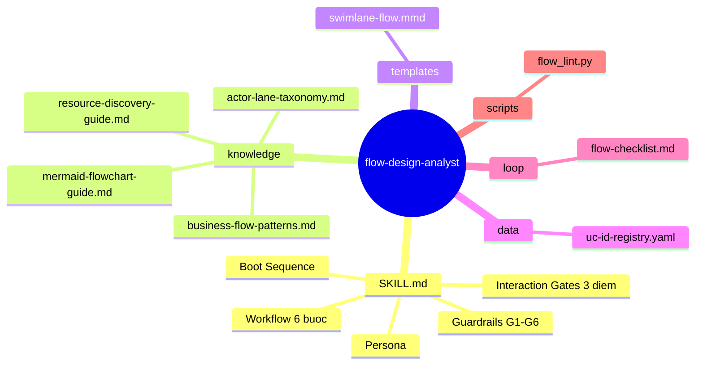
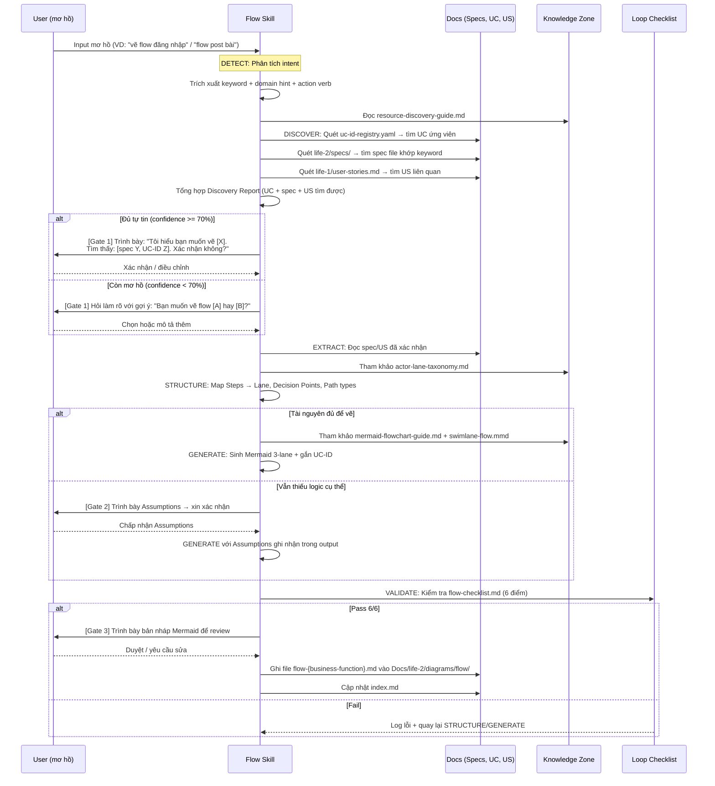

# flow-design-analyst — Architecture Design

> Generated by Skill Architect v2.0 | Date: 2026-02-20
> Status: 🟢 DESIGN COMPLETE — Ready for Skill Planner

---

## 1. Problem Statement

### 1.1. Pain Points

| # | Pain Point | Hệ quả nếu không giải quyết |
|---|-----------|------------------------------|
| P1 | Flow Diagram (checklist 2.4) chưa có nội dung đầy đủ — `flow-diagram.md` chỉ có vài ví dụ thô, **không bao quát modules M1–M6** | Life-2 không hoàn thành, AI Agent không có context để build website |
| P2 | Không có quy chuẩn thống nhất khi vẽ flow: mỗi module viết theo cảm hứng, thiếu Actor Swimlane, thiếu Decision Gate rõ ràng | AI Agent đọc vào không biết layer nào xử lý logic → sinh code sai kiến trúc |
| P3 | Sơ đồ luồng không gắn traceability về UC-ID / US-ID → không biết flow nào cover use case nào | Không thể verify coverage khi chuyển sang Life-3 |
| P4 | Khi spec chưa đủ (đang xây dựng), AI Agent dễ **bịa đặt business logic** không có trong tài liệu | Dự án đi sai quỹ đạo, mất chi phí sửa chữa cao |

### 1.2. User & Context

- **User**: Steve — sinh viên khóa luận, đang xây dựng hệ sinh thái Agent Skill để tự động hóa quy trình phát triển website.
- **Project**: Mạng xã hội chia sẻ kiến thức — 6 modules: M1 (Auth), M2 (Posts/Content), M3 (Feed), M4 (Engagement), M5 (Bookmarking), M6 (Notifications & Moderation).
- **Giai đoạn**: Life-2 (Phân tích & Thiết kế) — Cần hoàn thiện tài liệu để AI Agent sinh code ở Life-3.
- **Nguồn dữ liệu**: `Docs/life-2/specs/` (spec module), `Docs/life-1/01-vision/user-stories.md` (User Stories).
- **Mối quan hệ với skills khác**: Kế thừa từ `use-case` và `activity-diagram-design-analyst`; là input cho `sequence-design-analyst` và AI Agent build code.

### 1.3. Expected Outcomes

- Agent tự động vẽ **Business Process Flow với Swimlane 3 lanes** (User / System / DB) đúng chuẩn từ spec/user-story.
- Mọi Decision Node phải có **đầy đủ nhánh** (không dangling), mọi Action Node phải có **UC-ID**.
- Khi spec thiếu: kích hoạt **Assumption Mode** — liệt kê giả định thay vì tự bịa logic.
- Output: Markdown + Mermaid flowchart tại `Docs/life-2/diagrams/flow-diagram.md`.
- Đảm bảo **đồng nhất phong cách** với `activity-diagram-design-analyst` và `sequence-design-analyst`.

---

## 2. Capability Map

### 2.1. Tri Thức (Knowledge)

| # | Kiến thức cần có | Mức độ |
|---|-----------------|--------|
| K1 | Mermaid `flowchart TD/LR` syntax: nodes, edges, subgraph (swimlane), decision diamond, styling | ✅ Bắt buộc |
| K2 | Business Process Flow patterns: Happy Path, Alternative Path, Exception Path | ✅ Bắt buộc |
| K3 | Actor Lane Taxonomy: định nghĩa và rules phân chia trách nhiệm User / System / DB | ✅ Bắt buộc |
| K4 | Cách đọc spec và User Story: trích xuất Trigger, Steps, Conditions, Outcomes, Actors | ✅ Bắt buộc |
| K5 | Traceability convention: cách gắn UC-ID vào flow nodes, liên kết về use case diagram | ✅ Bắt buộc |
| K6 | Assumption notation: cách viết và trình bày giả định khi nguồn dữ liệu mơ hồ | 🟡 Conditional |
| K7 | **Resource Discovery**: cách trích xuất keyword từ input mơ hồ, map sang UC-ID/spec, xếc định độ tự tin (confidence) trước khi hỏi User | ✅ Bắt buộc |

### 2.2. Quy Trình (Process) — Detect → Discover → Extract → Structure → Generate → Validate

> **Nguyên tắc thiết kế cốt lõi**: Input người dùng thường **mơ hồ**. Skill PHẢI tự phân tích intent và tìm kiếm tài nguyên trước — KHÔNG hỏi người dùng câu hỏi mở.

```
Bước 0: DETECT      — Phân tích intent từ input mơ hồ:
                       Trích xuất keyword, domain hint, action verb
                       Tính Confidence Score (cao/thấp)

Bước 1: DISCOVER    — Tìm kiếm tài nguyên tự động:
                       Quét uc-id-registry.yaml → UC ứng viên
                       Quét Docs/life-2/specs/ → spec file khớp keyword
                       Quét Docs/life-1/user-stories.md → US liên quan
                       Tổng hợp Discovery Report

Bước 2: EXTRACT     — Đọc tài nguyên đã xác nhận, trích xuất:
                       Trigger, Actors, Steps, Conditions, Outcomes

Bước 3: STRUCTURE   — Phân bổ từng step vào đúng Actor Lane
                       Xác định Decision Points + Path types (Happy/Alt/Exception)

Bước 4: GENERATE    — Sinh Mermaid flowchart TD với swimlane 3 lanes + gắn UC-ID

Bước 5: VALIDATE    — Kiểm tra: no dangling branch, all paths terminate,
                       UC-ID mapped, Assumptions listed
```

### 2.3. Kiểm Soát (Guardrails)

| ID | Rule | Mô tả |
|----|------|---------|
| G1 | **No Blind Step** | Mọi Action Node PHẢI có căn cứ từ spec hoặc US. Không được tự thêm bước không có nguồn → phải ghi vào Assumptions. |
| G2 | **Decision Completeness** | Mọi Decision Diamond PHẢI có đủ tất cả nhánh output, có nhãn rõ ràng. Tuyệt đối không để nhánh hở (dangling). |
| G3 | **Lane Discipline** | Business logic → System lane. DB read/write → DB lane. UI trigger → User lane. Không được đặt sai lane. |
| G4 | **Path Termination** | Mọi nhánh trong flow PHẢI có điểm kết thúc: `([End])` hoặc endpoint rõ ràng. |
| G5 | **Assumption Required** | Khi spec chưa rõ logic, PHẢI khai báo `## Assumptions` dưới sơ đồ. Tuyệt đối không suy đoán ngầm. |
| G6 | **Discover Before Ask** | Skill PHẢI hoàn thành Discover (quét UC + spec + US) trước khi đưa ra bất kỳ câu hỏi nào cho User. Gate 1 PHẢI kèm Discovery Report — KHÔNG được hỏi câu mở. |

---

## 3. Zone Mapping

| Zone | Nội dung | Bắt buộc? |
|------|----------|-----------|
| **Core (SKILL.md)** | Persona: Senior BA Analyst, Boot Sequence, Workflow 6 bước (Detect→Discover→Extract→Structure→Generate→Validate), Interaction Gates, Guardrails G1–G6 | ✅ |
| **knowledge/** | `mermaid-flowchart-guide.md` — Syntax đầy đủ: flowchart TD/LR, subgraph/swimlane, decision diamond, node shapes, styling | ✅ |
| **knowledge/** | `business-flow-patterns.md` — 3 path patterns (Happy/Alternative/Exception) kèm ví dụ Mermaid đầy đủ | ✅ |
| **knowledge/** | `actor-lane-taxonomy.md` — Định nghĩa 3 lanes, rules phân chia, ví dụ đúng/sai, liên kết với kiến trúc backend | ✅ |
| **knowledge/** | `resource-discovery-guide.md` — Hướng dẫn phân tích intent mơ hồ, tìm kiếm tài nguyên trong Docs, keyword mapping strategy | ✅ |
| **templates/** | `swimlane-flow.mmd` — Khung flowchart 3-lane chuẩn với placeholder `%%ACTION%%`, `%%CONDITION%%`, `%%UC-ID%%` | ✅ |
| **data/** | `uc-id-registry.yaml` — Registry UC-ID + keyword aliases từ use case diagrams (`Docs/life-2/diagrams/UseCase/`) | ✅ |
| **loop/** | `flow-checklist.md` — 6 điểm kiểm tra: Lane Discipline, Decision Completeness, Path Termination, Traceability, Assumptions, Mermaid Syntax | ✅ |
| **scripts/** | `flow_lint.py` — Scan Mermaid code: phát hiện dangling node, missing label, unclosed bracket | 🟡 Optional |

---

## 4. Folder Structure



---

## 5. Execution Flow



---

## 6. Interaction Points

| # | Thời điểm | Skill làm gì trước? | Lý do dừng | Output cần từ User |
|---|-----------|---------------------|-----------|--------------------|
| **Gate 1** | Sau bước DISCOVER | Skill tự phân tích intent + quét Docs tìm UC/spec ứng viên. Trình bày Discovery Report | Xác nhận Skill hiểu đúng intent. Nếu còn mơ hồ → chọn 1 trong các gợi ý | "Đúng, vẽ [X]" hoặc "Không, ý tôi là [Y]" |
| **Gate 2** | Sau bước EXTRACT, khi spec thiếu logic | Skill liệt kê rõ phần nào thiếu + đề xuất Assumptions hợp lý | Không được tự bịa logic → phải có sự đồng ý từ User | Chấp nhận / bổ sung Assumptions |
| **Gate 3** | Sau bước GENERATE, trước khi ghi file | Skill tự validate 6-checklist + trình bày bản nháp Mermaid code | Để User review visual và business logic | "OK ghi file" hoặc "Sửa phần [X]" |

### Nguyên tắc Gate 1 — "Discover Before Ask"

> Skill PHẢI hoàn thành việc tìm kiếm tự động trước khi giao tiếp với User.
> Khi Gate 1 kích hoạt, Skill KHÔNG hỏi câu hỏi mở ("Bạn muốn vẽ gì?") mà trình bày **câu hỏi có gợi ý dựa trên kết quả Discover**:
>
> ✅ *"Tôi tìm thấy UC-M1-01 (Đăng ký) và UC-M1-02 (Đăng nhập) liên quan đến 'login'. Bạn muốn vẽ flow nào?"*
>
> ❌ *"Bạn muốn vẽ flow cho module nào?"*

---

## 7. Progressive Disclosure Plan

### Tầng 1: Bắt buộc đọc (Mandatory) — Đọc mỗi khi skill kích hoạt

| File | Lý do bắt buộc |
|------|---------------|
| `SKILL.md` | Persona, workflow chính, guardrails |
| `knowledge/mermaid-flowchart-guide.md` | Cú pháp Mermaid — không đọc sẽ sinh sai syntax |
| `loop/flow-checklist.md` | 6 điểm tự kiểm tra — đọc trước khi output |

### Tầng 2: Tự quyết định (Conditional) — Đọc khi đủ điều kiện

| File | Điều kiện đọc |
|------|--------------|
| `knowledge/business-flow-patterns.md` | Khi flow có > 2 nhánh alternative hoặc exception path |
| `knowledge/actor-lane-taxonomy.md` | Khi không chắc action nào thuộc lane nào |
| `data/uc-id-registry.yaml` | Khi cần gắn UC-ID vào node nhãn |
| `templates/swimlane-flow.mmd` | Khi bắt đầu tạo flowchart mới (dùng làm khung) |
| `scripts/flow_lint.py` | Khi diagram có trên 15 nodes |

---

## 8. Risks & Blind Spots

| # | Risk | Nguyên nhân | Mitigation |
|---|------|-------------|-----------|
| R1 | AI tự thêm business step không có trong spec | Spec chưa đầy đủ, AI "hoàn thiện" theo cảm hứng | Guardrail G1: No Blind Step + Assumption Mode bắt buộc |
| R2 | Decision node chỉ có 1 nhánh — flow logic sai | Quên xử lý exception / alternative | Guardrail G2: Decision Completeness + checklist điểm 2 |
| R3 | Nhầm lane: System logic đặt ở User lane | Chưa rõ kiến trúc Backend / Frontend split | Guardrail G3: Lane Discipline + `actor-lane-taxonomy.md` |
| R4 | Spec đang xây dựng → thiếu input → không vẽ được | Life-2 đang trong quá trình hoàn thiện | Gate 2: Assumption Mode, fallback về User Story |
| R5 | Flow quá phức tạp → Mermaid render lỗi | Module phức tạp nhiều nhánh (M3 Feed Ranking) | Rule: flow > 15 nodes → tách thành sub-flow riêng |
| R6 | Không đồng nhất style với activity/sequence skill | Mỗi skill dùng convention khác | `mermaid-flowchart-guide.md` thống nhất naming convention chung |

---

## 9. Open Questions

| # | Câu hỏi | Trạng thái |
|---|---------|-----------|
| Q1 | UC-ID registry hiện tại có file tập trung chưa? Hay Builder cần tổng hợp từ `Docs/life-2/diagrams/UseCase/`? | ✅ Đã xác nhận: tổng hợp từ UseCase directory |
| Q2 | Output: gộp hay tách file theo module? | ✅ **Đã chốt**: Tách file riêng, đặt tên theo **nghiệp vụ/chức năng** của flow |
| Q3 | Đồng nhất naming node với `activity-diagram-design-analyst`? | 🟡 Nên làm khi Build knowledge files |

### Quyết định Q2 — Output Naming Convention

**Rule**: Mỗi flow diagram là 1 file riêng, đặt tên mô tả chức năng/nghiệp vụ.

| Pattern | Ví dụ |
|---------|-------|
| `flow-{business-function}.md` | `flow-user-registration.md` |
| `flow-{business-function}.md` | `flow-post-creation.md` |
| `flow-{business-function}.md` | `flow-news-feed-ranking.md` |
| `flow-{business-function}.md` | `flow-bookmark-save.md` |

**Thư mục output**: `Docs/life-2/diagrams/flow/` (tạo subfolder riêng thay vì file đơn)

**Index file**: Skill phải tạo/cập nhật `Docs/life-2/diagrams/flow/index.md` liệt kê tất cả flow files và module tương ứng.

---

## 10. Metadata

- **Skill Name**: `flow-design-analyst`
- **Category**: Design Analysis Skills
- **Position in Ecosystem**: Use Case → Activity → **Flow (này)** → Sequence → Code
- **Output Convention**: Tách file riêng theo nghiệp vụ — `flow-{business-function}.md` tại `Docs/life-2/diagrams/flow/`
- **Created**: 2026-02-19
- **Redesigned**: 2026-02-20
- **Author**: Skill Architect v2.0 (Phases 1–3 confirmed by Steve)
- **Framework**: architect.md v2.0 (3 Pillars / 7 Zones)
- **Status**: 🟢 DESIGN COMPLETE — All Open Questions Resolved
- **Next Step**: Chạy `skill-planner` để sinh `todo.md` → `skill-builder` để build skill package
