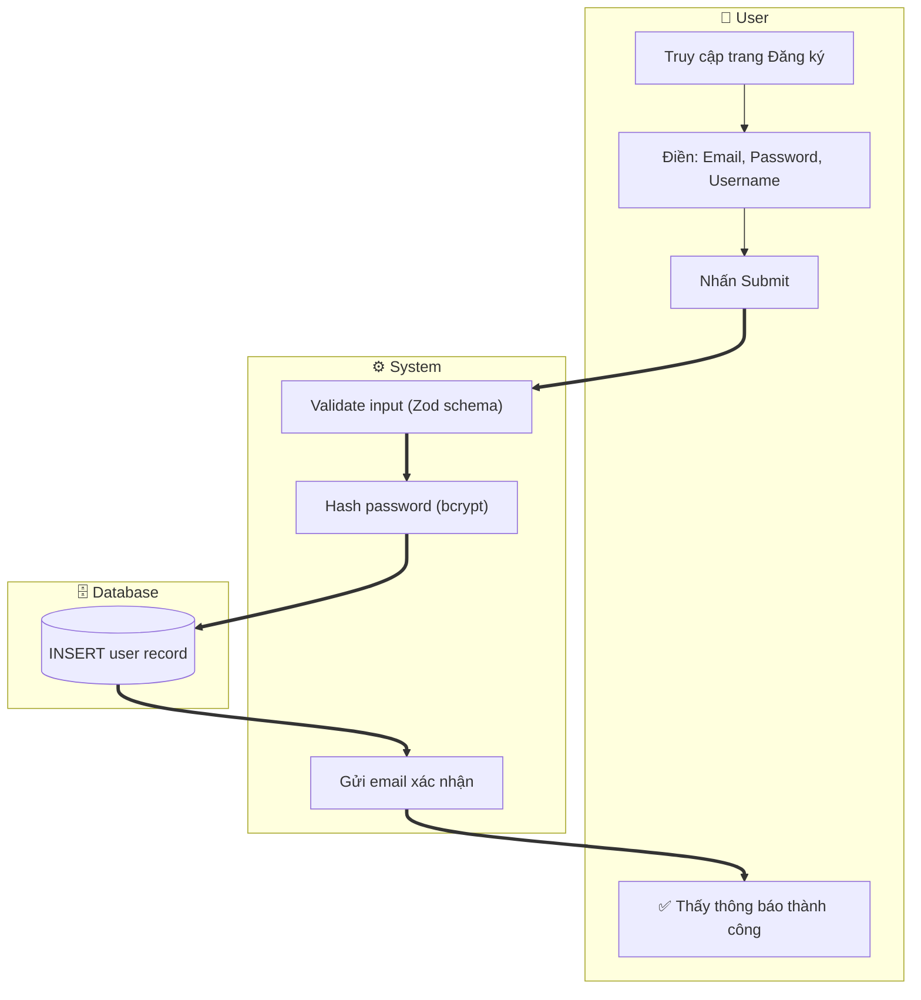
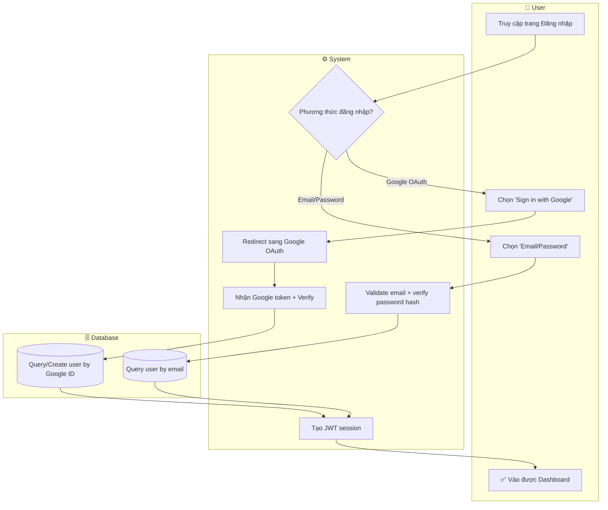

# Business Flow Patterns — 3 Path Types

> **Source**: Verified từ modernanalyst.com, wikipedia.org, processmaker.com, zeplin.io
> **Purpose**: Cung cấp domain knowledge để Builder viết `knowledge/business-flow-patterns.md`

---

## 1. Happy Path — Luồng Lý tưởng

### 1.1 Định nghĩa

**Happy Path** (còn gọi là "Golden Path" hoặc "Main Scenario") là luồng **lý tưởng, không có lỗi**, thể hiện chuỗi thao tác thành công ngắn nhất từ Trigger đến mục tiêu.

**Đặc điểm:**
- Linear flow — ít hoặc không có decision node
- Optimistic — giả định mọi input hợp lệ, mọi service phản hồi đúng
- Thể hiện **giá trị cốt lõi** của Use Case
- BA luôn phân tích happy path **trước** khi xét alternative/exception

**Dấu hiệu nhận biết trong spec/US:**
- "successfully", "returns", "is valid", "completes", "confirmed"
- Numbered list không có điều kiện rẽ nhánh

**Mermaid convention:** Dùng solid arrow `-->`. Có thể dùng `==>` để nhấn mạnh main flow.

### 1.2 Ví dụ — UC01: Đăng ký tài khoản (Happy Path only)



---

## 2. Alternative Path — Luồng Hợp lệ Thay thế

### 2.1 Định nghĩa

**Alternative Path** (còn gọi là "Extension Path") là luồng **hợp lệ**, vẫn đạt mục tiêu thành công, nhưng **lệch khỏi Happy Path** do lựa chọn của user hoặc điều kiện nghiệp vụ.

**Đặc điểm:**
- VẪN kết thúc thành công (phân biệt với Exception Path)
- Thường do: user choice (email vs Google), business rule divergence, feature flag
- Một process có thể có **nhiều Alternative Paths**
- Có thể hội tụ về điểm chung (merge) hoặc có endpoint riêng biệt

**Dấu hiệu nhận biết trong spec/US:**
- "alternatively", "if the user prefers", "in case of", "another option is"
- Acceptance Criteria có nhiều nhánh đều dẫn đến success

**Mermaid convention:** Decision diamond `{}` → mỗi nhánh đều kết thúc thành công.

### 2.2 Ví dụ — UC02/UC03: Đăng nhập (Email vs Google)



---

## 3. Exception Path — Luồng Lỗi

### 3.1 Định nghĩa

**Exception Path** (còn gọi là "Unhappy Path", "Sad Path", "Error Flow") xảy ra khi **lỗi, validation fail, timeout, hoặc điều kiện ngoài mong đợi** xuất hiện. Kết quả: **KHÔNG đạt mục tiêu ban đầu**.

**Đặc điểm:**
- Không thành công — user cần retry hoặc liên hệ support
- Hệ thống phải xử lý **gracefully**: hiển thị thông báo lỗi rõ ràng, không crash
- Phân loại exception phổ biến:
  - **Validation Error** (4xx): Input sai → thông báo lỗi cụ thể
  - **Business Rule Error** (4xx): Email đã tồn tại, không đủ quyền
  - **System/Infrastructure Error** (5xx): DB down, timeout, external API lỗi

**Dấu hiệu nhận biết trong spec:**
- "fails", "invalid", "error", "timeout", "not found", "unauthorized", "forbidden"
- Postcondition: "System displays error message"

**Mermaid convention:** Decision diamond → nhánh lỗi dùng dotted `-.->` hoặc label "Fail"/"Error". Kết thúc bằng `[("Error End")]` hoặc redirect về step đầu.

### 3.2 Ví dụ — UC01 Exception: Email đã tồn tại

```mermaid
flowchart TD
  subgraph User ["👤 User"]
    U1["Submit form đăng ký"]
    U2a["✅ Đăng ký thành công"]
    U2b["❌ Thấy lỗi: Email đã tồn tại"]
    U2c["❌ Thấy lỗi: Server không phản hồi"]
  end
  subgraph System ["⚙️ System"]
    S1["Nhận POST /api/users/register"]
    S2["Validate schema (Zod)"]
    S3{"Schema hợp lệ?"}
    S4{"Email đã tồn tại?"}
    S5["Hash password + Tạo user"]
    S6["Trả 400: Validation Error"]
    S7["Trả 409: Conflict — Email exists"]
    S8["Trả 201: Created"]
    S9["Catch: Trả 500: Internal Error"]
  end
  subgraph DB ["🗄️ Database"]
    D1[("SELECT * FROM users WHERE email=?")]
    D2[("INSERT INTO users")]
  end

  U1 --> S1 --> S2 --> S3
  S3 -- "Invalid (format sai)" -.-> S6 -.-> U2b
  S3 -- "Valid" --> S4 --> D1
  D1 -- "Chưa tồn tại" --> S5 --> D2 --> S8 --> U2a
  D1 -- "Đã tồn tại" -.-> S7 -.-> U2b
  S1 -.-> S9 -.-> U2c
  %% UC01 Exception Paths
```

---

## 4. Combined — Kết hợp 3 Patterns trong 1 Flow

### 4.1 Khi nào kết hợp?

Hầu hết business flow thực tế đều có cả 3 types:
- **Happy Path**: luồng chính (1 luồng)
- **Alternative Path**: biến thể hợp lệ (0-N luồng)
- **Exception Path**: xử lý lỗi (N luồng theo severity)

**Quy tắc thiết kế:**
1. Vẽ Happy Path trước → đặt các step thẳng từ trên xuống
2. Thêm Alternative Path → rẽ nhánh từ Decision node, hội tụ lại cuối
3. Thêm Exception Path → rẽ nhánh từ Decision node, kết thúc tại Error endpoint

### 4.2 Ví dụ kết hợp — UC19: Lưu/Bỏ lưu bài viết (M5)

```mermaid
flowchart TD
  subgraph User ["👤 User"]
    U1["Nhấn icon Bookmark trên bài viết"]
    U2a["✅ Icon đổi trạng thái: Đã lưu"]
    U2b["✅ Icon đổi trạng thái: Đã bỏ lưu"]
    U2c["❌ Toast: Vui lòng đăng nhập"]
    U2d["❌ Toast: Lỗi server"]
  end
  subgraph System ["⚙️ System"]
    S1["Nhận request: POST /api/bookmarks/:postId"]
    S2{"JWT hợp lệ?"}
    S3{"Bài viết đã bookmark?"}
    S4["INSERT bookmark"]
    S5["DELETE bookmark"]
    S6["Trả 401 Unauthorized"]
    S7["Trả 201 bookmark created"]
    S8["Trả 200 bookmark removed"]
    S9["Catch: Trả 500"]
  end
  subgraph DB ["🗄️ Database"]
    D1[("Verify JWT / Query users")]
    D2[("Query bookmarks collection")]
    D3[("Insert bookmark record")]
    D4[("Delete bookmark record")]
  end

  U1 --> S1

  %% Exception: Unauthorized
  S1 --> S2 --> D1
  D1 -- "Token invalid" -.-> S6 -.-> U2c

  %% Happy Path: Add bookmark
  D1 -- "Token valid" --> S3 --> D2
  D2 -- "Chưa bookmark" --> S4 --> D3 --> S7 --> U2a

  %% Alternative Path: Remove bookmark
  D2 -- "Đã bookmark" --> S5 --> D4 --> S8 --> U2b

  %% Exception: Server error
  S4 -.-> S9
  S5 -.-> S9
  S9 -.-> U2d

  %% UC19: Lưu/Bỏ lưu bài viết — M5 Bookmarking
```

---

## 5. Pattern Cheat Sheet — Nhận biết nhanh trong spec

| Pattern | Trigger words trong spec | Kết thúc | Mermaid arrow |
|---------|--------------------------|----------|---------------|
| Happy Path | "successfully", "returns", "valid", "completes" | ✅ Success endpoint | `-->` hoặc `==>` |
| Alternative Path | "alternatively", "or", "if user prefers", "either" | ✅ Success endpoint (khác Happy) | `-->` từ Decision |
| Exception Path | "fails", "invalid", "error", "timeout", "not found" | ❌ Error endpoint | `-.->` từ Decision |
