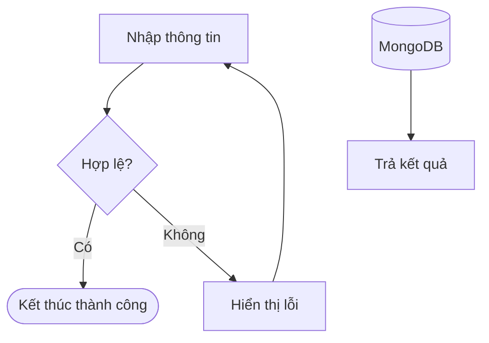
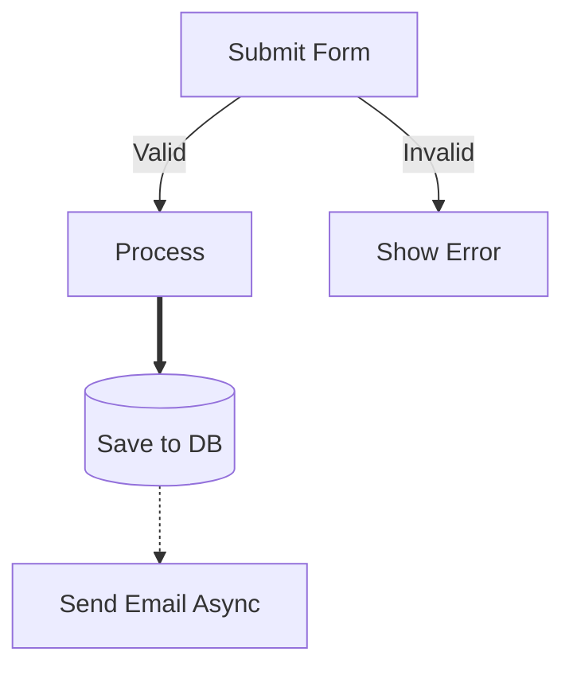
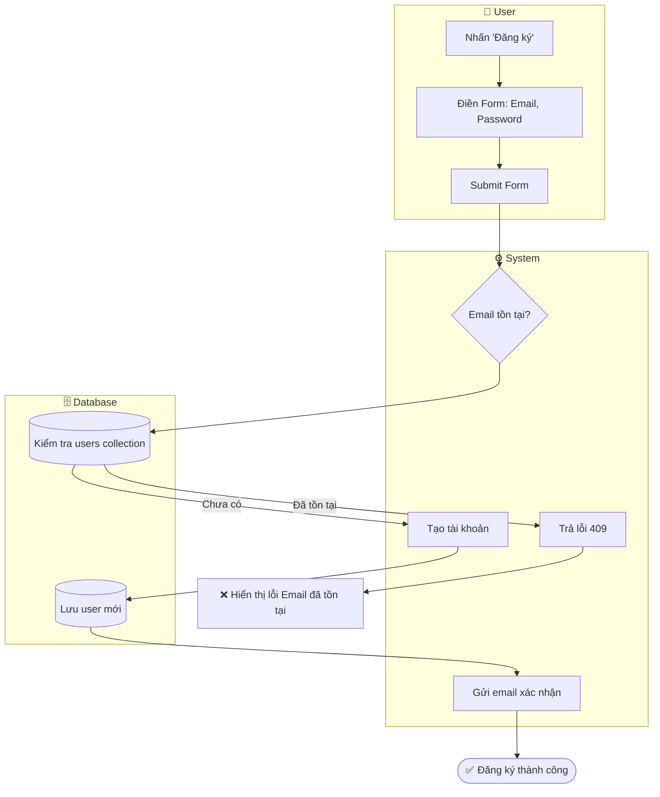
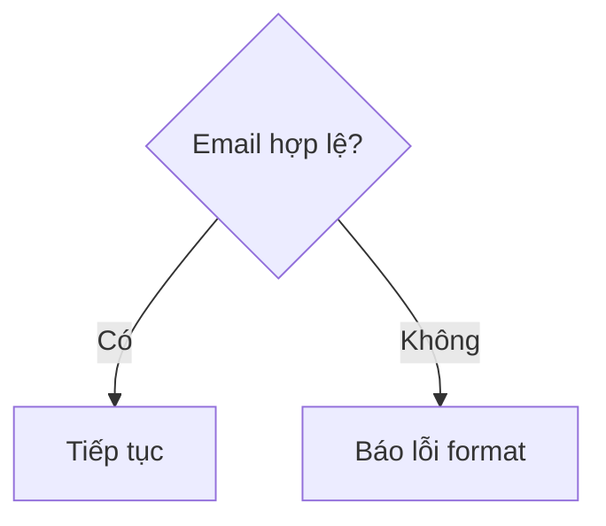
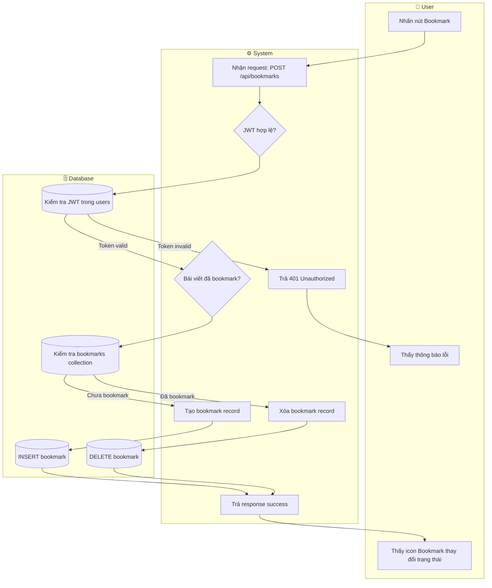

# Mermaid Flowchart Reference — Complete Syntax Guide

> **Source**: Verified từ mermaid.js.org, StackOverflow, activity-uml-rules.md §6
> **Purpose**: Cung cấp dữ liệu đầy đủ để Builder viết `knowledge/mermaid-flowchart-guide.md`

---

## 1. Node Shapes — Bảng đầy đủ

| Shape | Syntax | Dùng cho | Ghi chú |
|-------|--------|----------|---------|
| Rectangle (default) | `id["Text"]` | Action / Process step | Shape phổ biến nhất |
| Rounded edges | `id("Text")` | Trigger / Start event | Cũng dùng cho sub-process nhỏ |
| Stadium | `id(["Text"])` | Terminal: Start hoặc End | Ưu tiên dùng cho endpoint rõ |
| Subroutine | `id[["Text"]]` | Sub-process / Call activity | Hiếm dùng trong swimlane |
| Cylinder (Database) | `id[("Text")]` | Database node | Dùng trong DB Lane |
| Circle | `id(("Text"))` | Connector / Junction | Dùng nối qua trang |
| Rhombus (Decision) | `id{"Text"}` | Decision gate | Bắt buộc ≥ 2 nhánh có label |
| Hexagon | `id{{"Text"}}` | Preparation step | Ít dùng trong flowchart 3-lane |
| Parallelogram | `id[/"Text"/]` | Input / Output action | Dùng khi muốn nhấn mạnh I/O |
| Parallelogram Alt | `id[\"Text"\]` | Output ngược chiều | Hiếm dùng |
| Trapezoid | `id[/"Text"\]` | Manual operation | Dùng cho bước thủ công |

**Ví dụ code:**



---

## 2. Edge Types — Tất cả kiểu mũi tên

| Syntax | Tên | Dùng cho |
|--------|-----|----------|
| `A --> B` | Arrow đơn | Luồng thông thường (phổ biến nhất) |
| `A --- B` | Open link | Không có chiều, liên kết đơn giản |
| `A -- "Text" --> B` | Arrow có label | Nhánh có điều kiện ("Yes", "No", "Success") |
| `A -. "Text" .-> B` | Dotted + label | Luồng conditional, async, optional |
| `A -.-> B` | Dotted không label | Dependency ngầm, trigger gián tiếp |
| `A ==> B` | Thick arrow | Nhấn mạnh Happy Path chính |
| `A === "Text" ==> B` | Thick + label | Thick arrow có nhãn |
| `A ---o B` | Circle ending | Optional dependency |
| `A ---x B` | Cross ending | Blocked / Forbidden path |

**Ví dụ phân biệt:**



---

## 3. Subgraph — Swimlane Syntax (3-Lane)

Cú pháp chuẩn cho swimlane 3-lane (User / System / DB):

```
flowchart TD
  subgraph User ["👤 User"]
    direction TB
    ...nodes...
  end
  subgraph System ["⚙️ System"]
    direction TB
    ...nodes...
  end
  subgraph DB ["🗄️ Database"]
    direction TB
    ...nodes...
  end
```

**Các quy tắc subgraph quan trọng:**

1. **Label có dấu cách → BẮT BUỘC `""`**: `subgraph User ["👤 User"]` ✅ | `subgraph User [👤 User]` ❌ (render lỗi)
2. **`direction TB`** bên trong subgraph để control chiều riêng từng lane — không để mặc định.
3. **Keyword `end`** là reserved word — nếu dùng làm tên node: `id["end"]` ✅ | `id[end]` ❌ (parse lỗi)
4. **Lồng subgraph**: Có thể lồng nhưng khó control style — hạn chế dùng trong 3-lane pattern.

**Ví dụ subgraph hoàn chỉnh:**



---

## 4. Safe Label Rules — Quy tắc bắt buộc

> **Nguồn**: activity-uml-rules.md §6 (tuân thủ đồng nhất với activity-diagram-design-analyst)

### 4.1 Label Quoting (Bọc nhãn)

**BẮT BUỘC dùng `""` khi label chứa bất kỳ ký tự nào sau:**

| Ký tự nguy hiểm | Ví dụ label | Cách viết đúng |
|-----------------|-------------|----------------|
| `( )` ngoặc tròn | `Check (Status)?` | `"Check (Status)?"` |
| `{ }` ngoặc nhọn | `{Validation}` | `"{Validation}"` |
| `[ ]` ngoặc vuông | `[Array]` | `"[Array]"` |
| `:` dấu hai chấm | `Error: 404` | `"Error: 404"` |
| `/` dấu gạch chéo | `Read/Write` | `"Read/Write"` |
| `#` dấu thăng | `#status` | `"#status"` hoặc `#35;status` |
| Whitespace (khoảng trắng) | `My Action` | `"My Action"` |
| `&` dấu và | `A & B` | `"A & B"` |
| `?` dấu hỏi | `Valid?` | `"Valid?"` |

**Quy tắc vàng**: Luôn dùng `""` cho MỌI label dài hơn 1 từ.

```
✅ ĐÚNG: id{"Email đã tồn tại?"}
✅ ĐÚNG: id["Gửi email xác nhận (async)"]
❌ SAI:  id{Email đã tồn tại?}   → Parse error
❌ SAI:  id[Gửi email xác nhận (async)]  → Parse error
```

### 4.2 Line Breaks (Xuống dòng)

```
✅ ĐÚNG: id["Dòng 1<br/>Dòng 2"]
❌ SAI:  id["Dòng 1\nDòng 2"]   → \n không render trong Mermaid
```

### 4.3 Node ID Constraints

- **Chỉ dùng:** chữ cái (`a-z`, `A-Z`), số (`0-9`), dấu gạch dưới (`_`)
- **Không dùng trong ID:** `()`, `{}`, `[]`, `-`, spaces, ký tự đặc biệt
- **Convention KLTN**: Dùng prefix theo lane: `U_` (User), `S_` (System), `D_` (DB)

```
✅ ĐÚNG: U1, S_validate, DB_save, user_action_1
❌ SAI:  user-action, node(1), check&save
```

### 4.4 Cảnh báo đặc biệt

- Chữ `o` hoặc `x` đầu node trong connecting edge → Mermaid có thể parse nhầm thành `--o` hay `--x` arrow. **Workaround:** Thêm space hoặc wrap trong `""`.
- Từ `end` là reserved keyword — nếu cần dùng làm tên node, bắt buộc wrap: `id["end"]`.

---

## 5. Decision Node Rules — Quy tắc Diamond

**MỌI `{}` Decision Diamond PHẢI có:**
1. Tối thiểu 2 nhánh output
2. Mỗi nhánh có label rõ ràng ("Yes"/"No", "Có"/"Không", "Success"/"Fail")
3. Mọi nhánh có điểm kết thúc (không được để dangling)



**Các tình huống Decision Node phổ biến:**

| Situation | Nhánh 1 | Nhánh 2 | Ghi chú |
|-----------|---------|---------|---------|
| Validation | `"Hợp lệ"` | `"Không hợp lệ"` | |
| Auth Check | `"Đã đăng nhập"` | `"Chưa đăng nhập"` | |
| DB Query | `"Tìm thấy"` | `"Không tìm thấy"` | |
| API Response | `"200 OK"` | `"4xx/5xx Error"` | |
| Toggle | `"Đã bookmark"` | `"Chưa bookmark"` | Dùng cho UC19 |

---

## 6. Complete 3-Lane Example — Verified

Ví dụ đầy đủ: **Flow UC19 — Lưu/Bỏ lưu bài viết (KLTN)**


