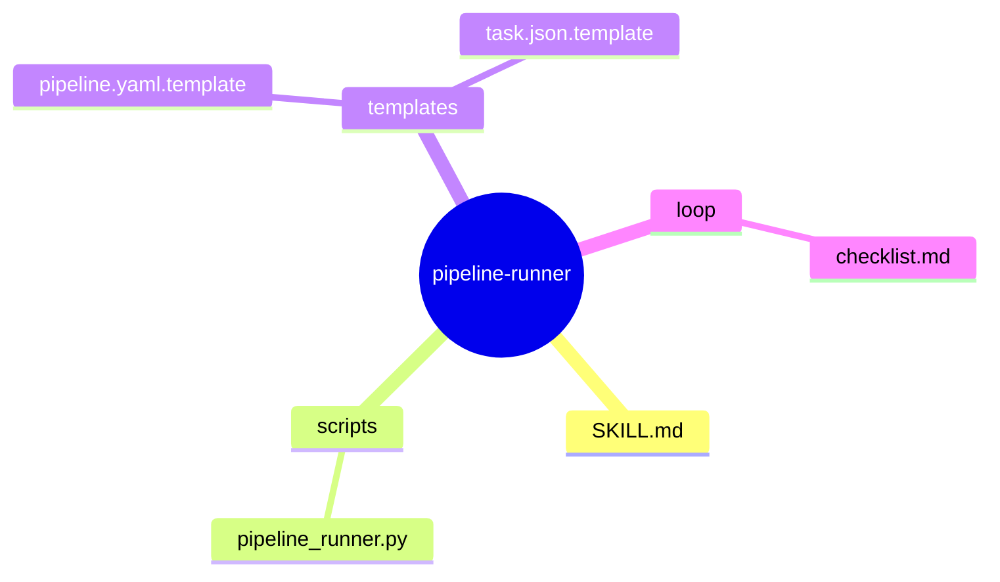
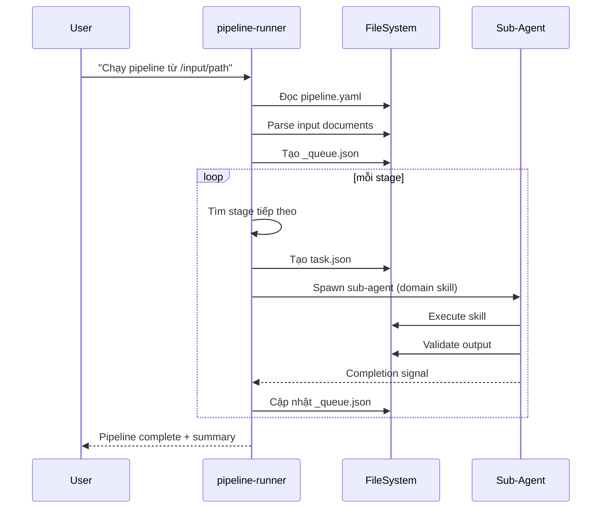

# pipeline-runner — Orchestrator Skill

## §1. Problem Statement

**Pain Point**: Hiện tại, các domain skills (flow, sequence, class, etc.) chạy độc lập, không có cơ chế tự động kích hoạt skill tiếp theo. Người dùng phải prompt thủ công từng skill.

**User & Context**:
- Người dùng muốn: "Chạy pipeline UML cho dự án X từ tài liệu trong /path"
- Hệ thống sẽ tự động: đọc input → chạy các skills tuần tự → xuất output

**Expected Output**:
- Tự động execute toàn pipeline
- Validated outputs cho mỗi stage
- Final summary report

---

## §2. Capability Map

### Pillar 1 — Knowledge
- Pipeline configuration (pipeline.yaml)
- Runtime state management (_queue.json)
- Sub-agent execution (Claude Code Task tool)
- File system operations

### Pillar 2 — Process
1. **Init Phase**: Parse input, load pipeline.yaml
2. **Loop Phase**: Find next stage → Execute → Validate → Update queue
3. **Complete Phase**: Generate summary

### Pillar 3 — Guardrails
- Validation bắt buộc sau mỗi stage
- Error handling với retry logic
- Source citation enforcement

---

## §3. Zone Mapping

| Zone | Files cần tạo | Nội dung | Bắt buộc? |
|------|--------------|----------|----------|
| Core | `SKILL.md` | Persona, workflow, guardrails | ✅ |
| Knowledge | N/A | Không cần thêm knowledge | ❌ |
| Scripts | `scripts/pipeline_runner.py` | Core execution logic | ✅ |
| Templates | `templates/pipeline.yaml.template` | Pipeline config template | ✅ |
| Templates | `templates/task.json.template` | Task spec template | ✅ |
| Data | N/A | Runtime trong _queue.json | ❌ |
| Loop | `loop/checklist.md` | Quality gate checklist | ✅ |

---

## §4. Folder Structure

---

## §5. Execution Flow

---

## §6. Interaction Points

| Khi nào | Hành động |
|----------|------------|
| Pipeline bắt đầu | Thông báo "Đã khởi động pipeline: {name}" |
| Mỗi stage complete | Thông báo "Stage {id} hoàn thành" |
| Validation fail | Dừng + Báo lỗi chi tiết |
| Pipeline complete | Xuất summary + output paths |

---

## §7. Progressive Disclosure Plan

### Tier 1 (Mandatory - mỗi lần chạy)
- Đọc pipeline.yaml
- Đọc _queue.json (nếu resume)
- Đọc SKILL.md của skill cần chạy

### Tier 2 (Conditional)
- Đọc validation scripts của từng domain skill
- Đọc handoff notes từ stages trước

---

## §8. Risks & Blind Spots

| Risk | Mitigation |
|------|------------|
| Skill không được kích hoạt | Pre-check: verify skill tồn tại trước khi spawn |
| Validation fail bị ignore | Enforcement: Không advance nếu validation != 0 |
| Context overflow | Sub-agent isolation: mỗi skill chạy trong context riêng |
| Resume không đúng | Checkpoint: Lưu state sau mỗi stage |

---

## §9. Open Questions

- [ ] Cần tạo custom prompt cho user call pipeline
- [ ] Cần xác định default pipeline template cho UML generation

---

## §10. Metadata

| Field | Value |
|-------|-------|
| skill-name | pipeline-runner |
| date | 2026-03-01 |
| author | Claude |
| status | DESIGN_COMPLETE |
