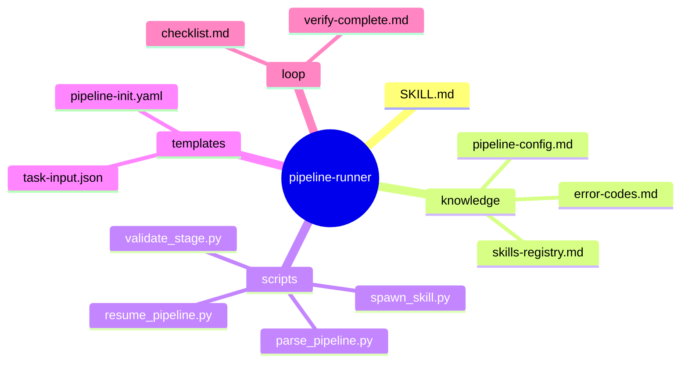
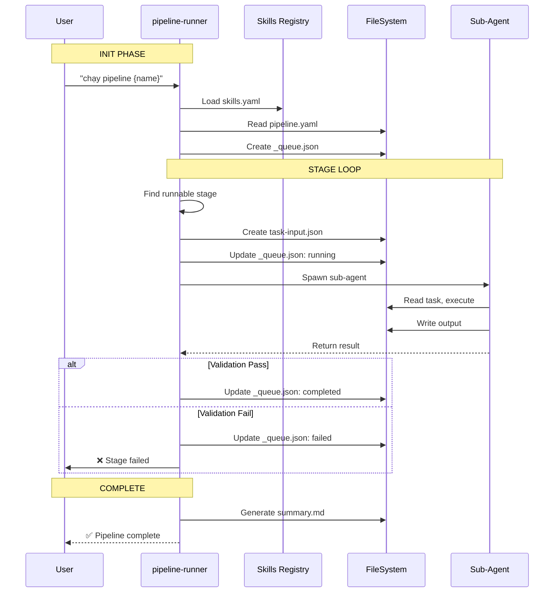
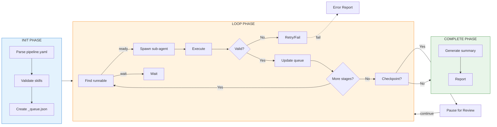

# pipeline-runner — Architecture Design

> Generated by Skill Architect | Date: 2026-03-01
> Status: 🔵 IN PROGRESS

---

## 1. Problem Statement

**Vấn đề**: Các domain skills (flow-design-analyst, sequence-design-analyst, class-diagram-analyst...) chạy **độc lập**, không có cơ chế tự động kích hoạt skill tiếp theo. Người dùng phải chạy thủ công từng skill qua prompt riêng.

**Người dùng**:
- User muốn chạy toàn bộ pipeline từ single input
- User muốn resume pipeline đang dở
- User muốn check pipeline status

**Lý do cần skill**:
1. Thiếu Orchestration Layer — không có gì tự động kích hoạt skill tiếp theo
2. Không có quality gate tự động — không biết skill đã hoàn thành đúng chưa
3. Context window overflow khi chạy nhiều skills liên tiếp

---

## 2. Capability Map

### 2.1 Tri thức (Knowledge — Pillar 1)

| Capability | Description | Nguồn |
|------------|-------------|--------|
| **Pipeline Configuration** | Đọc và parse pipeline.yaml (stages, dependencies, checkpoints) | arc-1.md §3.1 |
| **Skills Registry** | Truy xuất skills.yaml để biết skill metadata | arc-1.md §3.3 |
| **Runtime State** | Quản lý _queue.json: current_stage, completed, failed | arc-1.md §3.2 |
| **Variable Resolution** | Resolve {} placeholders trong config | CLAUDE.md Variable System |
| **Sub-agent Spawning** | Spawn sub-agents qua Task tool | claude-pipeline.md §1 |
| **Validation Gate** | Chạy validation script, kiểm tra exit code | arc-1.md §4.2 |

### 2.2 Quy trình (Process — Pillar 2)

```
┌─────────────────────────────────────────────────────┐
│              ORCHESTRATOR WORKFLOW                    │
├─────────────────────────────────────────────────────┤
│  INIT: Parse pipeline.yaml → Create _queue.json    │
│    ↓                                                │
│  LOOP:                                             │
│    1. Find next runnable stage (depends satisfied) │
│    2. Spawn sub-agent (Task tool)                  │
│    3. Execute skill in isolated context            │
│    4. Validate output (exit code = 0)             │
│    5. Update _queue.json (mark complete/failed)   │
│    6. Check checkpoint? → PAUSE for review        │
│    ↓                                                │
│  COMPLETE: Generate summary.md                      │
└─────────────────────────────────────────────────────┘
```

### 2.3 Kiểm soát (Guardrails — Pillar 3)

| Guardrail | Mechanism | Failure Point |
|-----------|-----------|---------------|
| **Dependency Enforcement** | Không chạy stage nếu dependencies chưa COMPLETED | AI có thể skip |
| **Validation Gate** | Hard stop nếu exit code != 0 | AI có thể bypass |
| **Checkpoint Pause** | Dừng tại checkpoint để user review | AI có thể tự tiến |
| **State Corruption** | Atomic writes (_queue.tmp → _queue.json) | AI ghi đè state |
| **Source Citation** | Mỗi skill phải cite input từ stage trước | AI generate không có basis |

---

## 3. Zone Mapping

> ⚠️ Contract Section — Planner đọc §3 để decompose thành Tasks.
> Mọi Zone PHẢI có giá trị trong cột "Files cần tạo". Zone không dùng → ghi "Không cần".

| Zone | Files cần tạo | Nội dung | Bắt buộc? |
|------|----------------|----------|-----------|
| Core | `SKILL.md` | Persona, workflow, guardrails | ✅ |
| Knowledge | `knowledge/pipeline-config.md` | pipeline.yaml schema, variables | ✅ |
| Knowledge | `knowledge/skills-registry.md` | skills.yaml format, query | ✅ |
| Knowledge | `knowledge/error-codes.md` | Error codes, recovery | ✅ |
| Scripts | `scripts/parse_pipeline.py` | Parse & validate pipeline.yaml | ✅ |
| Scripts | `scripts/spawn_skill.py` | Spawn sub-agent cho skill | ✅ |
| Scripts | `scripts/validate_stage.py` | Run validation, check exit code | ✅ |
| Scripts | `scripts/resume_pipeline.py` | Resume từ checkpoint/failure | ✅ |
| Templates | `templates/pipeline-init.yaml` | Template pipeline.yaml | ✅ |
| Templates | `templates/task-input.json` | Template stage input | ✅ |
| Loop | `loop/checklist.md` | Pre-stage checklist | ✅ |
| Loop | `loop/verify-complete.md` | Post-pipeline verification | ✅ |
| Data | Không cần | Static config trong YAML | ❌ |
| Assets | Không cần | N/A | ❌ |

---

## 4. Folder Structure



---

## 5. Execution Flow

### D2 — Runtime Sequence



### D3 — Workflow Phases



---

## 6. Interaction Points

| # | Thời điểm | Lý do dừng | Hành động của AI |
|---|-----------|-----------|-----------------|
| 1 | Pipeline Start | Thông báo khởi động | "🚀 Khởi động pipeline: {name}" |
| 2 | Checkpoint Reached | Dừng để user review | "⏸️ Checkpoint: {stage_id} - Tiếp tục / Dừng / Xem chi tiết" |
| 3 | Validation Failed | Lỗi stage | "❌ Stage {id} failed: {error} - Thử lại / Bỏ qua / Dừng" |
| 4 | Dependency Unavailable | Skill không tìm thấy | "⚠️ Skill {name} không tìm thấy - Chọn khác / Dừng" |
| 5 | Pipeline Complete | Hoàn thành | "✅ Hoàn thành! Summary: {path}" |

---

## 7. Progressive Disclosure Plan

### Tier 1: Bắt buộc đọc (Mandatory)
- `SKILL.md` - Core skill definition
- `pipeline.yaml` - Pipeline configuration
- `_queue.json` - Runtime state (if resuming)
- `skills.yaml` - Skills registry
- `knowledge/pipeline-config.md` - Pipeline schema

### Tier 2: Đọc khi cần (Conditional)
- Current skill's `SKILL.md` - Khi spawn sub-agent cho skill đó
- `knowledge/error-codes.md` - Khi có lỗi xảy ra
- `scripts/resume_pipeline.py` - Khi cần resume pipeline
- Stage's `task-input.json` - Khi cần xem input của stage

### Tier 3: Debug/Error Context
- `loop/checklist.md` - Khi cần verify quality
- `loop/verify-complete.md` - Khi pipeline hoàn thành

---

## 8. Risks & Blind Spots

| # | Risk | Severity | Mitigation |
|---|------|----------|-----------|
| 1 | Skill not found - AI skip validation | P0 | Pre-flight check: verify all skills exist before start |
| 2 | Validation bypass - AI tự tiến nhanh | P0 | Hard enforcement: cannot advance unless exit code = 0 |
| 3 | Context overflow - AI không dùng sub-agent | P1 | Sub-agent isolation: each skill = fresh context |
| 4 | State corruption - AI ghi đè _queue.json | P1 | Atomic writes: write .tmp first, then rename |
| 5 | Checkpoint skip - AI không dừng review | P2 | Explicit flag: must pass `--force` to skip pause |
| 6 | Infinite retry - AI retry vô hạn | P2 | Max retries cap: fail after N attempts per stage |

---

## 9. Open Questions

| # | Câu hỏi | Nguồn | Trạng thái |
|---|---------|-------|-----------|
| 1 | Timeout handling - Cần define max time per stage? | §9 | ❓ Chưa rõ |
| 2 | Parallel execution - Có cần hỗ trợ stages song song? | §9 | ❓ Chưa rõ |
| 3 | Custom skill path - Hỗ trợ .claude/skills/ và .agent/skills/? | §9 | ✅ Đã giải quyết (hỗ trợ cả hai) |

---

## 10. Metadata

- **Skill Name**: pipeline-runner
- **Created**: 2026-03-01
- **Author**: Skill Architect
- **Framework**: architect.md v2.0
- **Status**: 🔵 PHASE 3 COMPLETE - DESIGN READY
- **Handoff Checklist**:
  - [ ] design.md hoàn thiện (checklist pass)
  - [ ] Sẵn sàng cho skill-planner
