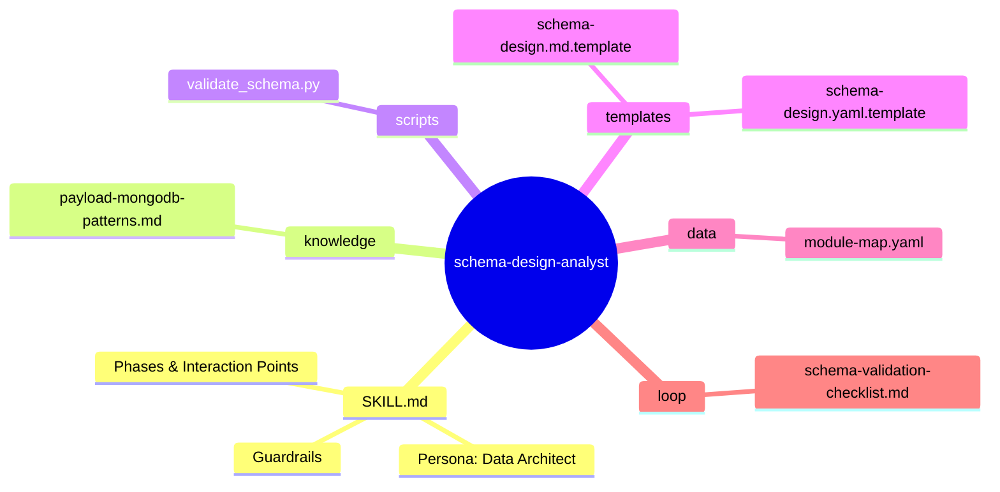
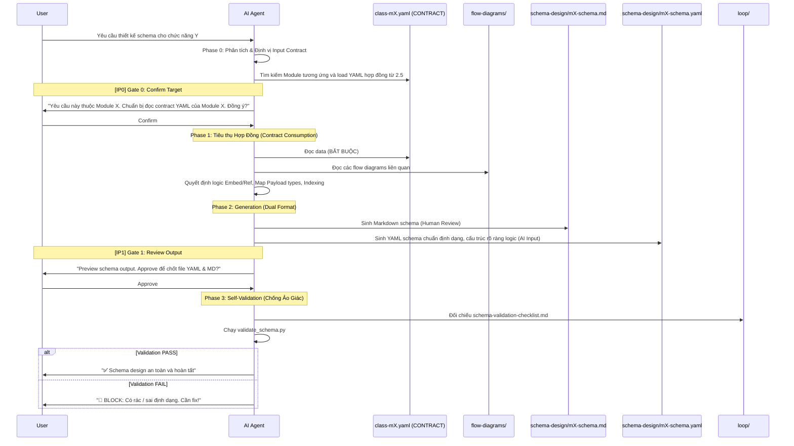

# schema-design-analyst — Architecture Design

> Generated by Skill Architect | Date: 2026-02-20
> Status: 🔵 IN PROGRESS

---

## 0. Input Mechanism

> **Cơ chế Input Data**: Skill nhận yêu cầu thiết kế Schema bất kỳ từ người dùng, tự động phân tích và tìm kiếm file Contract YAML tương ứng (do Task 2.5 sinh ra) để làm context tuyệt đối.

### 0.1 Input Types được chấp nhận

| Loại Input | Ví dụ | Skill xử lý thế nào |
|-----------|-------|--------------------|
| **Yêu cầu module rõ ràng** | "Thiết kế schema cho M1 Auth" | Map sang YAML contract của M1 → Đọc và chạy thẳng |
| **Yêu cầu theo chức năng chưa rõ** | "Thiết kế database cho phần User đăng nhập" | Phân tích chức năng → Trích xuất module M1 → Tìm YAML M1 tương ứng → Chờ Confirm |
| **Yêu cầu mơ hồ** | "Cần xây dựng data schema" | Phân tích intent → Đề xuất Scope module → Định vị YAML file → CHỜ confirm trước khi làm |
| **Yêu cầu + File tham chiếu** | "Dựa vào file activity này, làm schema M2" | Vẫn ưu tiên đọc Contract YAML M2 trước → Cập nhật bằng file đính kèm nếu hợp lệ logic DB |

### 0.2 Input Resolution Flow

```mermaid
flowchart TD
    Input([User Input]) --> DetectType{Phân tích Yêu cầu}
    
    DetectType -->|Module rõ ràng| LinkYAML[Map trực tiếp với YAML contract của Module]
    DetectType -->|Mơ hồ/Chức năng| AnalyzeIntent[Phân tích chức năng -> Tìm kiếm Module Tương ứng]
    
    AnalyzeIntent --> ProposeModule[Đề xuất Module Schema cần làm]
    ProposeModule --> IP0{IP0: Confirm Scope & Contract File}
    
    IP0 -->|Confirmed| LinkYAML
    IP0 -->|Denied| DetectType
    
    LinkYAML --> ReadContract[Đọc file class-mX.yaml (CONTRACT) làm Input]
    ReadContract --> Phase1[Tiến hành Phase 1: Translation & Strategy]
```

---

## 1. Problem Statement

**Vấn đề**: Khi chuyển giao từ mô hình hướng đối tượng (Class Diagram) sang thực tế lưu trữ vật lý (MongoDB/PayloadCMS), AI Agent dễ bị ảo giác (hallucination), thêu dệt, tự sáng tạo thêm các field hoặc xử lý sai logic embed/reference dẫn đến sụp đổ pipeline. Cần một "Kiến trúc sư Data" tàn nhẫn, **CHỈ làm việc dựa trên Contract YAML từ Skill 2.5** (cái gì tồn tại) và các Flow Diagrams (dữ liệu đi thế nào) để quyết định kiến trúc schema mà không được phép tự biên tự diễn thêm.

**Người dùng**: AI Code Agent ở giai đoạn **Life-3** dùng nó như blueprint tuyệt đối để viết code PayloadCMS collection & MongoDB rules.

**Lý do cần skill**: Đảm bảo tính chính xác, nhất quán và khả năng truy xuất nguồn gốc (traceability) từ requirement/diagrams sang physical database schema, loại bỏ hoàn toàn khả năng AI tự ý vẽ thêm field không có trong hợp đồng, là chốt chặn cuối cùng trước khi AI sinh code.

---

## 2. Capability Map

### 2.1 Tri thức (Knowledge — Pillar 1)
<!-- Skill cần tri thức gì? Dưới dạng tài liệu nào? -->

### 2.2 Quy trình (Process — Pillar 2)
<!-- Workflow logic: các bước, thứ tự, điều kiện rẽ nhánh -->

### 2.3 Kiểm soát (Guardrails — Pillar 3)
<!-- AI thường sai ở đâu? Cần kiểm soát gì? Checklist, verify rules? -->

---

## 3. Zone Mapping

> ⚠️ Contract Section — Planner đọc §3 để decompose thành Tasks.
> Mọi Zone PHẢI có giá trị trong cột "Files cần tạo". Zone không dùng → ghi "Không cần".

| Zone | Files cần tạo | Nội dung | Bắt buộc? |
|------|--------------|----------|-----------|
| Core (SKILL.md) | `SKILL.md` | Persona, phases, guardrails | ✅ |
| Knowledge | `knowledge/payload-mongodb-patterns.md` | Quy định Embed/Ref, Metadata strategy | ✅ |
| Scripts | `scripts/validate_schema.py` | Kiểm tra field rác/ảo giác so với hợp đồng | ✅ |
| Templates | `templates/schema-design.md.template`, `templates/schema-design.yaml.template` | Format xuất ra file thiết kế (Markdown cho Human, YAML chuẩn cấu trúc cho AI sau) | ✅ |
| Data | `data/module-map.yaml` | Map routing các module | ✅ |
| Loop | `loop/schema-validation-checklist.md` | Checklist verify data rules | ✅ |
| Assets | Không cần | N/A | ❌ |

---

## 4. Folder Structure



---

## 5. Execution Flow



---

## 6. Interaction Points

| # | Thời điểm | Lý do dừng | Hành động của AI |
|---|-----------|-----------|-----------------|
| 1 | Trước Phase 2 (Sau khi đọc Data) | Báo cáo tình trạng tiêu thụ Contract YAML. Phải đảm bảo YAML không trống và đã được lock từ Skill 2.5 | Trình bày summary contract + chờ confirm |
| 2 | Sau Phase 3 (Gen MD) | Chờ user review bản Schema Markdown xem logic Payload/MongoDB đã hợp lý chưa | Trình bày code schema + Cảnh báo rủi ro về performance (nếu có) + Chờ approve |
| 3 | Cuối Phase 4 (Validation) | Báo cáo kết quả kiểm soát chất lượng chống ảo giác. | Hiện Bảng Xanh (Pass) hoặc Đỏ (Lỗi). Bắt buộc phải dừng và tự sửa nếu Fail. |

---

## 7. Progressive Disclosure Plan

### Tier 1: Bắt buộc đọc (Mandatory)
- `SKILL.md` (Persona / Flow / Guardrails)
- `knowledge/payload-mongodb-patterns.md` (Cách quy hoạch Data)
- `data/module-map.yaml` (Biết file nào ở đâu)
- `Docs/life-2/diagrams/class-diagrams/index.md` (Đọc Status để biết được phép làm module nào)

### Tier 2: Đọc khi cần (Conditional)
- `Docs/life-2/diagrams/class-diagrams/mX-*/class-mX.yaml` (Chỉ load file YAML ĐẦU VÀO của module đang làm do Skill 2.5 xuất ra)
- `Docs/life-2/diagrams/flow-*/` (Các file flow map theo module)
- `templates/schema-design.md.template` và `schema-design.yaml.template` (Đọc khi bắt đầu sinh file)

---

## 8. Risks & Blind Spots

| # | Risk | Severity | Mitigation |
|---|------|----------|-----------|
| 1 | AI bịa field không có trong `class-mX.yaml` | P0 | Bắt buộc chạy script `validate_schema.py` cuối mỗi workflow. Nếu phát hiện field lạ, throw `[BLOCK]`. |
| 2 | Chọn sai Strategy (Embed lồng sâu quá 16MB) | P1 | Prompts trong SKILL.md yêu cầu AI suy diễn Data Size của Node khi thiết kế MongoDB Array. Payload Array field không được lưu trữ quá nhiều documents. |
| 3 | Context Overflow | P2 | Design bắt buộc Agent chỉ load 1 module YAML cho mỗi lượt làm việc thông qua `module-map.yaml`. |

---

## 9. Open Questions

| # | Câu hỏi | Nguồn (Phase) | Trạng thái |
|---|---------|--------------|-----------|
| 1 | Có cần viết Validation Script chạy bằng CI/CD hay Agent tự chạy cục bộ? | Phase 2 | ❓ Mở (Hiện tại: Agent tự chạy qua `scripts/validate_schema.py`) |

---

## 10. Metadata

- **Skill Name**: schema-design-analyst
- **Created**: 2026-02-20
- **Author**: Skill Architect
- **Framework**: architect.md v2.0
- **Status**: 🟢 DESIGN COMPLETE
- **Handoff Checklist**:
  - [x] design.md hoàn thiện (checklist pass)
  - [x] Sẵn sàng cho skill-planner
