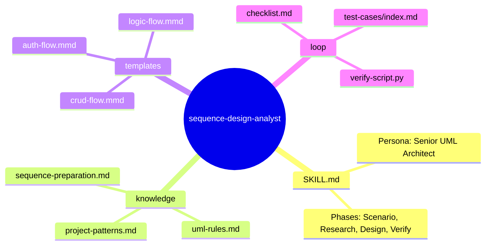
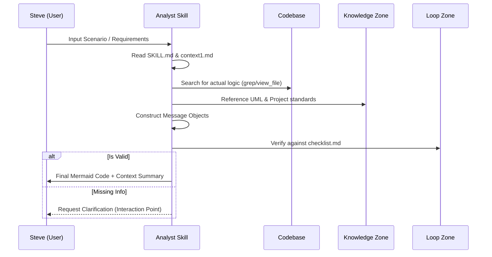

# sequence-design-analyst — Architecture Design

> Generated by Skill Architect | Date: 2026-02-17
> Status: � COMPLETED

---

## 1. Problem Statement

Việc thiết kế Sequence Diagram (sơ đồ tuần tự) thường gặp khó khăn do thiếu sự kết nối chặt chẽ giữa yêu cầu nghiệp vụ thô và logic thực thi trong codebase. Các sơ đồ do AI tạo ra thường bị thiếu hụt các thành phần lifeline (Actor, Service, DB) hoặc không mô tả chính xác thứ tự message flow. Steve cần một giải pháp chuyên biệt có khả năng tự tổng hợp từ tài liệu hướng dẫn (context1.md), nghiên cứu thực tế codebase và thiết kế sơ đồ chuẩn UML (Mermaid).

## 2. Capability Map

### 2.1 Tri thuc (Knowledge)
- **UML Standards**: Hiểu sâu về Lifelines, Synchronous/Asynchronous Messages, và các Fragments (`alt`, `opt`, `loop`, `ref`).
- **Mermaid Specialist**: Thành thạo cú pháp Mermaid mã nguồn mở để sinh sơ đồ chất lượng cao.
- **Domain Context**: Khả năng đọc hiểu kiến trúc dự án (React/Next.js frontend & PayloadCMS backend).

### 2.2 Quy trinh (Process)
1.  **Scenario Discovery**: Phân tích kịch bản từ input người dùng và tài liệu `context1.md`.
2.  **Codebase Research**: Quét codebase để xác định chính xác các lớp/hàm tham gia vào luồng.
3.  **Traceability Analysis**: Xây dựng chuỗi tương tác (chỉ rõ ai gọi ai, tham số là gì).
4.  **Drafting & Refinement**: Sinh code Mermaid và tối ưu hóa vị trí các lifelines bản vẽ.
5.  **Quality Assurance**: Kiểm tra chéo với Checklist trước khi bàn giao.

### 2.3 Kiem soat (Guardrails)
- **Code-First Truth**: Chỉ vẽ những gì thực sự tồn tại hoặc được định nghĩa trong yêu cầu thiết kế.
- **Readability Limit**: Cảnh báo người dùng nếu sơ đồ vượt quá mức độ phức tạp cho phép (quá nhiều lifelines hoặc nested fragments).
- **Naming Consistency**: Đảm bảo tên Actor/Object khớp 100% với codebase.

## 3. Zone Mapping

| Zone | Noi dung | Bat buoc? |
|------|----------|----------|
| Core (SKILL.md) | `SKILL.md`: Điều phối 5 pha: Collect, Research, Design, Generate, Verify. | ✅ |
| Knowledge | Chứa `knowledge/uml-rules.md`, `knowledge/project-patterns.md`, và `knowledge/sequence-preparation.md`. | ✅ |
| Scripts | (Optional) script phân tích call stack đơn giản. | ❌ |
| Templates | Mẫu Mermaid: `templates/crud-flow.mmd`, `templates/auth-flow.mmd`, `templates/logic-flow.mmd`. | ✅ |
| Data | Cấu hình theme/styling cho sơ đồ. | ❌ |
| Loop | `loop/checklist.md`, `loop/verify-script.py`, và `loop/test-cases/index.md`. | ✅ |
| Assets | N/A | ❌ |

## 4. Folder Structure

## 5. Execution Flow

## 6. Interaction Points

| # | Thoi diem | Ly do |
|---|-----------|-------|
| 1 | Sau khi Scenario Discovery | Xác nhận kịch bản (Scenario) và danh sách Actor/Lifelines chính xác. |
| 2 | Sau khi Codebase Research | Xác nhận luồng các phương thức (Method calls) đã đúng với thực tế codebase. |
| 3 | Trước khi Generate Final | Xác nhận phương án xử lý các nhánh `alt` phức tạp. |

## 7. Progressive Disclosure Plan

### Tang 1: Bat buoc doc (Mandatory)
- `SKILL.md`: Linh hồn điều hướng Agent.
- `knowledge/uml-rules.md`: Bộ quy tắc vẽ chuẩn.
- `loop/checklist.md`: Rào chắn chất lượng.

### Tang 2: Tu quyet dinh (Conditional)
- `knowledge/project-patterns.md`: Đọc khi cần hiểu cách gọi Local API của dự án.
- `templates/*.mmd`: Sử dụng khi sinh output cụ thể.
- `loop/verify-script.py`: Chạy khi cần thẩm định logic phức tạp.

## 8. Risks & Blind Spots

<!-- AI thuong sai o dau voi loai cong viec nay? Co rui ro gi? -->

| # | Risk | Mitigation |
|---|------|------------|
| 1 | AI vẽ sai logic thực tế do codebase phức tạp. | Bắt buộc AI phải dùng `grep/view_file` trước khi vẽ. |
| 2 | Sơ đồ Mermaid quá dài gây lỗi render hoặc khó đọc. | Quy tắc chia nhỏ sơ đồ (Sub-sequences) nếu lifelines > 8. |
| 3 | Thiếu các trường hợp ngoại lệ (Edge cases). | Checklist bắt buộc phải có ít nhất 1 block `alt` cho luồng lỗi. |

## 9. Open Questions

| # | Cau hoi | Trang thai |
|---|---------|-----------|
| 1 | Có cần bổ sung script tự động export ảnh từ Mermaid không? | ❌ Không cần |
| 2 | Skill có nên kiêm luôn việc gợi ý Refactor code sau khi vẽ không? | ❌ Không cần |

## 10. Metadata

- **Skill Name**: sequence-design-analyst
- **Created**: 2026-02-17
- **Author**: Skill Architect (Tít dễ thương 🌸)
- **Framework**: architect.md v2.0
- **Status**: 🚀 APPROVED (Ready for Planning)
