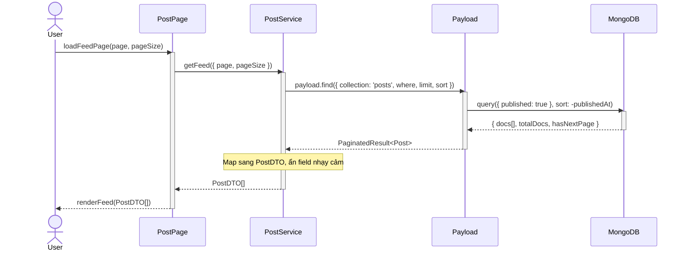
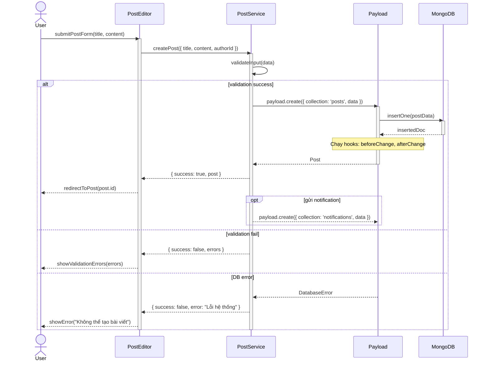

# Project Architecture & Patterns

> **Mục đích**: Giúp AI hiểu "bản đồ" kiến trúc và luồng logic của dự án Next.js + PayloadCMS để vẽ Sequence Diagram đúng lớp, đúng hướng call.

---

## 1. Core Architecture

### 1.1 Tech Stack & Runtime

- **Frontend / SSR**: Next.js 15 (App Router) chạy trên Node runtime.
  - Sử dụng Server Components, Route Handlers và/hoặc Server Actions cho các luồng cần truy cập Payload Local API.
- **Backend / CMS**: PayloadCMS 3.0 chạy cùng process với Next.js như một monolith.
- **Database**: MongoDB (theo quyết định kiến trúc chung của dự án).

### 1.2 API Style – Local API First

- **Local API** (Primary):
  - Sử dụng helper `getPayload` để lấy instance Payload trong môi trường Node.
  - Chỉ được sử dụng **trên server** (Route Handler, Server Component, Server Action), không dùng trực tiếp trên client component.
  - Các phương thức chính:
    - `payload.find({ collection, where, limit, sort })`
    - `payload.findByID({ collection, id })`
    - `payload.create({ collection, data })`
    - `payload.update({ collection, id, data })`

- **REST API** (Fallback / Integration):
  - Khi cần gọi từ client-side hoặc từ hệ thống bên ngoài, sử dụng REST endpoints chuẩn của Payload thay vì Local API.

**Guardrail cho Sequence**: Khi vẽ sơ đồ, luôn thể hiện luồng Data Access đi qua **Payload Local API hoặc REST API**, không bao giờ cho UI/Service nói chuyện trực tiếp với Database.

---

## 2. Sequence Layers (Thứ tự tham gia của các lớp)

### 2.1 Chuỗi lớp chuẩn

Thứ tự tham gia chuẩn trong các Sequence Diagram của dự án:

1. **Actor (User / External System)**
   - Người dùng web, mobile, hoặc hệ thống tích hợp (Payment Gateway, OAuth Provider).

2. **UI Component / Screen (Next.js App Router)**
   - Page / Layout / Client Component chịu trách nhiệm:
     - Nhận input từ user.
     - Gửi request tới Route Handler / Server Action / Service.

3. **Service Layer (Domain / Application Services)**
   - Viết bằng TypeScript, nằm trong thư mục kiểu `src/services/` hoặc `src/features/**/services`.
   - Đảm nhiệm:
     - Ánh xạ input từ UI thành lệnh domain.
     - Gọi Payload Local API thông qua các hàm helper (ví dụ: `postService.findMany`, `authService.login`).

4. **Payload Local API (Data Access via getPayload)**
   - Hàm helper kiểu:
     ```ts
     import { getPayload } from 'payload';
     import config from '@/payload.config';

     export const getPayloadClient = async () => {
       // caching instance để tránh tạo lại nhiều lần
       // ...
     };
     ```
   - Service layer gọi `payload.find`, `payload.findByID`, `payload.create`, v.v. tại đây.

5. **Database / External Systems**
   - MongoDB đứng phía sau Payload.
   - Các hệ thống khác (Redis, 3rd-party API) nếu có sẽ luôn được wrap bởi một service/adapter phía Payload hoặc service layer.

### 2.2 Quy tắc khi vẽ Sequence

- Không vẽ Actor / UI gọi Database trực tiếp; luôn chèn Service layer và Payload Local API.
- Tên lifeline nên phản ánh đúng layer, ví dụ:
  - `actor User`
  - `participant PostPage`
  - `participant PostService`
  - `participant Payload`
  - `participant MongoDB`

---

## 3. Common Logic Flows

### 3.1 Auth Flow (Login / Token / Session)

**Mục tiêu**: Chuẩn hóa cách thể hiện logic xác thực khi vẽ Sequence Diagram.

**Luồng tổng quát (login bằng email/password):**

1. `User` nhập credential trên UI (Login Page).
2. `LoginPage` gửi request tới `AuthRoute` hoặc `AuthService` (Route Handler / Server Action).
3. `AuthService` sử dụng `getPayload` để lấy client và gọi:
   ```ts
   payload.login({
     collection: 'users',
     data: { email, password },
   })
   ```
   (hoặc pattern tương đương nếu dùng collection auth của Payload).
4. Payload xác thực user, trả về user + token / session info.
5. `AuthService`:
   - Ghi session (HTTP-only cookie / session store).
   - Trả kết quả về cho UI (success / error).
6. UI hiển thị màn hình tiếp theo (dashboard) hoặc thông báo lỗi.

**Các điểm cần thể hiện rõ trong Sequence Diagram:**

- Nhánh `alt` cho:
  - `login success`
  - `invalid credentials`
  - (tùy chọn) `user locked` / `email not verified`
- `opt` block cho các hành động tùy chọn:
  - Ghi audit log login.
  - Gửi email đăng nhập mới.
- Không vẽ UI → Database, mà là:
  - `User ->> LoginPage ->> AuthService ->> Payload ->> MongoDB`.

**Ví dụ Sequence Diagram – Auth Flow:**

```mermaid
sequenceDiagram
  actor User
  participant LoginPage
  participant AuthService
  participant Payload
  participant MongoDB

  User ->> LoginPage: submitLoginForm(email, password)
  activate LoginPage
  LoginPage ->> AuthService: login(email, password)
  activate AuthService
  AuthService ->> Payload: payload.login({ collection: 'users', data })
  activate Payload
  Payload ->> MongoDB: findOne({ email })
  activate MongoDB
  MongoDB -->> Payload: UserRecord | null
  deactivate MongoDB

  alt login success
      Payload -->> AuthService: { user, token }
      deactivate Payload
      AuthService ->> AuthService: setSessionCookie(token)
      AuthService -->> LoginPage: { success: true, user }
      LoginPage -->> User: redirectToDashboard()
      opt ghi audit log
          AuthService -->> Payload: payload.create({ collection: 'auditLogs', data })
      end
  else invalid credentials
      Payload -->> AuthService: AuthError("Invalid credentials")
      deactivate Payload
      AuthService -->> LoginPage: { success: false, error }
      LoginPage -->> User: showError("Sai email hoặc mật khẩu")
  else user locked
      Payload -->> AuthService: AuthError("Account locked")
      deactivate Payload
      AuthService -->> LoginPage: { success: false, error }
      LoginPage -->> User: showError("Tài khoản bị khóa")
  end

  deactivate AuthService
  deactivate LoginPage
```

---

### 3.2 Data Query Flow (Payload find / findByID)

**Pattern chuẩn để truy vấn dữ liệu trong Next.js qua Payload Local API:**

1. **UI / Route Handler gọi Service:**
   - Ví dụ: `PostPage` gọi `PostService.getFeed({ page, pageSize })`.

2. **Service Layer xử lý business logic:**
   - Chuẩn hóa input (phân trang, filter).
   - Quyết định collection nào, điều kiện `where`, `sort`, `limit`.

3. **Service gọi Payload Local API:**
   ```ts
   const payload = await getPayloadClient();

   const result = await payload.find({
     collection: 'posts',
     where: { published: { equals: true } },
     limit: 20,
     sort: '-publishedAt',
   });
   ```

4. **Payload truy vấn Database và trả về result:**
   - `docs` (mảng record), `totalDocs`, `page`, `hasNextPage`, v.v.

5. **Service mapping dữ liệu về DTO:**
   - Chỉ expose field cần thiết cho UI (ẩn field nhạy cảm).
   - Có thể chuẩn hóa sang TypeScript DTO (Data Transfer Object).

6. **UI render kết quả:**
   - Server Component nhận data, render HTML.
   - Client Component chỉ nhận dữ liệu đã được chuẩn hóa.

**Quy tắc khi vẽ Sequence:**

- Luồng cơ bản:
  `User ->> UI ->> Service ->> Payload ->> DB -->> Payload -->> Service -->> UI -->> User`.
- Nếu chỉ cần đọc dữ liệu (read-only), không cần vẽ thêm Repo riêng nếu đã thể hiện Payload đủ rõ.
- Nếu dùng DTO pattern, có thể thêm lifeline `PostMapper` hoặc ghi rõ mapping trong note.

**Ví dụ Sequence Diagram – Data Query Flow:**



---

### 3.3 Write / Update Flow (Create / Update via Payload)

**Thích hợp cho các use case:** tạo post mới, cập nhật profile, tạo order.

1. `User` submit form tại UI.
2. UI gọi Service / Route Handler với payload form.
3. Service validate và chuẩn hóa data.
4. Service dùng Payload Local API:
   ```ts
   const newPost = await payload.create({
     collection: 'posts',
     data: { title, content, author: userId },
   });
   ```
   hoặc:
   ```ts
   const updatedPost = await payload.update({
     collection: 'posts',
     id,
     data: { title, content },
   });
   ```
5. Payload ghi dữ liệu xuống DB, chạy hooks (beforeValidate, beforeChange, afterChange, v.v.).
6. Service trả kết quả cho UI; UI hiển thị thông báo / redirect.

**Sequence nên thể hiện:**

- `alt` cho:
  - `validation success` vs `validation fail`.
  - `DB error` nếu cần mô tả luồng lỗi.
- `opt` cho:
  - Gửi notification, index search, background jobs.

**Ví dụ Sequence Diagram – Write / Update Flow:**



---

## 4. Guardrails for Sequence in This Project

Đây là các "luật cứng" khi vẽ Sequence Diagram cho codebase Next.js + Payload này.

- **Không vẽ trực tiếp vào Database**
  - Mọi thao tác đọc/ghi CSDL phải đi qua **Payload Local API** (hoặc REST API trong trường hợp đặc biệt).

- **Tôn trọng Layer Order**
  - Actor → UI → Service Layer → Payload Local API → Database.
  - Không bỏ qua Service Layer để UI gọi Payload trực tiếp, trừ các use case kỹ thuật đơn giản và đã được chấp thuận.

- **Tên Service khớp file `.service.ts`**
  - Nếu trong code có `post.service.ts`, thì trong sơ đồ nên dùng `PostService` thay vì tên tùy ý khác.

- **Auth luôn qua Auth Service / Auth Collection**
  - Không vẽ UI gọi thẳng `payload.find(users)` để login; phải qua `AuthService` / collection auth của Payload.

- **Sequence Diagram bám sát use case thật**
  - Mỗi sơ đồ phải gắn với một scenario cụ thể (login, load feed, create post…), không vẽ sơ đồ "tổng hợp" quá nhiều use case.

- **Không mô tả logic ngoài phạm vi dự án**
  - Nếu có tích hợp 3rd-party, chỉ mô tả tới mức cần thiết (ví dụ: `PaymentGateway`) mà không đi sâu vào nội bộ hệ thống đó.

---

## 5. Naming Conventions Tham Khảo Nhanh

| Layer              | Lifeline Mermaid           | Ví dụ file thực tế               |
|--------------------|----------------------------|----------------------------------|
| Actor              | `actor User`               | —                                |
| UI / Page          | `participant PostPage`     | `app/(frontend)/posts/page.tsx`  |
| Route Handler      | `participant PostRoute`    | `app/api/posts/route.ts`         |
| Service            | `participant PostService`  | `src/services/post.service.ts`   |
| Payload Local API  | `participant Payload`      | `src/lib/payload.ts`             |
| Database           | `participant MongoDB`      | MongoDB Atlas / local instance   |
| External System    | `participant PaymentGW`    | Stripe, VNPay, v.v.              |