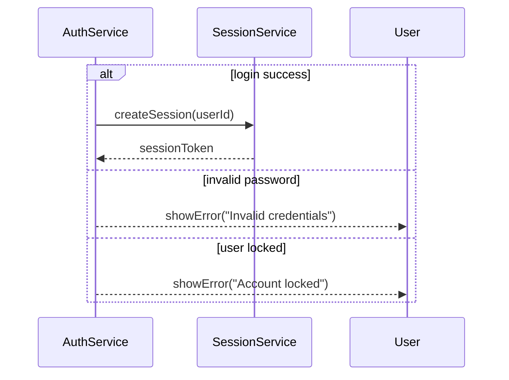
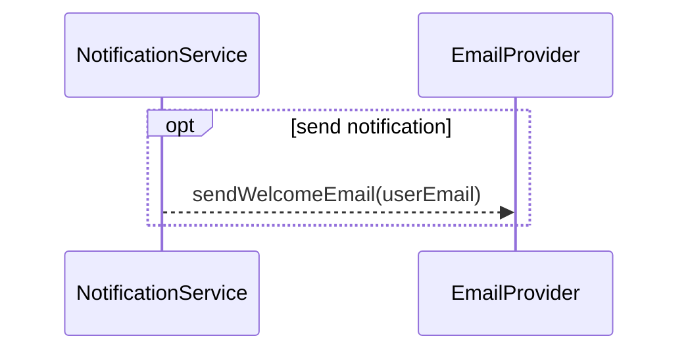
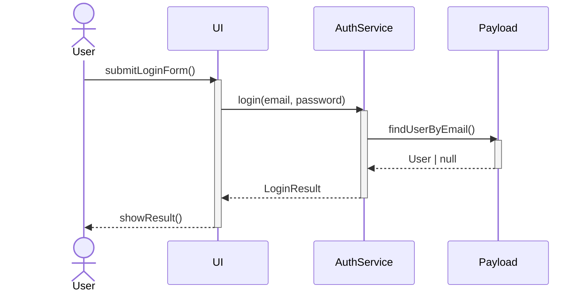

# UML Sequence Standards (Mermaid)

> **Mục đích**: Chuẩn hóa cách suy nghĩ và cú pháp khi vẽ Sequence Diagram bằng Mermaid cho toàn bộ dự án.

---

## 1. Syntax Basics

### 1.1 Lifelines (Participants & Actors)

- **Actor (người dùng / hệ thống ngoài)**
  - Dùng cú pháp Mermaid: `actor User` hoặc `actor Admin` để biểu diễn tác nhân bên ngoài.
  - Actor thường nằm ngoài cùng bên trái sơ đồ (User) hoặc ngoài cùng bên phải (các hệ thống tích hợp như Payment Gateway).

- **Participants (thành phần hệ thống)**
  - Dùng cú pháp: `participant LoginPage`, `participant AuthController`, `participant UserService`, `participant DB`.
  - Thứ tự khuyến nghị từ trái sang phải:
    1. Actor (User / External System)
    2. UI / Screen (Next.js page / React component)
    3. Controller / Route handler (Next.js route, server action)
    4. Service layer (TypeScript service / use case)
    5. Repository / Payload Local API
    6. Database / External infra (MongoDB, Redis, 3rd-party API)

### 1.2 Message Types

- **Synchronous call (gọi đồng bộ)**
  - Cú pháp Mermaid: `A ->> B: methodName(params)`
  - Dùng cho các lời gọi hàm / phương thức mà caller **chờ** kết quả (ví dụ: `Controller ->> Service: loginUser(email, password)`).

- **Asynchronous call (gửi event / message)**
  - Cú pháp Mermaid: `A -->> B: eventName`
  - Dùng cho các hành động fire-and-forget, ví dụ publish event, gửi message queue, cron job, webhooks.

- **Return message (trả kết quả)**
  - Cú pháp khuyến nghị: `B -->> A: result / status` trong Mermaid.
  - Chỉ vẽ return khi:
    - Kết quả quan trọng cho nhánh rẽ (success/fail).
    - Cần nhấn mạnh data được trả về (ví dụ: `User`, `AccessToken`, `Error`).

### 1.3 Notes và Annotation

- Sử dụng cú pháp Mermaid cho ghi chú:
  - `Note over A: short note`
  - `Note left of A: ...` hoặc `Note right of A: ...`
- Dùng note để:
  - Giải thích business rule quan trọng.
  - Link tới tài liệu khác (SRS, API doc).

### 1.4 Activation (Thời gian sống xử lý)

- Mermaid hỗ trợ `activate` / `deactivate` để biểu diễn khoảng thời gian object đang xử lý một lời gọi.
- Ví dụ:
  ```mermaid
  sequenceDiagram
    participant Service
    participant Repo

    Service ->> Repo: findUser()
    activate Repo
    Repo -->> Service: User
    deactivate Repo
  ```
- Activation nên dùng cho:
  - Thể hiện rõ call chain nhiều tầng (UI → Controller → Service → Repo → DB).
  - Hiển thị xử lý lồng nhau (nested calls / recursion).

---

## 2. Interaction Fragments (Quan trọng nhất)

**Mục tiêu**: Dùng đúng `alt`, `opt`, `loop` để mô tả if/else, luồng tùy chọn và vòng lặp theo đúng chuẩn UML.

### 2.1 `alt` – Rẽ nhánh logic (If / Else / Multi-branch)

- Dùng cho **các nhánh loại trừ lẫn nhau** (mutually exclusive paths).
- Mỗi nhánh có một guard (điều kiện), tương đương `if / else if / else`.

Ví dụ:


**Quy tắc:**

- Mọi luồng if/else quan trọng trong nghiệp vụ nên dùng `alt` thay vì vẽ nhiều mũi tên rời rạc.
- Không nhồi quá nhiều trường hợp hiếm → tách thành sơ đồ khác nếu số nhánh > 3–4.

### 2.2 `opt` – Hành động tùy chọn (Optional)

- `opt` dùng cho **một nhánh duy nhất, có thể xảy ra hoặc không** – tương đương `if (condition) { ... }` **không có** else.
- Thích hợp cho các tính năng "có cũng được, không có cũng được" như:
  - Gửi email thông báo.
  - Ghi log nâng cao.
  - Tính reward points nếu user là member.

Ví dụ:


**Quy tắc:**

- Nếu có cả nhánh "không gửi" với hành vi khác biệt → dùng `alt` thay vì `opt`.
- Không lạm dụng `opt` cho các logic chính của use case (nên dùng `alt`).

### 2.3 `loop` – Vòng lặp

- Dùng `loop` cho các thao tác lặp lại nhiều lần trong cùng một scenario:
  - Duyệt từng item trong giỏ hàng.
  - Gửi thông báo tới danh sách user.
- Có thể ghi điều kiện hoặc range ngay trên `loop`, ví dụ:
  ```mermaid
  sequenceDiagram
    loop for each item in cartItems
        CheckoutService ->> PricingService: calculatePrice(item)
        PricingService -->> CheckoutService: itemPrice
    end
  ```

**Quy tắc:**

- Không vẽ từng lần lặp giống hệt nhau; hãy dùng `loop` với mô tả rõ ràng.
- Nếu trong vòng lặp còn có if/else → có thể lồng `alt` bên trong `loop`.

---

## 3. Best Practices (Tư duy & Quy ước)

### 3.1 Tư duy từ Use Case → Sequence

Để tránh sơ đồ sai logic, luôn đi theo pipeline sau trước khi vẽ:

1. **Xác định scenario cụ thể**
   - Ví dụ: "User đăng nhập thành công", "User đăng nhập sai mật khẩu 3 lần".
2. **Liệt kê actor & đối tượng tham gia**
   - User, UI (page / component), Controller, Service, Repo, DB, external API.
3. **Viết lại luồng bước (Step 1, 2, 3, …)**
   - Ai gọi ai, gọi hàm gì, dữ liệu quan trọng là gì.
4. **Xác định điều kiện rẽ nhánh & vòng lặp**
   - Các case thành công / thất bại, điều kiện lỗi, loop qua danh sách.
5. **Quyết định mức chi tiết (SSD vs Design-level)**
   - Vẽ Actor ↔ System tổng quát hay xuống tới từng lớp UI / Service / Repo.

Sequence Diagram chỉ là bước **chuyển từ chữ sang hình** của 5 nhóm thông tin trên.

### 3.2 Activation Boxes (Thời gian xử lý)

- **Khi nào nên dùng activation**:
  - Khi muốn nhấn mạnh ai đang "giữ quyền điều khiển" tại mỗi bước trong call chain.
  - Khi có nested calls (Service gọi Repo, Repo gọi DB) để người xem dễ theo dõi.
- **Khi nào có thể lược bớt**:
  - Actor khởi phát (User / Browser) đôi khi không cần vẽ activation nếu lifeline kéo dài toàn bộ sơ đồ.
- **Định dạng**:
  - Dùng `activate Object` ngay sau message vào, và `deactivate Object` khi trả kết quả xong.

Ví dụ:


### 3.3 Đặt tên Message (Verb + Object)

- **Quy tắc chung**:
  - Tên message = **động từ + tân ngữ** (verb + object) bằng tiếng Anh chuẩn.
  - Ví dụ tốt: `loginUser`, `validateCredentials`, `createOrder`, `sendResetEmail`.
  - Tránh tên mơ hồ kiểu `doStuff`, `process`, `handle`.

- **Khớp với codebase**:
  - Ưu tiên dùng đúng tên hàm / method trong code nếu có.
  - Với Payload Local API, message có thể là:
    - `payload.find(posts)`, `payload.findByID(users)`, `payload.create(order)`.

- **Không nhét quá nhiều param vào message label**:
  - Chỉ nêu các tham số quan trọng (userId, orderId, amount…).
  - Chi tiết thêm có thể đưa vào note nếu cần.

### 3.4 Layout & Độ đọc được (Readability)

- **Giới hạn số lifeline**:
  - Nếu > 8 lifeline, cân nhắc tách thành nhiều sơ đồ nhỏ hơn (sub-sequence).
- **Nhóm các message liên quan**:
  - Các khối có cùng mục đích (validate, persist, notify) nên gom trong cùng một fragment hoặc được "đóng khung" bằng note.
- **Không vẽ "nhảy cóc" tới Database**:
  - Luồng phải luôn đi qua Service/Repository hoặc Payload Local API, không cho UI gọi DB trực tiếp.

---

## 4. Checklist Nhanh Trước Khi Chốt Sơ Đồ

Trước khi coi một Sequence Diagram là "xong", kiểm tra:

- [ ] Có **scenario cụ thể** được mô tả bằng lời ở ngoài (hoặc trong note).
- [ ] Tất cả actor & đối tượng đều có lifeline rõ ràng, tên đúng vai trò.
- [ ] Không có message "bay" thẳng từ UI tới DB, luôn qua Service/Repo/Payload.
- [ ] Các luồng if/else dùng `alt`, các hành động tùy chọn dùng `opt`, vòng lặp dùng `loop`.
- [ ] Message đặt tên theo quy tắc verb + object, ưu tiên khớp code thật.
- [ ] Activation thể hiện rõ call chain chính (ít nhất cho Service/Repo/DB nếu cần).
- [ ] Sơ đồ không quá dày đặc; nếu quá dài, tách thành nhiều sơ đồ nhỏ hơn theo use case hoặc subflow.