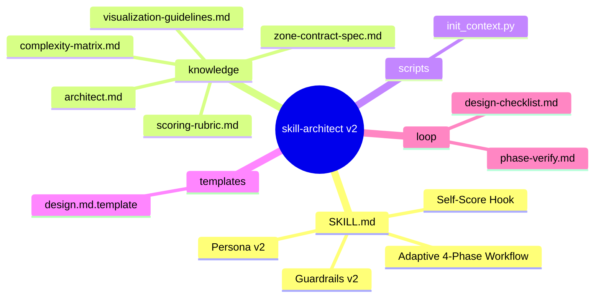
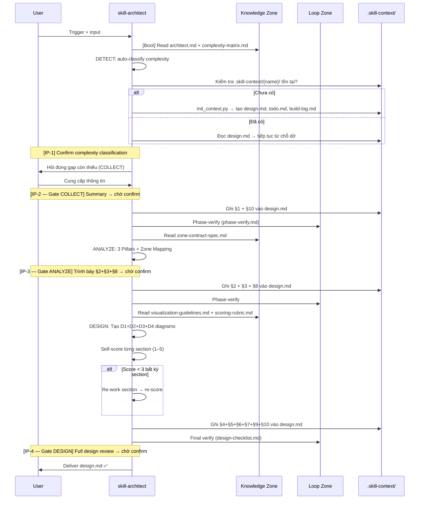
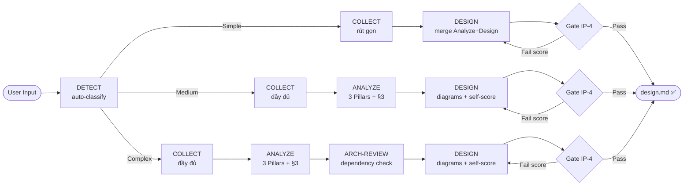
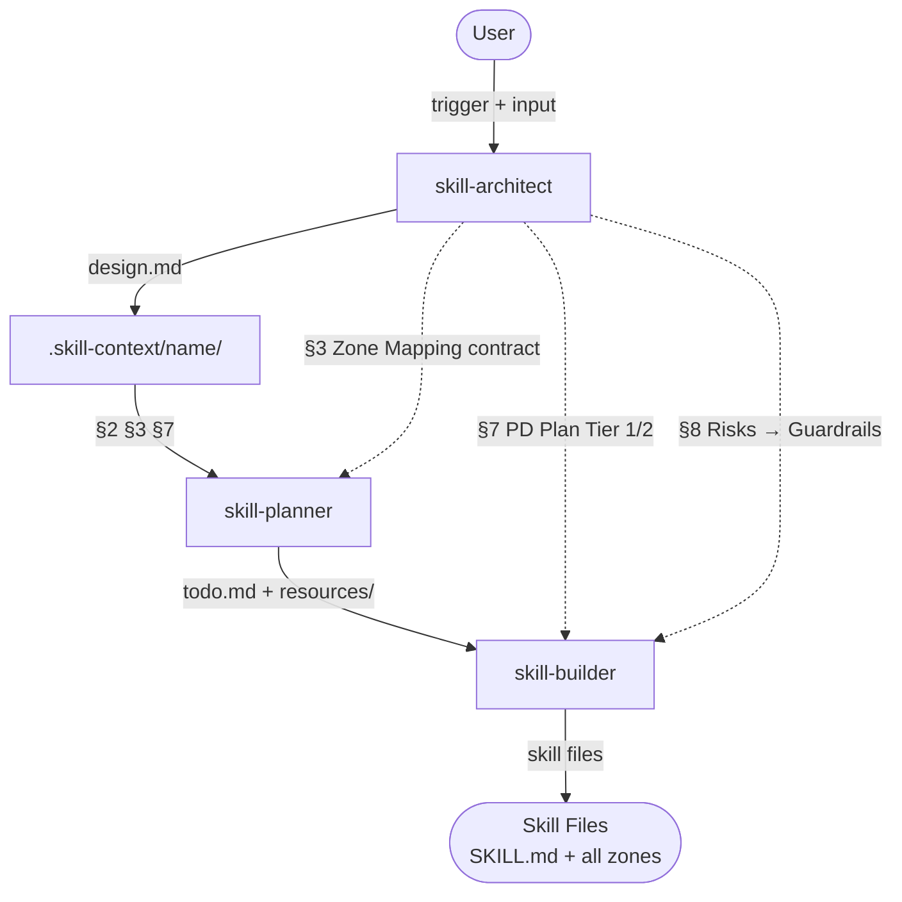

# skill-architect — Architecture Design

> Generated by Skill Architect | Date: 2026-02-22
> Status: 🟢 COMPLETE

---

## 1. Problem Statement

**Vấn đề**: Skill `skill-architect` hiện tại (v1) có 4 điểm yếu cốt lõi:
1. **Phases quá cồng kềnh** — 3 mandatory gates ngay cả với yêu cầu đơn giản, làm chậm toàn bộ workflow
2. **Guardrails không đủ mạnh** — AI có thể bỏ qua interaction gates, tự suy đoán thay vì hỏi user, skip design-checklist
3. **Zone Mapping (§3) không rõ ràng** — thiếu tên file cụ thể, Planner/Builder vẫn phải đoán hoặc hỏi thêm, vi phạm "contract" Architect→Planner
4. **Thiếu cơ chế tự đánh giá trong quá trình** — không có feedback loop nội tại; chỉ có checklist cuối, quá muộn để phát hiện lỗi

**Người dùng**: Developer sử dụng skill để thiết kế Agent Skills mới trong dự án Steve Void hoặc bất kỳ dự án có Agent Skill Framework. Downstream users: skill-planner (đọc §3), skill-builder (đọc §7 + §8).

**Lý do cần skill**: skill-architect là điểm khởi đầu của toàn bộ Skill Suite (Architect → Planner → Builder). Nếu design.md đầu ra không rõ ràng, Planner và Builder sẽ bị ảnh hưởng dây chuyền. Cần v2 với: (1) adaptive workflow theo complexity, (2) guardrails cứng hơn, (3) Zone Mapping contract chuẩn hóa, (4) self-scoring mechanism trong quá trình thiết kế.

---

## 2. Capability Map

### 2.1 Tri thức (Knowledge — Pillar 1)

| Tri thức | File | Ghi chú |
|---------|------|---------|
| Framework 3 Pillars & 7 Zones | `knowledge/architect.md` | Giữ nguyên từ v1 |
| Chuẩn sơ đồ Mermaid | `knowledge/visualization-guidelines.md` | Giữ nguyên từ v1 |
| **Complexity Detection Rules** | `knowledge/complexity-matrix.md` | Mới — auto-classify Simple/Medium/Complex |
| **Zone Mapping Contract Spec** | `knowledge/zone-contract-spec.md` | Mới — schema cứng §3, regex validation, examples |
| **Self-Scoring Rubric** | `knowledge/scoring-rubric.md` | Mới — AI tự cho điểm 1–5 từng section |

### 2.2 Quy trình (Process — Pillar 2)

**Adaptive workflow theo complexity** thay vì 3 phases cứng nhắc:

```
[DETECT] → phân loại tự động (Simple / Medium / Complex)
    │
    ├─ Simple  → COLLECT (rút gọn) → DESIGN (merge Analyze+Design)
    ├─ Medium  → COLLECT → ANALYZE → DESIGN
    └─ Complex → COLLECT → ANALYZE → ARCH-REVIEW → DESIGN
```

- **DETECT**: đọc input, áp complexity-matrix.md, chọn path — không hỏi user
- **COLLECT**: hỏi đúng gap còn thiếu (không hỏi lại những gì đã biết)
- **ANALYZE**: map 3 Pillars + Zone Mapping contract (§3 schema bắt buộc)
- **DESIGN**: tạo ≥3 Mermaid diagrams + self-score từng section trước deliver
- **ARCH-REVIEW** (Complex only): kiểm tra dependency với skill-planner/builder pipeline

### 2.3 Kiểm soát (Guardrails — Pillar 3)

| Vấn đề v1 | Guardrail v2 |
|-----------|-------------|
| AI bỏ qua interaction gates | Gate = BLOCKING — không có output nếu user chưa confirm |
| Skip design-checklist | Per-phase checklist từ `loop/phase-verify.md` nhúng vào cuối mỗi phase |
| §3 Zone Mapping thiếu tên file cụ thể | Regex validation: tên file phải khớp `[a-z][a-z0-9_\-]+\.[a-z]+` |
| AI không biết mình đang sai | Self-scoring rubric: score < 3/5 bất kỳ section → trigger re-work |
| AI tự suy đoán khi thiếu thông tin | Confidence rule: < 70% → bắt buộc hỏi trước khi proceed |

---

## 3. Zone Mapping

> ⚠️ Contract Section — Planner đọc §3 để decompose thành Tasks.
> Mọi Zone PHẢI có tên file cụ thể (regex: `[a-z][a-z0-9_\-]+\.[a-z]+`). Zone không dùng → ghi "Không cần".

| Zone | Files cần tạo | Nội dung | Bắt buộc? |
|------|--------------|----------|-----------|
| Core | `SKILL.md` | Persona v2, adaptive 4-phase workflow, guardrail hardening, self-scoring hook | ✅ |
| Knowledge | `knowledge/architect.md` | Framework 3 Pillars & 7 Zones (giữ nguyên, không sửa) | ✅ |
| Knowledge | `knowledge/visualization-guidelines.md` | Mermaid diagram standards (giữ nguyên) | ✅ |
| Knowledge | `knowledge/complexity-matrix.md` | Bảng phân loại Simple/Medium/Complex + tie-breaker rule | ✅ |
| Knowledge | `knowledge/zone-contract-spec.md` | Schema bắt buộc §3: format, regex, 2 ví dụ đầy đủ (đúng/sai) | ✅ |
| Knowledge | `knowledge/scoring-rubric.md` | Rubric tự đánh giá 1–5 cho 10 sections, penalty examples | ✅ |
| Scripts | `scripts/init_context.py` | Khởi tạo `.skill-context/{name}/` (giữ nguyên từ v1) | ✅ |
| Templates | `templates/design.md.template` | 10-section template cập nhật: thêm self-score row, phase-tag | ✅ |
| Data | Không cần | Config static không cần riêng | ❌ |
| Loop | `loop/design-checklist.md` | Quality gate tổng (cập nhật: thêm per-phase check markers) | ✅ |
| Loop | `loop/phase-verify.md` | Checklist nhỏ nhúng cuối mỗi phase; simulate Planner đọc §3 | ✅ |
| Assets | Không cần | N/A | ❌ |

---

## 4. Folder Structure



---

## 5. Execution Flow

### D2 — Runtime Sequence



### D3 — Adaptive Workflow Phases



### D4 — Skill Suite Pipeline



---

## 6. Interaction Points

| # | Thời điểm | Lý do dừng | Hành động của AI |
|---|-----------|-----------|-----------------|
| IP-1 | Ngay sau DETECT | Xác nhận complexity classification trước khi COLLECT | "Tôi phân loại đây là [Simple/Medium/Complex] vì [lý do]. Đúng không?" |
| IP-2 | Cuối COLLECT | Xác nhận đã hiểu đúng Pain Point + User + Output | Tóm tắt 3 items → chờ confirm → ghi §1+§10 |
| IP-3 | Cuối ANALYZE | Xác nhận §2+§3+§8 trước khi bước vào DESIGN | Trình bày bảng phân tích 3 Pillars + Zone Mapping → chờ confirm → ghi §2+§3+§8 |
| IP-4 | Cuối DESIGN | Final review toàn bộ design trước khi deliver | Trình bày design.md hoàn chỉnh → chờ confirm → deliver |
| IP-E | Bất kỳ lúc nào | Confidence < 70% về bất kỳ thông tin nào | Dừng ngay → hỏi cụ thể điều chưa rõ — không tiếp tục khi chưa có câu trả lời |

---

## 7. Progressive Disclosure Plan

### Tier 1: Bắt buộc đọc (Mandatory — mỗi lần trigger)

- `SKILL.md` — persona, adaptive phases, guardrails
- `knowledge/architect.md` — 3 Pillars & 7 Zones (nền tảng phân tích)
- `knowledge/complexity-matrix.md` — cần ngay ở DETECT phase để chọn đúng path

### Tier 2: Đọc khi cần (Conditional)

| File | Đọc khi nào |
|------|------------|
| `knowledge/visualization-guidelines.md` | Khi bước vào DESIGN phase, trước khi vẽ diagrams |
| `knowledge/zone-contract-spec.md` | Khi viết §3 Zone Mapping — để validate format |
| `knowledge/scoring-rubric.md` | Khi self-score từng section trong DESIGN phase |
| `loop/phase-verify.md` | Cuối mỗi phase trước khi mở gate |
| `loop/design-checklist.md` | Trước khi deliver — final quality gate |
| `templates/design.md.template` | Khi khởi tạo design.md mới (sau init_context.py) |

---

## 8. Risks & Blind Spots

| # | Risk | Severity | Mitigation |
|---|------|----------|-----------|
| R1 | AI classify sai complexity → chọn wrong path (Simple khi thực ra Complex) | P0 | Complexity Matrix tie-breaker: khi nghi ngờ → upgrade lên mức cao hơn |
| R2 | Zone Mapping (§3) vẫn thiếu tên file cụ thể dù đã có schema | P0 | Regex validation bắt buộc trước khi pass Gate 2; không format đúng = re-do |
| R3 | Self-scoring bị inflate (AI luôn cho điểm cao để pass) | P1 | Rubric có penalty examples rõ ràng; score < 3 bất kỳ section → trigger re-work loop |
| R4 | Adaptive workflow phức tạp → AI bị confuse giữa Simple/Medium/Complex paths | P1 | SKILL.md dùng decision table (if/else) thay vì text mô tả; Simple path rút gọn rõ ràng |
| R5 | Planner/Builder vẫn không parse được §3 contract dù đã cải thiện | P1 | `loop/phase-verify.md` có test case: simulate Planner đọc §3 và liệt kê được tasks |

---

## 9. Open Questions

| # | Câu hỏi | Nguồn (Phase) | Trạng thái |
|---|---------|--------------|-----------|
| 1 | Complexity threshold cụ thể: bao nhiêu zones/files thì là Medium vs Complex? | Phase 2 | ✅ Giao cho `knowledge/complexity-matrix.md` định nghĩa cụ thể |
| 2 | Self-scoring: AI report score cho user hay chỉ dùng nội bộ? | Phase 3 | ✅ Report khi score thấp (< 3); ẩn khi tất cả pass (không làm phiền user) |
| 3 | ARCH-REVIEW phase (Complex): cần giao tiếp với skill-planner thực sự hay chỉ simulate? | Phase 3 | ✅ Simulate — đọc design.md của planner nếu có, không cần runtime bridge |

---

## 10. Metadata

- **Skill Name**: skill-architect
- **Version**: v2 (redesign toàn bộ)
- **Created**: 2026-02-22
- **Author**: Skill Architect (self-redesign via Phase-1 confirm)
- **Framework**: architect.md v2.0
- **Status**: 🟢 COMPLETE — Phase 1 ✅ | Phase 2 ✅ | Phase 3 ✅
- **Scope**: Redesign cả SKILL.md + design.md template
- **Handoff Checklist**:
  - [x] design.md hoàn thiện (checklist pass)
  - [x] §3 Zone Mapping có tên file cụ thể (regex compliant)
  - [x] §7 phân biệt rõ Tier 1 và Tier 2
  - [x] §8 có 5 risks kèm mitigation
  - [x] §9 Open Questions đã resolve
  - [x] Sẵn sàng cho skill-planner
