# skill-builder — Architecture Design

> Generated by Skill Architect | Date: 2026-02-13
> Status: 🟢 COMPLETE

---

## 1. Problem Statement

Sau khi có bản thiết kế kiến trúc (`design.md` từ Architect) và kế hoạch triển khai
(`todo.md` từ Planner), người dùng + AI đối mặt với:

1. **Không có "thợ xây" chuyên biệt** — AI Agent phải tự build skill mà không có
   quy trình chuẩn, dễ bỏ sót components, sai cấu trúc
2. **Ảo giác khi viết nội dung** — AI tự bịa domain knowledge, viết guardrails chung
   chung, tạo template không khớp với thiết kế
3. **Thiếu kiểm tra chất lượng** — Không có cơ chế verify output vs thiết kế gốc

**Ai gặp vấn đề**: AI Agent thực thi + người dùng giám sát.
**Vị trí**: Skill #3 (cuối cùng) trong bộ Master Skill Suite (Architect → Planner → **Builder**).
**Expected Output**: Skill package hoàn chỉnh tại `.agent/skills/{skill-name}/` + `build-log.md`.

**Quyết định đã xác nhận:**

| # | Quyết định | Mô tả |
|---|-----------|-------|
| B-D1 | Autonomous | AI tự viết nội dung dựa 100% trên tài liệu sẵn có |
| B-D2 | Bám sát architect.md | Mọi file tạo ra PHẢI map được về 7 Zones |
| B-D3 | Sub-step Build | Chia nhỏ bước BUILD theo từng Phase của todo.md để tránh quá tải ngữ cảnh |
| B-D4 | **Engineer Stance** | Kỹ sư tự chủ, có quyền thẩm định, phản biện và sửa lỗi logic trong design.md |
| B-D5 | Error Stop | Gặp lỗi hệ thống (Permission/Disk) -> Ghi log -> Thông báo -> DỪNG NGAY |
| B-D6 | Placeholder Gate | Ngưỡng cảnh báo tịnh tiến cho Placeholder (5: Level Up, >10: FAIL) |

## 2. Capability Map

### 2.1 Tri thuc (Knowledge)

Builder là skill **duy nhất trong bộ 3 skill thực sự tạo ra sản phẩm** (files thật).
Nó cần hiểu **CẤU TRÚC CHUẨN** (xây cái gì) lẫn **CÁCH VIẾT NỘI DUNG** (viết gì vào mỗi file).

| # | Kiến thức | Vị trí trong skill | Mục đích |
|---|----------|-------------------|----------|
| K1 | **architect.md** (framework gốc) | `knowledge/architect.md` (copy) | Chuẩn 7 Zones, Progressive Disclosure §6, SKILL.md writing rules §9. **Bảo chứng cấu trúc** |
| K2 | **Build execution guidelines** | `knowledge/build-guidelines.md` (mới) | Cách viết nội dung cụ thể cho từng Zone type: SKILL.md (imperative form, phases), knowledge/ (cấu trúc tài liệu), loop/ (cách viết checklist) |
| K3 | **design.md** (INPUT) | `.skill-context/{name}/design.md` | Ground truth — kiến trúc skill cần build |
| K4 | **todo.md** (INPUT) | `.skill-context/{name}/todo.md` | "Bản vẽ thi công" — thứ tự, dependencies |
| K5 | **resources/** (INPUT) | `.skill-context/{name}/resources/` | Tài liệu domain do user cung cấp — **nguồn duy nhất cho nội dung domain** |

**Điểm khác biệt**: Architect chỉ thiết kế, Planner chỉ lập kế hoạch. Builder là **duy nhất viết code/nội dung thực**.

### 2.2 Quy trinh (Process)

| Step | Hành động | Input | Output | Interaction? |
|------|----------|-------|--------|-------------|
| **PREPARE** | Đọc design.md, todo.md, resources. **Thẩm định logic thiết kế**. | Files từ `.skill-context/{name}/` | Model nội bộ: danh sách sub-steps, phản biện (nếu có) | ❌ |
| **CLARIFY** | Hỏi user về `[CẦN LÀM RÕ]` hoặc **các điểm phi logic phát hiện được**. Ghi vào design.md §9. | todo.md + Thẩm định | design.md cập nhật, ambiguity & logic flaws resolved | ✅ Hỏi user |
| **BUILD** | Triển khai theo từng **Phase** của todo.md. Xong Phase nào mark Phase đó. | Kế hoạch đã thẩm định | `.agent/skills/{skill-name}/` | ❌ Chunked per Phase |
| **VERIFY** | Chạy `validate_skill.py`. Kiểm tra ngưỡng Placeholder (Thang 5/10). | Skill package + design + todo | Verification report | ❌ |
| **DELIVER** | Trình bày kết quả + ghi `build-log.md` | Verification report | build-log.md + báo cáo | ✅ Trình bày |

### 2.3 Kiem soat (Guardrails)

| # | Rule | Mô tả | Chống risk |
|---|------|-------|-----------|
| G1 | **Kỹ sư Phản biện** | Phải verify bản thiết kế trước khi build. Có quyền cãi lại và sửa logic sai | Thiết kế phi thực tế |
| G2 | **Phase-driven Build** | Phải chia nhỏ BUILD theo Phase của todo.md. Mark-as-done từng phase | Context Overload |
| G3 | **Log-Notify-Stop** | Lỗi ghi file/hệ thống -> Log -> Notify -> STOP. Không chạy cố | Data Corruption |
| G4 | **Placeholder Scale** | Cảnh báo mỗi 5 Placeholders. >10 Placeholders = Thất bại (Failure) | Nội dung rỗng |
| G5 | **Build-log bắt buộc** | Mọi quyết định, phản biện, file tạo -> ghi rõ vào build-log.md | Traceability |
| G6 | **Ghi log** | Mọi quyết định, file tạo, issue → ghi vào build-log.md | Traceability |
| G7 | **Giới hạn CLARIFY** | Mỗi phiên hỏi tối đa 5 mục `[CẦN LÀM RÕ]`, mọi trả lời phải lưu vào design.md mục Clarifications | B1 (đoán sai), tránh loop vô hạn |

## 3. Zone Mapping

| Zone | Cần? | Nội dung | Lý do |
|------|------|---------|-------|
| **Core (SKILL.md)** | ✅ | Persona "Senior Skill Builder". Flow 5 steps. 7 Guardrails | Linh hồn điều khiển |
| **Knowledge** | ✅ | `architect.md` (copy chuẩn) + `build-guidelines.md` (imperative SKILL.md ≤500 dòng, knowledge tách tham chiếu, loop checklist format, placeholder khi thiếu domain) | Cần hiểu CẤU TRÚC CHUẨN + CÁCH VIẾT |
| **Scripts** | ✅ | `validate_skill.py` — kiểm tra: đủ 4 Zones dùng (Core/Knowledge/Scripts/Loop), SKILL.md < 500 dòng, file list khớp design.md §3 + todo.md §2, tuân thủ Progressive Disclosure, báo cáo thiếu/sai | Automation cho Step VERIFY |
| **Templates** | ❌ | — | Mỗi skill khác nhau, design.md đã là "template" |
| **Data** | ❌ | — | Không có config tĩnh |
| **Loop** | ✅ | `build-checklist.md` — checklist kiểm tra chất lượng cuối cùng; build-log yêu cầu ghi input set, clarifications, files, validation, issues | Kiểm soát output trước deliver |
| **Assets** | ❌ | — | Không có media |

**Zones sử dụng: 4/7** (Core, Knowledge, Scripts, Loop).

**Scripts — validate_skill.py yêu cầu tối thiểu**
- Kiểm tra đủ 4 Zones được sử dụng (Core/Knowledge/Scripts/Loop), flag nếu thiếu.
- SKILL.md < 500 dòng, có persona + phases + guardrails.
- Đối chiếu danh sách file thực tế với thiết kế: design.md §3 (Zone Mapping) + todo.md §2 (Phase Breakdown).
- Kiểm tra Progressive Disclosure: Tier 1 (SKILL.md, knowledge/*) tồn tại; Tier 2 (loop/, scripts/) có link từ SKILL.md.
- Xuất báo cáo có trạng thái Pass/Fail từng hạng mục.

**build-log.md skeleton (Step DELIVER)**
- Input set (design.md, todo.md, resources/* phiên bản hiện tại).
- Clarifications đã ghi vào design.md (mục Clarifications).
- Files created/updated trong `.agent/skills/{skill-name}/`.
- Kết quả validate_skill.py + tự kiểm tra build-checklist.md.
- Issues còn mở hoặc cần user điền tiếp.

## 4. Folder Structure

## 5. Execution Flow

```mermaid
sequenceDiagram
    participant U as User
    participant B as Skill Builder
    participant K as knowledge/
    participant D as design.md
    participant T as todo.md
    participant R as resources/
    participant S as scripts/validate_skill.py
    participant L as loop/build-checklist.md
    participant O as .agent/skills/{name}/

    U->>B: Kich hoat Builder (skill-name)
    B->>B: Doc SKILL.md (persona + rules)
    B->>K: Doc architect.md + build-guidelines.md

    Note over B: === STEP PREPARE ===
    B->>D: Doc design.md (§3 Zone Mapping)
    B->>T: Doc todo.md (§2 Phase Breakdown)
    B->>R: Doc resources/ (neu co)
    B->>B: Tao model noi bo: files can tao + thu tu

    Note over B: === STEP CLARIFY ===
    B->>T: Scan tim [CAN LAM RO]
    alt Co items can lam ro
        loop Voi moi item [CAN LAM RO]
            B->>U: Hoi user ve item
            U->>B: Tra loi
            B->>D: Ghi cau tra loi vao design.md
        end
    end

    Note over B: === STEP BUILD ===
    B->>O: Tao folder .agent/skills/{name}/
    loop Voi moi task trong todo.md phases
        B->>K: Tham chieu architect.md (cau truc)
        B->>K: Tham chieu build-guidelines.md (cach viet)
        B->>D: Tham chieu design.md (noi dung)
        B->>R: Lay domain content tu resources/
        B->>O: Tao file voi noi dung
    end

    Note over B: === STEP VERIFY ===
    B->>S: Chay validate_skill.py
    S-->>B: Ket qua validation
    B->>L: Doc build-checklist.md
    B->>B: Doi chieu output vs design.md §3 + todo.md §4 DoD

    Note over B: === STEP DELIVER ===
    B->>B: Ghi build-log.md (files, decisions, issues)
    B->>U: Trinh bay ket qua tong hop
```

## 6. Interaction Points

| # | Thời điểm | Loại | Lý do |
|---|-----------|------|-------|
| 1 | Step CLARIFY — gặp `[CẦN LÀM RÕ]` | Question → ghi vào design.md (mục Clarifications), tối đa 5 mục/phiên | Giải quyết ambiguity trước khi build. Loop đến hết |
| 2 | Step DELIVER — kết thúc | Present results | User xem skill package + build-log trước khi hoàn tất |

**Chỉ 2 interaction points** — vì input (design.md + todo.md) đã được confirm bởi Architect + Planner.
B-D3 yêu cầu ít interaction, chạy 1 mạch.

## 7. Progressive Disclosure Plan

### Tầng 1: Bắt buộc đọc (Mandatory)
- `SKILL.md` — persona, 5 steps, 6 guardrails
- `knowledge/architect.md` — framework 7 Zones, Progressive Disclosure, SKILL.md writing rules
- `knowledge/build-guidelines.md` — cách viết nội dung cho từng Zone type

### Tầng 2: Tự quyết định (Conditional)
- `loop/build-checklist.md` — đọc SAU Step BUILD để tự kiểm tra (Step VERIFY)
- `scripts/validate_skill.py` — chạy trong Step VERIFY

## 8. Risks & Blind Spots

| # | Blind Spot | Nguy cơ | Mitigation |
|---|-----------|---------|------------|
| B1 | **Bịa nội dung knowledge/** | AI "sáng tạo" domain knowledge thay vì dùng resources/ | G1: bám tài liệu. Thiếu → tạo skeleton, user điền sau |
| B2 | **SKILL.md quá chung** | Persona/phases mơ hồ "xử lý input, tạo output" | build-guidelines.md hướng dẫn cụ thể, architect.md §9.1 |
| B3 | **Bỏ sót files** | design.md nói 5 zones nhưng chỉ tạo 3 | validate_skill.py đối chiếu 1-1 + build-checklist |
| B4 | **Sai Progressive Disclosure** | Nhồi mọi thứ vào SKILL.md thay vì phân tầng | architect.md §6 quy định. build-guidelines.md có ví dụ |
| B5 | **Guardrails copy-paste** | Checklists chung chung, không specific | build-guidelines.md có pattern guardrails hiệu quả |
| B6 | **Quên ghi build-log** | Tập trung build mà không document decisions/issues | G6 bắt buộc. Step DELIVER kiểm tra |

## 9. Open Questions

Không có — tất cả decisions đã xác nhận qua Phase 1 và Phase 2.

**Clarifications (điền khi chạy Step CLARIFY):**
- (placeholder) Append mỗi câu trả lời cho `[CẦN LÀM RÕ]` vào đây để giữ nguồn duy nhất.

## 10. Metadata

- **Skill Name**: skill-builder
- **Created**: 2026-02-13
- **Author**: Skill Architect
- **Framework**: architect.md v2.0
- **Position**: #3 trong bộ Master Skill Suite (Architect → Planner → **Builder**)
- **Decisions**: B-D1 (autonomous), B-D2 (bám architect.md), B-D3 (chạy 1 mạch), B-D4 (clarify-first)
- **Zones Used**: 4/7 (Core, Knowledge, Scripts, Loop)
- **Status**: 🟢 COMPLETE
