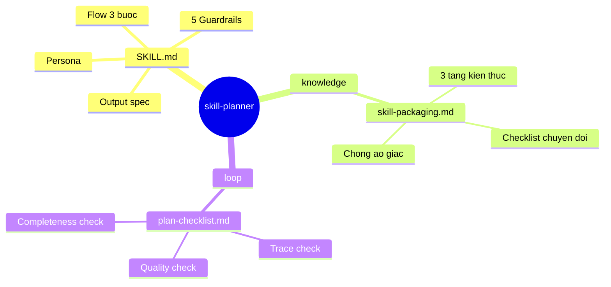
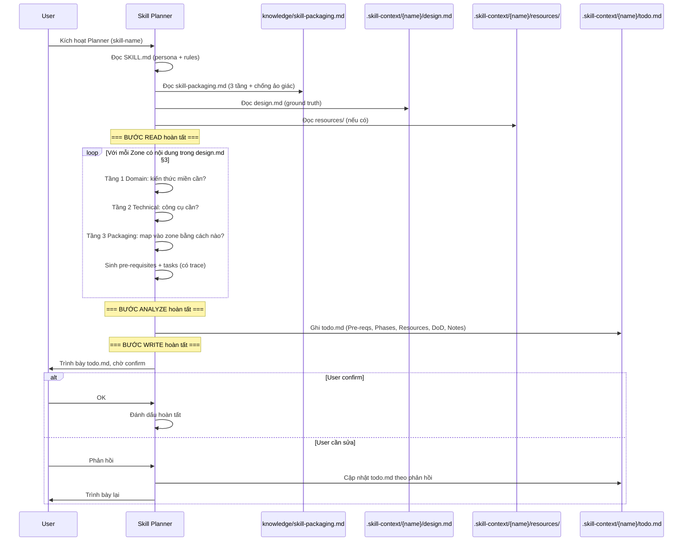

# skill-planner — Architecture Design

> Generated by Skill Architect | Date: 2026-02-13
> Status: 🟢 COMPLETE

---

## 1. Problem Statement

Sau khi Skill Architect tạo bản thiết kế kiến trúc (`design.md`), người dùng đối mặt
với 3 vấn đề:

1. **Không biết bắt đầu từ đâu** — design.md chứa kiến trúc tổng thể nhưng không chỉ
   thứ tự triển khai
2. **Không biết cần chuẩn bị kiến thức gì** — skill thường đòi hỏi domain knowledge
   mà người dùng (hoặc AI) chưa có
3. **Dễ lạc hướng khi xây dựng** — không có checklist hoàn thành, dễ bỏ sót thành phần

**Ai gặp vấn đề**: AI Agent và người dùng đang xây dựng Agent Skill mới.
**Vị trí**: Skill #2 trong bộ Master Skill Suite (Architect → **Planner** → Builder).

## 2. Capability Map

### 2.1 Tri thức (Knowledge)

| # | Kiến thức | File | Mục đích |
|---|----------|------|---------|
| K1 | Đóng gói kỹ năng (Skill Packaging) | `knowledge/skill-packaging.md` | Hiểu cách chuyển human skill → agent skill. Mô hình 3 tầng. Chống ảo giác |
| K2 | Bản thiết kế (Input) | `.skill-context/{name}/design.md` | Ground truth — nguồn duy nhất mọi task phải trace về |
| K3 | Tài liệu tham khảo (Input) | `.skill-context/{name}/resources/` + context prompt | Bổ sung từ user (nếu có) |

**Không dùng** `architect.md` — đó là framework thiết kế, không phải framework lập kế hoạch.

#### Nội dung `knowledge/skill-packaging.md`:

1. **Nguyên tắc đóng gói**
   - Kỹ năng con người = Kiến thức + Quy trình + Phán đoán
   - AI cần cả 3 ở dạng TƯỜNG MINH (explicit)
   - Phán đoán → chuyển thành Guardrails + Checklists

2. **Mô hình 3 tầng kiến thức**
   - Tầng 1 (Domain): Kiến thức miền — hiểu bản chất thứ cần làm
   - Tầng 2 (Technical): Kỹ thuật triển khai — công cụ, cú pháp
   - Tầng 3 (Packaging): Đóng gói — map human skill vào 7 Zones

3. **Checklist chuyển đổi** (cho mỗi Zone trong design.md):
   - Kiến thức miền nào cần? → knowledge/ files
   - Công cụ/kỹ thuật nào cần? → scripts/, tools
   - Quy trình nào cần chuẩn hóa? → SKILL.md phases
   - Phán đoán nào cần guardrail? → loop/ checklists
   - Output nào cần khuôn mẫu? → templates/

4. **Nguyên tắc chống ảo giác**
   - Mọi task PHẢI trace về section cụ thể trong design.md
   - Không phát minh requirements mới (chỉ phân rã)
   - Không đoán kiến thức miền — liệt kê để user cung cấp
   - Đánh dấu rõ: `[TỪ DESIGN]` vs `[GỢI Ý BỔ SUNG]`

### 2.2 Quy trình (Process)

**Flow liên tục 3 bước nội bộ, 1 interaction point ở cuối:**

| Bước | Hành động | Input | Output |
|------|----------|-------|--------|
| READ | Đọc design.md + resources/ + context prompt | Files từ `.skill-context/{name}/` | Model nội bộ về skill |
| ANALYZE | Phân tích 3 tầng kiến thức × mỗi Zone | Model + skill-packaging.md | Bảng kiến thức + tasks |
| WRITE | Ghi todo.md, trace mọi item về design.md | Kết quả phân tích | `.skill-context/{name}/todo.md` |

**Logic ANALYZE chi tiết:**
```
Với MỖI Zone có nội dung trong design.md §3 (Zone Mapping):
├── Tầng 1 (Domain): Kiến thức miền nào cần chuẩn bị?
├── Tầng 2 (Technical): Công cụ/kỹ thuật thu thập kiến thức nào cần?
└── Tầng 3 (Packaging): Map vào Zone bằng cách nào, cần tạo file gì?
→ Sinh: Pre-requisite entries + Task entries (có trace)
```

### 2.3 Kiem soat (Guardrails)

| # | Rule | Mô tả |
|---|------|-------|
| G1 | Trace bắt buộc | Mọi item trong todo.md PHẢI trace về `design.md §N` |
| G2 | Phân biệt nguồn | Đánh dấu `[TỪ DESIGN]` vs `[GỢI Ý BỔ SUNG]` |
| G3 | Không phát minh | Chỉ PHÂN RÃ thiết kế, không thêm requirements mới |
| G4 | Liệt kê, không tự làm | Liệt kê kiến thức cần → user chuẩn bị. Không tự search |
| G5 | Neo vào design.md | Ground truth duy nhất. Nếu thiếu → ghi vào Notes, không đoán |

## 3. Zone Mapping

| Zone | Cần? | Nội dung | Lý do |
|------|------|---------|-------|
| Core (SKILL.md) | ✅ | Persona Senior Skill Planner. Flow Read→Analyze→Write. 5 Guardrails. Output spec | Linh hồn điều khiển |
| Knowledge | ✅ | `skill-packaging.md` — 3 tầng kiến thức, checklist chuyển đổi, chống ảo giác | Tri thức nền về đóng gói kỹ năng |
| Scripts | ❌ | — | Output là markdown, không cần automation |
| Templates | ❌ | — | Dùng `todo.md.template` từ init_context |
| Data | ❌ | — | Không có config tĩnh |
| Loop | ✅ | `plan-checklist.md` — kiểm tra chất lượng todo.md | Kiểm soát output |
| Assets | ❌ | — | Không có media |

## 4. Folder Structure



## 5. Execution Flow



## 6. Interaction Points

| # | Thời điểm | Loại | Lý do |
|---|-----------|------|-------|
| 1 | Sau khi ghi todo.md | Confirm/Revise | User xem kết quả, xác nhận hoặc yêu cầu sửa |

Chỉ 1 interaction point — vì input (design.md) đã được confirm bởi Skill Architect.

## 7. Progressive Disclosure Plan

### Tầng 1: Bắt buộc đọc (Mandatory)
- `SKILL.md` — persona, flow, guardrails
- `knowledge/skill-packaging.md` — 3 tầng kiến thức, chống ảo giác

### Tầng 2: Tự quyết định (Conditional)
- `loop/plan-checklist.md` — đọc SAU khi ghi todo.md để tự kiểm tra

## 8. Risks & Blind Spots

| # | Risk | Nguy cơ | Mitigation |
|---|------|---------|------------|
| B1 | Bịa kiến thức miền | AI viết sai kiến thức domain vì tự suy luận | G1+G2: trace bắt buộc + đánh dấu nguồn |
| B2 | Tasks quá chung chung | "Tạo SKILL.md" không đủ chi tiết | plan-checklist: mỗi task phải actionable |
| B3 | Bỏ sót Zone | Design nói cần Zone nhưng Planner quên | Checklist: đối chiếu mọi Zone trong design §3 |
| B4 | Sai thứ tự dependencies | Task B phụ thuộc A nhưng xếp sau | Tasks xếp theo dependency, ghi rõ phụ thuộc |
| B5 | Không phân biệt 3 tầng | Gộp Domain + Technical + Packaging | skill-packaging.md bắt buộc tách 3 tầng |

## 9. Open Questions

Không có — tất cả decisions đã được thống nhất trong Phase 1-2.

## 10. Metadata

- **Skill Name**: skill-planner
- **Created**: 2026-02-13
- **Author**: Skill Architect
- **Framework**: architect.md v2.0
- **Position**: #2 trong bộ Master Skill Suite (Architect → **Planner** → Builder)
- **Decisions**: P-D1 (liệt kê), P-D2 (knowledge nền), P-D3 (3 tầng), P-D4 (flow liên tục)
- **Zones Used**: 3/7 (Core, Knowledge, Loop)
- **Status**: 🟢 COMPLETE
