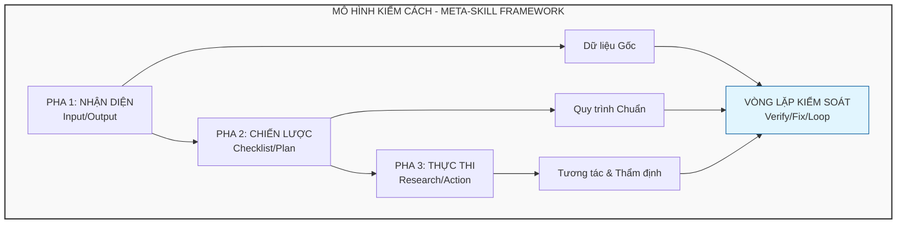
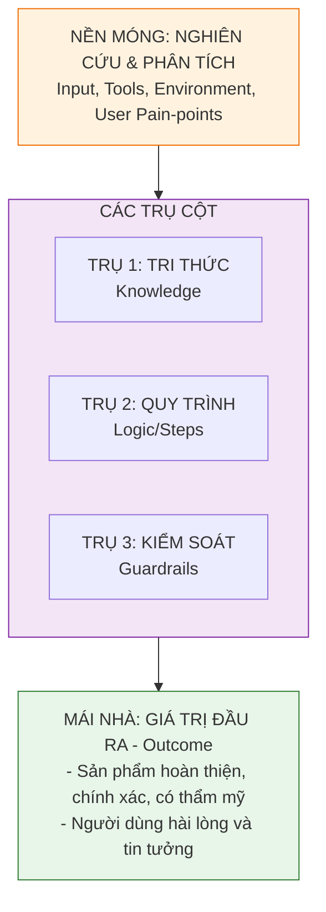
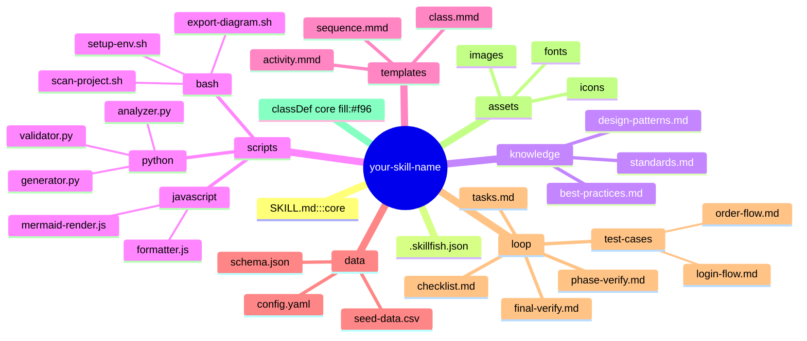
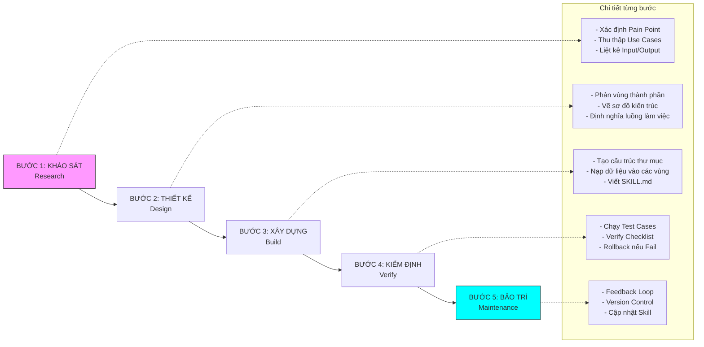
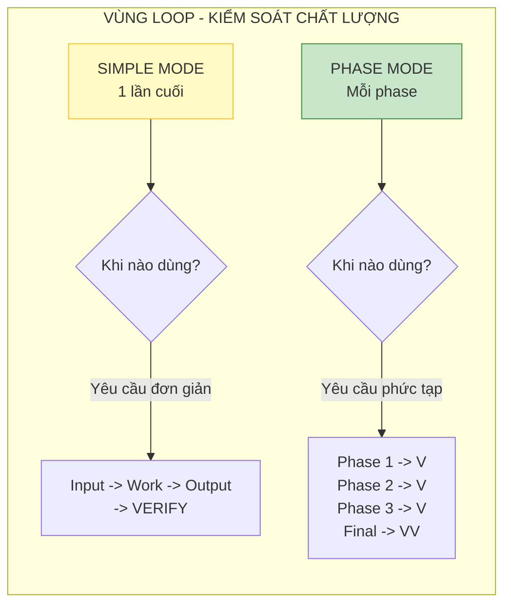
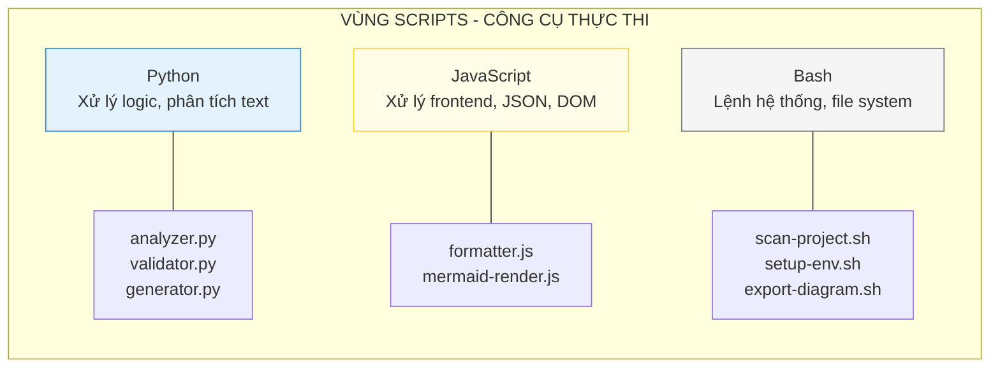
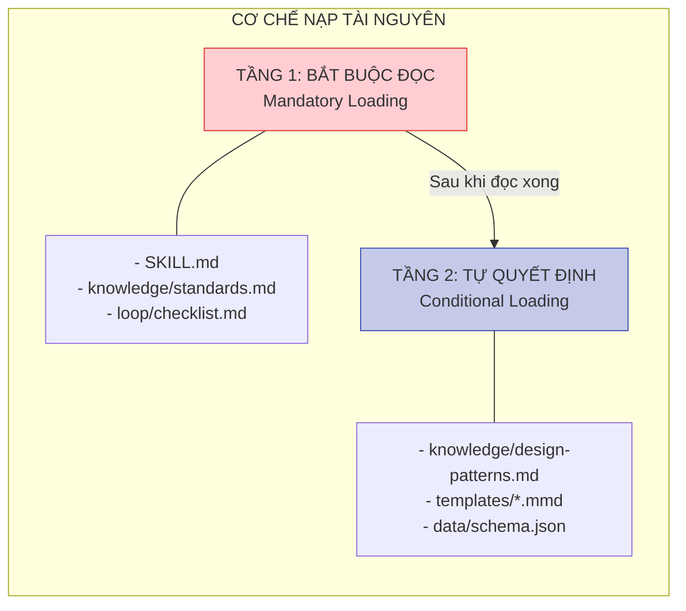
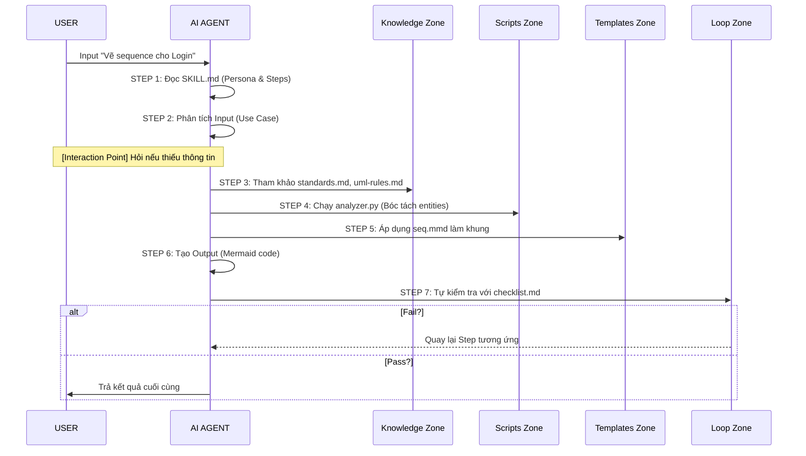
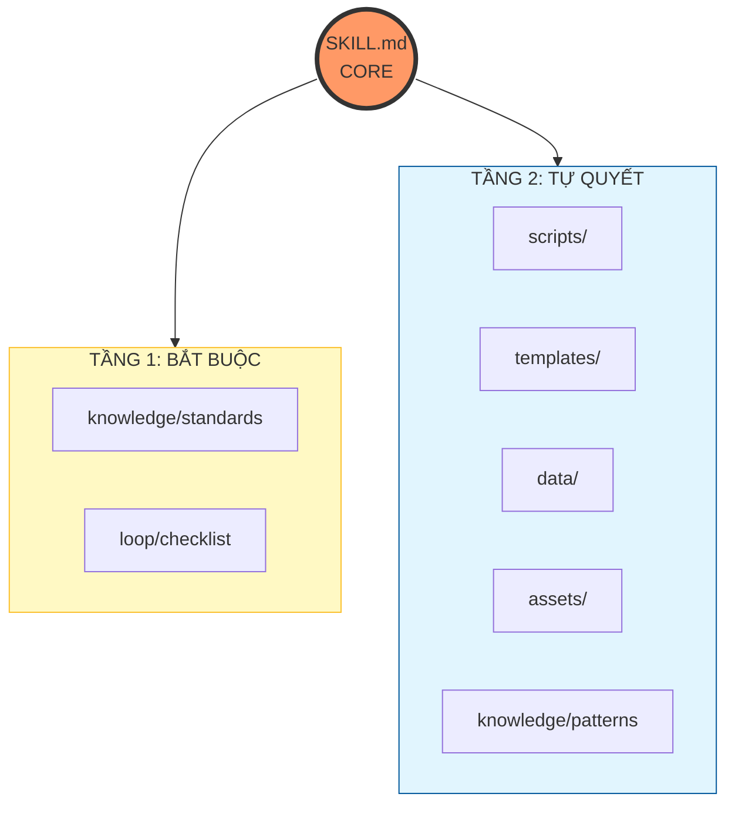

# AGENT SKILL FRAMEWORK - TÀI LIỆU KIẾN TRÚC

================================================================================
                        PHẦN 1: TỔNG QUAN KIẾN TRÚC
================================================================================

## 1.1. Mô hình Meta-Skill Framework

Mô hình này định nghĩa cách tiếp cận tổng thể để xây dựng một bộ Agent Skill
có cấu trúc, logic và khả năng kiểm soát chất lượng.




## 1.2. Kiến trúc "Ngôi nhà" (Building Metaphor)




================================================================================
                  PHẦN 2: CÁC THÀNH PHẦN KIẾN TRÚC (ZONES)
================================================================================

## 2.1. Cấu trúc thư mục chuẩn




## 2.2. Chi tiết từng Zone

| ZONE | MỤC ĐÍCH | VÍ DỤ NỘI DUNG | KHI NÀO AI ĐỌC? |
| :--- | :--- | :--- | :--- |
| **SKILL.md (Core)** | Linh hồn điều khiển | Persona, Steps, Guardrails | LUÔN LUÔN (khi skill được kích hoạt) |
| **knowledge/** | Tri thức chuẩn | UML rules, Design patterns | Khi cần tham khảo quy tắc |
| **scripts/** | Công cụ tự động hóa | Python analyzer, Bash generator | Khi cần thực thi logic phức tạp |
| **templates/** | Mẫu đầu ra | Mermaid templates, Code stubs | Khi cần tạo output chuẩn |
| **data/** | Cấu hình & dữ liệu cứng | YAML config, JSON schema | Khi cần đọc cấu hình cố định |
| **loop/** | Kiểm soát chất lượng | Checklist, Tasks, Test cases | SAU mỗi phase để tự kiểm tra |
| **assets/** | Tài nguyên tĩnh | Icons, Fonts, Images | Khi tạo output có media |


================================================================================
                     PHẦN 3: WORKFLOW XÂY DỰNG SKILL
================================================================================

## 3.1. Quy trình 5 bước




## 3.2. Chi tiết từng bước

### Bước 1: Khảo sát (Research & Discovery)

    Mục tiêu: Hiểu rõ "vùng đất" mình định xây.
    
    Việc cần làm:
    [1] Xác định Input: Người dùng sẽ đưa cái gì? (Rác hay vàng?)
    [2] Xác định Tools: AI sẽ dùng Terminal, Browser hay Library nào?
    [3] Tìm ra "Điểm mù" của AI: AI thường sai ở đâu trong công việc này?

### Bước 2: Thiết kế (System Design)

    Mục tiêu: Tạo ra logic "tường minh" cho AI.
    
    Việc cần làm:
    [1] Xây dựng Quy trình logic (Flowchart): Bước A -> Bước B
    [2] Xác định Điểm dừng tương tác: Khi nào AI PHẢI hỏi người dùng?
    [3] Định nghĩa Định dạng Output: Mermaid, Markdown, hay Code?

### Bước 3: Xây dựng (Build)

    Mục tiêu: Viết file SKILL.md và nạp tài nguyên.
    
    Việc cần làm:
    [1] Persona: Định vị AI là Senior Architect hay Senior Coder
    [2] Phase-based Steps: Chia nhỏ công việc thành các Pha
    [3] Tạo templates, scripts, knowledge files

### Bước 4: Kiểm định (Verify)

    Mục tiêu: Đảm bảo Skill hoạt động đúng.
    
    Việc cần làm:
    [1] Chạy Test Cases
    [2] Verify Checklist
    [3] Rollback nếu phát hiện lỗi

### Bước 5: Bảo trì (Maintenance)

    Mục tiêu: Giữ cho Skill không bị "lỗi thời".
    
    Việc cần làm:
    [1] Feedback Loop: Ghi lại chỗ AI làm dở
    [2] Version Control: Cập nhật khi môi trường thay đổi


================================================================================
                   PHẦN 4: CƠ CHẾ KIỂM SOÁT (LOOP/VERIFY)
================================================================================

## 4.1. Hai chế độ kiểm soát




## 4.2. Cấu trúc thư mục loop/

```
loop/
+-- checklist.md            <-- Danh sách kiểm tra chung
+-- tasks.md                <-- Công việc cần hoàn thành
+-- phase-verify.md         <-- Checklist riêng cho từng Phase
+-- final-verify.md         <-- Checklist kiểm tra cuối cùng
+-- test-cases/
    +-- login-flow.md
    +-- order-flow.md
```


================================================================================
                    PHẦN 5: VÙNG SCRIPTS (CÔNG CỤ)
================================================================================

## 5.1. Ba loại script




## 5.2. Ma trận chọn script theo công việc

| LOẠI CÔNG VIỆC | SCRIPT ƯU TIÊN |
| :--- | :--- |
| **Phân tích text, NLP** | Python |
| **Xử lý JSON, format data** | JavaScript |
| **Quét thư mục, đọc cấu trúc** | Bash |
| **Validate syntax** | Python |
| **Render diagram** | JavaScript |
| **Tạo file, copy template** | Bash |
| **Gọi API bên ngoài** | Python/JS |


================================================================================
               PHẦN 6: PROGRESSIVE DISCLOSURE (NẠP TÀI NGUYÊN)
================================================================================

## 6.1. Hai tầng nạp file




================================================================================
                  PHẦN 7: LUỒNG HOẠT ĐỘNG CỦA AI AGENT
================================================================================

## 7.1. Execution Flow




================================================================================
                   PHẦN 8: KIẾN TRÚC TỔNG HỢP (v2.0)
================================================================================




================================================================================
                            PHẦN 9: PHỤ LỤC
================================================================================

## 9.1. Nguyên tắc viết SKILL.md

    [1] Imperative Form: Luôn bắt đầu bằng động từ mạnh
        Ví dụ: "Analyze the input", "Generate the code"
        KHÔNG dùng: "You should analyze"
    
    [2] Progressive Disclosure: Chỉ để những gì AI cần làm NGAY LẬP TỨC
        trong SKILL.md. Tài liệu tham khảo dài để trong references/
    
    [3] Verified Steps: Mỗi giai đoạn (Phase) phải kết thúc bằng:
        "Check the output against the checklist in loop/checklist.md"

## 9.2. Điểm dừng tương tác (Interaction Points)

    AI PHẢI dừng lại và hỏi người dùng khi:
    [1] Thông tin đầu vào không đủ để xử lý
    [2] Có nhiều cách hiểu khác nhau
    [3] Cần xác nhận trước khi thực hiện hành động có rủi ro
    [4] Confidence Score dưới 70%

## 9.3. Cơ chế Rollback

    Nếu ở Phase N phát hiện lỗi từ Phase M (M < N):
    [1] Ghi nhận lỗi và nguyên nhân
    [2] Thông báo người dùng về việc quay lại
    [3] Quay lại Phase M và sửa lỗi
    [4] Tiếp tục lại từ Phase M

================================================================================
                               KẾT THÚC TÀI LIỆU
================================================================================
Phiên bản: 2.0
Ngày tạo: 2026-02-09
Tác giả: Vũ Thương Hải (với sự hỗ trợ của AI Agent)
================================================================================
