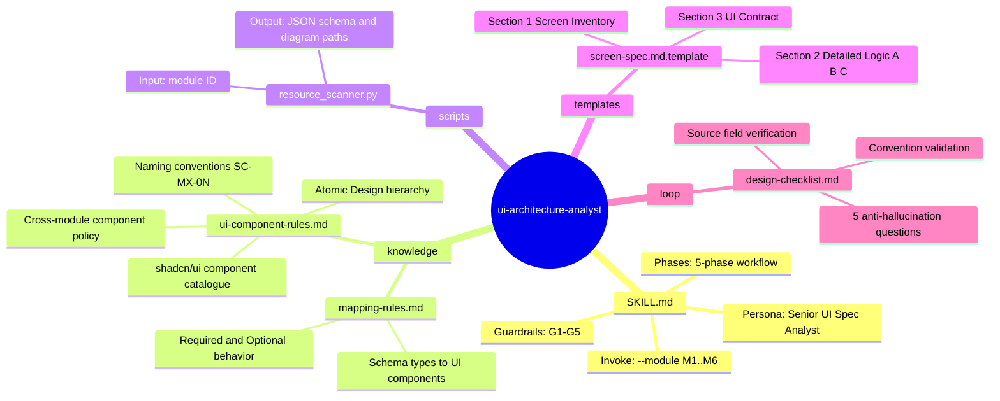
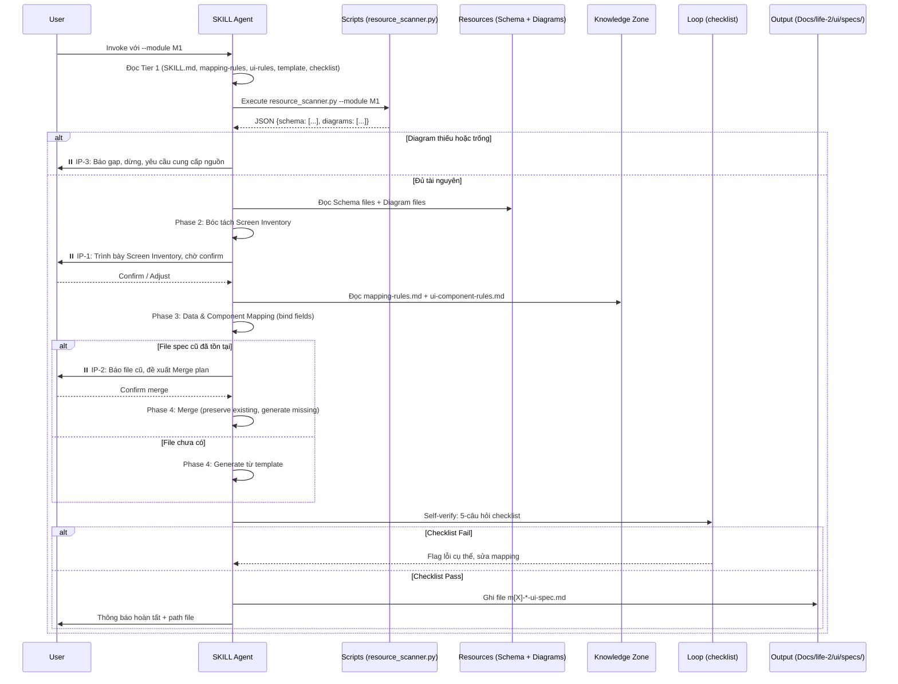
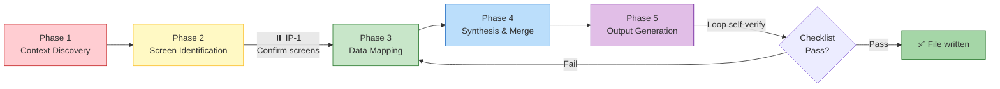
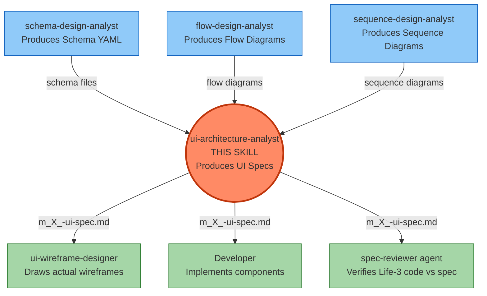

# ui-architecture-analyst — Architecture Design

> Generated by Skill Architect (Redesign v2) | Date: 2026-02-21
> Status: 🟢 DONE

---

## §1 Problem Statement

**Pain Point**:
Trong Life-2 hiện tại, có một "khoảng trống" giữa hai tầng:
- **Upstream**: Các sơ đồ logic (`Class Diagram`, `Flow Diagram`, `Sequence Diagram`) + `Database Schema` + `Docs/life-2/specs/` đã hoàn chỉnh.
- **Downstream**: Skill `ui-wireframe-designer` dùng MCP Pencil để vẽ wireframe trực tiếp lên canvas `.pen`.

Khi thiếu tầng trung gian này, AI vẽ wireframe sẽ **tự bịa field**, **tự suy diễn flow**, thiếu Traceability (không biết màn hình phục vụ UC nào, hiển thị data từ table nào). Kết quả: wireframe sai thực tế, thiếu field, và AI ở Life-3 không đủ context để code.

**Vai trò của skill này** *(nguồn: `resources/design-research.md`)*:
Dịch thuật từ **Logic → Nghiệp vụ màn hình**, làm rõ trước khi vẽ:
1. **Traceability**: Màn hình này phục vụ Use Case nào, data từ Schema nào, flow theo Diagram nào.
2. **Data Binding**: Field nào hiển thị, dùng component shadcn gì, validation rule gì.
3. **Consistency Check**: Class Diagram nói 5 field → Spec phải có đủ 5 (không thiếu, không thừa).

**Người dùng chính**:
1. **AI Agent** (`ui-wireframe-designer`) — đọc output làm input trước khi dùng MCP Pencil vẽ canvas.
2. **Developer (Life-3)** — đọc spec để implement UI component đúng field, đúng validation, đúng flow.

**Output cụ thể**:
Mỗi lần chạy với `--module M[X]`, skill tạo hoặc cập nhật file:
```
Docs/life-2/ui/specs/m[X]-*-ui-spec.md
```
File theo format 3-section chuẩn:
- **Section 1 — Screen Inventory**: Bảng liệt kê màn hình (`SC-M[X]-0N`), mục tiêu, actor, Use Case reference.
- **Section 2 — Detailed Screen Logic**: Mỗi màn hình có (A) Data-Component Binding table (shadcn component + Source Field), (B) Interaction Flow (Pre/Post/Error từ diagram), (C) States & Variations.
- **Section 3 — UI Contract**: Bảng mapping `UI ID → data-testid` cho AI Life-3 code được ngay.

---

## §2 Capability Map

### 2.1 Pillar 1 — Knowledge (Tri thức)

| Tri thức cần có | Nguồn cung cấp |
|----------------|----------------|
| Quy tắc ánh xạ: Schema field type → UI Component type (shadcn) | `knowledge/mapping-rules.md` |
| Naming convention: `SC-M[X]-0N`, `input-field-name`, `btn-action` | `knowledge/ui-component-rules.md` |
| shadcn/ui component catalogue (Button, Input, Select, Dialog, Card, Textarea, Badge, Avatar...) | `knowledge/ui-component-rules.md` |
| Atomic Design hierarchy + Neobrutalism style principles | `knowledge/ui-component-rules.md` |
| Cách parse Mermaid diagram để trích xuất flow/entity | Trong-context (SKILL.md instruction) |
| Traceability format: UC reference, Schema reference, Diagram reference | `knowledge/mapping-rules.md` |

### 2.2 Pillar 2 — Process (Quy trình)

5 phases tuần tự, mỗi phase có output rõ ràng:

| Phase | Tên | Input | Output | Gate |
|-------|-----|-------|--------|------|
| 1 | **Context Discovery** | Module ID (VD: `M1`) | Danh sách file cần đọc (schema + diagrams) | — |
| 2 | **Screen Identification** | Flow/Use Case diagrams | Screen Inventory draft | ⏸️ IP-1: Confirm với user |
| 3 | **Data & Component Mapping** | Schema + Screen Inventory | Data binding table cho từng screen | — |
| 4 | **Synthesis & Merge** | Draft spec cũ (nếu có) + Mapping table | Merged spec (existing section → preserve, missing → generate) | ⏸️ IP-2: Nếu file cũ tồn tại |
| 5 | **Output Generation** | Merged content + template | File `m[X]-*-ui-spec.md` đã ghi | Loop checklist |

### 2.3 Pillar 3 — Guardrails (Kiểm soát)

| ID | Rule | Xử lý khi vi phạm |
|----|------|--------------------|
| G1 | **Zero Hallucination**: Không thêm UI field nếu không có trong Schema | Dừng, ghi `[SOURCE MISSING]` vào Source Field column |
| G2 | **Zero Invented Flow**: Không thêm interaction flow nếu không có trong diagrams | Dừng, log gap → IP-3 |
| G3 | **Single Module Scope**: Mỗi lần chỉ xử lý 1 module | Từ chối, yêu cầu user re-invoke với module cụ thể |
| G4 | **Merge over Overwrite**: File cũ đã tồn tại → merge, không ghi đè | IP-2 trước khi write |
| G5 | **Missing Diagram Gate**: Nếu diagram nguồn thiếu/trống → không đoán | Dừng tại IP-3, báo gap cho user |

---

## §3 Zone Mapping

> ⚠️ Contract Section — Planner đọc §3 để decompose thành Tasks.

| Zone | Files cần tạo | Nội dung | Bắt buộc? |
|------|--------------|----------|-----------|
| Core (SKILL.md) | `SKILL.md` | Persona "Senior UI Spec Analyst", workflow 5 phases, guardrails G1–G5, invoke instructions (`--module M[X]`) | ✅ |
| Knowledge | `knowledge/mapping-rules.md` | Bảng ánh xạ: Schema type (`text`, `email`, `select`, `richText`, `upload`, `relationship`) → UI Component (`Input`, `Select`, `RichEditor`, `ImageUpload`, `RelationPicker`) + Required/Optional behavior | ✅ |
| Knowledge | `knowledge/ui-component-rules.md` | (1) Naming convention: Screen ID (`SC-M[X]-0N`), Element ID (`input-*`, `btn-*`, `select-*`, `link-*`). (2) shadcn/ui component catalogue (Button, Input, Select, Dialog, Card, v.v.). (3) Atomic Design hierarchy. (4) Cross-module component policy (Header/Sidebar → skip, document in index only) | ✅ |
| Scripts | `scripts/resource_scanner.py` | Nhận `--module M[X]` → tự động resolve và trả về list đường dẫn file: Schema YAML, Flow diagram, Sequence diagram, Use Case diagram cho module đó. Trả về JSON `{schema: [], diagrams: []}` | ✅ |
| Templates | `templates/screen-spec.md.template` | Mẫu Markdown chuẩn 3-section: Screen Inventory table, Detailed Screen Logic (A/B/C sub-sections), UI Contract table | ✅ |
| Data | Không cần | N/A — Mapping rules đã ở knowledge/, module paths resolved bởi script | ❌ |
| Loop | `loop/design-checklist.md` | 5 câu hỏi phản biện bắt buộc trước khi ghi file: (1) Mọi Source Field có trong Schema không? (2) Mọi flow có trong diagram không? (3) File cũ đã được merge chưa? (4) Screen IDs đúng convention không? (5) Có cross-module field chưa xử lý không? | ✅ |
| Assets | Không cần | N/A — Skill chỉ tạo Markdown output, không cần icons hay fonts | ❌ |

---

## §4 Folder Structure



---

## §5 Execution Flow

### D2 — Execution Flow (Runtime)



### D3 — Workflow Phases



### D4 — Skill Ecosystem Relationship



---

## §6 Interaction Points

| # | ID | Thời điểm kích hoạt | Lý do bắt buộc dừng | Hành động của AI |
|---|----|--------------------|--------------------|-----------------|
| 1 | **IP-1** | Sau Phase 2 — Screen Inventory đã bóc tách xong | Confirm danh sách màn hình trước khi đi sâu vào data mapping (tránh mapping sai scope) | Trình bày bảng Screen Inventory (Screen ID, Tên, Mục tiêu, Actor). Chờ `confirm` hoặc nhận điều chỉnh. |
| 2 | **IP-2** | Khi `resource_scanner.py` phát hiện file spec cũ đã tồn tại | Tránh ghi đè mất thông tin human đã viết vào draft cũ | Hiển thị list sections đã có vs. chưa có. Đề xuất merge plan: "preserve §A, §B — generate §C". Chờ confirm. |
| 3 | **IP-3** | Khi diagram nguồn bị thiếu hoặc nội dung trống/placeholder | G5 Guardrail: không đoán flow khi không có nguồn | Báo rõ: "Diagram `[path]` không có nội dung đủ để extract flow cho `[Screen ID]`." Stop toàn bộ phase. Yêu cầu user cung cấp diagram trước hoặc chỉ định fallback. |

---

## §7 Progressive Disclosure Plan

### Tier 1 — Bắt buộc đọc ngay khi invoke (Mandatory)

Đây là những file AI **phải đọc trước khi làm bất kỳ thứ gì** — kể cả trước khi chạy script.

| File | Lý do Tier 1 |
|------|--------------|
| `SKILL.md` | Persona, workflow, guardrails — nền tảng điều khiển toàn bộ session |
| `knowledge/mapping-rules.md` | Cần ngay từ Phase 1 để biết cần tìm field type nào trong schema |
| `knowledge/ui-component-rules.md` | Cần ngay để output Screen Inventory đúng naming convention |
| `loop/design-checklist.md` | Đọc sớm để AI "ý thức" ranh giới — không phải chỉ dùng cuối |
| `templates/screen-spec.md.template` | Biết format output ngay từ đầu để mapping đúng structure |

### Tier 2 — Đọc theo context động (Conditional)

| File / Resource | Điều kiện load |
|-----------------|---------------|
| Schema YAML files (VD: `m1-auth-schema.yaml`) | Được `resource_scanner.py` resolve và trả về theo module cụ thể |
| Diagram files (flow, sequence) | Được `resource_scanner.py` resolve và trả về theo module cụ thể |
| File spec cũ `Docs/life-2/ui/specs/m[X]-*-ui-spec.md` | Chỉ đọc nếu file tồn tại (Phase 4 Merge) |

---

## §8 Risks & Blind Spots

| # | Risk | Severity | Mitigation |
|---|------|----------|-----------|
| R1 | **Context Overflow**: Đọc quá nhiều file schema + diagrams toàn dự án, tràn context window | P1 | `resource_scanner.py` bắt buộc scope theo module. Mỗi invocation chỉ resolve files của 1 module. |
| R2 | **Field Hallucination**: AI thêm UI input không có trong Schema (VD: thêm `input-phone` khi schema không có `phone` field) | P0 | Bắt buộc cột "Source Field" trong mọi UI Element row. `loop/design-checklist.md` câu 1 verify 1-1 với schema. |
| R3 | **Overwrite Data Loss**: Ghi đè file spec cũ, mất nội dung human đã viết tay | P1 | IP-2 bắt buộc khi file tồn tại. Merge algorithm: section cũ còn nội dung → preserve; section trống/missing → generate. |
| R4 | **Missing Diagram Gap**: Diagram nguồn trống hoặc chưa được tạo → AI đoán mò interaction flow | P1 | IP-3 kích hoạt khi diagram thiếu. AI không được tiếp tục — báo gap, dừng, yêu cầu user cung cấp upstream artifact. |
| R5 | **Component Misidentification**: Nhầm UI component type (VD: dùng `Input` thay vì `Select` cho field `enum`) | P2 | `knowledge/mapping-rules.md` có lookup table đầy đủ. Checklist câu 2 verify component type match schema type. |

---

## §9 Open Questions

| # | Câu hỏi | Ảnh hưởng | Trạng thái |
|---|---------|----------|-----------|
| Q1 | Màn hình **cross-module** (VD: Notification Banner xuất hiện trên mọi screen, Navigation Header) — document ở đâu? Lặp lại trong mỗi spec hay có file riêng? | Ảnh hưởng scope Screen Inventory của từng module | 🔵 ĐỀ XUẤT: Document 1 lần ở `Docs/life-2/ui/specs/index.md` → các module spec chỉ reference, không lặp lại. Cần Builder xác nhận. |
| Q2 | **Error/Empty States** của một màn hình — document như sub-section trong Section 2C hay tạo Screen ID riêng (VD: `SC-M1-01-empty`)? | Ảnh hưởng Screen Inventory count và wireframe scope | 🔵 ĐỀ XUẤT: Sub-section trong §2C (States & Variations). Không tạo Screen ID riêng trừ khi state có toàn bộ layout khác biệt hoàn toàn. Cần Builder xác nhận. |
| Q3 | `resource_scanner.py` — khi diagram file tồn tại nhưng chỉ có **placeholder content** (chưa điền), IP-3 có kích hoạt không? Hay chỉ khi file không tồn tại? | Ảnh hưởng G5 guardrail behavior | ✅ ĐÃ LÀM RÕ (2026-02-21): IP-3 kích hoạt khi: (1) file size < 200 bytes, OR (2) chứa keyword `TODO`/`placeholder`/`...`, OR (3) Mermaid stub rỗng (block `graph`/`sequenceDiagram`/`flowchart` không có nội dung bên trong). File thiếu hoàn toàn cũng trigger IP-3. |

---

## §10 Metadata

- **Skill Name**: `ui-architecture-analyst`
- **Context Dir**: `.skill-context/ui-architecture-analyst/`
- **Created**: 2026-02-21
- **Redesigned**: 2026-02-21 (v2 — full redesign by Skill Architect)
- **Author**: Skill Architect
- **Framework**: `architect.md v2.0`
- **Status**: 🟢 DONE
- **Version**: v2.0 (redesign)
- **Changes from v1**:
  - Added `knowledge/ui-component-rules.md` to §3 Zone Mapping
  - Fixed `knowledge/mapping-rules.md` from Tier 2 → Tier 1 in §7
  - Added IP-3 (Missing Diagram Gate) to §6
  - Added R4, R5 to §8 Risks (from 3 → 5 risks)
  - Rewrote D3 flowchart with complete 5 phases + styles
  - Added D4 Ecosystem Relationship diagram (new)
  - Added 3 substantive Open Questions to §9 (from 1 → 3)
  - Enhanced §2 Pillar 2 with Phase I/O table

- **Handoff Checklist**:
  - [x] §3 có tên file cụ thể (không placeholder)
  - [x] §7 phân biệt rõ Tier 1 (5 files mandatory) và Tier 2 (dynamic via script)
  - [x] §8 có 5 risks kèm mitigation cụ thể
  - [x] §9 có 3 Open Questions thực chất (Q3 đánh dấu CẦN LÀM RÕ cho Builder)
  - [x] 4 sơ đồ Mermaid (D1 mindmap, D2 sequence, D3 flowchart, D4 ecosystem)
  - [x] Sẵn sàng cho `skill-planner`
