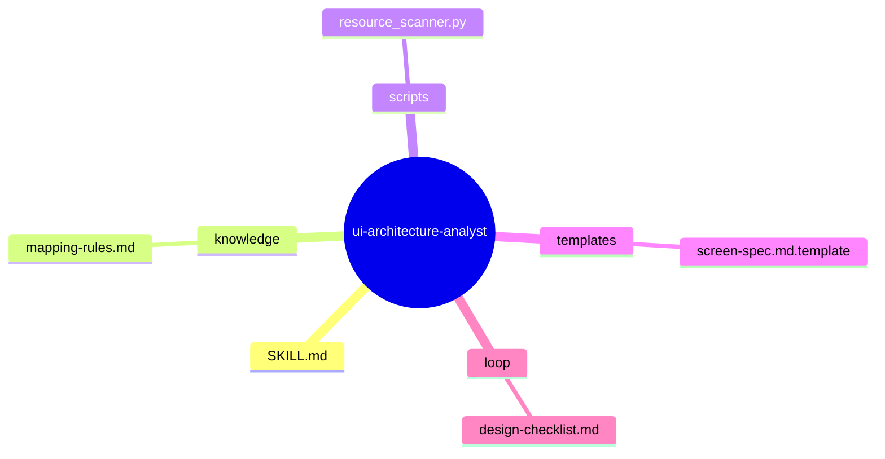
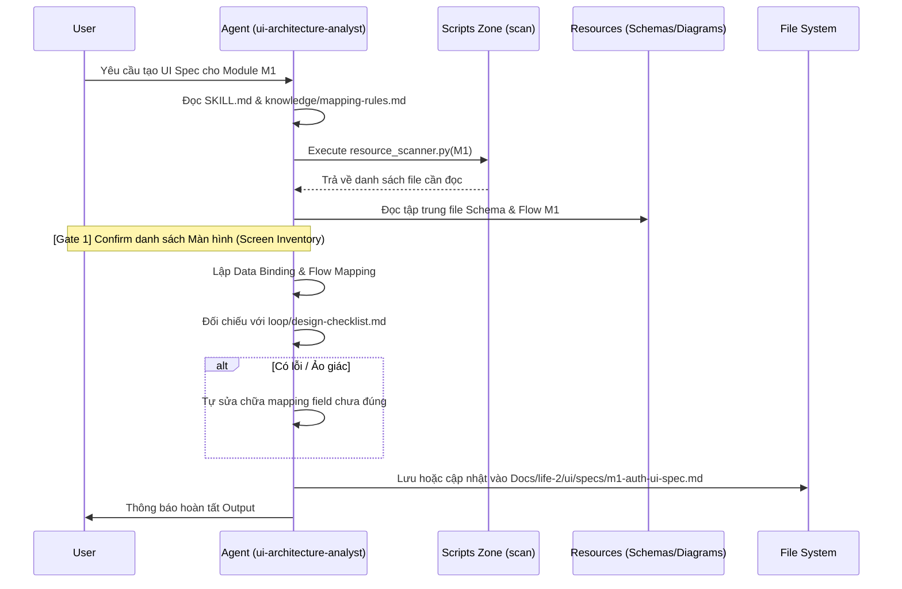
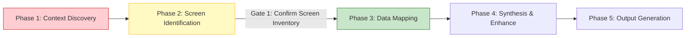

# ui-architecture-analyst — Architecture Design

> Generated by Skill Architect | Date: 2026-02-21
> Status: 🔵 IN PROGRESS

---

## 1. Problem Statement

**Vấn đề**: Thiếu bước trung gian kết nối giữa các sơ đồ logic (Class, Flow, Sequence) và giai đoạn vẽ giao diện (Wireframe) ở Life-2. Cần đặc tả rõ mỗi màn hình chứa các dữ liệu gì, gọi action gì trước khi thực thi vẽ để tránh AI vẽ sót/ảo giác field.

**Người dùng**: AI Agent ở giai đoạn thiết kế UI (đặc biệt là `ui-wireframe-designer`) và Developers cần bản mô tả chức năng UI chi tiết.

**Lý do cần skill**: Có một "chuyên gia" tự động dịch logic trừu tượng (Database Schemas, Business Flows) thành các bản **Screen Specifications** cụ thể, chuẩn mực cho từng Module. Đồng thời, có khả năng merge/enrich các bản nháp có sẵn.

---

## 2. Capability Map

### 2.1 Tri thức (Knowledge — Pillar 1)
- Quy tắc ánh xạ dữ liệu: Biến kiểu dữ liệu (text, email, select từ PayloadCMS Schema) thành các UI Component Elements tương ứng.
- Khả năng đọc hiểu Activity/Sequence Mermaid Diagram để tạo Interaction Flow cho UI.
- Nắm vững kiến trúc "Atomic Design" và naming convention cho UI IDs (`btn-submit`, `input-email`).

### 2.2 Quy trình (Process — Pillar 2)
1. **Context Discovery**: Nhận Module (VD: M1), tìm kiếm schema và diagrams tương ứng bằng script.
2. **Screen Identification**: Bóc tách các màn hình cần thiết từ Use Case / Flow.
3. **Data & Component Mapping**: Gắn các UI Elements với Data Fields và Trigger Actions.
4. **Logic Synthesis (Merge & Enhance)**: Trích xuất logic từ file nháp (nếu có) để không ghi đè mất thông tin cũ.
5. **Output Generation**: Ghi ra file theo template `ui/specs/m[X]-*-ui-spec.md`.

### 2.3 Kiểm soát (Guardrails — Pillar 3)
- Tuyệt đối không tự bịa đặt Data Field mà không có trong Database Schema.
- Không bịa Flow nếu không được định nghĩa ở Sequence/Activity Diagrams.
- Tránh tràn Context bằng cách bắt buộc giới hạn việc quét ở một Module duy nhất mỗi lần chạy.

---

## 3. Zone Mapping

> ⚠️ Contract Section — Planner đọc §3 để decompose thành Tasks.

| Zone | Files cần tạo | Nội dung | Bắt buộc? |
|------|--------------|----------|-----------|
| Core (SKILL.md) | `SKILL.md` | Persona, workflow 5 bước cơ bản, guardrails, hướng dẫn phân tích. | ✅ |
| Knowledge | `knowledge/mapping-rules.md` | Quy tắc ánh xạ Schema -> UI type và quy định đặt tên UI Element ID. | ✅ |
| Scripts | `scripts/resource_scanner.py` | Script để tự động gom đường link các file Schema và Diagrams tương ứng với Module đầu vào. | ✅ |
| Templates | `templates/screen-spec.md.template` | Mẫu cấu trúc Markdown chuẩn phân chia Screen Inventory và Detailed Logic. | ✅ |
| Data | Không cần | N/A | ❌ |
| Loop | `loop/design-checklist.md` | Bộ 5 câu hỏi phản biện bắt buộc trước khi ghi ra file Screen Spec cuối cùng. | ✅ |
| Assets | Không cần | N/A | ❌ |

---

## 4. Folder Structure

---

## 5. Execution Flow

### D3 — Workflow Phases

---

## 6. Interaction Points

| # | Thời điểm | Lý do dừng | Hành động của AI |
|---|-----------|-----------|-----------------|
| 1 | Sau khi gom được Context & Lên danh sách Screen | Xác nhận xem danh sách các màn hình (Screen Inventory) bóc tách ra đã hợp lý với Use Case chưa. | Trình bày bảng Screen Inventory + chờ confirm trước khi đi sâu vào data mapping. |
| 2 | Khi tìm thấy file spec cũ đã tồn tại | Tránh vô tình ghi đè các cấu trúc đặc biệt mà con người đã viết vào bản draft. | Đề xuất plan "Merge & Enhance" + chờ confirm. |

---

## 7. Progressive Disclosure Plan

### Tier 1: Bắt buộc đọc (Mandatory)
- `SKILL.md`
- `loop/design-checklist.md` (Để ý thức ranh giới an toàn của Data Mapping ngay từ đầu)
- `templates/screen-spec.md.template`

### Tier 2: Đọc khi cần (Conditional)
- `knowledge/mapping-rules.md` — Đọc trong Phase "Data & Component Mapping".

---

## 8. Risks & Blind Spots

| # | Risk | Severity | Mitigation |
|---|------|----------|-----------|
| 1 | Tràn Context (Overflow) do đọc quá nhiều file của toàn dự án. | P1 | Giới hạn bắt buộc truyền theo từng `module` (VD: tham số `--module M1`). |
| 2 | Ảo giác Field UI: Thêm các UI input không có trong Schema. | P0 | Bắt buộc đối chiếu 1-1 với Schema, yêu cầu ghi Cột "Source Field" trong Spec. Sử dụng checklist để self-verify. |
| 3 | Ghi đè file bất cẩn làm mất dữ liệu draft cũ. | P1 | Sử dụng thuật toán Merge/Update nếu file đã tồn tại thay vì tạo và overwrite lại từ đầu. Đặt Interaction Point để hỏi User. |

---

## 9. Open Questions

| # | Câu hỏi | Nguồn (Phase) | Trạng thái |
|---|---------|--------------|-----------|
| 1 | File config "style guide" có cần load không? | Mở rộng | ✅ Đã giải quyết (Không cần thiết cho phân tích Logic UI, chỉ cần ở Skill Wireframe). |

---

## 10. Metadata

- **Skill Name**: ui-architecture-analyst
- **Created**: 2026-02-21
- **Author**: Skill Architect
- **Framework**: architect.md v2.0
- **Status**: 🟢 DONE
- **Handoff Checklist**:
  - [x] design.md hoàn thiện (checklist pass)
  - [x] Sẵn sàng cho skill-planner
