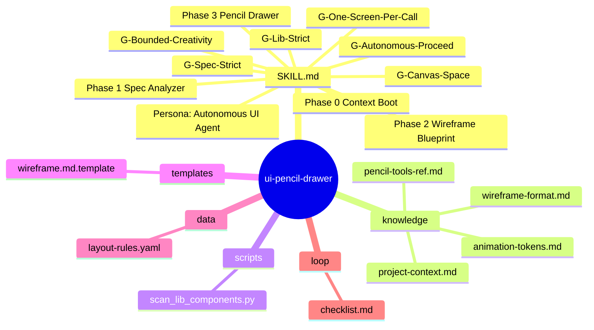
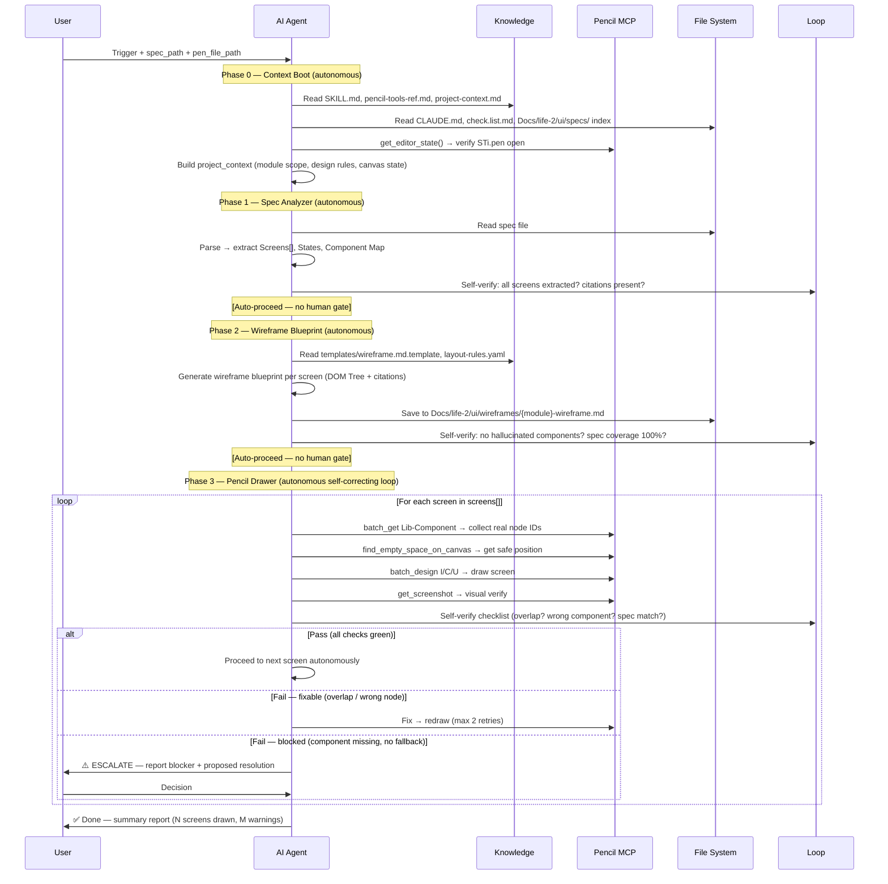
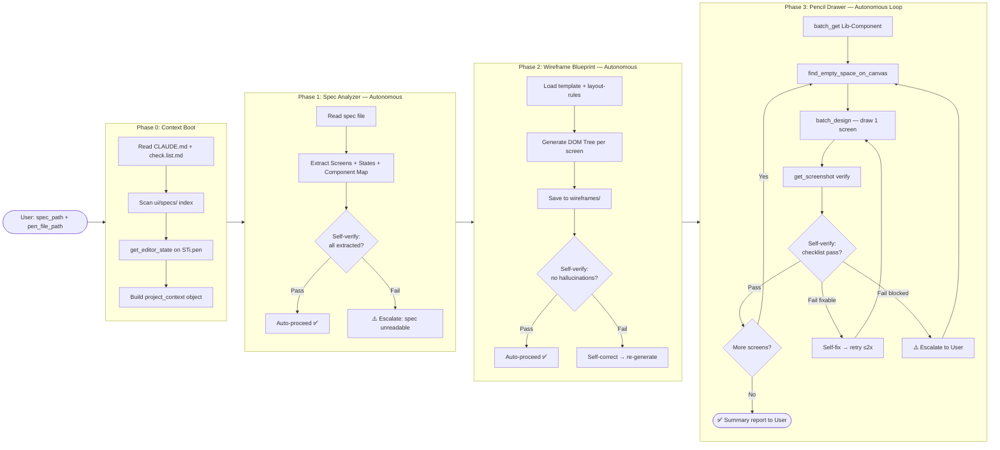

# ui-pencil-drawer — Architecture Design

> Generated by Skill Architect | Date: 2026-02-21
> Status: 🟢 COMPLETE
> Philosophy: **AGI-Oriented Autonomous Execution** — AI tự hiểu dự án, tự quyết định, chỉ dừng khi genuinely blocked. Human chỉ cung cấp input ban đầu.

---

## 1. Problem Statement

**Vấn đề**: Thiết kế UI thủ công cho hàng chục màn hình (M1–M6) trong dự án Steve Void rất tốn thời gian — cần kéo thả, căn chỉnh tọa độ, clone từng component một trong Pencil canvas. Với 6 module mỗi module có 3–8 màn hình, quy trình manual tạo bottleneck nghiêm trọng trong Life-2.

**Người dùng**: Steve (developer + designer), đang trong Life-2 design phase của KLTN, cần chuyển các file `Docs/life-2/ui/specs/*.md` thành UI hoàn chỉnh trong file `STi.pen`.

**Lý do cần skill**: Thay vì vẽ tay từng pixel, skill sẽ: (1) tự boot context dự án từ docs; (2) đọc spec → phân tích screens & component mapping; (3) tạo wireframe blueprint markdown; (4) tự động clone components từ `Lib-Component` frame vào canvas qua Pencil MCP tools. Triết lý: **AI tự thực thi end-to-end**, human chỉ cung cấp spec path + `.pen` file path ban đầu. Mục tiêu: tiết kiệm 90%+ thời gian design thủ công, giảm thiểu human-in-the-loop.

---

## 2. Capability Map

### 2.1 Tri thức (Knowledge — Pillar 1)

- **Project context**: Tự đọc `check.list.md`, `Docs/life-2/specs/` để hiểu design direction, module scope, naming conventions
- **UI Spec format**: Hiểu cấu trúc markdown specs với Screens, States, Block/Component mapping
- **Pencil MCP API**: 6 tools cần dùng — `batch_get`, `batch_design` (I/C/U/R/D ops), `find_empty_space_on_canvas`, `get_screenshot`, `snapshot_layout`, `get_editor_state`
- **Component library scanning**: Tự quét frame `Lib-Component` trong STi.pen để lấy reusable node IDs (không hỏi user)
- **Wireframe blueprint format**: DOM Tree dạng text — phân cấp component, mapping sang Lib-Component IDs, override text

### 2.2 Quy trình (Process — Pillar 2)

> **Autonomous Execution Model**: AI tự chạy end-to-end. Chỉ dừng khi: (a) ambiguity không resolve được từ docs, hoặc (b) component thiếu không có fallback. Không hỏi confirm cho từng phase.

**Phase 0 — Context Boot (mới):**

- Hành động: Tự đọc `CLAUDE.md` → `check.list.md` → `Docs/life-2/ui/specs/` index → `get_editor_state()` trên STi.pen
- Output nội bộ: project_context object (module scope, design rules, canvas state)
- Rule: Không skip phase này. Context Boot đảm bảo AI không hallucinate field names hay design patterns.

**Phase 1 — Spec Analyzer (autonomous):**

- Input: Spec file path (ví dụ: `Docs/life-2/ui/specs/m1-auth-ui-spec.md`)
- Hành động: Parse → extract danh sách Screens, States, và Component Mapping
- Output nội bộ: screens[], component_map — AI tự tiến sang Phase 2 ngay
- Escalate only if: spec file không tồn tại hoặc format không nhận dạng được

**Phase 2 — Wireframe Blueprint (autonomous):**

- Input: Kết quả Phase 1 (screens + component map)
- Hành động: Tự tạo wireframe blueprint (DOM Tree text) cho từng màn hình
- Output: File `Docs/life-2/ui/wireframes/{module}-wireframe.md` — lưu và tiến ngay
- Rule: Mỗi blueprint entry phải có source citation từ spec. Tự validate trước khi tiến.

**Phase 3 — Pencil Drawer (autonomous self-correcting loop):**

- Input: Wireframe blueprint + file STi.pen đang mở
- Hành động: `batch_get` Lib-Component → `find_empty_space_on_canvas` → `batch_design` (I/C/U) → `get_screenshot` → self-verify → next screen
- Rule: Vẽ 1 màn hình / 1 `batch_design` call. Tự fix nếu screenshot không pass. Tối đa 2 retry/screen.
- Escalate only if: component missing + không có fallback sau khi đã tìm Lib-Component

### 2.3 Kiểm soát (Guardrails — Pillar 3)

- **G-Lib-Strict**: 100% resource phải là `ref` type từ Lib-Component. Không tự vẽ rectangle/text thô nếu Lib-Component đã có component tương đương.
- **G-Spec-Strict**: Không thêm field, button, hay element nếu spec file không đề cập. Mỗi component cần có source citation.
- **G-Canvas-Space**: Bắt buộc gọi `find_empty_space_on_canvas` trước mỗi batch_design session. Không vẽ đè lên Lib-Component frame.
- **G-One-Screen-Per-Call**: Mỗi batch_design call chỉ vẽ 1 màn hình. Screenshot verify trước khi vẽ màn hình tiếp theo.
- **G-Bounded-Creativity**: Phân tách rõ *Strict Zones* (chỉ lắp ghép block 100% đúng Spec) và *Fluid Zones* (được sáng tạo spacing, copy, và dùng hàm AI sinh hình ảnh `G()`).

---

## 3. Zone Mapping

> ⚠️ Contract Section — Planner đọc §3 để decompose thành Tasks.
> Mọi Zone PHẢI có giá trị trong cột "Files cần tạo". Zone không dùng → ghi "Không cần".

| Zone | Files cần tạo | Nội dung | Bắt buộc? |
| :--- | :--- | :--- | :--- |
| Core (SKILL.md) | `SKILL.md` | Persona: Autonomous UI Design Agent. 4 Phases (Phase 0–3). 5 Guardrails (kể cả Bounded-Creativity). Autonomous execution model: self-correcting, escalate only when genuinely blocked. | ✅ |
| Knowledge | `knowledge/pencil-tools-ref.md` | Reference đầy đủ syntax cho 6 Pencil MCP tools: batch_get, batch_design ops (I/C/U/R/D/G), find_empty_space_on_canvas, get_screenshot, snapshot_layout, get_editor_state | ✅ |
| Knowledge | `knowledge/wireframe-format.md` | Chuẩn format wireframe blueprint: DOM Tree hierarchy, component mapping syntax, text override notation, source citation format | ✅ |
| Knowledge | `knowledge/project-context.md` | Hướng dẫn AI đọc project docs để self-orient: CLAUDE.md → check.list.md → ui/specs/ → STi.pen. Naming conventions, module scope, design aesthetic (Neobrutalism + Pink). | ✅ |
| Knowledge | `knowledge/animation-tokens.md` | Bộ từ điển animation tokens → Framer Motion specs → Pencil `context` field assignment. 7 tokens (fade-up, scale-in, hover-lift, ...). Dùng trong Phase 3 Fluid Zones. Self-critique checklist cho animation. | ✅ |
| Scripts | `scripts/scan_lib_components.py` | Quét frame `Lib-Component` trong STi.pen qua batch_get, extract reusable node IDs, output JSON map tên→nodeId. Dùng trong Phase 0 Context Boot. | ✅ |
| Templates | `templates/wireframe.md.template` | Template markdown cho 1 màn hình: header, layout-direction, component-slots, source-citation, states, notes | ✅ |
| Data | `data/layout-rules.yaml` | Static rules: default gap (24px), padding (16/24/32px), screen width (375/1440px), frame naming convention, retry limits | ✅ |
| Loop | `loop/checklist.md` | Autonomous self-verify checklist — AI chạy sau mỗi Phase: spec coverage, no hallucinated components, no canvas overlaps, screenshot quality. Định nghĩa pass/fail threshold để tự quyết tiến hay fix. | ✅ |
| Assets | Không cần | N/A | ❌ |

---

## 4. Folder Structure

---

## 5. Execution Flow

---

## 5b. Workflow Phases

---

## 6. Interaction Points

> **AGI Principle**: AI không hỏi confirm cho từng phase. Chỉ escalate khi gặp hard blocker mà không thể tự resolve. Default behavior = tự quyết định và tiến.

| # | Trigger | Điều kiện escalate | Hành động của AI |
| :--- | :--- | :--- | :--- |
| 1 | Phase 0 — STi.pen không mở hoặc không tìm thấy | `get_editor_state` trả về null và không có pen file path hợp lệ từ user | Báo lỗi + hướng dẫn: "Vui lòng mở STi.pen trước" |
| 2 | Phase 3 — Component missing sau khi đã tìm toàn bộ Lib-Component | Component trong wireframe blueprint không match bất kỳ node nào trong Lib-Component (sau fuzzy search) | Báo: `[BLOCKED] Component "{name}" không tồn tại trong Lib-Component. Options: (a) skip, (b) dùng primitive, (c) bạn thêm vào Lib-Component rồi AI continue` |

**Không escalate (AI tự xử lý):**

- Overlap nhỏ → tự gọi lại `find_empty_space_on_canvas` với padding lớn hơn
- Screenshot quality thấp → tự retry `batch_design` (max 2 lần)
- Spec section không rõ → tự inference từ project_context + ghi note trong wireframe
- Component tên gần giống → tự dùng best-match từ Lib-Component scan

---

## 7. Progressive Disclosure Plan

### Tier 0: Phase 0 Boot (trước khi làm bất cứ gì)

- `SKILL.md` — load persona + autonomous execution model
- `knowledge/project-context.md` — hướng dẫn đọc project docs để self-orient
- Sau đó: tự đọc `CLAUDE.md` + `check.list.md` + `Docs/life-2/ui/specs/` index

### Tier 1: Bắt buộc đọc trước Phase 2 (Mandatory)

- `knowledge/pencil-tools-ref.md` — Pencil MCP API syntax (cần trước Phase 3)
- `knowledge/wireframe-format.md` — blueprint format + source citation chuẩn

### Tier 2: Đọc khi cần (Conditional — AI tự quyết khi nào đọc)

- `templates/wireframe.md.template` — khi bắt đầu generate wireframe (Phase 2)
- `data/layout-rules.yaml` — khi cần spacing/padding/screen-width reference
- `loop/checklist.md` — sau mỗi Phase để self-verify pass/fail threshold

---

## 8. Risks & Blind Spots

| # | Risk | Severity | Mitigation |
| :--- | :--- | :--- | :--- |
| 1 | AI bịa component IDs không tồn tại trong Lib-Component | P0 | G-Lib-Strict: Phase 0 bắt buộc gọi `batch_get` để scan toàn bộ Lib-Component trước. Cache kết quả. Tuyệt đối không hardcode IDs. |
| 2 | Vẽ đè lên Lib-Component frame hoặc các screen đã vẽ | P0 | G-Canvas-Space: bắt buộc gọi `find_empty_space_on_canvas` trước mỗi `batch_design`. Verify `snapshot_layout` sau khi vẽ. |
| 3 | Thêm UI elements không có trong spec (hallucination) | P1 | G-Spec-Strict: mỗi component trong wireframe blueprint phải có source citation. AI tự validate trước khi tiến — không cần human review. |
| 4 | batch_design call quá nhiều ops, AI bị rối/nhầm node IDs | P1 | G-One-Screen-Per-Call: max 1 màn hình / 1 batch_design call. Screenshot + self-verify sau mỗi call. Tự retry nếu fail. |
| 5 | Autonomous mode bỏ qua lỗi, tích lũy sai sót qua nhiều màn hình | P1 | G-Fail-Fast: mỗi Phase có pass/fail threshold rõ ràng trong checklist.md. Nếu self-verify fail 2 lần liên tiếp → escalate thay vì tiếp tục. |
| 6 | Wireframe blueprint quá phức tạp làm AI lost orientation trong Phase 3 | P2 | Giới hạn mỗi wireframe blueprint file 1 màn hình. Build context object trong Phase 0 để AI luôn biết mình đang ở đâu trong execution. |

---

## 9. Open Questions

| # | Câu hỏi | Nguồn | Trạng thái |
| :--- | :--- | :--- | :--- |
| 1 | File `.pen` cụ thể ở đường dẫn nào trong project? (prompt.md nói `STi.pen`) | Phase 0 | ✅ Resolved: AI nhận pen_file_path từ trigger input. Nếu không có → `get_editor_state()` lấy file đang mở. |
| 2 | `Lib-Component` là tên frame trong STi.pen hay file pen riêng? | Phase 0 | ✅ Resolved: Phase 0 tự gọi `batch_get` với pattern `{name: "Lib-Component"}` để tìm. Không cần hỏi user. |
| 3 | Mỗi màn hình cần vẽ full states (error, loading, empty) hay chỉ default state? | Phase 1 | ✅ Resolved: Default = chỉ vẽ default state. Full states là optional — AI inference từ spec (nếu spec đề cập states thì vẽ, không thì bỏ qua). |
| 4 | `scan_lib_components.py` cần tích hợp với Pencil MCP như thế nào? Script Python không gọi được MCP trực tiếp | Kỹ thuật | ✅ Resolved: Script không gọi MCP. Thay vào đó: AI thực hiện `batch_get` trực tiếp trong Phase 0, lưu kết quả vào internal component_map. Script chỉ là reference / post-process helper nếu cần. |

---

## 10. Metadata

- **Skill Name**: `ui-pencil-drawer`
- **Created**: 2026-02-21
- **Updated**: 2026-02-21 — AGI-oriented autonomous execution model
- **Author**: Skill Architect (AI) — based on prompt.md by Steve
- **Framework**: architect.md v2.0
- **Execution Model**: Autonomous — AI tự thực thi end-to-end, human chỉ cung cấp spec_path + pen_file_path. Escalate only when genuinely blocked.
- **Status**: 🟢 COMPLETE (v2 — AGI philosophy)
- **Handoff Checklist**:
  - [x] design.md hoàn thiện (checklist pass)
  - [x] Phase 0 Context Boot được thiết kế
  - [x] Interaction Points giảm từ 4 → 2 (hard blockers only)
  - [x] §9 Open Questions: tất cả 4 câu đã resolved
  - [x] Sẵn sàng cho skill-planner
