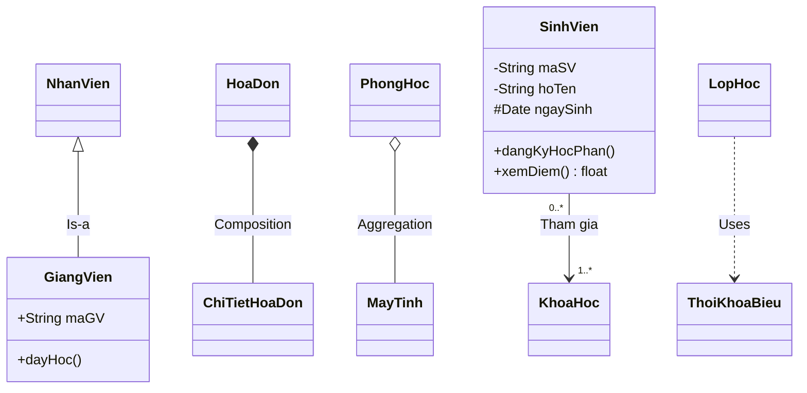

# Class Diagram - Tài nguyên nghiên cứu

> **Nguồn**: NotebookLM - https://notebooklm.google.com/notebook/46ddeb54-c391-43df-95f2-53c820428ada
> **Ngày tạo**: 2026-02-02

---

## 1. Lý thuyết

### 1.1 Khái niệm
**Class Diagram (Sơ đồ lớp)** là biểu đồ quan trọng nhất trong nhóm mô hình hóa cấu trúc (Structural Modeling) của UML.

- **Định nghĩa**: Sơ đồ mô tả cấu trúc tĩnh của hệ thống bằng cách hiển thị các lớp (classes), thuộc tính (attributes), hành vi/phương thức (behaviors/operations) và mối quan hệ giữa các đối tượng.
- **Vai trò**: Rút ngắn khoảng cách giữa thế giới thực và thế giới phần mềm, xây dựng thuật ngữ chung cho người sử dụng và người phân tích hệ thống.

### 1.2 Mục đích sử dụng
- **Mô tả cấu trúc dữ liệu**: Xác định thông tin cần lưu trữ và cấu trúc của chúng
- **Đặc tả thiết kế**: Đặt tên, lập mô hình khái niệm, đặc tả cộng tác giữa các thành phần
- **Thiết kế CSDL**: Làm cơ sở cho sơ đồ cơ sở dữ liệu
- **Giao tiếp**: Công cụ để phân tích viên, thiết kế viên và lập trình viên hiểu rõ hệ thống

### 1.3 Khi nào dùng?

| Giai đoạn | Mục đích | Mức độ chi tiết |
|-----------|----------|-----------------|
| **Phân tích** | Nắm bắt thực thể nghiệp vụ từ yêu cầu | Mức khái niệm, bỏ qua chi tiết kỹ thuật |
| **Thiết kế** | Chi tiết hóa cấu trúc phần mềm trước khi code | Đầy đủ kiểu dữ liệu, visibility, phương thức |
| **Lập trình** | Bản vẽ kỹ thuật để chuyển đổi sang mã nguồn | Mapping to Code |

### 1.4 Ý nghĩa trong phân tích thiết kế
- Định hình kiến trúc phần mềm thông qua xác định mối quan hệ
- Cơ sở cho CSDL và Code: Ánh xạ trực tiếp ra bảng CSDL hoặc class trong mã nguồn
- **Bản thiết kế "xương sống"** của phần mềm

---

## 2. Cấu trúc

### 2.1 Cách biểu diễn Class

Một lớp được biểu diễn bằng **hình chữ nhật chia 3 ngăn**:

```
┌─────────────────────────┐
│      TenLop             │  ← Ngăn 1: Tên lớp (PascalCase)
├─────────────────────────┤
│ - thuocTinh1: String    │  ← Ngăn 2: Thuộc tính
│ # thuocTinh2: int       │
│ + thuocTinh3: Date      │
├─────────────────────────┤
│ + phuongThuc1(): void   │  ← Ngăn 3: Phương thức
│ - phuongThuc2(p: int)   │
└─────────────────────────┘
```

**Quy tắc đặc biệt**:
- Lớp trừu tượng (Abstract): Tên lớp *in nghiêng*
- Interface: Có ký hiệu `<<interface>>`
- Static: Thuộc tính/phương thức được <u>gạch chân</u>

### 2.2 Ký hiệu Visibility (Tầm vực truy cập)

| Ký hiệu | Tên | Ý nghĩa |
|---------|-----|---------|
| `+` | Public | Truy cập công khai, mọi lớp khác đều có thể truy cập |
| `-` | Private | Truy cập riêng tư, chỉ nội bộ lớp đó |
| `#` | Protected | Chỉ lớp đó và các lớp con kế thừa |
| `~` | Package | Truy cập trong cùng gói/package |

### 2.3 Các loại đường nối (Relationships)

| Loại quan hệ | Ký hiệu | Ý nghĩa | Ví dụ |
|--------------|---------|---------|-------|
| **Kế thừa** (Generalization) | Đường liền, mũi tên tam giác rỗng → lớp cha | "Is-a" (Là một) | HinhVuong kế thừa Shape |
| **Kết hợp** (Association) | Đường liền (có/không mũi tên) | Kết nối giữa hai lớp | SinhVien tham gia KhoaHoc |
| **Kết tập** (Aggregation) | Đường liền, hình thoi rỗng ◇ | "Has-a" lỏng lẻo | Xe hơi có Bánh xe |
| **Cấu thành** (Composition) | Đường liền, hình thoi đặc ◆ | "Part-of" chặt chẽ | Hóa đơn - Chi tiết hóa đơn |
| **Phụ thuộc** (Dependency) | Đường nét đứt, mũi tên mở | A sử dụng B | Lớp A dùng biến cục bộ kiểu B |

### 2.4 Multiplicity (Bản số)

| Ký hiệu | Ý nghĩa |
|---------|---------|
| `1` | Chỉ duy nhất 1 |
| `0..1` | 0 hoặc 1 (tùy chọn) |
| `*` hoặc `0..*` | 0 hoặc nhiều |
| `1..*` | 1 hoặc nhiều |
| `2..4` | Khoảng xác định (từ 2 đến 4) |

### 2.5 Cú pháp Mermaid



**Ký hiệu Mermaid:**
- `<|--` : Kế thừa (Inheritance)
- `*--` : Cấu thành (Composition)
- `o--` : Kết tập (Aggregation)
- `-->` : Kết hợp (Association)
- `..>` : Phụ thuộc (Dependency)

---

## 3. Cách thức xây dựng

### 3.1 Quy trình 6 bước

```
┌─────────────────────────────────────────────────────────────────┐
│  BƯỚC 1: Xác định các lớp (Identify Classes)                   │
│  ↓                                                              │
│  BƯỚC 2: Xác định mối quan hệ (Identify Relationships)         │
│  ↓                                                              │
│  BƯỚC 3: Xác định thuộc tính (Identify Attributes)             │
│  ↓                                                              │
│  BƯỚC 4: Xác định phương thức (Identify Methods)               │
│  ↓                                                              │
│  BƯỚC 5: Tổ chức và tinh chỉnh (Refine & Organize)             │
│  ↓                                                              │
│  BƯỚC 6: Kiểm tra và nhóm gói (Check & Group)                  │
└─────────────────────────────────────────────────────────────────┘
```

### 3.2 Chi tiết từng bước

**Bước 1: Xác định các lớp**
- Tìm kiếm **danh từ** trong tài liệu yêu cầu, Use Case scenarios
- Tiêu chí: Có thông tin cần lưu trữ? Có hệ thống bên ngoài? Có vai trò tác nghiệp?
- Phân loại: Con người, Vật thể, Tổ chức, Sự kiện, Địa điểm

**Bước 2: Xác định mối quan hệ**
- Tìm kiếm **động từ** thể hiện tương tác giữa các lớp
- Xác định: Association, Generalization, Aggregation, Composition, Dependency

**Bước 3: Xác định thuộc tính**
- Tìm thông tin dữ liệu phụ thuộc vào đối tượng cụ thể
- Phân loại: định danh, phân loại, định lượng, thời gian, không gian
- Nếu thuộc tính phức tạp → tách thành Lớp riêng

**Bước 4: Xác định phương thức**
- Bổ sung hành vi mà đối tượng cần thực hiện
- Tương ứng với các hành động xử lý dữ liệu của lớp

**Bước 5: Tổ chức và tinh chỉnh**
- Sử dụng kế thừa cho các lớp có đặc điểm chung
- Xử lý thuộc tính phân loại → tách thành lớp con
- Loại bỏ liên kết dư thừa

**Bước 6: Kiểm tra và nhóm gói**
- Kiểm tra bao phủ hết yêu cầu
- Nhóm các lớp liên quan thành Packages

### 3.3 Best Practices

| Nên làm | Không nên làm |
|---------|---------------|
| Tập trung vào thông tin quan trọng | Mô hình hóa mọi thứ |
| Dùng ký hiệu cần thiết | Lạm dụng tất cả ký hiệu UML |
| Phân biệt mức phân tích/thiết kế | Trộn lẫn mức độ chi tiết |
| Đặt tên chuẩn (PascalCase) | Đặt tên không nhất quán |
| Dùng Association Class khi cần | Tạo quan hệ 1-1 dư thừa |

---

## 4. Hoạt động

### 4.1 Cách đọc một Lớp

```
┌─────────────────────────┐
│      SinhVien           │  ← Viết thường/đậm = Concrete Class
│      *TenLop*           │  ← In nghiêng = Abstract Class
│   <<interface>>         │  ← Stereotype = Interface
├─────────────────────────┤
│ - maSV: String          │  ← Private attribute
│ # ngaySinh: Date        │  ← Protected attribute
│ + hoTen: String         │  ← Public attribute
│ _staticAttr: int_       │  ← Gạch chân = Static
├─────────────────────────┤
│ + dangKy(): void        │  ← Public method
│ - validate(): bool      │  ← Private method
└─────────────────────────┘
```

### 4.2 Cách hiểu các mối quan hệ

| Nhìn thấy | Hiểu là |
|-----------|---------|
| Mũi tên tam giác rỗng | Lớp con "LÀ MỘT" (Is-a) trường hợp của Lớp cha |
| Hình thoi rỗng ◇ | Quan hệ "CÓ MỘT" (Has-a) lỏng lẻo, con tồn tại độc lập |
| Hình thoi đặc ◆ | Quan hệ "BỘ PHẬN" (Part-of) chặt, con phụ thuộc cha |
| Đường nét đứt | Lớp A "SỬ DỤNG" lớp B (dependency) |
| Mũi tên navigability | Lớp đuôi có thể gọi lớp đầu |

### 4.3 Cách đọc Bản số (Multiplicity)

Ví dụ: `Khách hàng (1) ------ (0..*) Đơn hàng`

→ Đọc: "Một khách hàng có thể có nhiều đơn hàng (hoặc chưa có), nhưng mỗi đơn hàng chỉ thuộc về đúng 1 khách hàng"

### 4.4 Theo dõi luồng thông tin

1. **Chiều mũi tên (Navigability)**:
   - A → B: Trong code của A sẽ có biến tham chiếu đến B
   - A có thể gọi hàm của B, nhưng B không biết gì về A

2. **Ánh xạ sang Code**:
   - Quan hệ Aggregation/Composition/Association: Lớp chứa sẽ có thuộc tính là đối tượng của lớp kia
   - Ví dụ: HoaDon (1) ◆-- (1..*) ChiTietHoaDon → HoaDon có List<ChiTietHoaDon>

---

## 5. Thành phần cấu thành

### 5.1 Các loại Lớp

| Loại | Đặc điểm | Ký hiệu |
|------|----------|---------|
| **Concrete Class** | Có thể tạo đối tượng thực tế | Tên viết bình thường |
| **Abstract Class** | Không tạo đối tượng, làm cơ sở kế thừa | Tên *in nghiêng* |
| **Interface** | Định nghĩa tập hành vi phải thực thi | `<<interface>>` |

### 5.2 Các loại Thuộc tính

| Loại | Mô tả | Ký hiệu |
|------|-------|---------|
| Instance Attribute | Thuộc về đối tượng cụ thể | Bình thường |
| Static Attribute | Thuộc về cả lớp (chia sẻ chung) | <u>Gạch chân</u> |
| Derived Attribute | Tính toán từ thuộc tính khác | `/tuoi` (dấu /) |

### 5.3 Các loại Phương thức

| Loại | Mô tả | Ký hiệu |
|------|-------|---------|
| Concrete Method | Có phần thân xử lý đầy đủ | Bình thường |
| Abstract/Virtual Method | Chưa cài đặt hoặc có thể ghi đè | *In nghiêng* |
| Static Method | Thuộc về lớp | <u>Gạch chân</u> |

### 5.4 Tất cả các loại Quan hệ

```
ASSOCIATION (Kết hợp)
    ├── Unidirectional (1 chiều)     A ────────> B
    ├── Bidirectional (2 chiều)      A <───────> B
    └── Reflexive (Phản thân)        A ────┐
                                           └──> A

AGGREGATION (Kết tập)               A ◇────────> B
    → "Has-a" lỏng lẻo

COMPOSITION (Cấu thành)             A ◆────────> B
    → "Part-of" chặt chẽ

GENERALIZATION (Kế thừa)            A ◁──────── B
    → "Is-a"

DEPENDENCY (Phụ thuộc)              A - - - - -> B
    → "Uses"

REALIZATION (Hiện thực hóa)         A ◁- - - - - B
    → Interface implementation
```

### 5.5 Thành phần bổ sung

| Thành phần | Vai trò | Ví dụ |
|------------|---------|-------|
| **Association Class** | Lưu thông tin của mối quan hệ | Điểm (giữa SinhVien và MonHoc) |
| **Stereotypes** | Mở rộng/phân loại thành phần | `<<interface>>`, `<<ORM Persistable>>` |
| **Constraints** | Quy tắc/điều kiện ràng buộc | `{visibility=implementation}` |
| **Role Name** | Làm rõ vai trò trong quan hệ | "employer", "employee" |
| **Multiplicity** | Số lượng đối tượng tham gia | 1, 0..1, *, 1..* |

---

## Checklist

- [x] **Lý thuyết**: có khái niệm, mục đích, bối cảnh sử dụng
- [x] **Cấu trúc**: có cú pháp/ký hiệu, format UML/Mermaid
- [x] **Cách xây dựng**: có quy trình 6 bước và best practices
- [x] **Hoạt động**: có cách đọc và luồng thông tin
- [x] **Thành phần**: có danh sách đầy đủ thành phần và quan hệ

---

*Tài liệu được tổng hợp từ NotebookLM với nguồn "Chủ đề 5: Mô hình hóa cấu trúc"*
