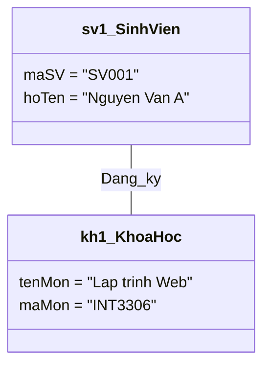

# Object Diagram - Tài nguyên nghiên cứu

> **Nguồn**: NotebookLM - https://notebooklm.google.com/notebook/46ddeb54-c391-43df-95f2-53c820428ada
> **Ngày tạo**: 2026-02-02

---

## 1. Lý thuyết

### 1.1 Khái niệm
**Object Diagram (Sơ đồ đối tượng)** là một biểu đồ thuộc nhóm mô hình hóa cấu trúc (Structural Modeling) trong UML.

- **Định nghĩa**: Là một phiên bản cụ thể của Class Diagram. Nếu Class Diagram là bản vẽ thiết kế (khuôn mẫu), thì Object Diagram là một **bức ảnh chụp nhanh (snapshot)** của hệ thống tại một thời điểm cụ thể, hiển thị các đối tượng thực tế (instances) và mối quan hệ giữa chúng.
- **Ký hiệu đặc trưng**: Tên của đối tượng luôn được **gạch dưới** để phân biệt với lớp (ví dụ: <u>sinhVienA: SinhVien</u>)

### 1.2 Mục đích sử dụng
- **Minh họa kịch bản cụ thể**: Biểu diễn ví dụ thực tế về dữ liệu và cấu trúc đối tượng
- **Kiểm tra tính đúng đắn**: Kiểm tra Class Diagram có hoạt động đúng với tình huống thực tế không
- **Mô tả trạng thái**: Hiển thị giá trị cụ thể của thuộc tính tại một thời điểm nhất định

### 1.3 Khi nào dùng?
- Khi Class Diagram quá phức tạp và trừu tượng, cần ví dụ cụ thể để giải thích
- Khi cần phân tích quan hệ Aggregation/Composition để xem vòng đời đối tượng
- Trong giai đoạn phân tích (Analysis) để nắm bắt yêu cầu qua ví dụ dữ liệu thực tế

### 1.4 So sánh Class Diagram vs Object Diagram

| Tiêu chí | Class Diagram | Object Diagram |
|----------|---------------|----------------|
| **Bản chất** | Khuôn mẫu (Template) | Thể hiện (Instance) |
| **Tính thời gian** | Tĩnh (Static) - Luôn đúng | Snapshot - Chỉ đúng tại thời điểm đó |
| **Thành phần** | Lớp (Class) - tên không gạch chân | Đối tượng (Object) - tên gạch chân |
| **Thuộc tính** | Tên + kiểu dữ liệu (name: string) | Giá trị cụ thể (name = "Nguyen Van A") |
| **Mục tiêu** | Định nghĩa hệ thống (Design) | Kiểm tra hoạt động (Verification) |

**Ẩn dụ**: Nếu Class Diagram là "bản vẽ kiến trúc" ngôi nhà, thì Object Diagram là "bức ảnh chụp" ngôi nhà khi đã có người và đồ đạc cụ thể.

---

## 2. Cấu trúc

### 2.1 Cách biểu diễn Đối tượng (Object)

```
┌─────────────────────────────┐
│  sv1 : SinhVien             │  ← Tên đối tượng : Tên lớp (GẠCH CHÂN)
├─────────────────────────────┤
│  maSV = "SV001"             │  ← Giá trị thuộc tính
│  hoTen = "Nguyen Van A"     │
│  tuoi = 20                  │
└─────────────────────────────┘
```

**Quy tắc quan trọng**:
- Tên đối tượng **PHẢI được gạch chân** để phân biệt với Class
- Cú pháp đầy đủ: `<u>Tên_đối_tượng : Tên_lớp</u>`
- Đối tượng nặc danh: `<u>: Tên_lớp</u>` (không có tên cụ thể)

### 2.2 Cách hiển thị Giá trị thuộc tính

| Class Diagram | Object Diagram |
|---------------|----------------|
| `name: String` | `name = "Nguyen Van A"` |
| `age: int` | `age = 20` |
| `status: String` | `status = "Active"` |

- Thuộc tính Static: vẫn được <u>gạch chân</u> như trong Class Diagram

### 2.3 Các loại Liên kết (Links)

Liên kết (Link) là thể hiện cụ thể của Association trong Class Diagram.

```
┌──────────────────┐         ┌──────────────────┐
│  sv1 : SinhVien  │─────────│  kh1 : KhoaHoc   │
└──────────────────┘  Link   └──────────────────┘
```

**Đặc điểm**:
- Đường liền nét nối giữa hai đối tượng
- **Không có multiplicity** (1..*, 0..1) - vì đây là liên kết cụ thể
- Có thể có tên liên kết hoặc tên vai trò

### 2.4 Cú pháp Mermaid (Mô phỏng)

Mermaid chưa có loại biểu đồ riêng cho Object Diagram, nhưng có thể mô phỏng:



---

## 3. Cách thức xây dựng

### 3.1 Quy trình 6 bước

```
┌─────────────────────────────────────────────────────────────────┐
│  BƯỚC 1: Phân tích Class Diagram                               │
│  ↓                                                              │
│  BƯỚC 2: Xác định kịch bản cụ thể (scenario)                   │
│  ↓                                                              │
│  BƯỚC 3: Khởi tạo các đối tượng (Instantiate Objects)          │
│  ↓                                                              │
│  BƯỚC 4: Gán giá trị cho thuộc tính                            │
│  ↓                                                              │
│  BƯỚC 5: Vẽ các liên kết (Links)                               │
│  ↓                                                              │
│  BƯỚC 6: Kiểm tra tính nhất quán với Class Diagram             │
└─────────────────────────────────────────────────────────────────┘
```

### 3.2 Chi tiết từng bước

**Bước 1: Phân tích Class Diagram**
- Xem xét cấu trúc, thuộc tính và mối quan hệ đã định nghĩa

**Bước 2: Xác định kịch bản**
- Chọn tình huống thực tế cần minh họa
- Ví dụ: "Sinh viên Nguyễn Văn A đăng ký môn Lập trình Web"

**Bước 3: Khởi tạo đối tượng**
- Vẽ hình chữ nhật cho từng đối tượng
- Đặt tên theo cú pháp: `<u>Tên_đối_tượng : Tên_lớp</u>`

**Bước 4: Gán giá trị thuộc tính**
- Điền dữ liệu cụ thể: `Tên_thuộc_tính = Giá_trị`
- Đảm bảo tuân thủ kiểu dữ liệu trong Class Diagram

**Bước 5: Vẽ liên kết**
- Dựa vào Association trong Class Diagram
- Với multiplicity 1..*: vẽ nhiều đối tượng cụ thể

**Bước 6: Kiểm tra**
- Đảm bảo tuân thủ multiplicity
- Tên thuộc tính khớp với Class Diagram

### 3.3 Best Practices

| Nên làm | Không nên làm |
|---------|---------------|
| Tập trung vào kịch bản cụ thể | Vẽ tất cả đối tượng của hệ thống |
| Giữ tính nhất quán với Class Diagram | Tự thêm thuộc tính mới |
| Dùng để kiểm tra thiết kế | Viết multiplicity trên đường link |
| Hiển thị trạng thái qua giá trị | Bỏ qua việc gạch chân tên |

---

## 4. Hoạt động

### 4.1 Cách đọc tên đối tượng

```
┌───────────────────────────┐
│  sv1 : SinhVien           │  ← Đối tượng sv1 thuộc lớp SinhVien
│  ─────────────────        │     (PHẢI gạch chân)
└───────────────────────────┘

┌───────────────────────────┐
│  : HoaDon                 │  ← Đối tượng nặc danh thuộc lớp HoaDon
│  ────────                 │     (vẫn gạch chân)
└───────────────────────────┘
```

**Quy tắc phân biệt**:
- Tên **gạch chân** → Object
- Tên **không gạch chân** → Class
- Tên **in nghiêng** → Abstract Class

### 4.2 Cách hiểu giá trị thuộc tính

```
┌───────────────────────────┐
│  hd1 : HoaDon             │
├───────────────────────────┤
│  maHD = "HD001"           │  ← Giá trị cụ thể
│  ngayLap = "2026-02-02"   │
│  trangThai = "DaThanhToan"│  ← Trạng thái của đối tượng
│  _tongSoHD = 100_         │  ← Static (gạch chân) - thuộc về lớp
└───────────────────────────┘
```

### 4.3 Cách theo dõi liên kết

**So sánh với Class Diagram**:

| Class Diagram | Object Diagram |
|---------------|----------------|
| `KhachHang (1) ─── (*) DonHang` | 1 đối tượng KH nối với 3 đối tượng DH cụ thể |
| Có multiplicity 1..* | Không có multiplicity |
| Mô tả trừu tượng | Minh họa cụ thể |

**Ví dụ**:
```
┌──────────────┐
│  kh1 : KH    │
└──────┬───────┘
       │
       ├──────────┬──────────┐
       │          │          │
┌──────┴───┐ ┌────┴─────┐ ┌──┴────────┐
│ dh1 : DH │ │ dh2 : DH │ │ dh3 : DH  │
└──────────┘ └──────────┘ └───────────┘
```

---

## 5. Thành phần cấu thành

### 5.1 Danh sách thành phần

| Thành phần | Mô tả | Ký hiệu |
|------------|-------|---------|
| **Objects** | Thực thể tồn tại trong hệ thống thực tế | Hình chữ nhật |
| **Object Names** | Định danh duy nhất cho đối tượng | <u>Gạch chân</u> |
| **Anonymous Objects** | Đối tượng không có tên cụ thể | <u>: TenLop</u> |
| **Attribute Values** | Giá trị dữ liệu cụ thể của thuộc tính | `tenThuocTinh = giaTriCuThe` |
| **Links** | Đường nối thể hiện mối quan hệ giữa đối tượng | Đường liền nét |

### 5.2 Chi tiết từng thành phần

**Objects (Đối tượng)**:
- Thành phần chính của sơ đồ
- Đại diện cho thực thể tồn tại trong hệ thống
- Là instance cụ thể của Class

**Object Names (Tên đối tượng)**:
- Cú pháp: `tên_đối_tượng : Tên_Lớp`
- Bắt buộc gạch chân
- Ví dụ: `<u>xe_cua_tuan : XeHoi</u>`

**Anonymous Objects (Đối tượng nặc danh)**:
- Cú pháp: `: Tên_Lớp` (không có tên)
- Vẫn phải gạch chân
- Dùng khi danh tính không quan trọng bằng loại

**Attribute Values (Giá trị thuộc tính)**:
- Xác định trạng thái của đối tượng
- Cú pháp: `tenThuocTinh = giaTri`
- Static attribute vẫn gạch chân

**Links (Liên kết)**:
- Instance của Association trong Class Diagram
- Không có multiplicity
- Thể hiện quan hệ cụ thể giữa 2 đối tượng

---

## Checklist

- [x] **Lý thuyết**: có khái niệm, mục đích, so sánh với Class Diagram
- [x] **Cấu trúc**: có cú pháp/ký hiệu, cách gạch chân, Mermaid mô phỏng
- [x] **Cách xây dựng**: có quy trình 6 bước và best practices
- [x] **Hoạt động**: có cách đọc tên, giá trị, liên kết
- [x] **Thành phần**: có danh sách đầy đủ 5 thành phần chính

---

*Tài liệu được tổng hợp từ NotebookLM với nguồn "Chủ đề 5: Mô hình hóa cấu trúc"*
