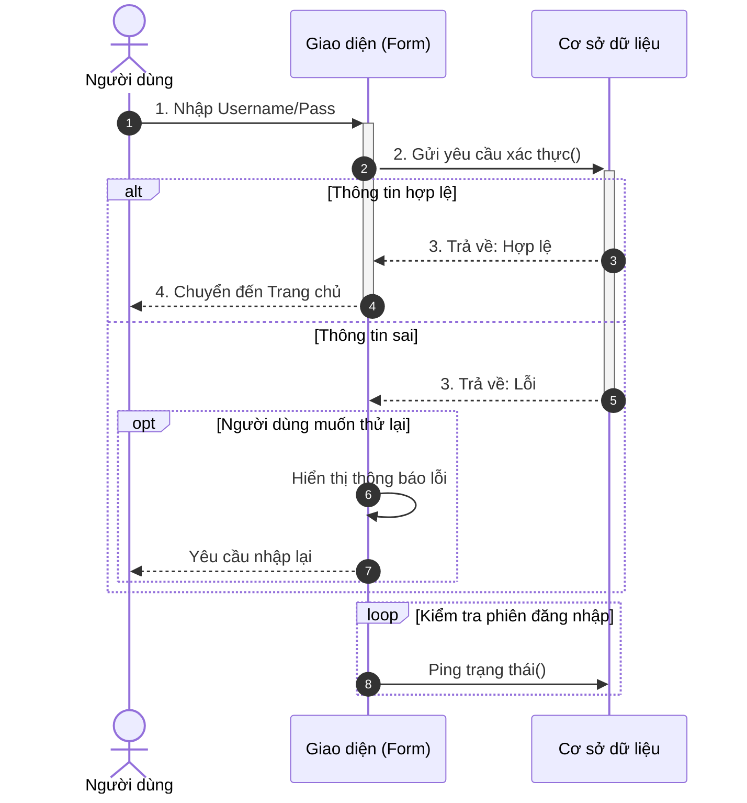

# Sequence Diagram - Tài nguyên nghiên cứu

> **Nguồn**: NotebookLM - https://notebooklm.google.com/notebook/46ddeb54-c391-43df-95f2-53c820428ada
> **Ngày tạo**: 2026-02-02

---

## 1. Lý thuyết

### 1.1 Khái niệm
**Sequence Diagram (Biểu đồ tuần tự)** là một loại biểu đồ thuộc nhóm Mô hình hóa hành vi (Behavioral Modeling) trong UML.

- **Định nghĩa**: Biểu đồ dùng để xác định các trình tự diễn ra sự kiện của một nhóm đối tượng. Miêu tả chi tiết các thông điệp (messages) được gửi và nhận giữa các đối tượng, đồng thời chú trọng đến **trình tự về mặt thời gian**.
- **Bản chất**: Diễn giải chi tiết cách thức một chức năng hoạt động thông qua sự tương tác giữa các đối tượng theo thời gian.

### 1.2 Mục đích sử dụng
- Xác định rõ **thứ tự các bước** thực hiện của một chức năng
- Mô tả **luồng thông tin** và các thông điệp trao đổi giữa Actor và hệ thống
- **Chi tiết hóa logic** từ yêu cầu chức năng, làm cơ sở để lập trình viên viết mã

### 1.3 Khi nào dùng?
- Sau khi đã xác định được các Use Case
- Khi cần đi sâu vào chi tiết kỹ thuật của từng chức năng
- Các trường hợp cụ thể:
  - Mô tả luồng xử lý của chức năng Đăng nhập
  - Mô tả các chức năng quản lý (CRUD)
  - Mô tả các luồng tương tác phía người dùng cuối

### 1.4 Mối quan hệ với Use Case Diagram

```
┌─────────────────────────────────────────────────────────────────┐
│                    USE CASE DIAGRAM                             │
│                  (Ai làm gì - Tổng quát)                       │
│                          ↓                                      │
│              Ánh xạ 1-1 hoặc 1-n                               │
│                          ↓                                      │
│                 SEQUENCE DIAGRAM                                │
│              (Làm như thế nào - Chi tiết)                      │
└─────────────────────────────────────────────────────────────────┘
```

**So sánh**:
- **Use Case**: Cho biết "Ai làm gì" (Tác nhân tương tác với hệ thống)
- **Sequence**: Giải thích "Làm như thế nào" (Trình tự thông điệp giữa các đối tượng)

---

## 2. Cấu trúc

### 2.1 Các thành phần cơ bản

```
   Actor      Object1       Object2       Object3
     │           │             │             │
     │           │             │             │
     │──────────>│             │             │  Synchronous Message
     │           │─────────────>│            │
     │           │             ┌┴┐           │  Activation Box
     │           │             │ │───────────>│
     │           │             │ │           ┌┴┐
     │           │             │ │<─ ─ ─ ─ ─ ┘│┘ Return Message
     │           │<─ ─ ─ ─ ─ ─ ┘             │
     │<─ ─ ─ ─ ─ │             │             │
     │           │             │             │
     ▼           ▼             ▼             ▼
                    Thời gian (từ trên xuống dưới)
```

### 2.2 Ký hiệu các thành phần

| Thành phần | Ký hiệu | Mô tả |
|------------|---------|-------|
| **Actor** | Hình người que | Người dùng hoặc hệ thống bên ngoài |
| **Lifeline** | Hình chữ nhật + đường đứt nét dọc | Sự tồn tại của đối tượng theo thời gian |
| **Activation Box** | Hình chữ nhật hẹp trên Lifeline | Thời gian đối tượng đang xử lý |
| **Synchronous Message** | Mũi tên đặc (─▶) | Gọi hàm, chờ xử lý xong |
| **Asynchronous Message** | Mũi tên mở (─>) | Gửi rồi tiếp tục, không chờ |
| **Return Message** | Mũi tên nét đứt (- - >) | Trả về kết quả |
| **Self Message** | Mũi tên quay lại chính mình | Đối tượng gọi chính nó |

### 2.3 Các loại Message

| Loại | Ký hiệu UML | Ý nghĩa | Mermaid |
|------|-------------|---------|---------|
| **Synchronous** | Mũi tên đặc (▶) | Gọi và chờ xử lý xong | `A->>B: message` |
| **Asynchronous** | Mũi tên mở (>) | Gửi rồi tiếp tục | `A-)B: message` |
| **Return** | Nét đứt, mũi tên mở | Trả kết quả về | `B-->>A: result` |
| **Self** | Quay lại chính mình | Tự gọi | `A->>A: process` |

### 2.4 Combined Fragments

| Fragment | Từ khóa | Ý nghĩa | Mermaid |
|----------|---------|---------|---------|
| **Alternative** | `alt` | If/Else - rẽ nhánh | `alt [cond] ... else ... end` |
| **Option** | `opt` | If - tùy chọn | `opt [cond] ... end` |
| **Loop** | `loop` | Vòng lặp | `loop [cond] ... end` |
| **Break** | `break` | Ngắt luồng | `break [cond] ... end` |
| **Parallel** | `par` | Xử lý song song | `par ... and ... end` |

### 2.5 Cú pháp Mermaid



**Ký hiệu Mermaid**:
- `->>+` : Synchronous Message + Activate
- `-->>-` : Return Message + Deactivate
- `actor` : Khai báo Actor
- `participant` : Khai báo Object

---

## 3. Cách thức xây dựng

### 3.1 Quy trình 5 bước

```
┌─────────────────────────────────────────────────────────────────┐
│  BƯỚC 1: Xác định phạm vi và kịch bản Use Case                 │
│  ↓                                                              │
│  BƯỚC 2: Xác định các đối tượng tham gia (Lifelines)           │
│  ↓                                                              │
│  BƯỚC 3: Xác định thông điệp và thứ tự                         │
│  ↓                                                              │
│  BƯỚC 4: Sử dụng Combined Fragments (alt, loop, opt)           │
│  ↓                                                              │
│  BƯỚC 5: Hoàn thiện và tinh chỉnh                              │
└─────────────────────────────────────────────────────────────────┘
```

### 3.2 Chi tiết từng bước

**Bước 1: Xác định phạm vi từ Use Case**
- Chọn một Use Case cụ thể (VD: "Đăng nhập", "Quản lý bài viết")
- Tham chiếu Bảng kịch bản: Tác nhân, Tiền điều kiện, Chuỗi sự kiện, Ngoại lệ

**Bước 2: Xác định Lifelines (theo MVC)**
- **Actor**: Người dùng, Admin
- **Boundary (View)**: Giao diện, Form
- **Control (Controller)**: Xử lý logic
- **Entity (Model/Database)**: Lưu trữ dữ liệu

**Bước 3: Xác định thông điệp**
- Chuyển đổi "Chuỗi sự kiện" thành mũi tên
- Thứ tự: Trên → Dưới (theo thời gian)
- Luồng: Actor → View → Controller → Database → trả về

**Bước 4: Sử dụng Combined Fragments**
- `alt`: Rẽ nhánh (đăng nhập đúng/sai)
- `opt`: Tùy chọn (xác nhận xóa)
- `loop`: Lặp (hiển thị danh sách)

**Bước 5: Hoàn thiện**
- Thêm Return messages
- Kiểm tra đồng bộ với Class Diagram

### 3.3 Best Practices

| Nên làm | Không nên làm |
|---------|---------------|
| Bám sát kiến trúc MVC | Để View gọi trực tiếp Database |
| Đặt tên hàm thực tế (checkLogin(), getAllPosts()) | Đặt tên mô tả chung chung |
| Vẽ luồng logic chính | Vẽ quá chi tiết getter/setter |
| Sử dụng AI/Mermaid | Vẽ thủ công lãng phí thời gian |
| Kiểm tra khớp với Use Case Specification | Không đồng bộ tài liệu |

---

## 4. Hoạt động

### 4.1 Nguyên tắc đọc

**Hai chiều không gian**:
- **Chiều dọc (Thời gian)**: Từ trên xuống dưới - sự kiện trên xảy ra trước
- **Chiều ngang (Đối tượng)**: Các đối tượng xếp theo hàng ngang ở đầu

### 4.2 Cách đọc từng thành phần

| Nhìn thấy | Đọc là |
|-----------|--------|
| Đường đứt nét dọc (Lifeline) | "Đối tượng này tồn tại trong suốt quy trình" |
| Hình chữ nhật hẹp (Activation Box) | "Đối tượng đang bận xử lý" |
| Mũi tên đặc (→▶) | "A gọi B và chờ xong mới tiếp tục" |
| Mũi tên mở (→>) | "A gửi B rồi làm việc khác ngay" |
| Mũi tên nét đứt (- - >) | "B trả kết quả về A" |
| Khung `alt` | "NẾU... THÌ... NGƯỢC LẠI..." (If/Else) |
| Khung `opt` | "NẾU... THÌ..." (If, không có Else) |
| Khung `loop` | "LẶP LẠI" (For/While) |
| Khung `break` | "NGẮT/THOÁT" (Exception) |

### 4.3 Cách theo dõi luồng

1. **Bắt đầu từ góc trái trên**: Actor gửi thông điệp đầu tiên
2. **Lần theo mũi tên**: Xem trỏ đến đối tượng nào
3. **Nhìn xuống dưới**: Di chuyển dọc theo Lifeline
4. **Xử lý logic**: Gặp khung `alt/opt` → xác định nhánh
5. **Kết thúc**: Không còn thông điệp hoặc Return cuối cùng

---

## 5. Thành phần cấu thành

### 5.1 Danh sách đầy đủ

| Thành phần | Tên tiếng Anh | Vai trò |
|------------|---------------|---------|
| **Tác nhân** | Actor | Người dùng hoặc hệ thống bên ngoài |
| **Đường sống** | Lifeline | Đại diện vòng đời của đối tượng |
| **Đối tượng** | Object/Participant | Các thành phần hệ thống (View, Controller, DB) |
| **Thanh kích hoạt** | Activation Bar | Thời gian đối tượng thực thi |
| **Thông điệp đồng bộ** | Synchronous Message | Gọi và chờ xử lý |
| **Thông điệp bất đồng bộ** | Asynchronous Message | Gửi không cần chờ |
| **Thông điệp trả về** | Return Message | Phản hồi kết quả |
| **Tự gọi** | Self-Message | Đối tượng gọi chính mình |
| **Khung điều khiển** | Combined Fragments | alt, opt, loop, break, par |
| **Điều kiện bảo vệ** | Guard Condition | Điều kiện trong [ ] |

### 5.2 Chi tiết Combined Fragments

```
┌───────────────────────────────────────────────────────────────┐
│  alt [Điều kiện 1]         │  If - Else                      │
│  ─────────────────────────────────────────                   │
│  ... hành động nếu đúng ...                                  │
│  ─ ─ ─ ─ ─ ─ ─ ─ ─ ─ ─ ─ ─ ─ (đường chia đôi)              │
│  else [Điều kiện 2]                                          │
│  ... hành động nếu sai ...                                   │
└───────────────────────────────────────────────────────────────┘

┌───────────────────────────────────────────────────────────────┐
│  opt [Điều kiện]           │  If (không có Else)             │
│  ─────────────────────────────────────────                   │
│  ... hành động nếu đúng ...                                  │
│  (bỏ qua nếu sai)                                            │
└───────────────────────────────────────────────────────────────┘

┌───────────────────────────────────────────────────────────────┐
│  loop [Điều kiện lặp]      │  For / While                    │
│  ─────────────────────────────────────────                   │
│  ... lặp lại hành động ...                                   │
└───────────────────────────────────────────────────────────────┘

┌───────────────────────────────────────────────────────────────┐
│  par                       │  Parallel (song song)           │
│  ─────────────────────────────────────────                   │
│  ... hành động 1 ...                                         │
│  ─ ─ ─ ─ ─ ─ ─ ─ ─ ─ ─ ─ ─                                  │
│  and                                                         │
│  ... hành động 2 (cùng lúc) ...                              │
└───────────────────────────────────────────────────────────────┘
```

---

## Checklist

- [x] **Lý thuyết**: có khái niệm, mục đích, mối quan hệ với Use Case
- [x] **Cấu trúc**: có cú pháp/ký hiệu, các loại Message, Mermaid
- [x] **Cách xây dựng**: có quy trình 5 bước và best practices
- [x] **Hoạt động**: có cách đọc từng thành phần, theo dõi luồng
- [x] **Thành phần**: có danh sách đầy đủ + chi tiết Combined Fragments

---

*Tài liệu được tổng hợp từ NotebookLM với nguồn "Luận Văn Xây Dựng Website Khoa CNTT" và "Mô hình hóa hành vi"*
