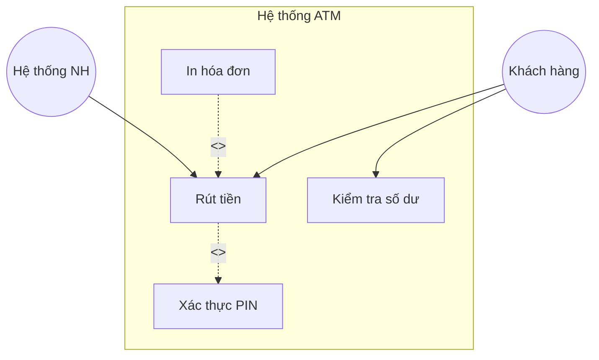

# Use Case Diagram - Tài nguyên nghiên cứu

> **Nguồn**: NotebookLM - https://notebooklm.google.com/notebook/46ddeb54-c391-43df-95f2-53c820428ada
> **Ngày tạo**: 2026-02-02

---

## 1. Lý thuyết

### 1.1 Khái niệm
**Use Case Diagram (Biểu đồ ca sử dụng)** là một loại biểu đồ thuộc nhóm Mô hình hóa hành vi (Behavioral Modeling) trong UML.

- **Định nghĩa**: Biểu đồ mô tả sự tương tác giữa các tác nhân bên ngoài (actors) và hệ thống thông qua các ca sử dụng (use cases).
- **Bản chất**: Thể hiện các chức năng, nhiệm vụ của hệ thống dưới góc độ của người sử dụng.

### 1.2 Mục đích sử dụng
- **Thể hiện yêu cầu hệ thống**: Mô tả mọi yêu cầu chức năng của hệ thống
- **Mô tả tương tác**: Xác định ai (tác nhân) sẽ thực hiện hành động gì với hệ thống
- **Định hình chức năng**: Xác định danh sách tính năng (Đăng nhập, Quản lý người dùng, Quản lý bài viết...)
- **Cung cấp Use Case View**: Một trong 5 góc nhìn quan trọng trong kiến trúc UML

### 1.3 Khi nào dùng?

| Giai đoạn | Mô tả |
|-----------|-------|
| **Sau khảo sát** | Sau khi tìm hiểu User Personas, dùng Use Case để cụ thể hóa yêu cầu |
| **Trước thiết kế chi tiết** | Xác định phạm vi chức năng trước khi vẽ Class Diagram, Sequence Diagram |
| **Giai đoạn Phân tích & Thiết kế** | Là trọng tâm của Analysis & Design phase |

### 1.4 Vai trò trong quy trình phát triển

```
┌────────────────────────────────────────────────────────────────┐
│                    USE CASE DIAGRAM                            │
│                         ↓                                      │
│     ┌─────────────────────────────────────────┐               │
│     │ Phân rã chức năng thành modules         │               │
│     │ (Quản lý Slide, Quản lý Người dùng...)  │               │
│     └─────────────────────────────────────────┘               │
│                         ↓                                      │
│     ┌─────────────────────────────────────────┐               │
│     │ Xây dựng kịch bản kiểm thử (Test Cases) │               │
│     └─────────────────────────────────────────┘               │
│                         ↓                                      │
│     ┌─────────────────────────────────────────┐               │
│     │ Giao tiếp giữa BA - Dev - Khách hàng    │               │
│     └─────────────────────────────────────────┘               │
└────────────────────────────────────────────────────────────────┘
```

**Cơ sở cho các biểu đồ khác**:
- **Sequence Diagram**: Mô tả trình tự thực hiện của một Use Case cụ thể
- **Class Diagram**: Thiết kế các lớp cần thiết để thực thi Use Case
- **Collaboration Diagram**: Biểu diễn kịch bản khai thác của Use Case

---

## 2. Cấu trúc

### 2.1 Các thành phần cơ bản

```
┌─────────────────────────────────────────────────────────────┐
│                     HỆ THỐNG ATM                            │
│  ┌─────────────────────────────────────────────────────┐   │
│  │                                                      │   │
│  │        ╭──────────────╮      ╭──────────────╮       │   │
│  │        │  Rút tiền    │      │ Kiểm tra    │       │   │
│  │        │              │      │ số dư       │       │   │
│  │        ╰──────────────╯      ╰──────────────╯       │   │
│  │               │                                      │   │
│  │               │ <<include>>                          │   │
│  │               ▼                                      │   │
│  │        ╭──────────────╮                              │   │
│  │        │ Xác thực PIN │                              │   │
│  │        ╰──────────────╯                              │   │
│  │                                                      │   │
│  └─────────────────────────────────────────────────────┘   │
│                     System Boundary                         │
└─────────────────────────────────────────────────────────────┘
     ┌─┐
     │O│    ← Actor (hình người que)
    /│\
    / \
  Khách hàng
```

### 2.2 Ký hiệu các thành phần

| Thành phần | Ký hiệu | Mô tả |
|------------|---------|-------|
| **Actor** | Hình người que | Người dùng hoặc hệ thống bên ngoài |
| **Use Case** | Hình bầu dục (ellipse) | Chức năng cụ thể của hệ thống |
| **System Boundary** | Hình chữ nhật | Phạm vi của hệ thống |
| **Association** | Đường liền nét | Tương tác Actor - Use Case |
| **Include** | Đường nét đứt + `<<include>>` | Bắt buộc phải thực hiện |
| **Extend** | Đường nét đứt + `<<extend>>` | Tùy chọn, có điều kiện |
| **Generalization** | Đường liền + mũi tên tam giác rỗng | Kế thừa |

### 2.3 Các loại quan hệ chi tiết

**Association (Liên kết)**:
```
  Actor ─────────── Use Case
```
- Thể hiện Actor tham gia vào Use Case

**Include (Bao gồm)**:
```
  Base UC - - - - - -> Included UC
             <<include>>
```
- Use Case A **bắt buộc** phải thực hiện Use Case B
- Ví dụ: "Rút tiền" include "Xác thực thẻ"

**Extend (Mở rộng)**:
```
  Extension UC - - - - - -> Base UC
               <<extend>>
```
- Use Case A **có thể** được thực hiện khi có điều kiện
- Ví dụ: "In hóa đơn" extend "Rút tiền"

**Generalization (Kế thừa)**:
```
  Actor con ◁─────── Actor cha
```
- Actor con kế thừa quyền hạn của Actor cha

### 2.4 Cú pháp Mermaid



**Hoặc dùng useCaseDiagram**:
```mermaid
useCaseDiagram
    actor "Khách hàng" as User
    actor "Hệ thống Ngân hàng" as BankSys

    package "Hệ thống ATM" {
        usecase "Rút tiền" as UC1
        usecase "Kiểm tra số dư" as UC2
        usecase "Xác thực PIN" as UC3
        usecase "In hóa đơn" as UC4
    }

    User --> UC1
    User --> UC2
    UC1 ..> UC3 : <<include>>
    UC4 ..> UC1 : <<extend>>
    UC1 --> BankSys
```

---

## 3. Cách thức xây dựng

### 3.1 Quy trình 5 bước

```
┌─────────────────────────────────────────────────────────────────┐
│  BƯỚC 1: Xác định các Tác nhân (Identify Actors)               │
│  ↓                                                              │
│  BƯỚC 2: Xác định các Ca sử dụng (Identify Use Cases)          │
│  ↓                                                              │
│  BƯỚC 3: Xác định các Quan hệ (Identify Relationships)         │
│  ↓                                                              │
│  BƯỚC 4: Vẽ biên hệ thống (System Boundary)                    │
│  ↓                                                              │
│  BƯỚC 5: Kiểm tra và tinh chỉnh (Review and Refine)            │
└─────────────────────────────────────────────────────────────────┘
```

### 3.2 Chi tiết từng bước

**Bước 1: Xác định Actors**
- Trả lời: Ai sử dụng hệ thống? Hệ thống nào tương tác? Ai cung cấp/nhận dữ liệu?
- Actor là **vai trò (role)**, không phải cá nhân cụ thể
- Ví dụ: "Giảng viên" thay vì "Thầy Tuấn"

**Bước 2: Xác định Use Cases**
- Dựa vào bảng yêu cầu chức năng hoặc sơ đồ phân rã
- Tìm cụm **Động từ + Danh từ**
- Ví dụ: "Đăng nhập", "Thêm chuyên mục", "Sửa giảng viên", "Xóa slide"

**Bước 3: Xác định Quan hệ**
- **Association**: Nối Actor với Use Case họ thực hiện
- **Include**: Khi tiền điều kiện yêu cầu (VD: "đã đăng nhập")
- **Extend**: Khi hành động là tùy chọn có điều kiện
- **Generalization**: Khi Actor con kế thừa Actor cha

**Bước 4: Vẽ System Boundary**
- Hình chữ nhật bao quanh Use Cases
- Use Cases nằm trong, Actors nằm ngoài

**Bước 5: Kiểm tra**
- Mỗi Use Case phải mang lại giá trị cho Actor
- Kiểm tra kịch bản Main flow và Exception

### 3.3 Best Practices

| Nên làm | Không nên làm |
|---------|---------------|
| Đặt tên: **Động từ + Danh từ** | Đặt tên chỉ có danh từ |
| Gom các bước nhỏ thành UC lớn | Vẽ "Nhập username", "Nhập password" riêng |
| Kèm bảng đặc tả Use Case | Chỉ có hình vẽ không có mô tả |
| Phân rã UC quá lớn | Để UC "Quản lý hệ thống" quá chung |
| Phân biệt Include vs Extend | Nhầm lẫn bắt buộc vs tùy chọn |

---

## 4. Hoạt động

### 4.1 Cách đọc biểu đồ

Trả lời câu hỏi: **"Ai (Actor) đang làm gì (Use Case) với hệ thống?"**

**Đọc Actor**:
- Hình người que nằm **ngoài** System Boundary
- Xác định vai trò: Admin, User, Hệ thống bên ngoài...
- Một Actor có thể nối với nhiều Use Cases

**Đọc Use Case**:
- Hình bầu dục nằm **trong** System Boundary
- Tên là Động từ + Danh từ
- Đại diện cho một chức năng hoàn chỉnh

**Đọc các quan hệ**:

| Nhìn thấy | Hiểu là |
|-----------|---------|
| Đường liền nét Actor → UC | Actor tham gia vào chức năng này |
| `<<include>>` A → B | Để làm A, **bắt buộc** phải chạy B |
| `<<extend>>` B → A | Khi làm A, **có thể** làm thêm B (tùy chọn) |
| Mũi tên tam giác Actor con → Actor cha | Actor con kế thừa mọi quyền của cha |

**Đọc System Boundary**:
- Trong hình chữ nhật = phạm vi phần mềm
- Ngoài hình chữ nhật = môi trường bên ngoài

### 4.2 Ví dụ đọc biểu đồ

```
Admin ──── [Quản lý người dùng]
       │
       └── [Quản lý bài viết]
                    │
                    │ <<include>>
                    ▼
               [Đăng nhập]
```

Đọc:
- Admin có thể thực hiện "Quản lý người dùng" và "Quản lý bài viết"
- Để "Quản lý bài viết", Admin **bắt buộc** phải "Đăng nhập" trước

---

## 5. Thành phần cấu thành

### 5.1 Danh sách thành phần

| Thành phần | Mô tả | Ví dụ |
|------------|-------|-------|
| **Actors** | Người dùng hoặc hệ thống bên ngoài | Admin, User, Hệ thống thanh toán |
| **Use Cases** | Chức năng nghiệp vụ của hệ thống | Đăng nhập, Thêm/Sửa/Xóa chuyên mục |
| **System Boundary** | Phạm vi giới hạn của ứng dụng | Hình chữ nhật bao quanh |
| **Relationships** | Các mối quan hệ | Association, Include, Extend, Generalization |
| **Use Case Specification** | Bảng đặc tả chi tiết kèm theo | Kịch bản, tiền điều kiện, ngoại lệ |

### 5.2 Use Case Specification (Đặc tả Use Case)

Đây là thành phần văn bản quan trọng đi kèm biểu đồ:

| Mục | Mô tả | Ví dụ |
|-----|-------|-------|
| **Tên Use Case** | Tên chức năng | Đăng nhập |
| **Tác nhân chính** | Actor thực hiện | Admin, User |
| **Tiền điều kiện** | Điều kiện cần có trước | Chưa đăng nhập |
| **Hậu điều kiện** | Kết quả sau khi thực hiện | Đăng nhập thành công |
| **Kích hoạt (Trigger)** | Sự kiện bắt đầu | Người dùng chọn chức năng đăng nhập |
| **Main Flow** | Các bước chính | 1. Nhập thông tin → 2. Kiểm tra → 3. Thông báo thành công |
| **Exception** | Tình huống lỗi | Sai mật khẩu → Báo lỗi → Yêu cầu nhập lại |

### 5.3 Mẫu Use Case Specification

```markdown
## Use Case: Đăng nhập

| Mục | Nội dung |
|-----|----------|
| **Tên UC** | UC01 - Đăng nhập |
| **Tác nhân** | Admin, User |
| **Tiền điều kiện** | Người dùng chưa đăng nhập, đang ở trang Login |
| **Hậu điều kiện** | Đăng nhập thành công, chuyển đến trang chủ |
| **Trigger** | Người dùng truy cập trang đăng nhập |

### Main Flow:
1. Người dùng nhập username và password
2. Người dùng nhấn nút "Đăng nhập"
3. Hệ thống kiểm tra thông tin
4. Hệ thống xác thực thành công
5. Hệ thống chuyển đến trang chủ

### Exception:
- **3a.** Sai username/password:
  - 3a1. Hệ thống hiển thị thông báo lỗi
  - 3a2. Quay lại bước 1
- **3b.** Tài khoản bị khóa:
  - 3b1. Hệ thống thông báo tài khoản bị khóa
  - 3b2. Kết thúc Use Case
```

---

## Checklist

- [x] **Lý thuyết**: có khái niệm, mục đích, vai trò trong quy trình
- [x] **Cấu trúc**: có cú pháp/ký hiệu, các loại quan hệ, Mermaid
- [x] **Cách xây dựng**: có quy trình 5 bước và best practices
- [x] **Hoạt động**: có cách đọc Actor, Use Case, quan hệ
- [x] **Thành phần**: có danh sách đầy đủ + Use Case Specification

---

*Tài liệu được tổng hợp từ NotebookLM với nguồn "Mô hình hóa cấu trúc" và "Đồ án tốt nghiệp xây dựng website"*
