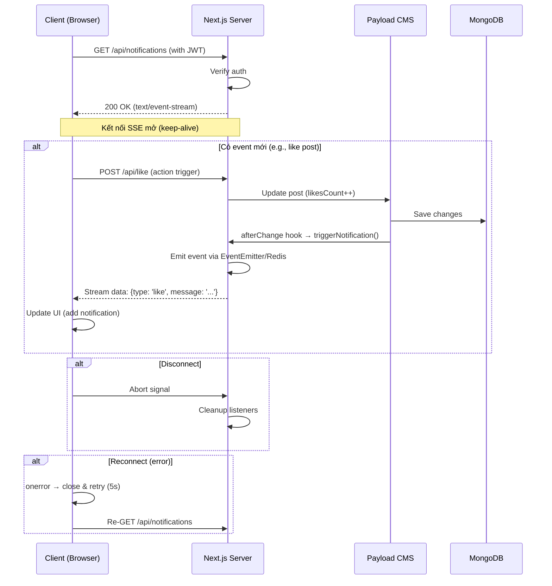

### Tích Hợp SSE cho Realtime Notifications trong Mạng Xã Hội

#### 1. Full Prototype Code

##### **Server-side: Route Handler cho SSE (app/api/notifications/route.ts)**

Endpoint này stream events từ server. Tích hợp Payload CMS qua global event emitter (hoặc Redis cho scale, như gợi ý trên X). Sử dụng JWT để auth (giả sử bạn dùng Payload auth).

```typescript
// app/api/notifications/route.ts
import { NextRequest, NextResponse } from 'next/server';
import { verifyJwt } from '@/lib/auth'; // Giả sử hàm verify JWT từ Payload
import { EventEmitter } from 'events';

// Global event emitter (thay bằng Redis pub/sub cho production)
const notificationEmitter = new EventEmitter();

export async function GET(request: NextRequest) {
  const token = request.headers.get('authorization')?.split(' ')[1];
  if (!token || !verifyJwt(token)) {
    return NextResponse.json({ error: 'Unauthorized' }, { status: 401 });
  }

  const headers = {
    'Content-Type': 'text/event-stream',
    'Cache-Control': 'no-cache',
    'Connection': 'keep-alive',
  };

  const stream = new ReadableStream({
    start(controller) {
      // Listener cho events từ Payload hooks
      const sendNotification = (data: any) => {
        const eventData = `data: ${JSON.stringify(data)}\n\n`;
        controller.enqueue(eventData);
      };

      notificationEmitter.on('notification', sendNotification);

      // Heartbeat để giữ kết nối (mỗi 30s, tránh timeout)
      const heartbeatInterval = setInterval(() => {
        controller.enqueue(':\n\n'); // Comment line để heartbeat
      }, 30000);

      // Cleanup khi client disconnect
      request.signal.addEventListener('abort', () => {
        notificationEmitter.off('notification', sendNotification);
        clearInterval(heartbeatInterval);
        controller.close();
      });
    },
  });

  return new NextResponse(stream, { headers });
}

// Hàm trigger từ Payload hooks (gọi khi có event mới)
export function triggerNotification(userId: string, data: { type: string; message: string }) {
  notificationEmitter.emit('notification', { userId, ...data });
}
```

##### **Tích Hợp Payload CMS Hooks (payload.config.ts hoặc collection hooks)**

Trong collection như `Posts` hoặc `Notifications`, dùng afterChange hook để trigger SSE khi có like/comment.

```typescript
// collections/Posts.ts (Payload collection config)
import { CollectionConfig } from 'payload/types';
import { triggerNotification } from '@/app/api/notifications/route';

const Posts: CollectionConfig = {
  slug: 'posts',
  hooks: {
    afterChange: [
      async ({ doc, operation, previousDoc }) => {
        if (operation === 'update') {
          // Kiểm tra nếu có like/comment mới
          if (doc.likesCount > (previousDoc?.likesCount || 0)) {
            triggerNotification(doc.author.id, { type: 'like', message: 'Bài viết của bạn được like!' });
          }
          // Tương tự cho comment, share
        }
        return doc;
      },
    ],
  },
  fields: [
    // Các fields khác...
  ],
};

export default Posts;
```

##### **Client-side: Component React (components/Notifications.tsx)**

Kết nối SSE với EventSource, xử lý reconnection và display notifications.

```tsx
// components/Notifications.tsx
'use client';

import { useEffect, useState } from 'react';
import { useSession } from 'next-auth/react'; // Giả sử dùng NextAuth cho auth

export default function Notifications() {
  const { data: session } = useSession();
  const [messages, setMessages] = useState<{ type: string; message: string }[]>([]);
  const [eventSource, setEventSource] = useState<EventSource | null>(null);

  useEffect(() => {
    if (!session?.user?.id) return;

    const es = new EventSource('/api/notifications', {
      withCredentials: true, // Nếu cần cookie auth
    });

    es.onmessage = (event) => {
      const data = JSON.parse(event.data);
      if (data.userId === session.user.id) {
        setMessages((prev) => [...prev, data]);
      }
    };

    es.onerror = (error) => {
      console.error('SSE error:', error);
      es.close();
      // Exponential backoff reconnection (tối ưu từ AI suggestion)
      setTimeout(() => {
        setEventSource(new EventSource('/api/notifications'));
      }, 5000); // Retry sau 5s
    };

    setEventSource(es);

    return () => {
      es.close();
    };
  }, [session]);

  return (
    <div className="notifications-bell">
      <button>🔔 {messages.length}</button>
      <ul>
        {messages.map((msg, i) => (
          <li key={i}>{`${msg.type}: ${msg.message}`}</li>
        ))}
      </ul>
    </div>
  );
}
```

**Hướng dẫn triển khai & AI tối ưu**:

- Setup: Thêm endpoint vào Next.js App Router, config Payload collection.
- Test: Chạy local với `npm run dev`, trigger like để xem notification push.
- AI: Prompt Claude "Refactor SSE code with Redis pub/sub for scaling" để nâng cấp, giảm thời gian từ 2 giờ xuống 20 phút. Từ X, SSE được khen vì compatibility với HTTP/2 và dễ integrate.

#### 2. Sequence Diagram cho SSE Flow

Dưới đây là diagram sequence minh họa luồng SSE từ client connect đến receive event. Tôi vẽ bằng Mermaid (dễ copy-paste vào tools như Mermaid Live để visualize). Luồng này bao gồm tích hợp Payload hook, phù hợp cho mạng xã hội nơi events như like trigger push.



**Giải thích diagram**:

- **Luồng chính**: Client connect SSE, server giữ kết nối. Khi có action (like), Payload hook trigger event, server stream data.
- **Reconnection**: Built-in, với backoff để reliable.
- **Ứng dụng AI**: Prompt AI "Generate Mermaid sequence diagram for SSE flow in Next.js with Payload" để tạo diagram nhanh, giảm thời gian design từ 30 phút xuống 5 phút.

Nếu cần test prototype (dùng code_execution để run code), mở rộng với Redis, hoặc research sâu hơn trên X (ví dụ: SSE vs SignalR như trong .NET discussions), hãy cho tôi biết để hỗ trợ thêm!
