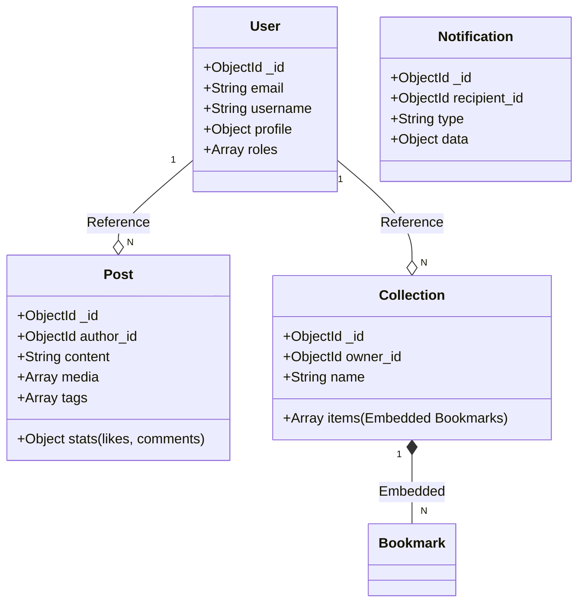

# Document Schema & Aggregate Design (MongoDB)

> **Mục đích:** Chi tiết cấu trúc Document (JSON), chiến lược Nhúng (Embed) vs Tham chiếu (Reference).  
> **Tham chiếu:** diagrams/er-diagram.md, prompt.md

---

## 🏗️ Document Schema Diagram (Aggregate roots)

---

## 📂 Collections Detail

### 1. `users` (Aggregate Root)

* **Strategy**: One document per user.
* **Fields**:
  * `email`: string (unique)
  * `username`: string (unique)
  * `profile`: { avatar, bio, socialLinks: [] } (Embedded)
  * `settings`: { privacy, notifications } (Embedded)

### 2. `posts` (Aggregate Root)

* **Strategy**: One document per post. Reference to `author_id`.
* **Fields**:
  * `author`: ObjectId (Ref: users)
  * `content`: string
  * `media`: [ { type, url } ]
  * `stats`: { likes: number, comments: number, shares: number } (Denormalized for fast read)
  * `rankingScore`: number (Computed for Feed)

### 3. `user_collections` (Aggregate Root)

* **Strategy**: One document per collection. **Embed** bookmarks inside.
* **Fields**:
  * `owner`: ObjectId (Ref: users)
  * `name`: string
  * `bookmarks`: [ { post_id: ObjectId, savedAt: Date } ] (Embedded items)

### 4. `interactions`

* **Strategy**: Separate collection for high-frequency writes (Likes, Comments).
* **Collections**: `likes`, `comments`, `follows`.

### 5. `notifications`

* **Strategy**: Capped collection or TTL index to purge old notifications.
* **Fields**: `recipient`, `actor`, `type`, `entityId`, `isRead`.

---

## ⚡ Data Access Strategy

1. **News Feed**: Query `posts` sorted by `rankingScore` + `createdAt`.
2. **User Profile**: Find One `users` + Find `posts` (author_id).
3. **Bookmarks**: Find One `user_collections` (owner_id) to get all embedded bookmarks.
