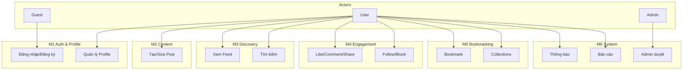

# Use Case Diagram – Sơ đồ tổng quát hệ thống

> **File tạo/sửa:** `Docs/life-2/diagrams/UseCase/use-case-diagram.md`  
> **Mục đích:** Sơ đồ tổng quát actors và use cases của Content-centric SNS (Social Publishing + Social Bookmarking), map từ FR và feature-map.  
> **Format:** Mermaid (useCaseDiagram)  
> **Nguồn:** `Docs/life-1/01-vision/FR/requirements-srs.md`, `Docs/life-1/01-vision/FR/feature-map-and-priority.md`

---

## Phân tích (theo quy trình 5 bước)

### Actors
| Actor | Vai trò | FR tham chiếu |
|-------|---------|---------------|
| **Guest** | Người chưa đăng nhập | FR-1 |
| **User** | Người dùng đã đăng nhập | FR-2 → FR-10 |
| **Admin** | Quản trị viên (kế thừa User) | FR-9 |

### Use Cases (verb + noun)
| Module | Use Case | FR |
|--------|----------|-----|
| M1 Auth & Profile | Đăng ký, Đăng nhập, Đăng xuất, Quên mật khẩu | FR-1 |
| M1 Auth & Profile | Quản lý Profile, Xem profile người khác | FR-2 |
| M2 Content | Tạo bài viết, Chỉnh sửa/Xóa bài viết, Gắn tag, Cài đặt visibility | FR-3 |
| M3 Discovery | Xem News Feed, Tìm kiếm | FR-4, FR-7 |
| M4 Engagement | Like/Unlike, Comment, Share | FR-5 |
| M4 Engagement | Follow/Unfollow, Block user | FR-10 |
| M5 Bookmarking | Bookmark bài viết, Quản lý Collections | FR-6 |
| M6 System | Xem thông báo realtime, Đánh dấu đã đọc | FR-8 |
| M6 System | Báo cáo nội dung, Admin duyệt báo cáo | FR-9 |

### Quan hệ
- **Generalization:** Admin kế thừa User
- **Extend:** Quên mật khẩu extend Đăng nhập (tùy chọn)
- **Include:** Tạo bài viết include Gắn tag (bắt buộc gắn ít nhất 0 tag)

---

## Biểu đồ Use Case (Mermaid)

```mermaid
useCaseDiagram
    actor "Guest" as Guest
    actor "User" as User
    actor "Admin" as Admin

    Admin --|> User

    package "Content-centric SNS" {
        usecase "Đăng ký" as UC1
        usecase "Đăng nhập" as UC2
        usecase "Đăng xuất" as UC3
        usecase "Quên mật khẩu" as UC4
        usecase "Quản lý Profile" as UC5
        usecase "Xem profile người khác" as UC6
        usecase "Tạo bài viết" as UC7
        usecase "Chỉnh sửa/Xóa bài viết" as UC8
        usecase "Gắn tag" as UC9
        usecase "Cài đặt visibility" as UC10
        usecase "Xem News Feed" as UC11
        usecase "Tìm kiếm" as UC12
        usecase "Like/Unlike" as UC13
        usecase "Comment" as UC14
        usecase "Share" as UC15
        usecase "Follow/Unfollow" as UC16
        usecase "Block user" as UC17
        usecase "Bookmark bài viết" as UC18
        usecase "Quản lý Collections" as UC19
        usecase "Xem thông báo realtime" as UC20
        usecase "Đánh dấu đã đọc" as UC21
        usecase "Báo cáo nội dung" as UC22
        usecase "Admin duyệt báo cáo" as UC23
    }

    Guest --> UC1
    Guest --> UC2
    UC4 ..> UC2 : <<extend>>
    UC7 ..> UC9 : <<include>>

    User --> UC2
    User --> UC3
    User --> UC5
    User --> UC6
    User --> UC7
    User --> UC8
    User --> UC10
    User --> UC11
    User --> UC12
    User --> UC13
    User --> UC14
    User --> UC15
    User --> UC16
    User --> UC17
    User --> UC18
    User --> UC19
    User --> UC20
    User --> UC21
    User --> UC22

    Admin --> UC23
```

---

## Sơ đồ đơn giản (flowchart – overview nhanh)

> Dùng khi cần xem nhanh actors và nhóm chức năng chính.



---

## Map Use Case ↔ FR ↔ Module

| Use Case | FR | Module |
|----------|-----|--------|
| Đăng ký, Đăng nhập, Đăng xuất, Quên mật khẩu | FR-1 | M1 |
| Quản lý Profile, Xem profile người khác | FR-2 | M1 |
| Tạo/Chỉnh sửa/Xóa bài viết, Gắn tag, Visibility | FR-3 | M2 |
| Xem News Feed | FR-4 | M3 |
| Like/Unlike, Comment, Share | FR-5 | M4 |
| Bookmark, Collections | FR-6 | M5 |
| Tìm kiếm | FR-7 | M3 |
| Thông báo realtime, Đánh dấu đã đọc | FR-8 | M6 |
| Báo cáo, Admin duyệt | FR-9 | M6 |
| Follow/Unfollow, Block | FR-10 | M4 |
