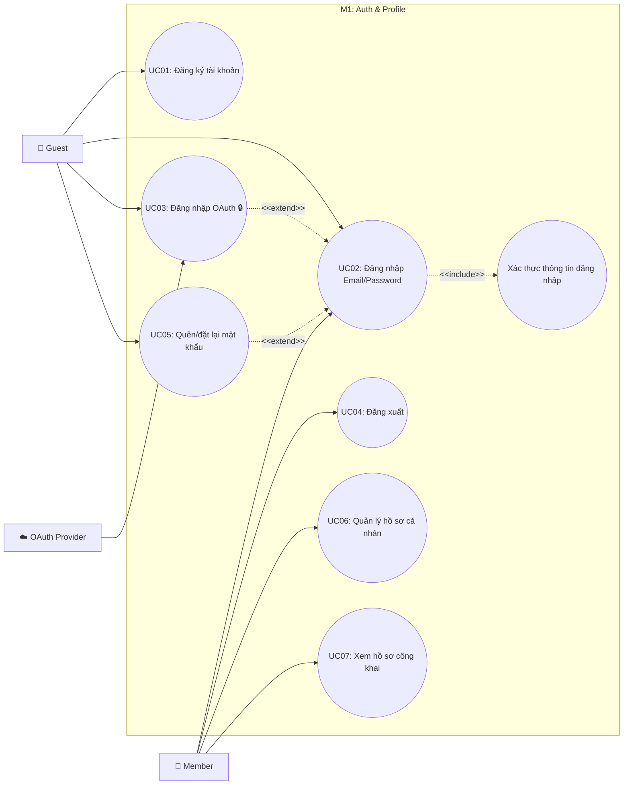

# Use Case M1: Auth & Profile

> [!IMPORTANT]
> **Start here:** Nếu bạn chưa xem bản tổng quát hệ thống, hãy tham khảo [UseCase Overview](./use-case-overview.md).

## 1) Phân vùng chức năng (Domain Context)
Module M1 quản lý danh tính người dùng (Guest/Member) và hồ sơ cá nhân. Đây là cửa ngõ đầu tiên của hệ thống (Auth) và nơi thể hiện diện mạo người dùng (Profile).

## 2) Traceability Table

| UC | Use Case | Module | FR |
|---|---|---|---|
| UC01 | Đăng ký tài khoản | M1.1 | FR-1 |
| UC02 | Đăng nhập Email/Password | M1.1 | FR-1 |
| UC03 | Đăng nhập OAuth 🔒 | M1.1 | FR-1 |
| UC04 | Đăng xuất | M1.1 | FR-1 |
| UC05 | Quên/đặt lại mật khẩu | M1.1 | FR-1 |
| UC06 | Quản lý hồ sơ cá nhân | M1.2 | FR-2 |
| UC07 | Xem hồ sơ công khai | M1.2 | FR-2 |

## 3) Use Case Diagram

## 4) Cross-module Dependencies
- **M6**: Khi đăng ký thành công (UC01), hệ thống có thể gửi thông báo chào mừng qua Module M6. (Tham chiếu: [M6 Notifications](./use-case-m6-notifications-moderation.md))
- **M3**: Hồ sơ công khai (UC07) là đích đến khi người dùng click vào tác giả bài viết từ News Feed. (Tham chiếu: [M3 Feed](./use-case-m3-discovery-feed.md))
