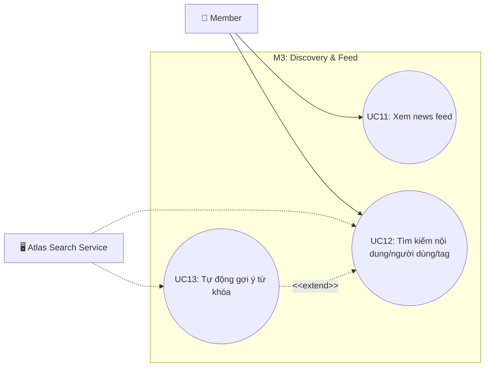

# Use Case M3: Discovery & Feed

> [!IMPORTANT]
> **Start here:** Nếu bạn chưa xem bản tổng quát hệ thống, hãy tham khảo [UseCase Overview](./use-case-overview.md).

## 1) Phân vùng chức năng (Domain Context)
Module M3 chịu trách nhiệm hiển thị nội dung cho người dùng thông qua News Feed và cung cấp công cụ tìm kiếm mạnh mẽ (Discovery) để khám phá nội dung, người dùng hoặc thẻ băm (tag).

## 2) Traceability Table

| UC | Use Case | Module | FR |
|---|---|---|---|
| UC11 | Xem news feed | M3.1 | FR-4 |
| UC12 | Tìm kiếm nội dung/người dùng/tag | M3.2 | FR-7 |
| UC13 | Tự động gợi ý từ khóa (autocomplete) | M3.2 | FR-7 |

## 3) Use Case Diagram

## 4) Cross-module Dependencies
- **M2**: News Feed (UC11) hiển thị các bài viết được tạo ra từ Module M2.
- **M4**: Từ News Feed, người dùng có thể thực hiện Like/Comment bài trực tiếp. (Tham chiếu: [M4 Engagement](./use-case-m4-engagement-connections.md))
- **M6**: Trong quá trình lướt Feed (UC11), người dùng có thể báo cáo vi phạm (UC23). (Tham chiếu: [M6 Notifications & Moderation](./use-case-m6-notifications-moderation.md))
